1. 产品介绍
===========

**Keyes brick 42合一传感器套装**

|image1|

1.1 介绍
--------

Keyes brick
42合一传感器套装主要包含常用的42款传感器/模块，还有对应的keyes UNO
R3开发板、传感器扩展板和连接线。42款传感器/模块上都带有防反接口，和提供的传感器扩展板接口完全匹配。使用时，将传感器扩展板堆叠在keyes
UNO R3开发板，利用1根自带的连接线将传感器/模块连接在扩展板上，简单方便。

为了对这个42款传感器/模块有更深入的了解，基于这个42款传感器/模块做个多个学习课程。这些课程是利用米思齐软件平台制作的，课程中提供了对应的接线方法、图形化编程代码、实验结果和简单的代码介绍等信息。通过这些课程，可以对编程方法、逻辑有了更深刻的理解。

1.2 清单
--------

+------+----------------------------------+------+--------------------------------+
| 序号 | 名称                             | 数量 | 图片                           |
+======+==================================+======+================================+
| 1    | keyes brick                      | 1    | |image2|                       |
|      | LED白发白模块(焊盘孔)            |      |                                |
|      | 防反插白色端子                   |      |                                |
+------+----------------------------------+------+--------------------------------+
| 2    | keyes brick                      | 1    | |image3|                       |
|      | 热敏电阻传感器(焊盘孔)           |      |                                |
|      | 防反插白色端子                   |      |                                |
+------+----------------------------------+------+--------------------------------+
| 3    | keyes brick 按键传感器(焊盘孔)   | 1    | |image4|                       |
|      | 防反插白色端子（配黄帽）         |      |                                |
+------+----------------------------------+------+--------------------------------+
| 4    | keyes brick 干簧管(焊盘孔)       | 1    | |image5|                       |
|      | 防反插白色端子                   |      |                                |
+------+----------------------------------+------+--------------------------------+
| 5    | keyes brick                      | 2    | |image6|                       |
|      | 魔术光杯传感器(焊盘孔)           |      |                                |
|      | 防反插白色端子                   |      |                                |
+------+----------------------------------+------+--------------------------------+
| 6    | keyes brick                      | 1    | |image7|                       |
|      | DHT11温湿度传感器(焊盘孔)        |      |                                |
|      | 防反插白色端子                   |      |                                |
+------+----------------------------------+------+--------------------------------+
| 7    | keyes brick                      | 1    | |image8|                       |
|      | 震动模块传感器(焊盘孔)           |      |                                |
|      | 防反插白色端子                   |      |                                |
+------+----------------------------------+------+--------------------------------+
| 8    | keyes brick                      | 1    | |image-20251022104535269|      |
|      | 水滴水蒸气传感器(焊盘孔)         |      |                                |
|      | 防反插白色端子                   |      |                                |
+------+----------------------------------+------+--------------------------------+
| 9    | keyes brick                      | 1    | |image9|                       |
|      | 倾斜模块传感器(焊盘孔)           |      |                                |
|      | 防反插白色端子                   |      |                                |
+------+----------------------------------+------+--------------------------------+
| 10   | keyes brick 光折断传感器(焊盘孔) | 1    | |image10|                      |
|      | 防反插白色端子                   |      |                                |
+------+----------------------------------+------+--------------------------------+
| 11   | keyes brick                      | 1    | |image11|                      |
|      | 手指测心跳模块(焊盘孔)           |      |                                |
|      | 防反插白色端子                   |      |                                |
+------+----------------------------------+------+--------------------------------+
| 12   | keyes brick                      | 1    | |image12|                      |
|      | ADXL345加速度传感器(焊盘孔)      |      |                                |
|      | 防反插白色端子                   |      |                                |
+------+----------------------------------+------+--------------------------------+
| 13   | keyes brick 土壤传感器(焊盘孔)   | 1    | |image13|                      |
|      | 防反插白色端子                   |      |                                |
+------+----------------------------------+------+--------------------------------+
| 14   | keyes brick                      | 1    | |image14|                      |
|      | 麦克风声音传感器(焊盘孔)         |      |                                |
|      | 防反插白色端子                   |      |                                |
+------+----------------------------------+------+--------------------------------+
| 15   | keyes brick 霍尔传感器(焊盘孔)   | 1    | |image15|                      |
|      | 防反插白色端子                   |      |                                |
+------+----------------------------------+------+--------------------------------+
| 16   | keyes brick 碰撞传感器(焊盘孔)   | 1    | |image16|                      |
|      | 防反插白色端子                   |      |                                |
+------+----------------------------------+------+--------------------------------+
| 17   | SG90 9G 23\ *12.2*\ 29mm         | 1    | |image17|                      |
|      | 配十字臂 蓝色 辉盛 180度 环保    |      |                                |
+------+----------------------------------+------+--------------------------------+
| 18   | keyes brick HC-SR04超声波传感器  | 1    | |image18|                      |
|      | 防反插白色端子                   |      |                                |
+------+----------------------------------+------+--------------------------------+
| 19   | keyes brick                      | 1    | |image19|                      |
|      | 有源蜂鸣器模块焊盘孔)            |      |                                |
|      | 防反插白色端子                   |      |                                |
+------+----------------------------------+------+--------------------------------+
| 20   | keyes brick MQ-2                 | 1    | |image20|                      |
|      | 烟雾传感器(焊盘孔)               |      |                                |
|      | 防反插白色端子                   |      |                                |
+------+----------------------------------+------+--------------------------------+
| 21   | keyes brick                      | 1    | |image21|                      |
|      | 敲击模块传感器(焊盘孔)           |      |                                |
|      | 防反插白色端子                   |      |                                |
+------+----------------------------------+------+--------------------------------+
| 22   | keyes brick                      | 1    | |image22|                      |
|      | 电容触摸传感器(焊盘孔)           |      |                                |
|      | 防反插白色端子                   |      |                                |
+------+----------------------------------+------+--------------------------------+
| 23   | keyes brick                      | 1    | |image23|                      |
|      | 红外接收传感器(焊盘孔)           |      |                                |
|      | 防反插白色端子                   |      |                                |
+------+----------------------------------+------+--------------------------------+
| 24   | keyes brick                      | 1    | |image24|                      |
|      | 摇杆模块传感器(焊盘孔)           |      |                                |
|      | 防反插白色端子（要配摇杆帽）     |      |                                |
+------+----------------------------------+------+--------------------------------+
| 25   | keyes brick                      | 1    | |image25|                      |
|      | 无源蜂鸣器模块(焊盘孔)           |      |                                |
|      | 防反插白色端子                   |      |                                |
+------+----------------------------------+------+--------------------------------+
| 26   | keyes brick MQ-3                 | 1    | |image26|                      |
|      | 酒精传感器(焊盘孔)               |      |                                |
|      | 防反插白色端子                   |      |                                |
+------+----------------------------------+------+--------------------------------+
| 27   | keyes brick 避障传感器(焊盘孔)   | 1    | |image27|                      |
|      | 防反插白色端子                   |      |                                |
+------+----------------------------------+------+--------------------------------+
| 28   | keyes brick TM1637               | 1    | |image28|                      |
|      | 4位数码管模块(焊盘孔)            |      |                                |
|      | 防反插白色端子                   |      |                                |
+------+----------------------------------+------+--------------------------------+
| 29   | keyes brick                      | 1    | |image29|                      |
|      | 旋转编码器模块(焊盘孔)           |      |                                |
|      | 防反插白色端子                   |      |                                |
+------+----------------------------------+------+--------------------------------+
| 30   | keyes brick                      | 1    | |image30|                      |
|      | 人体红外热释电传感器(焊盘孔)     |      |                                |
|      | 防反插白色端子                   |      |                                |
+------+----------------------------------+------+--------------------------------+
| 31   | keyes brick                      | 1    | |image31|                      |
|      | 激光头传感器模块(焊盘孔)         |      |                                |
|      | 防反插白色端子                   |      |                                |
+------+----------------------------------+------+--------------------------------+
| 32   | keyes brick                      | 1    | |image32|                      |
|      | 可调电位器模块(焊盘孔)           |      |                                |
|      | 防反插白色端子                   |      |                                |
+------+----------------------------------+------+--------------------------------+
| 33   | keyes brick 巡线传感器(焊盘孔)   | 1    | |image33|                      |
|      | 防反插白色端子                   |      |                                |
+------+----------------------------------+------+--------------------------------+
| 34   | keyes brick                      | 1    | |image34|                      |
|      | 18B20温度传感器(焊盘孔)          |      |                                |
|      | 防反插白色端子                   |      |                                |
+------+----------------------------------+------+--------------------------------+
| 35   | keyes brick                      | 1    | |image35|                      |
|      | TEMT6000光线传感器(焊盘孔)       |      |                                |
|      | 防反插白色端子                   |      |                                |
+------+----------------------------------+------+--------------------------------+
| 36   | keyes brick 5V                   | 1    | |image36|                      |
|      | 单路继电器模块(焊盘孔)           |      |                                |
|      | 防反插白色端子                   |      |                                |
+------+----------------------------------+------+--------------------------------+
| 37   | keyes brick 插件RGB模块(焊盘孔)  | 1    | |image37|                      |
|      | 防反插白色端子                   |      |                                |
+------+----------------------------------+------+--------------------------------+
| 38   | Keyes brick                      | 1    | |image38|                      |
|      | 8X8点阵模块(可选地址)            |      |                                |
|      | 防反插白色端子                   |      |                                |
+------+----------------------------------+------+--------------------------------+
| 39   | keyes brick IIC 1602             | 1    | |image39|                      |
|      | 蓝屏（5V）防反插白色端子         |      |                                |
+------+----------------------------------+------+--------------------------------+
| 40   | 0.96寸高亮高清晰 IIC通信         | 1    | |image40|                      |
|      | OLED模块 小OLED显示屏 蓝屏       |      |                                |
+------+----------------------------------+------+--------------------------------+
| 41   | keyes brick 3231时钟模块(焊盘孔) | 1    | |image41|                      |
|      | 防反插白色端子                   |      |                                |
+------+----------------------------------+------+--------------------------------+
| 42   | KEYES                            | 1    | |image42|                      |
|      | 130电机-DC3-5V浇花小水泵驱动模块 |      |                                |
+------+----------------------------------+------+--------------------------------+
| 43   | Keyes brick shield 传感器扩展板  | 1    | |image43|                      |
|      | 防反插白色端子                   |      |                                |
+------+----------------------------------+------+--------------------------------+
| 44   | keyes UNO R3 for arduino 开发板  | 1    | |image44|                      |
|      | 红色 环保                        |      |                                |
+------+----------------------------------+------+--------------------------------+
| 45   | 3P 双头XH2.54插头 L=200mm 白色   | 15   | |image45|                      |
+------+----------------------------------+------+--------------------------------+
| 46   | 4P 双头XH2.54插头 L=200mm 白色   | 7    | |image46|                      |
+------+----------------------------------+------+--------------------------------+
| 47   | 5P 双头XH2.54插头 L=200mm 白色   | 3    | |image47|                      |
+------+----------------------------------+------+--------------------------------+
| 48   | AM/BM 透明蓝 OD:5.0 L=50cm 环保  | 1    | |image48|                      |
+------+----------------------------------+------+--------------------------------+
| 49   | 透明绿 开口50\ *76*\ 0.2MM 环保  | 40   | |image49|                      |
+------+----------------------------------+------+--------------------------------+
| 50   | JMP-1 17键86\ *40*\ 6.5MM 黑色   | 1    | |image50|                      |
+------+----------------------------------+------+--------------------------------+
| 51   | DC3-5V浇花小水泵+100MM连接线     | 1    | |image51|                      |
+------+----------------------------------+------+--------------------------------+
| 52   | 浇花水管 内径6MM 外径8MM 1米     | 1    | |image52|                      |
+------+----------------------------------+------+--------------------------------+
| 53   | 130电机+100MM连接线              | 1    | |image53|                      |
+------+----------------------------------+------+--------------------------------+
| 54   | 桨参数：孔径2mm 转动直径：72mm   | 1    | |image54|                      |
|      | 中间圆帽直径：24mm 叶片长:25mm   |      |                                |
|      | 中间圆帽颜色：黄 环保            |      |                                |
+------+----------------------------------+------+--------------------------------+
| 55   | N-240 235\ *160*\ 65MM 白色 环保 | 1    | |image55|                      |
+------+----------------------------------+------+--------------------------------+

1.3 介绍keyes UNO R3开发板
--------------------------

特写：

|image56|

开发板的各个接口和主要元器件。

|image57|

**芯片简介**

- 1 ATMEGA328P-AU

- 7 Atmega16U2 USB转串口芯片

- 9 AMS1117 5V稳压芯片

**接口简介**

2 ICSP接口: 给ATMEGA328P-AU烧录固件接口

3 数字口D0-D13

串口通信：D0(RX)和D1(TX)

外部中断：D2（中断0）和D3（中断1）

PWM口：D3、D5、D6、D9、D10和D11

SPI通信：D10(SS)、D11(MOSI)、D12(MISO)和D13(SCK)

LED:D13直接驱动标志“L”的LED

4 ICSP接口: 给Atmega16U2烧录固件接口

6 USB接口: 用于下载程序、串口调试和供电

10 DC电源接口: 可接入7V-12V范围内电压

11 电源输出接口: 输出3.3V或5V，常用于对外供电或进行共地处理

12 DC电源接口: 可接入7V-12V范围内电压

13 模拟口A0-A5

IIC通信：A4(SDA)和A5（SCL）,也可当做数字口使用：A0(D14)、A1(D15)、A2(D16)、A3(D17)、A4(D18)和A5(D19)

**器件简介**

- 5 复位按键

- 8 16 MHz晶

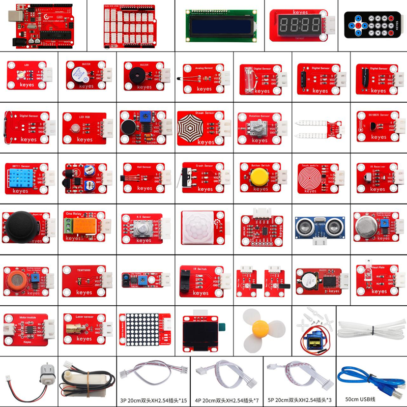
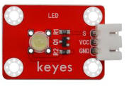
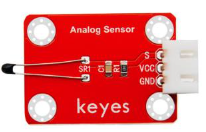
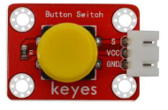
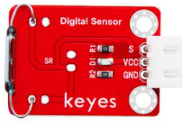
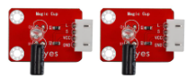
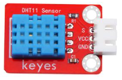
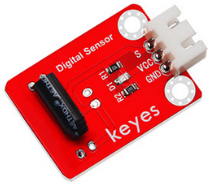
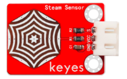
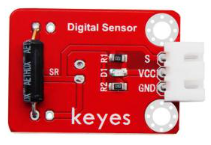
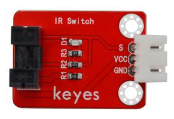
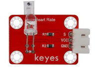
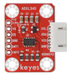
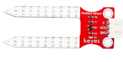
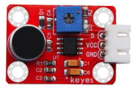
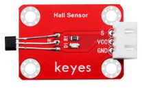
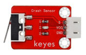
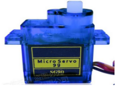
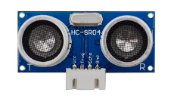
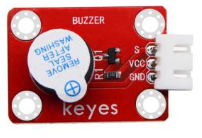
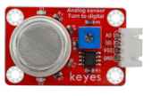
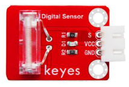
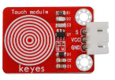
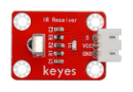
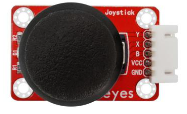
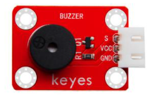
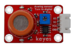
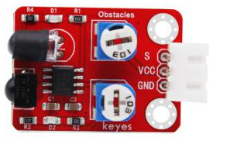
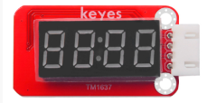
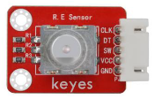
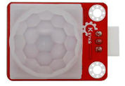
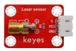
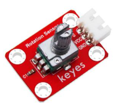
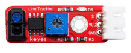
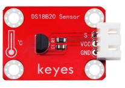
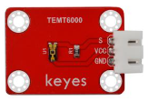
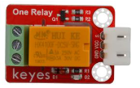
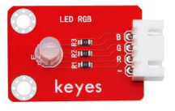
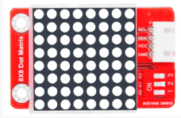
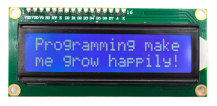
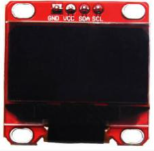
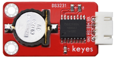
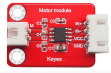
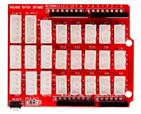
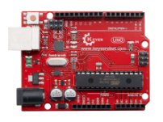
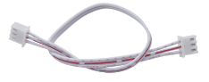
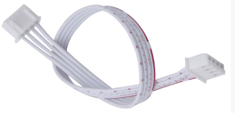
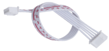
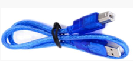
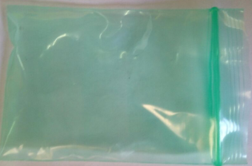

.. |image56| image:: media/image-20251022113306959.png

