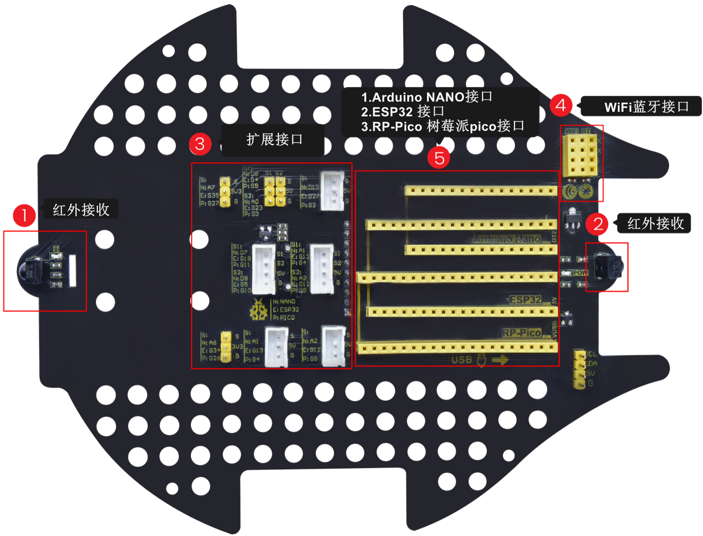
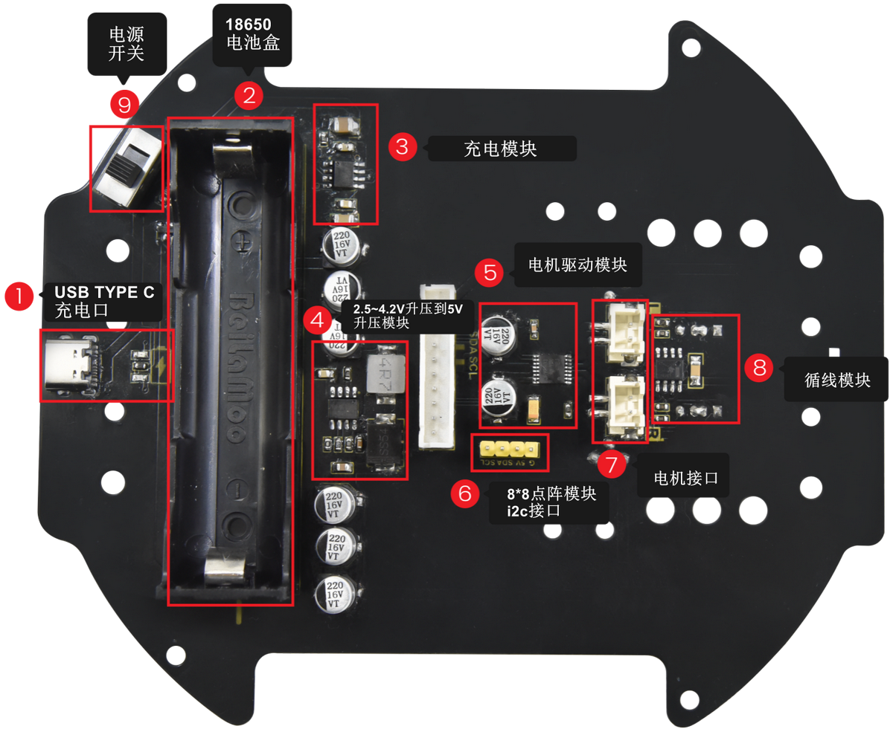

# 简介

------

## **介绍**

- Beetlebot智能小车是兼容乐高积木的STEM教育产品。它能躲避路障、循黑线行驶，识别光线，并可通过红外或WIFI遥控。它有三种外形：足球机器人、投石攻城车和搬运机器人，也可自由发挥，提升创造力。

- Beetlebot革新了电机驱动和传感器设计，集成式结构功能可靠且安装简便。控制核心采用开源硬件Arduino，可实现低成本的Arduino编程学习计划。

- Beetlebot培养编程、人工智能应用、创新思维、动手实践、解决问题和团队协作能力。例如，孩子们可以用编程的Beetlebot进行足球比赛或攻城对战游戏，非常有趣！

## **特点**

1. 兼容乐高积木：可以用乐高积木扩展外形和增加兼容乐高的传感器。
2. 三种机器人外形：足球机器人，投石攻城车，搬运机器人。
3. 功能丰富：有表情显示，氛围灯控制，循迹，避障，追光，红外控制，WIFI控制。
4. 安装简单：车体采用嵌入式设计，只需要几个步骤就可以完成车体的安装和接线。
5. 兼容性强：车体预留了raspberriy pico和ESP32控制板的插口，兼容这两种开发板。
6. 充电功能:集成了18650锂电池的充放电的电路，使用起来更经济便捷。
7. WiFi控制：小车采用的是WiFi控制，有能力的朋友可以在此基础上进行二次开发。
8. 小车APP：兼容Android和iOS系统，精美的软件界面和丰富灵活的控制系统。

------

## **参数**

工作电压：5V

电池输入电压：2.5V~4.2V（单节锂电池）

最大输出电流：≤3A

最大耗散功率：≤15W

WiFi工作频率：2.4G

电机转速：200rpm/min(5V电压)

电机驱动形式：双路H桥

超声波感应角度：<15度

超声波探测距离：2cm~400cm

红外遥控距离：7m左右

安装后尺寸：176*137\*130mm±1%

工作温度：–10至+65摄氏度

------

## **扩展板介绍**

- 套件中NANO开发板，详细参数请参考链接：http://www.keyes-robot.com/pd.jsp?id=62&fromColId=0#_pp=0_449_3

- 扩展板介绍：

  

- 驱动板介绍：

