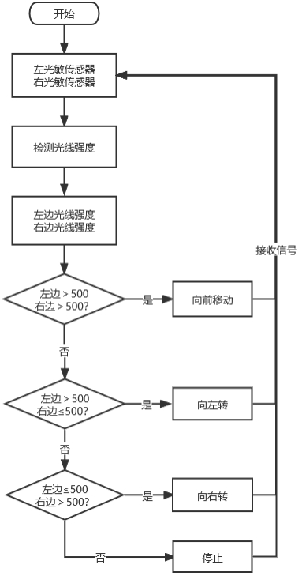

# Project 013: 寻光车

## 实验简介


前面实验已经了解过光敏传感器的工作原理、电机驱动与调速，在本实验中，我们利用光敏传感器检测光线强弱来实现小车寻光效果，哪边光敏传感器接收到的光线较强，小车就往那边走。

## 工作原理

| 左光敏传感器的模拟值 | 右光敏传感器的模拟值 |   功能   |
| :------------------: | :------------------: | :------: |
|       大于500        |       大于500        | 向前移动 |
|       大于500        |     小于等于500      | 向左移动 |
|     小于等于500      |       大于500        | 向右移动 |
|       小于500        |       小于500        |   停止   |

## 实验接线

| 左边光敏传感器 | 小车PCB板 |      | 右边光敏传感器 | 小车PCB板 |
| :------------: | :-------: | ---- | :------------: | :-------: |
|       G        |     G     |      |       G        |     G     |
|       V        |     V     |      |       V        |     V     |
|       S        |  S（A6）  |      |       S        |  S（A7）  |

 

## 流程图

 

## 实验代码

左边光敏传感器是由Arduino Nano主板的IO口A6控制，右边光敏传感器是由Arduino Nano主板的IO口A7控制。

```c++
/*
Project 13:Light Following Car
*/ 
const int light_L_Pin = A6;   //定义左光敏传感器引脚A6
const int light_R_Pin = A7;   //定义右光敏传感器引脚A7
const int left_ctrl = 4;//定义左电机方向控制引脚D4
const int left_pwm = 6;//定义左电机速度控制引脚D6
const int right_ctrl = 2;//定义右电机方向控制引脚D2
const int right_pwm = 5;//定义右电机速度控制引脚D5
int left_light; 
int right_light;
const int servopin = 9;//定义舵机的脚位在D9
int myangle;
int pulsewidth;

void setup(){
  Serial.begin(9600);
  pinMode(light_L_Pin, INPUT); //设置左光敏传感器引脚为输入
  pinMode(light_R_Pin, INPUT); //设置右光敏传感器引脚为输入
  pinMode(left_ctrl,OUTPUT);//设置左电机方向控制引脚为输出
  pinMode(left_pwm,OUTPUT);//设置左电机pwm控制速度引脚为输出
  pinMode(right_ctrl,OUTPUT);//设置右电机方向控制引脚为输出
  pinMode(right_pwm,OUTPUT);//设置右电机pwm控制速度引脚为输出
  servopulse(servopin,90);//设置舵机初始角度为90
  delay(300);
}

void loop(){
  left_light = analogRead(light_L_Pin);//读取左光敏传感器的值
  right_light = analogRead(light_R_Pin);//读取右光敏传感器的值
  Serial.print("left_light_value = ");
  Serial.println(left_light);
  Serial.print("right_light_value = ");
  Serial.println(right_light);
  if (left_light > 500 && right_light > 500) //左,右光敏传感器测到的范围值
  {  
    Car_front(); //小车前进
  } 
  else if (left_light >500 && right_light <= 500)  //左,右光敏传感器测到的范围值
  {
    Car_left(); //小车左转
  } 
  else if (left_light <= 500 && right_light > 500) //左,右光敏传感器测到的范围值
  {
    Car_right(); //小车右转
  } 
  else  //除以上情况之外
  {
    Car_Stop(); //小车停止
  }
}

void servopulse(int servopin,int myangle)//舵机运行角度
{
  for(int i=0; i<20; i++)
  {
    pulsewidth = (myangle*11)+500;
    digitalWrite(servopin,HIGH);
    delayMicroseconds(pulsewidth);
    digitalWrite(servopin,LOW);
    delay(20-pulsewidth/1000);
  }  
}

void Car_front()
{
  digitalWrite(left_ctrl,LOW); //左电机方向控制引脚低电平
  analogWrite(left_pwm,200); //左电机PWM控制速度200
  digitalWrite(right_ctrl,LOW); //右电机方向控制引脚低电平
  analogWrite(right_pwm,200); //右电机PWM控制速度200
}
void Car_left()
{
  digitalWrite(left_ctrl,HIGH); //左电机方向控制引脚高电平
  analogWrite(left_pwm,200); //左电机PWM控制速度200
  digitalWrite(right_ctrl,LOW); //右电机方向控制引脚低电平
  analogWrite(right_pwm,200); //右电机PWM控制速度200;
}
void Car_right()
{
  digitalWrite(left_ctrl,LOW); //左电机方向控制引脚低电平
  analogWrite(left_pwm,200); //左电机PWM控制速度200
  digitalWrite(right_ctrl,HIGH); //右电机方向控制引脚高电平
  analogWrite(right_pwm,200); //右电机PWM控制速度200
}
void Car_Stop()
{
  digitalWrite(left_ctrl,LOW);//左电机方向控制引脚低电平
  analogWrite(left_pwm,0);//左电机PWM控制速度0
  digitalWrite(right_ctrl,LOW);//右电机方向控制引脚低电平
  analogWrite(right_pwm,0);//右电机PWM控制速度0
}
```

## 实验现象

将实验代码上传至Arduino Nano主板，小车安上电池，并且将电源开关拨到ON端，上电后，寻光车能够跟随着光移动。

