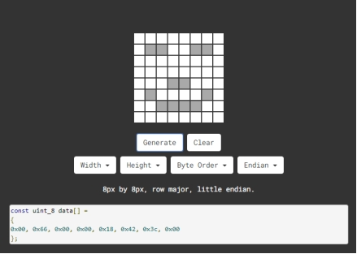

# Project 04: 8\*8点阵

## 实验简介：


8\*8 点阵屏通过LED(发光二极管）组成，以灯珠亮灭来显示文字、图片、动画、视频等，8\*8 点阵显示屏制作简单，安装方便，被广泛应用于各种公共场合，如汽车报站器、广告屏、银行窗口屏、叫号屏以及停车系统等等。在本实验中，将使用8*8 点阵屏来显示图案。

------

## 元件知识

**8\*8点阵屏：**LED点阵屏按照LED发光颜色可分为单色、双色、三色灯等，可显示红、黄、绿甚至是真彩色。根据LED的数量又分为4×4、8×8、16×16等不同类型。这里我们通过单色8×8点阵屏来了解其原理。

不同点阵屏封装不同，8×8点阵屏由8行8列共64个LED灯组成，其内部结构如下图：

 

每个LED放置在行线和列线的交叉点上，当对应的某一行电平拉高，某一列电拉低，则对应交叉点的LED就会点亮。8×8点阵屏有16个管脚，将有丝印的一边朝下，逆时针编号为1-8，9-16。

 

其对应内部管脚定义如下如所示：

 

比如我们要点亮第一行第一列LED灯，则对应将点阵屏的第9脚拉高，第13脚拉低，其他LED控制以此类推即可。

HT16K33：8X8点阵驱动模块：上面介绍了8*8点阵的原理，想控制8*8点阵需要多达16个单片机的引脚。这样既浪费资源也浪费时间。这里用了一个驱动点阵屏的芯片：HT16K33。HT16K33是一款内存映射和多功能LED控制器驱动芯片。利用HT16K33芯片驱动1个8*8点阵，只需要利用单片机的I2C通信端口控制点阵，大大的节约了单片机资源。下图是HT16K33 芯片工作原理图。

 

我们基于以上原理设计了一个8X8点阵驱动模块，从上图我们可以看出，我们只要通过I2C 通讯利用单片机的2个引脚就可以很好的控制点阵显示。

**8X8点阵模块的参数：**

- 工作电压: 5V  

- 额定输入频率: 400KHZ 

- 输入功率: 2.5W 

- 输入电流: 500mA 

**取模工具的使用说明：**

点阵和驱动的原理都已经介绍完了，那点阵上显示的内容是怎么来的呢，有没有比较简便的方法？这里给大家介绍一款点阵取模工具，这块工具使用的是在线版，链接：[http://dotmatrixtool.com/#](http://dotmatrixtool.com/)

现在就一起看看怎么使用吧。

①打开链接如下图：

 

②我们的点阵是8*8的，所以调整高度为8，宽度为8，如下图：

 

③在***\*Byte order\**** 这里选择***\*Row major\**** 这个模式

 

④将图案生成16进制的数据

如下图，按鼠标左键选中，右键取消，画好自己想要的图案，点击***\*Generate\****，就会生成我们所需要的十六进制的数据了,

 

这个生成的十六进制的代码（0x00, 0x66, 0x00, 0x00, 0x18, 0x42, 0x3c, 0x00）就是我们需要显示的内容，我们先保存好，等一下需要放到程序里面。

 

## 实验接线：

 

| 8*8点阵 | 小车PCB板 |
| :-----: | :-------: |
|    G    |     G     |
|   5V    |    5V     |
|   SDA   |    SDA    |
|   SCL   |    SCL    |


## 实验代码

```c++
/*
 Project 04 8*8 Dot Matrix
 8*8 dot matrix screen to display patterns
*/ 
#include <ks_Matrix.h>
Matrix myMatrix(A4,A5);    //set pins to communication pins
// define an array
uint8_t LedArray1[8]={0x00, 0x66, 0x00, 0x00, 0x18, 0x42, 0x3c, 0x00};  
uint8_t  LEDArray[8]; //define an array(by modulus tool) without initial value

void setup(){
  myMatrix.begin(0x70);  //communication address
  myMatrix.clear();    //clear matrix
}

void loop(){
  for(int i=0; i<8; i++)  // there is eight data, loop for eight times
  {
LEDArray[i]=LedArray1[i];  //Call the emoticon array data in the subroutine LEDArray
for(int j=7; j>=0; j--)  //Every data(byte) has 8 bit, therefore, loop for eight times
    {
      if((LEDArray[i]&0x01)>0) //judge if the last bit of data is greater than 0
      {
        myMatrix.drawPixel(j, i,1);  //light up the corresponding point
      }
      else  //otherwise
      {
        myMatrix.drawPixel(j, i,0);  //turn off the corresponding point
      }
      LEDArray[i] = LEDArray[i]>>1;  //LEDArray[i] moves right for one bit to judge the previous one bit
    }
  }
  myMatrix.writeDisplay();  // dot matrix shows
}
```

## 实验现象

将实验代码上传至Arduino Nano主板上，利用USB线上电后，小车前的8*8点阵屏显示“笑脸”图案。


