### 项目二 双色LED模块调节LED颜色

**1.实验说明**

在这个套件中，有一个keyes brick双色LED模块，它采用F5-红绿共阴雾状LED元件。控制时，需要将模块R G连接单片机PWM口，GND接地线。通过调节两个PWM值，控制LED元件显示红光、绿光的比例，从而控制双色LED显示不同颜色。

实验中，通过2个测试代码，两种控制方法，控制它显示不同颜色。

**2.实验器材**

- keyes brick 双色LED模块*1

- keyes UNO R3开发板*1

- 传感器扩展板*1

- 3P 双头XH2.54连接线*1

- USB线*1

**3.接线图**

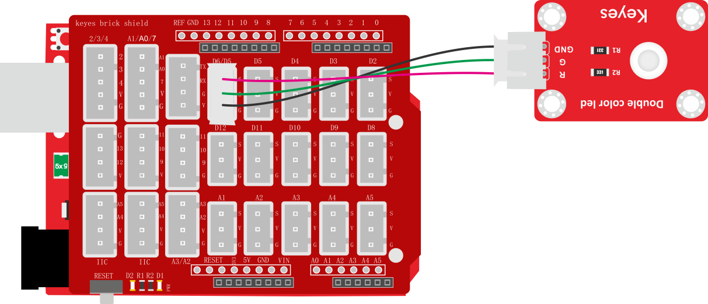

**4.测试代码**

代码1：

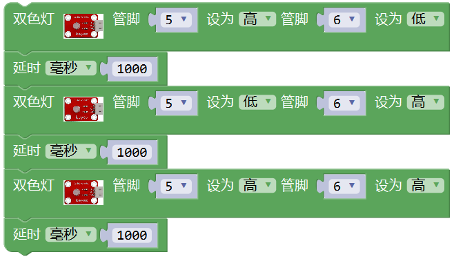

代码2：

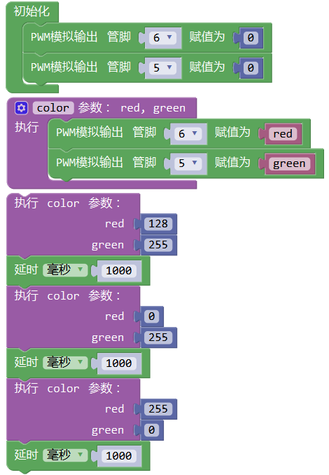

**5.代码1说明**

1. 代码1中，从库文件  中找到，把管脚设置为5和6。管脚5对应的是数字口5，用于控制双色LED显示绿色；管脚6对应的是数字口6，用于控制双色LED显示红色。模块是共阴驱动，即对应颜色设置为高电平时，对应颜色LED亮起。
2. 现在观察代码，控制模块上LED显示绿色1秒、红色1秒、混合颜色（红绿比例一样）1秒，循环交替。

**6.代码2说明**

1. 初始化时设置D5 D6的PWM值为0，熄灭模块上双色 LED。
2. 开始设置一个子程序，找到函数选项，找到项，选择使用该单元。点击标志设置子程序框架，将拉入，连续拉入2个该单元；点击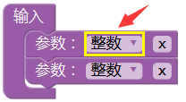设置3个参数类型，设置为整数，点击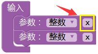设置参数名称；子程序框架设置成功，显示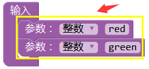，点击标志，退出子程序框架设置。设置完后，在单元中，找到设置的2个名称的参数。
3. 设置框架成功后，显示，点击，设置子程序名称，设置为color。
4. 子程序框架名称设置成功后，开始设置子程序。根据接线，D6控制双色LED显示红光，D5控制双色LED显示绿光。利用这2个PWM口的PWM值控制双色LED显示不同颜色。控制对应的PWM值越大，对应显示的颜色比例越重。因此，子程序设置为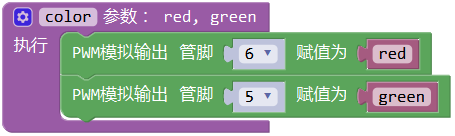。
5. 子程序设置成功后，在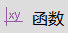中找到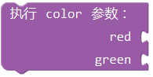，通过设置这2个参数，控制模块上双色ED显示不同颜色、亮度，理论来说，可以设置双色LED显示多种颜色，总共有255\*255种排列组合。
6. 设置时，如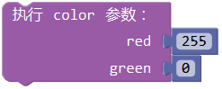表示使双色LED显示最亮的红色。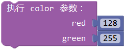表示使双色LED显示混合颜色，颜色比例为红：绿为128:255。

**7.测试结果**

上传测试代码1成功，上电后，模块上双色LED循环显示对应设置的3种颜色，间隔时间为1秒。上传测试代码2成功，上电后，模块上双色LED显示对应设置的3种颜色，循环不止，间隔时间为1秒。