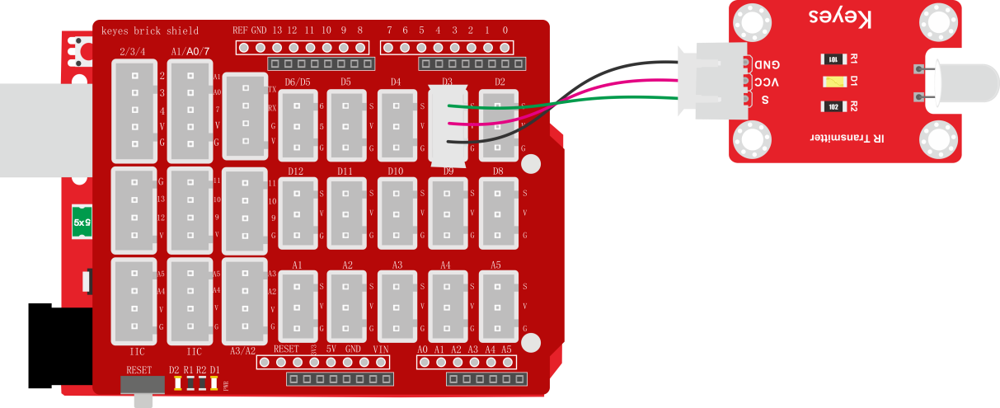
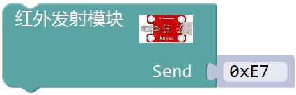
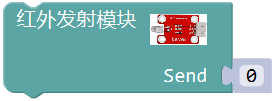

### 项目二十三 红外发射

**1.实验说明**

在这个套件中，有一个红外发射传感器，它主要用到了红外发射管。它是一个能发射出特定波长红外光的二极管。可以将传感器连接到单片机上，利用编程，控制传感器发射出38KHz调制信号，可适应市面上各种红外接收头，以便红外线接收传感器能接收到，从而实现红外无线通讯。

实验中，利用红外发射传感器发射对应数据，每发射一次数据，传感器上的D1 LED就闪烁一次。

**2.实验器材**

- keyes brick 红外发射传感器*1

- keyes UNO R3开发板*1

- 传感器扩展板*1

- 3P 双头XH2.54连接线*1

- USB线*1

**3.接线图**

**4.测试代码**

**5.代码说明**

1. 在找到，库文件内部设置传感器信号端连接在D3接口。
2. 在里面填入需要发送的数据，该数据可以用16进制、10进制和2进制的输入方法，代码中用的是16进制方法，改为和，效果一样。发射的数据最大为0xFF（255     B11111111)。

**6.测试结果**

按照接线图接线，上传测试代码成功，上电后，传感器红外发射管不断发射0xE7的数据，间隔时间为0.2秒。发射数据时，传感器上的D1 LED不断闪烁。