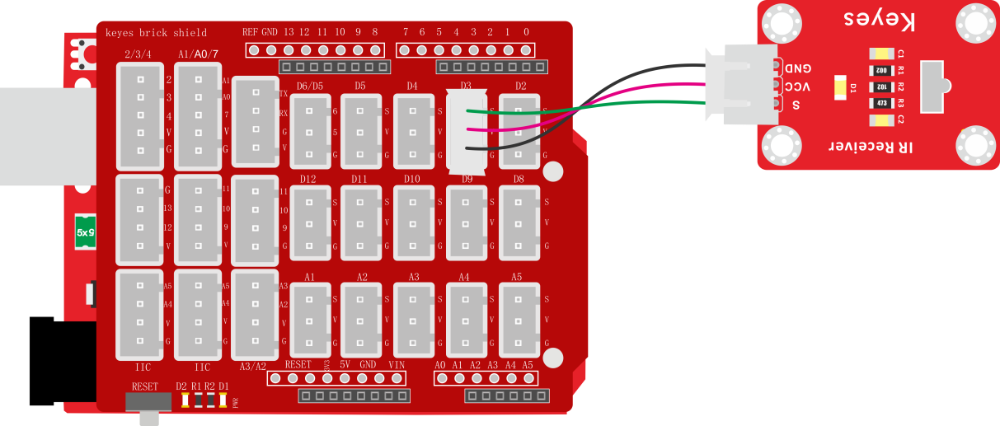
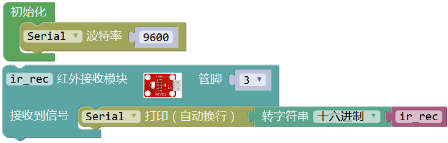
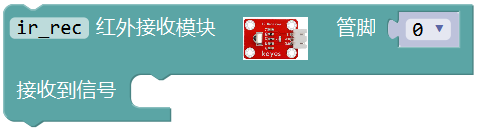
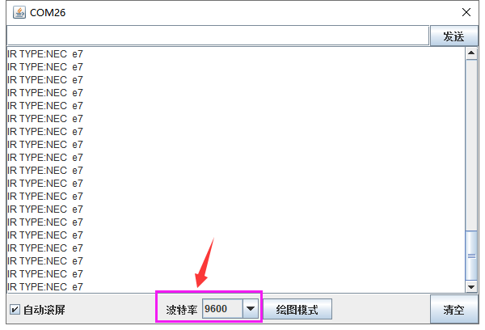
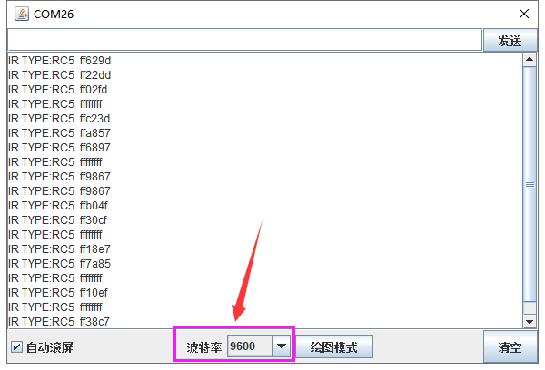

### 项目二十四 红外接收

**1.实验说明**

上一实验中，介绍红外发射传感器的使用方法。这一实验中，了解红外接收传感器的使用方法。红外接收传感器主要采用VS1838B红外接收传感器元件。该元件是集接收、放大、解调一体的器件，内部IC就已经完成了解调，输出的就是数字信号。它可接收标准38KHz调制的遥控器信号。

实验中，利用红外接收传感器接收外部红外发射设备发射的红外信号，并将接收信号在串口监视器上显示。

**2.实验器材**

- keyes brick 红外接收传感器*1

- keyes UNO R3开发板*1

- 传感器扩展板*1

- 3P 双头XH2.54连接线*1

- USB线*1

**3.接线图**

**4.测试代码**

**5.代码说明**

1. 在 找到根据接线，把管脚设置为3。
2. 设置后，得到接收到的数据，默认为是10进制的。为了方便读取数据，可以在找到，将所得数据转换为你需要的进制的数据，代码中转换为16进制数据。

**6.测试结果**

按照接线图接线，上传测试代码成功，利用USB线上电后，打开串口监视器，里面就会显示红外接收传感器接收到的数据。

按照上一个试验的方法，制作一个红外发射设备（发射0xE7数据），按照这一实验方法制作红外接收设备。红外发射传感器的发射头，对准红外接收传感器的接收头。接收到信号后，红外接收传感器上的D1也开始闪烁，串口监视器显示如下图。

将红外遥控当做红外发射设备，将红外遥控对准红外接收传感器的接收头，串口监视器显示如下图。

