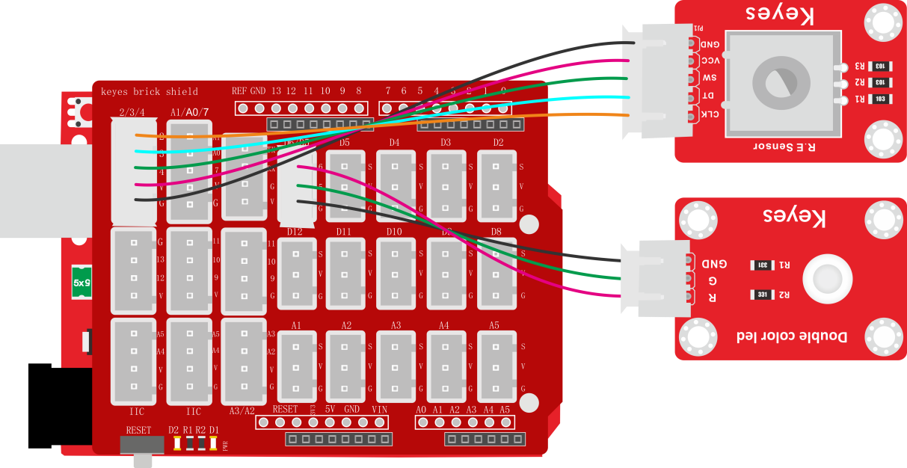
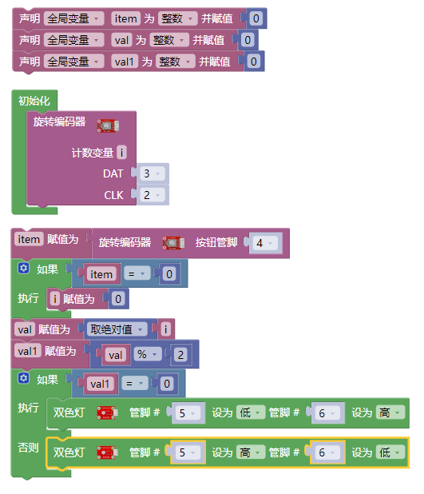
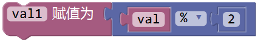

### 项目三十九 旋转编码器模块控制双色LED模块

**1.实验说明**

在前面课程的实验二十中，利用旋转编码器计数。将它扩展下，通过得出的计数，用来控制双色LED模块上LED显示不同颜色。

设计代码时，需要对所得数据取绝对值。将数据除以二，得到余数，余数为0控制双色LED模块上LED亮红光，余数为1，双色LED模块上LED亮绿光。

**2.实验器材**

- keyes brick 旋转编码器模块*1

- keyes UNO R3开发板*1

- keyes brick 双色LED模块*1

- 传感器扩展板*1

- 5P双头XH2.54连接线*1

- 3P 双头XH2.54连接线*1

- USB线*1

**3.接线图**

**4.测试代码**

**5.代码说明**

1. 实验中，在找到，然后改为，即可设计对i取绝对值。
2. 在找到，将+改成%，设置，即将val1设置为val除以2的余数。
3. 得到余数后，在找到，设置管脚，根据接线设置管脚为5（绿灯）和6（红灯)。
4. 利用余数控制模块上LED显示对应灯光颜色。

**5.测试结果**

上传测试代码成功，按照接线图接好线，上电后，旋转编码器，即可控制外接的双色LED模块上的LED的颜色（红与绿）。