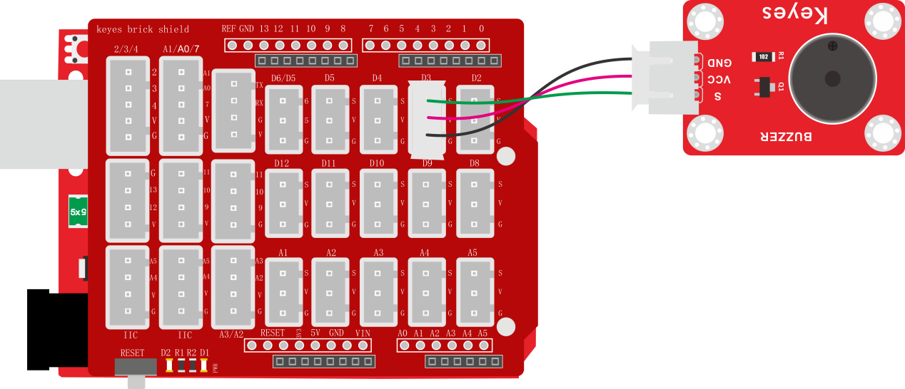
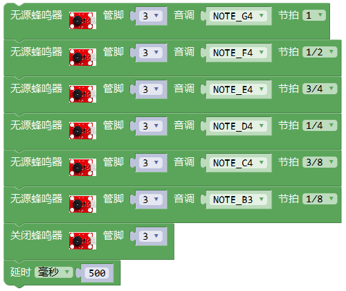
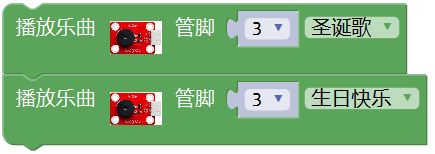

### 项目八 无源蜂鸣器模块播放音乐

**1.实验说明**

前面课程中介绍了套件中的有源蜂鸣器模块的使用方法。在这里介绍下套件中的无源蜂鸣器模块，它主要采用12\*8.5MM 5V 2K无源蜂鸣器元件。无源蜂鸣器元件内部不带震荡电路，控制时，只需要在蜂鸣器元件正极输入不同频率的方波（电压5V），负极接地，控制蜂鸣器响起不同频率的声音。该元件的中心频率是2KHz。无源蜂鸣器驱动频率与发生频率之间是一一对应的关系，即驱动频率是2KHz的方波，那听到的声音频率也是2KHz。

实验中，利用无源蜂鸣器模块上蜂鸣器输出各种频率的声音，然后控制无源蜂鸣器模块上蜂鸣器播放完整音乐。

**2.实验器材**

- keyes brick 无源蜂鸣器模块*1

- keyes UNO R3开发板*1

- 传感器扩展板*1

- 3P 双头XH2.54连接线*1

- USB线*1

**3.接线图**

**4.测试代码**

代码1：

代码2：

**5.代码1说明**

1. 在的  单元找到，其中管脚是代码模块信号端接口，连接的是D3，所以设置为3；音调设置对应的是模块上无源蜂鸣器发出的频率，点击米思齐软件上代码按键，看到对应频率；节拍对应的是各个频率延迟的时间，1个节拍就是延迟1秒。
2. 同样，可以在的  单元找到，管脚同样设置为3，代码1中为了方便观察效果，在后面加了延迟500毫秒。

**6.代码2说明**

1. 同样，可以，在的  单元找到，管脚设置为3。库文件中，直接利用代码控制频率和节拍，使蜂鸣器直接播放《圣诞歌》和《生日快乐》歌曲。

**7.测试结果**

上传测试代码1成功，上电后，模块上无源蜂鸣器循环播放对应频率对应节拍的声音。上传测试代码2成功，上电后，模块上无源蜂鸣器循环播放《圣诞歌》和《生日快乐》两首歌曲。