### 项目九 按键传感器检测实验

**1.实验说明**

在这个套件中，有一个keyes brick按键传感器，它主要采用1个轻触开关，自带1个黄色按键帽。当按下按键时，传感器信号端为低电平；松开按键时，信号端为高电平。

实验中，通过读取传感器上S端高低电平，判断传感器上按键是否按下；并且在串口监视器上显示测试结果。

**2.实验器材**

- keyes brick按键传感器*1

- keyes UNO R3开发板*1

- 传感器扩展板*1

- 3P双头XH2.54连接线*1

- USB线*1

**3.接线图**

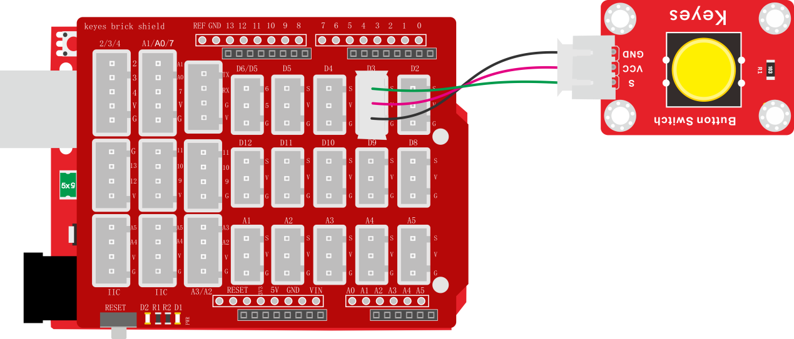

**4.测试代码**

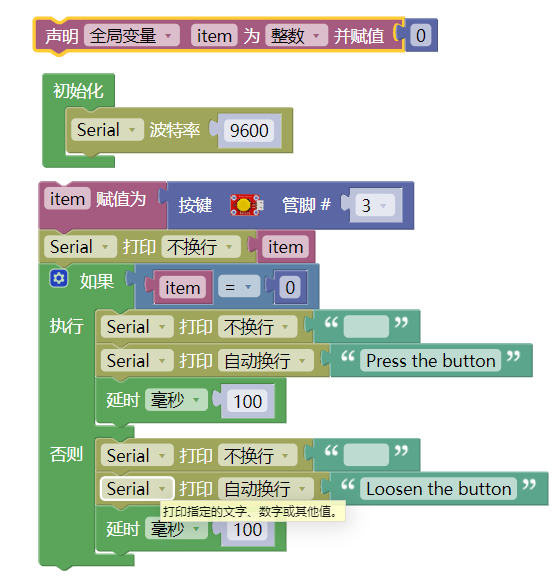

**5.代码说明**

1. 在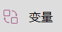单元找到，设置item初始变亮为整数，并赋值为0，。

2. 初始化设置波特率为9600。
3. 同样，可以在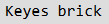的单元找到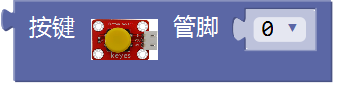，管脚设置为3。将读取到D3读取到的数字值赋值给item，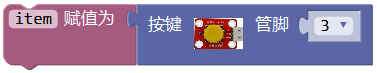。
4. 在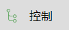单元内，找到，点击进行设置，在里面任意添加 如果否则 否则逻辑单元，如下图。

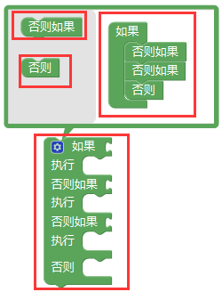

实验中，只需要添加一个否则单元，设置完成后点击，完成设置。

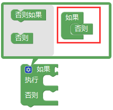

5. 代码逻辑是传感器感应到按键按下时，信号端为低电平，D3口为低电平，即item为0。这时在串口监视器显示对应的数字值和字符；否则（传感器感应到按键松开时），item为1，窗口监视器显示1和另外的字符。

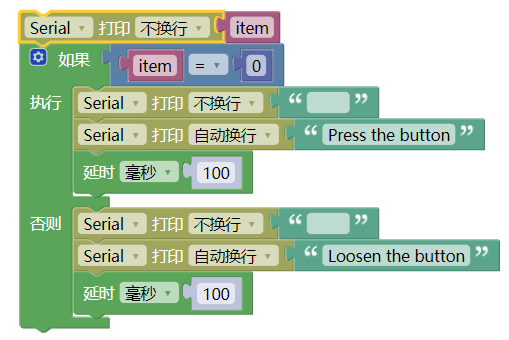

**6.测试结果**

上传测试代码成功，利用USB线上电后，打开串口监视器，设置波特率为9600。串口监视器显示对应数据和字符。实验中，当传感器按下按键时，item为0，串口监视器显示“Press the button”字符；松开按键时，item为1，串口监视器显示“Loosen the button”字符，如下图。

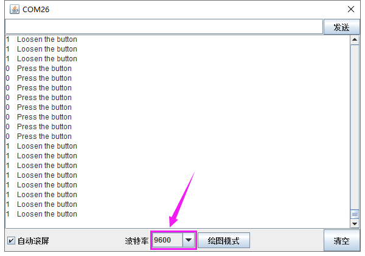

