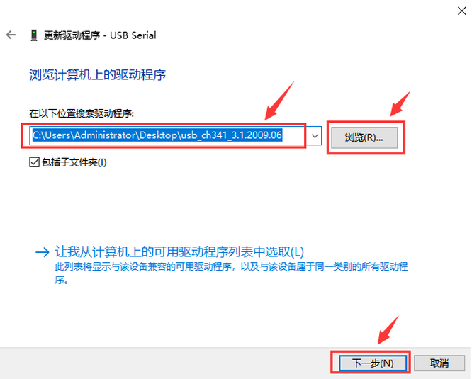
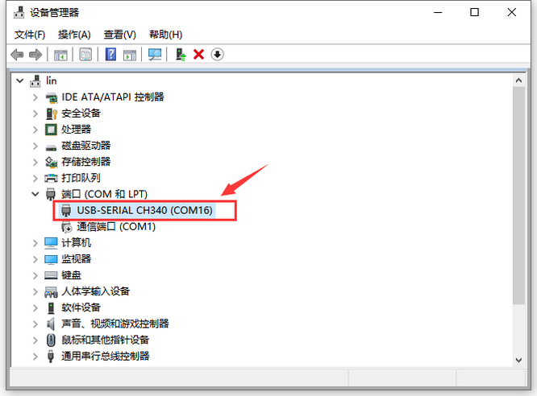

注意：扩展板上标注的G、GND表示电源负极，可连接传感器的G、GND、—等负极接口；标注的V、VCC为电源正极（此扩展板上的电源为5V），可连接传感器的V、VCC、+ 等5V电源接口。

------

**安装开发软件和驱动**

**安装Arduino IDE（Windows）**

我们先到Arduino官方的网站：https://www.arduino.cc/

下载最新版本的arduino开发软件，进入网站之后点击界面上的SOFTWARE,如下图：

------

Arduino 软件有很多版本，有wodows,mac linux系统的（如下图），而且还有过去老的版本，你只需要下载一个适合系统的版本即可。

------

这里我们以Windows系统的为例给大家介绍下载和安装的步骤。Windows系统的也有两个版本，一个版本是安装版的，一个是下载版的不用安装，直接下载文件到电脑，解压缩就可以用了。

一般情况下，我们点击JUST DOWNLOAD就可以下载了，当然，如果你愿意，你可以选择小小的赞助一下，以帮助伟大的Arduino 开源事业。

------

安装Arduino IDE（Mac）

不同的系统，需要下载不同的Arduino IDE，下载方式和5.1.1章节类似。选择如下图。

------

**keyes NANO PLUS开发板**

在开始所有的项目之前，我们首先要了解下面这片keyes NANO开发板，是这个项目的核心开发板。

Keyes NANO的处理器核心是ATMEGA328P-AU。和官网的ARDUINO NANO对比，Keyes NANO使用的USB转串口芯片为CH340，安装的驱动文件不一样，其他的使用方法完全一样。

它同时具有14路数字输入/输出口（其中6路可作为PWM输出），8路模拟输入，1个16MHz晶体振荡器，1个Type-C USB接口，1个ICSP接口和一个复位按钮。

其中ICSP接口是用来给ATMEGA328P-AU烧录固件，由于这个该芯片我们在出厂前都以烧录好固件，所以一般不用。使用时我们可以利用Type-C USB线供电，，还可以利用排母接口VIN GND（DC 7-12V）供电。

​	它包含支持微控制器所需的一切，可以通过连接排针Vin 和GND（DC 7-12V)接口和USB电源即可启动。

**安装开发板驱动文件**

在Windows系统电脑详细使用方法

安装Arduino IDE后，我们就开始安装驱动。将控制板用USB线连接在电脑上后，如果是Windows10系统电脑，电脑会自动安装驱动。如果是其他系统电脑，如Windows7系统电脑，需要手动安装驱动。

控制板的USB转串口芯片为CH340我们需要安装这芯片的驱动，驱动为usb_ch341_3.1.2009.06。

第一次将控制板连接电脑时，点击计算机--属性--设备管理器，显示如下图。

------

点击USB Serial后，点击“更新驱动程序”，开始安装驱动，如下图。

------

进入下图，选择浏览我的电脑以查找驱动程序。

------

在电脑中找到usb_ch341_3.1.2009.06文件夹。

------

安装驱动完成，出现下图点击关闭，之后就会出现串口号了。

------

这样驱动就装好了。点击计算机--属性--设备管理器，我们可看见如下图。

------

在MAC系统电脑详细使用方法

请参考以下链接:

https://wiki.keyestudio.com/Download_CH340_Driver_on_MAC_System

------

**Arduino IDE设置和工具栏介绍**

在Windows系统电脑详细使用方法

装好了开发板的驱动，我们下面了解Arduino软件的使用，首先我们打开Arduino IDE软件。

------

选择正确的Arduino板，与连接到计算机的电路板相匹配。转到Tools→Board，选择Arduino NANO。

------

然后再选择正确的COM口（安装驱动成功后，可看到对应COM口），这样就算连接成功了。

------

在MAC系统电脑详细使用方法

在 Arduino IDE设置时，方法和5.1.5.1章节类似，只是设置COM口时不同，如下图。

------

**启动你的第一个程序**

上面我们学习了怎么下载软件和安装开发板的驱动，那下面我们就开始正式开始第一个程序，打开文件选择例子，选择第一个文件BASIC里面的BLINK程序。

------

按照前面方法设置板和COM口，IDE右下角显示对应板和COM口。点击左上角的“√”图标开始编译程序，检查错误，也可以点击“→”一键编译并上传到开发板。

------

上传成功如下图。

程序上传成功，板载的LED灯亮一秒钟，灭一秒钟，恭喜你的第一个程序完成了。Arduino编程语言可以分为三个主要部分：函数、值（变量和常量）和结构。具体参考请查看Arduino官网教程https://www.arduino.cc/reference/en/

------

**安装库文件**

在开始课程之前我们还需要安装课程里面代码需要的Arduino库文件。

**什么是arduino库文件 ?**

库是代码的集合，使您可以轻松地连接到传感器、显示器、模块等。

例如，内置的LiquidCrystal库使与字符LCD显示器的通话变得容易，Internet上有数百个其他库可供下载。参考中列出了内置库和手动添加的库。 

------

**如何安装库文件?**

在这里，我们将为您介绍最简单的添加库的方法。首先，依次点击右上角的Skerch>Include Library>Add .Zip Library...

------

再选择文件中，找到自己需要的库压缩包.zip格式，点击确定即可添加成功，添加成功后消息栏会显示“Library installed”。

更多教程与产品，请访问本公司官网http://www.keyes-robot.com/

------

