# Arduino教程


## 开发环境设置

注意：扩展板上标注的G、GND表示电源负极，可连接传感器的G、GND、—等负极接口；标注的V、VCC为电源正极（此扩展板上的电源为5V），可连接传感器的V、VCC、+ 等5V电源接口。

------


**安装开发软件和驱动**

**安装Arduino IDE（Windows）**

我们先到Arduino官方的网站：https://www.arduino.cc/

下载最新版本的arduino开发软件，进入网站之后点击界面上的SOFTWARE,如下图：


------


Arduino 软件有很多版本，有wodows,mac linux系统的（如下图），而且还有过去老的版本，你只需要下载一个适合系统的版本即可。

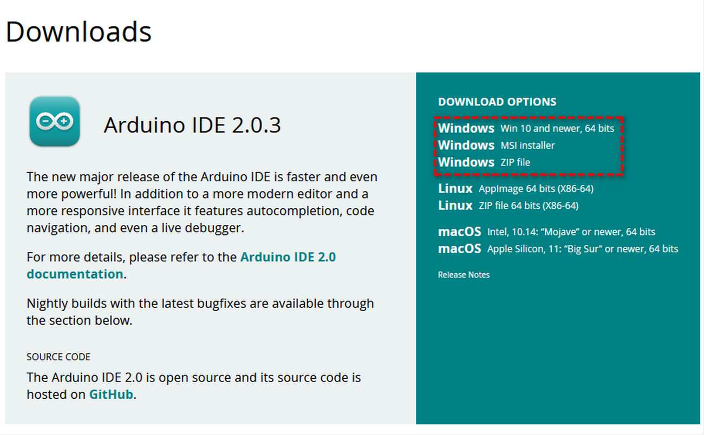

------


这里我们以Windows系统的为例给大家介绍下载和安装的步骤。Windows系统的也有两个版本，一个版本是安装版的，一个是下载版的不用安装，直接下载文件到电脑，解压缩就可以用了。


一般情况下，我们点击JUST DOWNLOAD就可以下载了，当然，如果你愿意，你可以选择小小的赞助一下，以帮助伟大的Arduino 开源事业。

------


安装Arduino IDE（Mac）

不同的系统，需要下载不同的Arduino IDE，下载方式和5.1.1章节类似。选择如下图。


------


**keyes NANO PLUS开发板**

在开始所有的项目之前，我们首先要了解下面这片keyes NANO开发板，是这个项目的核心开发板。


Keyes NANO的处理器核心是ATMEGA328P-AU。和官网的ARDUINO NANO对比，Keyes NANO使用的USB转串口芯片为CH340，安装的驱动文件不一样，其他的使用方法完全一样。

它同时具有14路数字输入/输出口（其中6路可作为PWM输出），8路模拟输入，1个16MHz晶体振荡器，1个Type-C USB接口，1个ICSP接口和一个复位按钮。

其中ICSP接口是用来给ATMEGA328P-AU烧录固件，由于这个该芯片我们在出厂前都以烧录好固件，所以一般不用。使用时我们可以利用Type-C USB线供电，，还可以利用排母接口VIN GND（DC 7-12V）供电。

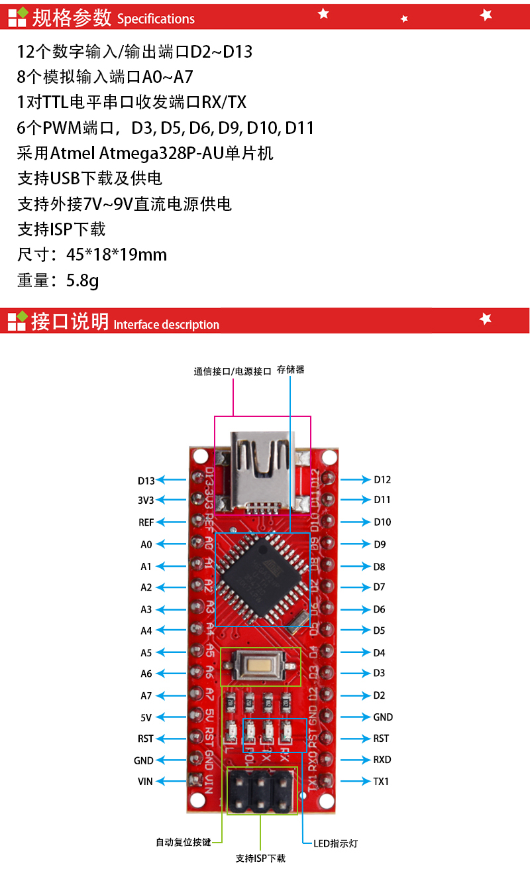

​	它包含支持微控制器所需的一切，可以通过连接排针Vin 和GND（DC 7-12V)接口和USB电源即可启动。

**安装开发板驱动文件**

在Windows系统电脑详细使用方法

安装Arduino IDE后，我们就开始安装驱动。将控制板用USB线连接在电脑上后，如果是Windows10系统电脑，电脑会自动安装驱动。如果是其他系统电脑，如Windows7系统电脑，需要手动安装驱动。

控制板的USB转串口芯片为CH340我们需要安装这芯片的驱动，驱动为usb_ch341_3.1.2009.06。

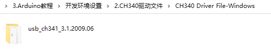

第一次将控制板连接电脑时，点击计算机--属性--设备管理器，显示如下图。


------


点击USB Serial后，点击“更新驱动程序”，开始安装驱动，如下图。

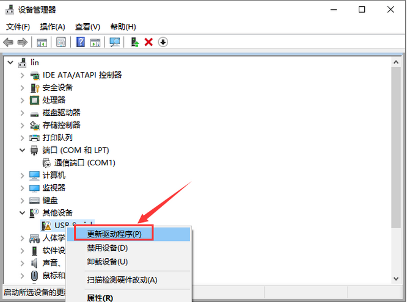

------


进入下图，选择浏览我的电脑以查找驱动程序。

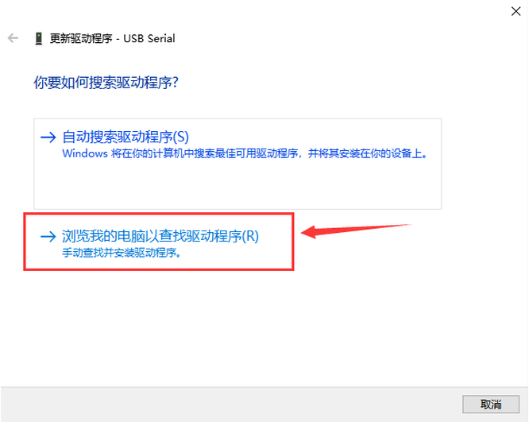

------


在电脑中找到usb_ch341_3.1.2009.06文件夹。


------


安装驱动完成，出现下图点击关闭，之后就会出现串口号了。

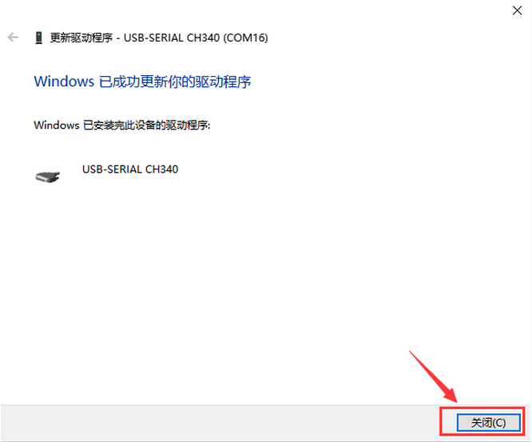

------


这样驱动就装好了。点击计算机--属性--设备管理器，我们可看见如下图。

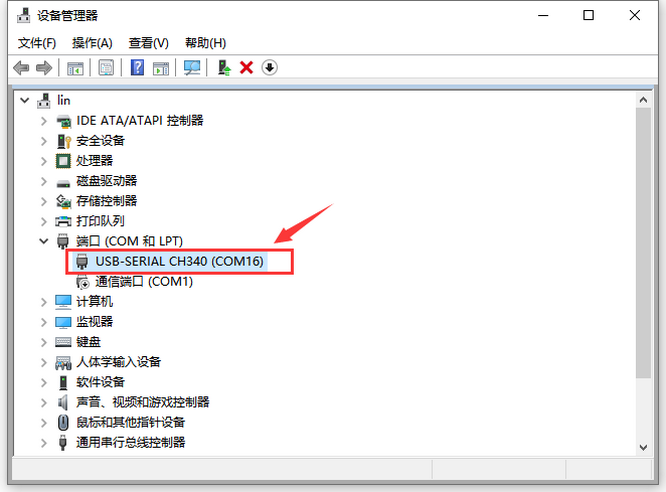

------


在MAC系统电脑详细使用方法

请参考以下链接:

https://wiki.keyestudio.com/Download_CH340_Driver_on_MAC_System

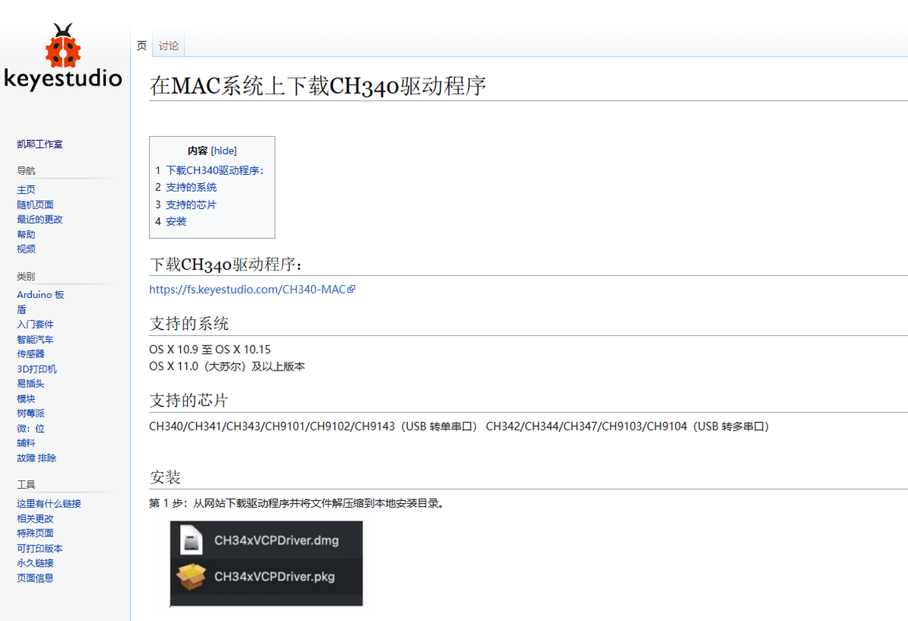


------


**Arduino IDE设置和工具栏介绍**

在Windows系统电脑详细使用方法

装好了开发板的驱动，我们下面了解Arduino软件的使用，首先我们打开Arduino IDE软件。

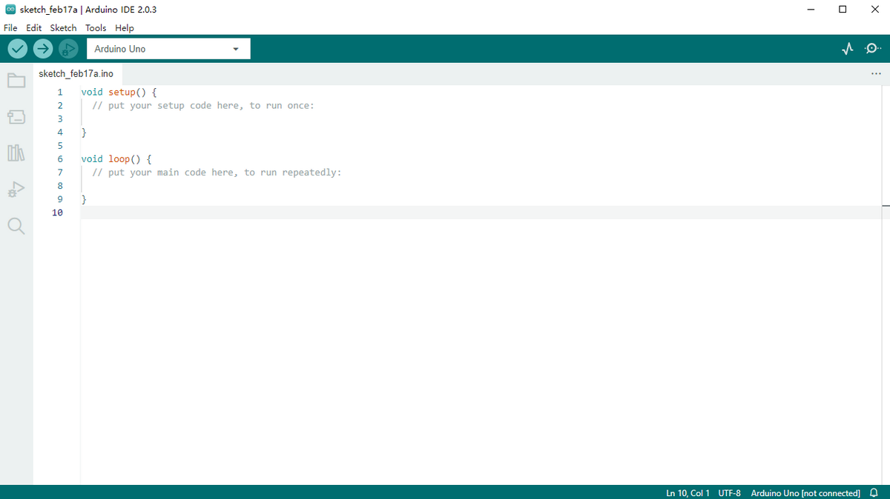

------


选择正确的Arduino板，与连接到计算机的电路板相匹配。转到Tools→Board，选择Arduino NANO。

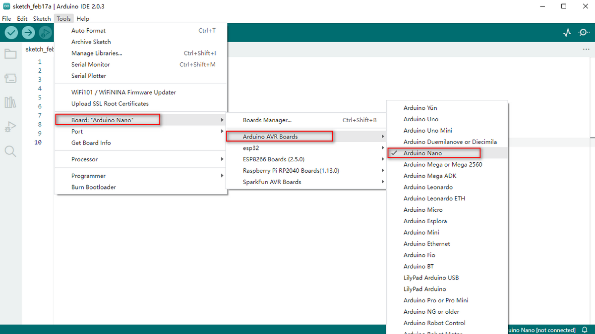

------


然后再选择正确的COM口（安装驱动成功后，可看到对应COM口），这样就算连接成功了。

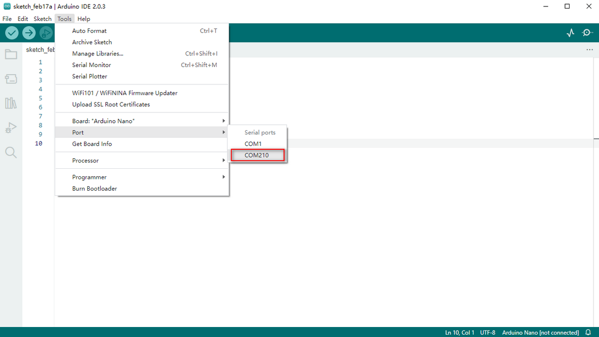

------


在MAC系统电脑详细使用方法

在 Arduino IDE设置时，方法和5.1.5.1章节类似，只是设置COM口时不同，如下图。

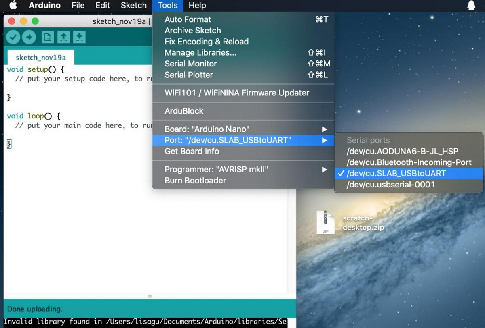

------


**启动你的第一个程序**

上面我们学习了怎么下载软件和安装开发板的驱动，那下面我们就开始正式开始第一个程序，打开文件选择例子，选择第一个文件BASIC里面的BLINK程序。

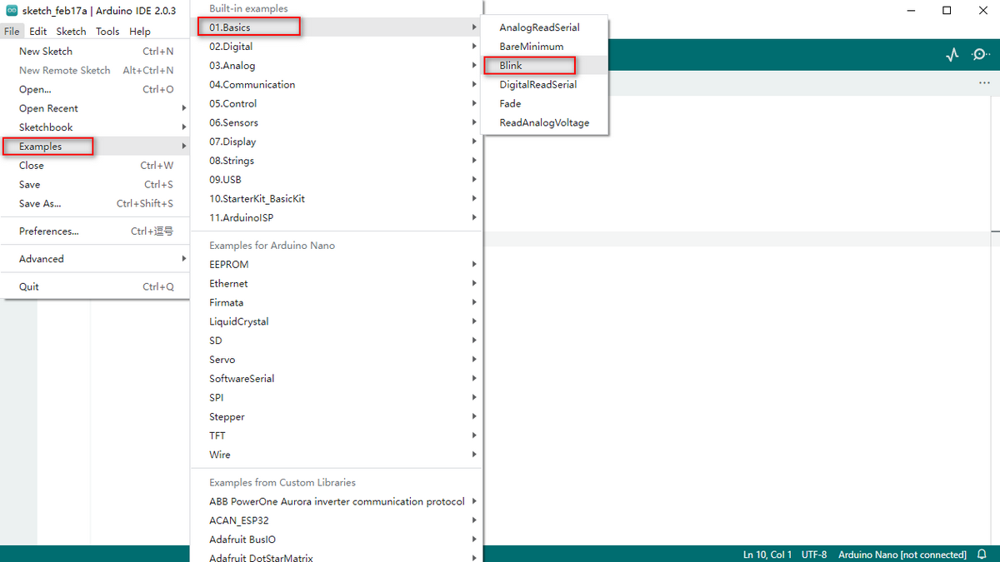

------


按照前面方法设置板和COM口，IDE右下角显示对应板和COM口。点击左上角的“√”图标开始编译程序，检查错误，也可以点击“→”一键编译并上传到开发板。

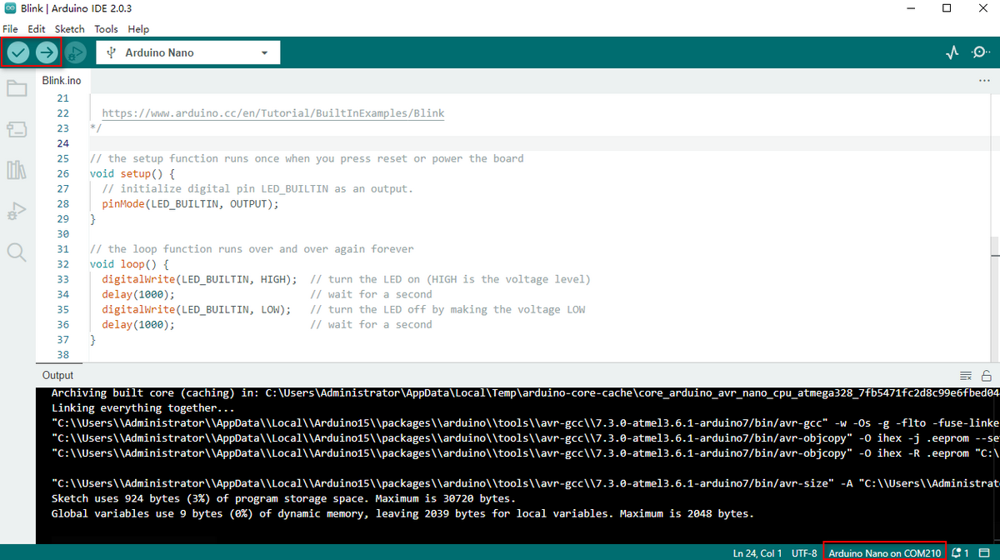

------


上传成功如下图。

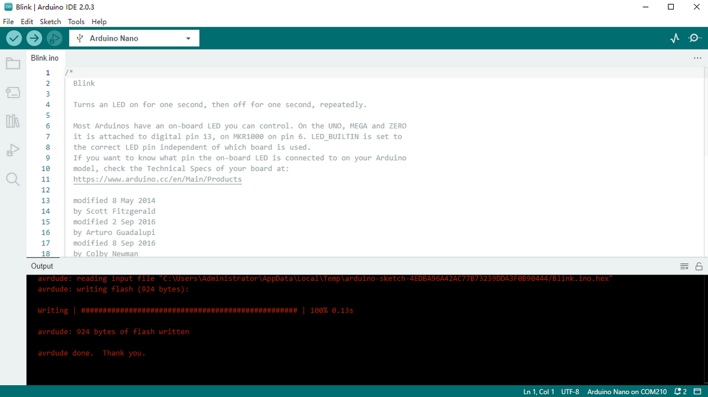

程序上传成功，板载的LED灯亮一秒钟，灭一秒钟，恭喜你的第一个程序完成了。Arduino编程语言可以分为三个主要部分：函数、值（变量和常量）和结构。具体参考请查看Arduino官网教程https://www.arduino.cc/reference/en/

------


**安装库文件**

在开始课程之前我们还需要安装课程里面代码需要的Arduino库文件。

**什么是arduino库文件 ?**

库是代码的集合，使您可以轻松地连接到传感器、显示器、模块等。

例如，内置的LiquidCrystal库使与字符LCD显示器的通话变得容易，Internet上有数百个其他库可供下载。参考中列出了内置库和手动添加的库。 

------


**如何安装库文件?**

在这里，我们将为您介绍最简单的添加库的方法。首先，依次点击右上角的Skerch>Include Library>Add .Zip Library...


------


再选择文件中，找到自己需要的库压缩包.zip格式，点击确定即可添加成功，添加成功后消息栏会显示“Library installed”。

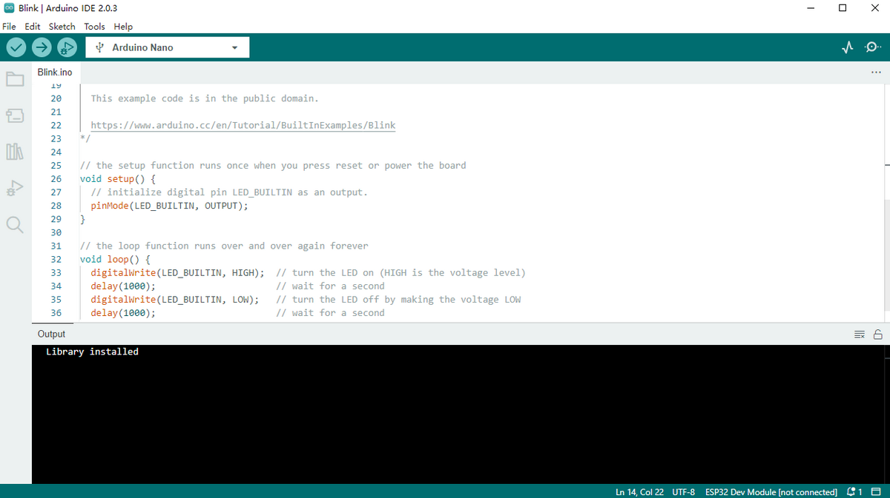

更多教程与产品，请访问本公司官网http://www.keyes-robot.com/

------


## 安装步骤

### 清单

**当收到这个产品时，请根据清单进行清点，以确保所有配件完整无损。如果发现有缺失的配件，请立即联系我们的销售人员。**

| 序号 |       图片        |                        规格                        | 倍用量 |
| :--: | :---------------: | :------------------------------------------------: | :----: |
|  1   | 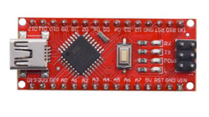 | keyes NANO for arduino 开发板 红色 |   1    |
|  2   |  |      ESP8266串口WIFI ESP-01 WEBDUINO专用      |   1    |
|  3   |  | 光敏电阻传感器 |   2    |
|  4   |  |             乐高舵机 270°舵机             |   1    |
|  5   |  |               扩展板             |   1    |
|  6   |  |            驱动板            |   1    |
|  7   |  |              乐高套件           |   1    |
|  8   | 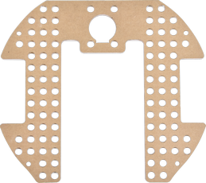 |                亚克力垫高板                |   1    |
|  9   | 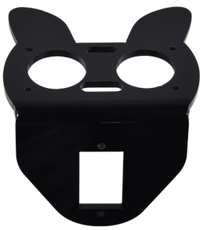 |                      超声波固定亚克力折弯板                      |   1    |
|  10  | 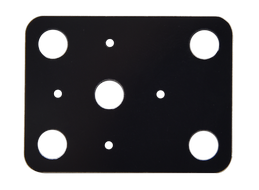 |                     乐高孔位亚克力舵机固定平台                     |   1    |
|  11  |  |                 马达                |   2    |
|  12  | 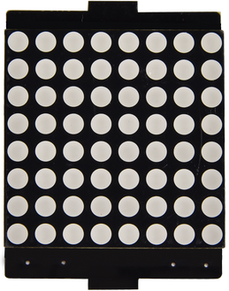 |                 8X8点阵模块                 |   1    |
|  13  | 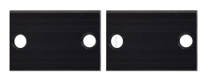 |                  马达固定部件                  |   2    |
|  14  | 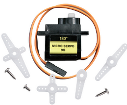 |            9G 舵机180度             |   1    |
|  15  |  |               轮胎               |   2    |
|  16  |  |            超声波传感器       |   1    |
|  17  | 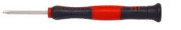 | 红黑色 十字螺丝刀 |   1    |
|  18  |  |   万向轮   |   1    |
|  19  | 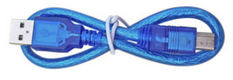 |            USB MINI5P 蓝色            |   1    |
|  20  |  | 遥控器 |   1    |
|  21  | 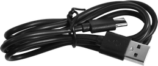 |            USB type-c            |   1    |
|  22  |  |                    紫黑色 十字螺丝刀                    |   1    |
|  23  | 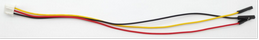 |            XH2.54-3Pin+杜邦母单            |   2    |
|  24  |  |                    4P 杜邦母对母连拼                    |   1    |
|  25  |  |      HX2.54mm-4P转2.54杜邦母单 |   1    |
|  26  |   |                  缠绕管                  |   1   |
|  27  |   |                10P XH2.54白色端子                |   1   |
|  28  |   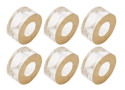 |                乐高摩擦销用亚克力垫片                |   1   |
|  29  |    |               六角铜柱            |   4   |
|  30  |  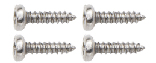 |               自攻螺钉            |   4   |
|  31  |  |                    镀镍螺母                 |   4   |
|  32  |   |                    不锈钢螺钉                |   4    |
|  33  |   |               镀镍螺母            |   2    |
|  34  |  |    十字螺钉 |   2    |
|  35  | 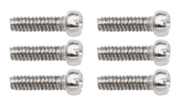 |    十字螺钉 |   6    |
|  36  |   |    十字螺钉    |   10   |
|  37  |  |    镀镍螺母    |   8    |
|  38  |  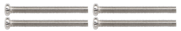 |      十字螺钉   |   4    |
|  39  |  |     桌上足球     |   1    |
|  40  |  |           钢珠万向轮           |   1    |
|  41  |  |              18650电池              |   1    |
|  42  | 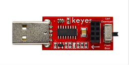 |   USB转ESP-01S WIFI模块串口测试扩展板 |   1    |
|  43  | 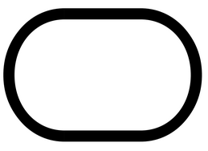 |                       寻迹跑道                       |   1    |
| 44 |  | 圆头十字 自攻螺丝 | 2 |


### 实物组装


 在安装过程中，会有烧录代码的过程，请先安装软件部分，如果已经完成，接下来就开始实物的安装吧。一共分为20个小步骤，可分为椴木板安装和开发板接线两大类，还请拿出100%的精神，集中注意力，尽情享受动手创造的快乐吧！

------

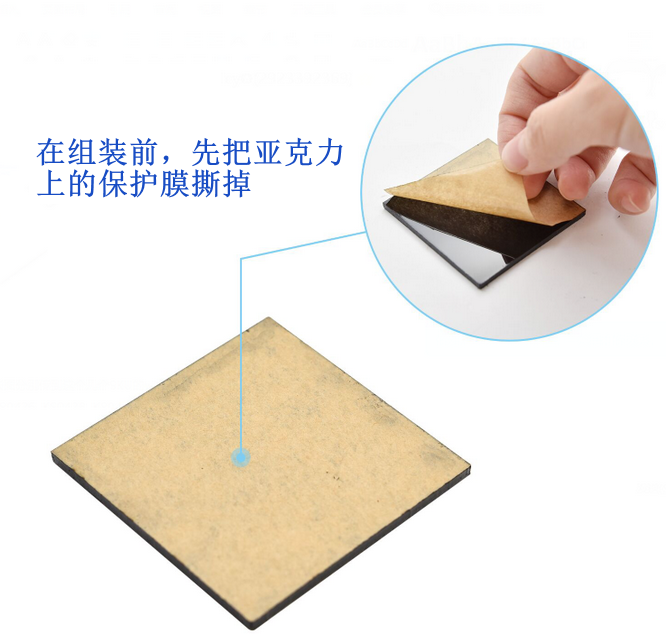


步骤 1

------
1.1

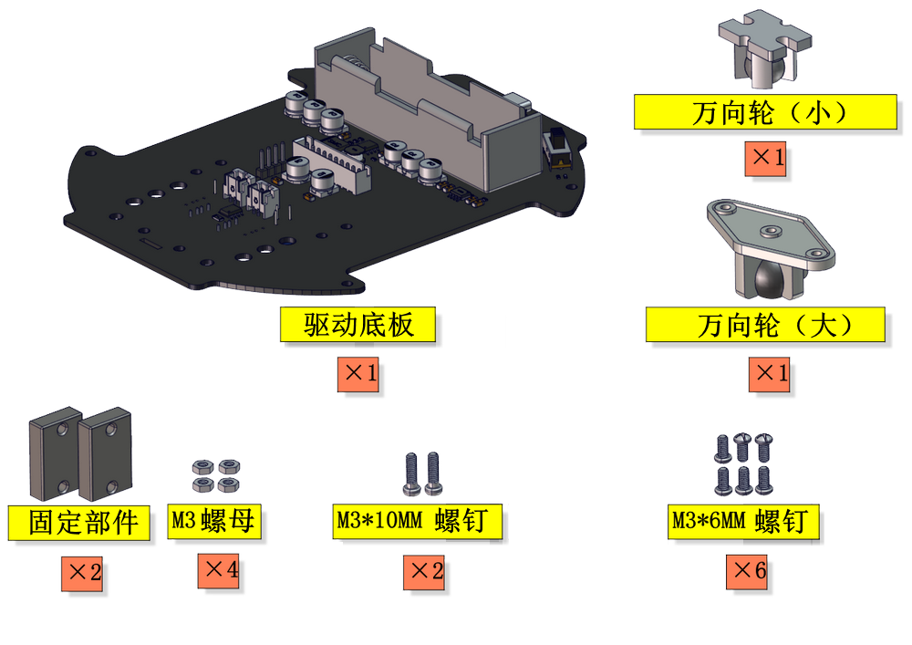

------
1.2

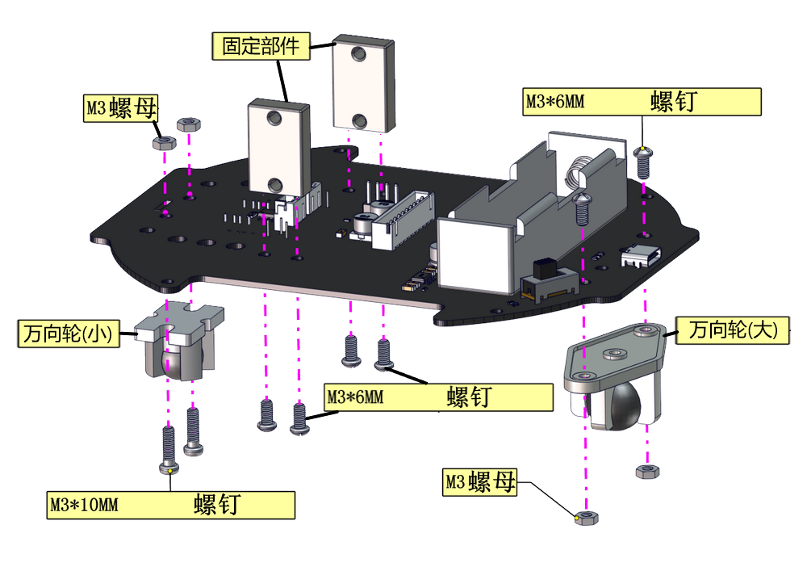

------
1.3

完成

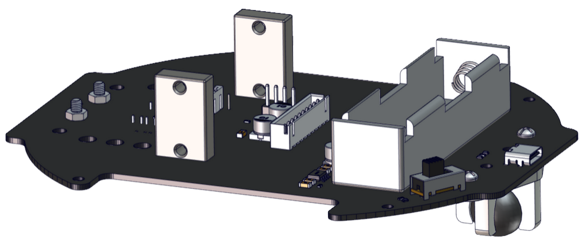

------


步骤 2

------

2.1

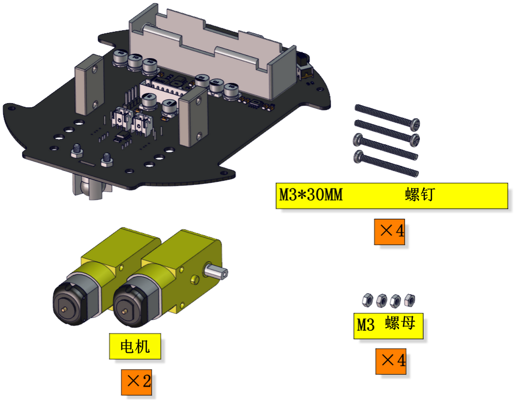

------

2.2


------

2.3

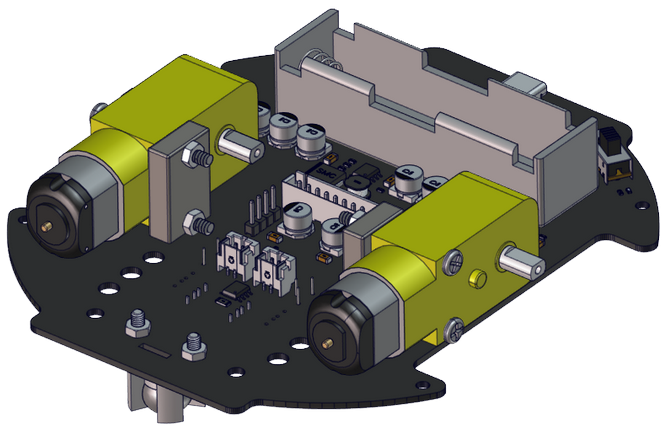

------


步骤 3

------

3.1


------

3.2

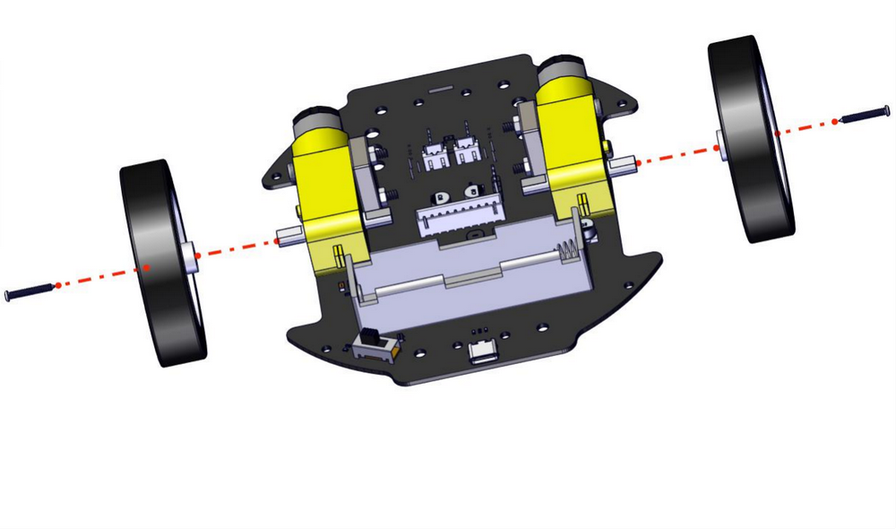

------

3.3


------


步骤 4

------

4.1


------

4.2

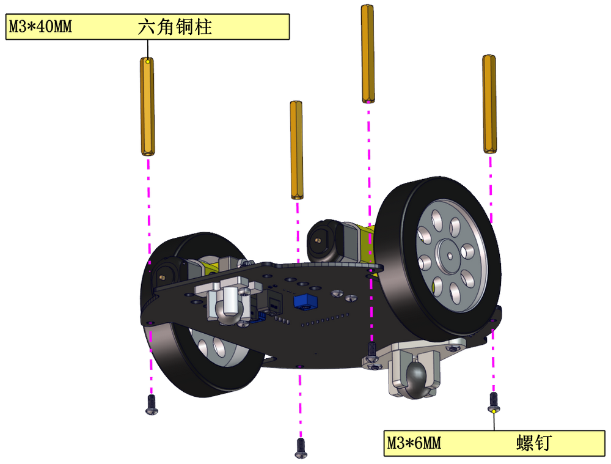

------

4.3

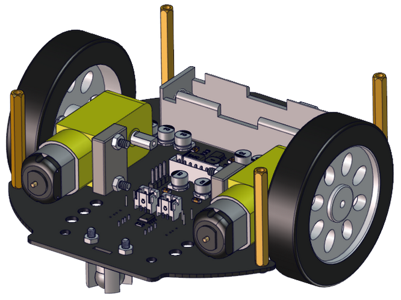

------


步骤 5

------

5.1

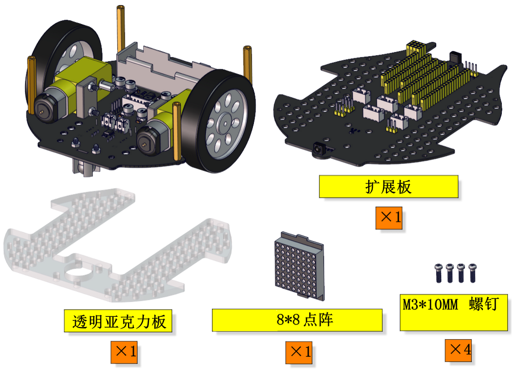

------

5.2


|   模块   |       接口        |
| :------: | :---------------: |
| 左边电机 | （L）  2.54mm端子 |
| 右边电机 | （R）  2.54mm端子 |

**接线时，请注意区分线材颜色，传感器S接黄色，V接红色，G接黑色**

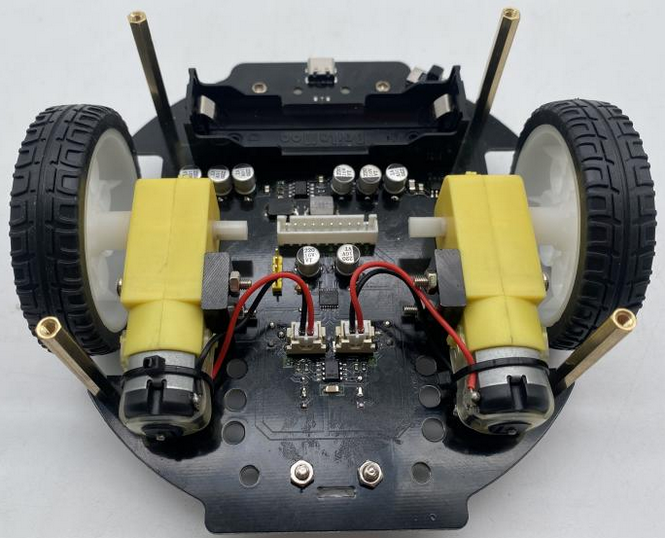

------

5.3

将8*8点阵，通过杜邦线连接PCB底板。

| 所需线材 | 4P 杜邦母对母连拼 100mm （黑红蓝绿线） |
| -------- | -------------------------------------- |


8*8点阵接线表：

| 8*8点阵模块 |   PCB底板   |
| :---------: | :---------: |
|  G（黑色）  |  G（黑色）  |
| 5V（红色）  | 5V（红色）  |
| SDA（蓝色） | SDA（蓝色） |
| SCL（绿色） | SCL（绿色） |

然后将电机、8*8点阵屏用连接线，连接上下两块 PCB板，如下。

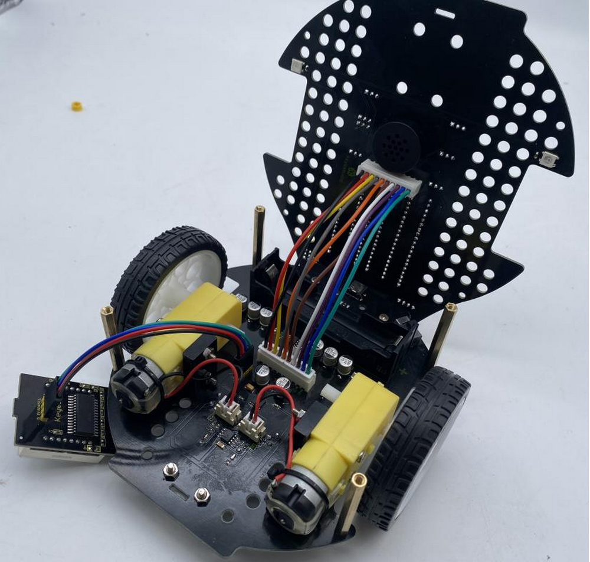

------

5.4


------

5.5

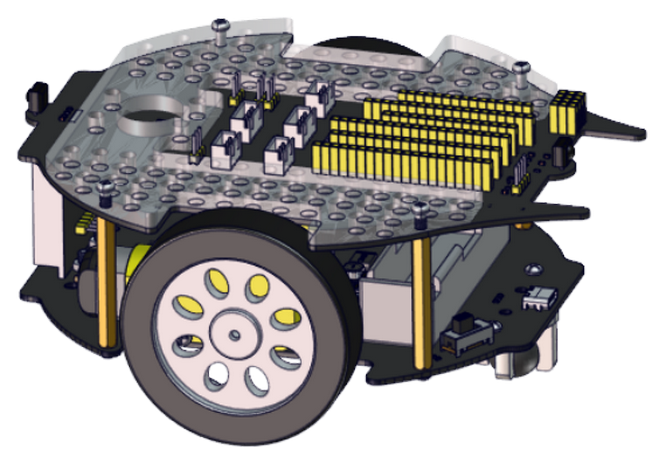

------


步骤 6

------

6.1


------

6.2

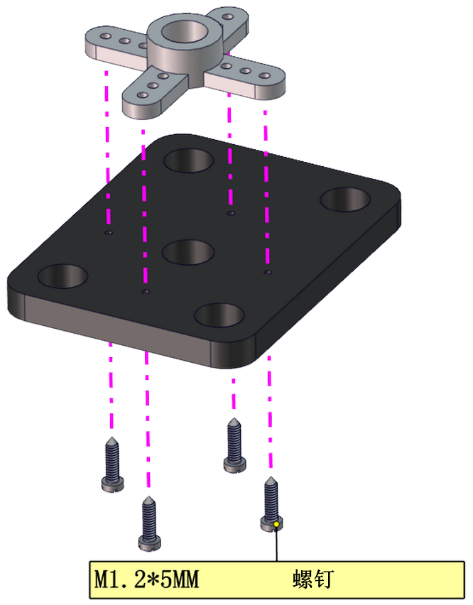

------

6.3

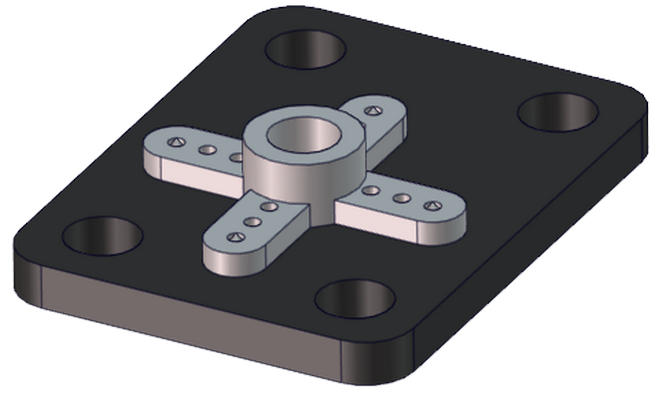

------


步骤 7

------

7.1


------

7.2

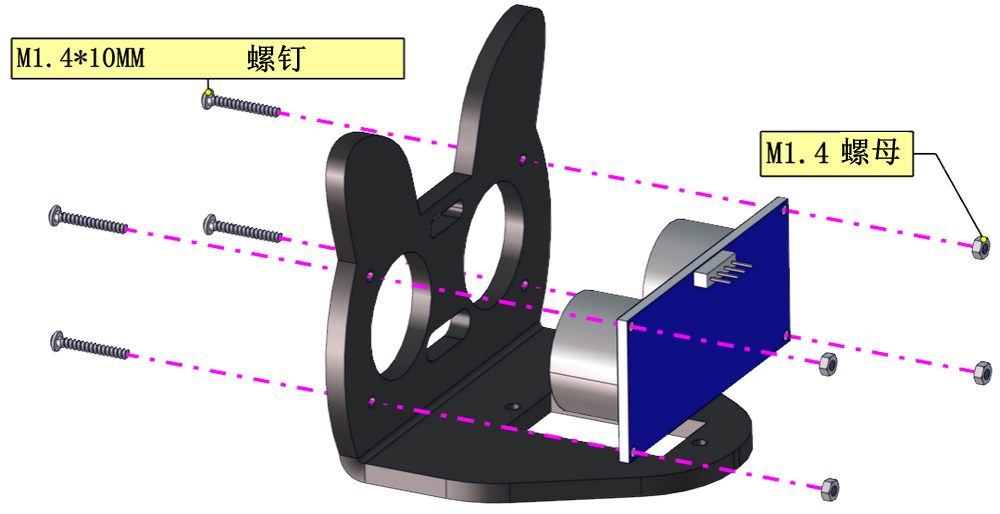

------

7.3

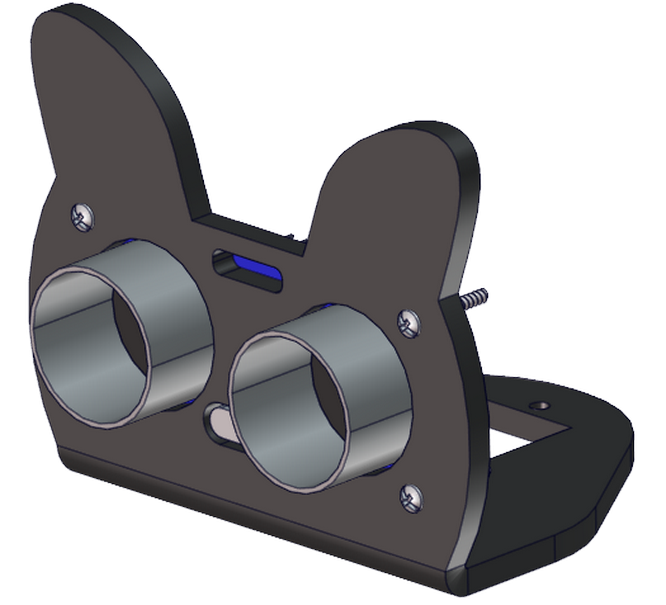

------


步骤 8

------

8.1


------

8.2


------

8.3


------


步骤 9

------

9.1


------

9.2


------

**安装舵机前，舵机角度调节到90度，通过烧录代码进行调节，通过arduino编译器进行。**

- 用舵机连接到小车的扩展板，连接扩展板上的引脚S1（D9）。


- 用**Arduino IDE**打开**window_servo.ino**，并上传至NANO开发板。

  

- 舵机将会调整到90度。

------

9.3

**开始安装舵机**


------

9.4


------

9.5


------


步骤 10

------

10.1


------

10.2


------

10.3


------

10.4

**此步骤需要使用杜邦线，连接超声波传感器。**

|     模块     |         线材          |
| :----------: | :-------------------: |
| 超声波传感器 | 4PIN **（黑红蓝绿）** |


- 先接超声波模块，**接线时，请注意区分线材颜色，Vcc接红色，Trig接蓝色，Echo接绿色，Gnd接黑色,**

  请务必要接线正确，否则发生短路，会烧坏超声波传感器！！

  

  ------

  超声波线另一端，接小车扩展板上。

  

  ------

  

  ------

  


10.5

**此步骤需要使用杜邦线，连接两个光敏传感器。**

|    模块    | 线材 |
| :--------: | :--: |
| 光敏传感器 | 3PIN |


- 先连接光敏传感器，请注意，**黄色线连接S，红色线连接V，黑色线连接G**。

  

  ------

  

- 再把传感器连接到小车扩展板，请注意，**黄色线连接S，红色线连接V，黑色线连接G**。

  

  ------

  

------


步骤 11

------

11.1

**所需零件**


------

11.2


------

11.3


------

11.4


------


步骤 12

------

12.1

使用缠绕管，把线全部整理起来。


------


------

完成


------

## 项目教程

### Project 01: LED Blinking

实验简介

在前面的准备工作中，知道我们Arduino Nano主板上有个板载LED(L)，而且我们已经知道这个LED是连接在Arduino Nano主板上的D13，在本实验中，我们让这个LED闪烁起来。LED闪烁对于学习Arduino的爱好者而言，是最基础的实验项目，也是新手必须经历的一个练习。

------

元件知识

**板载LED：**LED是一种被称为“发光二极管”的半导体，是一种由半导体材料(硅、硒、锗等)制成的电子器件。它的控制方法非常简单，通过控制Arduino Nano主板上IO口（D13）的高低电平，来使LED灯亮灭。


------

实验代码

```c++
/*
  项目01 LED闪烁
  控制LED灯亮一秒，灭一秒，循环往复
*/
int ledPin = 13; // 定义LED引脚为D13

// 初始化函数，在开发板启动或复位时运行一次
void setup() 
{
  // 将LED引脚设置为输出模式
  pinMode(ledPin, OUTPUT);
}

// 主循环函数，会不断重复执行
void loop() 
{
  digitalWrite(ledPin, HIGH);   // 点亮LED（高电平）
  delay(1000);                  // 延时1秒
  digitalWrite(ledPin, LOW);    // 熄灭LED（低电平）
  delay(1000);                  // 延时1秒
}
```

------

实验现象

将实验代码上传至Arduino Nano主板上，利用USB线上电后，Arduino Nano主板上的板载LED就闪烁起来。
### Project 02: 6812 RGB


实验简介

小车扩展板上有4个RGB LED，RGB LED属于简单的发光模块，可以通过调节色彩调出不同颜色的灯效，可广泛应用于建筑物、桥梁、道路、花园、庭院、地板等领域的装饰照明与会场布置、圣诞节、万圣节、情人节、复活节、国庆节等节日期间烘托气氛等场景。在本实验中，使小车扩展板上的4个RGB实现各种灯光效果。

------

元件知识

**SK6812RGB：**小车扩展板上有4个RGB LED，从原理图中可以看出，这4个RGBLED都是串联起来的，在电压电流充足的情况下可以接几百个RGB LED，都可以用一根信号线控制任意一个RGB LED，并且让它显示任意一种颜色。每一颗RGBLED都是一个独立的像素点，每个像素点都是由R、G、B三基色颜色组成，可实现256级亮度显示，完成16777216种颜色的全真色彩显示，同时像素点内部包含了智能数字接口数据锁存信号整形放大驱动电路，还内置信号整形电路，有效保证了像素点光的颜色高度一致。


------

实验代码

```c++
/*
  项目02 SK6812 RGB
  4个RGB灯实现多种灯光效果
*/
#include <Adafruit_NeoPixel.h>

#define PIN A3

// NeoPixel参数配置
Adafruit_NeoPixel strip = Adafruit_NeoPixel(60, PIN, NEO_GRB + NEO_KHZ800);

// 安全使用说明：
// 1. 在电源两端并联1000uF电容
// 2. 第一个LED的数据输入端串联300-500欧姆电阻
// 3. 尽量缩短Arduino与第一个LED的距离
// 4. 避免带电连接电路
// 5. 如需带电操作，请先连接GND地线

void setup() 
{
    strip.begin();
    strip.show();  // 初始化所有LED为关闭状态
}

void loop() 
{
    // 基础单色填充效果
    colorWipe(strip.Color(255, 0, 0), 50);   // 红色填充
    colorWipe(strip.Color(0, 255, 0), 50);   // 绿色填充  
    colorWipe(strip.Color(0, 0, 255), 50);   // 蓝色填充
    
    // 剧院追逐效果
    theaterChase(strip.Color(127, 127, 127), 50);  // 白色追逐
    theaterChase(strip.Color(127, 0, 0), 50);      // 红色追逐
    theaterChase(strip.Color(0, 0, 127), 50);      // 蓝色追逐

    // 彩虹效果
    rainbow(20);            // 整体彩虹渐变
    rainbowCycle(20);       // 循环彩虹渐变
    theaterChaseRainbow(50);// 彩虹追逐效果
}

// 顺序填充颜色函数
void colorWipe(uint32_t c, uint8_t wait) 
{
    for(uint16_t i=0; i<strip.numPixels(); i++) 
    {
        strip.setPixelColor(i, c);
        strip.show();
        delay(wait);
    }
}

// 整体彩虹渐变效果
void rainbow(uint8_t wait) 
{
    uint16_t i, j;

    for(j=0; j<256; j++) 
    {
        for(i=0; i<strip.numPixels(); i++) 
        {
            strip.setPixelColor(i, Wheel((i+j) & 255));
        }
        strip.show();
        delay(wait);
    }
}

// 循环彩虹渐变效果
void rainbowCycle(uint8_t wait) 
{
    uint16_t i, j;

    for(j=0; j<256*5; j++)  // 5个颜色周期
    {
        for(i=0; i<strip.numPixels(); i++) 
        {
            strip.setPixelColor(i, Wheel(((i*256/strip.numPixels())+j) & 255));
        }
        strip.show();
        delay(wait);
    }
}

// 剧院式追逐灯光效果
void theaterChase(uint32_t c, uint8_t wait) 
{
    for(int j=0; j<10; j++)  // 10个循环
    {  
        for(int q=0; q<3; q++) 
        {
            for(int i=0; i<strip.numPixels(); i=i+3) 
            {
                strip.setPixelColor(i+q, c);  // 每3个LED点亮1个
            }
            strip.show();
            delay(wait);
            
            for(int i=0; i<strip.numPixels(); i=i+3) 
            {
                strip.setPixelColor(i+q, 0); // 每3个LED关闭1个
            }
        }
    }
}

// 彩虹剧院追逐效果
void theaterChaseRainbow(uint8_t wait) 
{
    for(int j=0; j<256; j++)  // 遍历所有颜色
    {  
        for(int q=0; q<3; q++) 
        {
            for(int i=0; i<strip.numPixels(); i=i+3) 
            {
                strip.setPixelColor(i+q, Wheel((i+j)%255));
            }
            strip.show();
            delay(wait);
            
            for(int i=0; i<strip.numPixels(); i=i+3) 
            {
                strip.setPixelColor(i+q, 0);
            }
        }
    }
}

// 色轮颜色生成器
uint32_t Wheel(byte WheelPos) 
{
    if(WheelPos < 85) 
    {
        return strip.Color(WheelPos*3, 255-WheelPos*3, 0);
    } 
    else if(WheelPos < 170) 
    {
        WheelPos -= 85;
        return strip.Color(255-WheelPos*3, 0, WheelPos*3);
    } 
    else 
    {
        WheelPos -= 170;
        return strip.Color(0, WheelPos*3, 255-WheelPos*3);
    }
}
```

实验现象

将实验代码上传至Arduino Nano主板上，利用USB线上电后，小车PCB板上的4个RGB LED实现各种灯光效果。 


### Project 03: 演奏音乐

实验简介

小车扩展板上有个喇叭功放元件，它常用来播放音乐，作为一些音乐播放设备的外接扩音设备。

在本实验中，我们利用喇叭功放元件来播放一首音乐。

------

元件知识

***\*喇叭功放元件：\****喇叭功放元件（原理相当于无源蜂鸣器），其内部不带震荡电路，控制时需要在元件正极输入不同频率的方波，负极接地，从而控制喇叭功放元件响起不同频率的声音。

------

实验代码：

```c++
/*
Project 03 Buzzer
Buzzer plays music
*/
// 定义音符频率常量
#define NOTE_B0  31
#define NOTE_C1  33
#define NOTE_CS1 35
#define NOTE_D1  37
#define NOTE_DS1 39
#define NOTE_E1  41
#define NOTE_F1  44
#define NOTE_FS1 46
#define NOTE_G1  49
#define NOTE_GS1 52
#define NOTE_A1  55
#define NOTE_AS1 58
#define NOTE_B1  62
#define NOTE_C2  65
#define NOTE_CS2 69
#define NOTE_D2  73
#define NOTE_DS2 78
#define NOTE_E2  82
#define NOTE_F2  87
#define NOTE_FS2 93
#define NOTE_G2  98
#define NOTE_GS2 104
#define NOTE_A2  110
#define NOTE_AS2 117
#define NOTE_B2  123
#define NOTE_C3  131
#define NOTE_CS3 139
#define NOTE_D3  147
#define NOTE_DS3 156
#define NOTE_E3  165
#define NOTE_F3  175
#define NOTE_FS3 185
#define NOTE_G3  196
#define NOTE_GS3 208
#define NOTE_A3  220
#define NOTE_AS3 233
#define NOTE_B3  247
#define NOTE_C4  262
#define NOTE_CS4 277
#define NOTE_D4  294
#define NOTE_DS4 311
#define NOTE_E4  330
#define NOTE_F4  349
#define NOTE_FS4 370
#define NOTE_G4  392
#define NOTE_GS4 415
#define NOTE_A4  440
#define NOTE_AS4 466
#define NOTE_B4  494
#define NOTE_C5  523
#define NOTE_CS5 554
#define NOTE_D5  587
#define NOTE_DS5 622
#define NOTE_E5  659
#define NOTE_F5  698
#define NOTE_FS5 740
#define NOTE_G5  784
#define NOTE_GS5 831
#define NOTE_A5  880
#define NOTE_AS5 932
#define NOTE_B5  988
#define NOTE_C6  1047
#define NOTE_CS6 1109
#define NOTE_D6  1175
#define NOTE_DS6 1245
#define NOTE_E6  1319
#define NOTE_F6  1397
#define NOTE_FS6 1480
#define NOTE_G6  1568
#define NOTE_GS6 1661
#define NOTE_A6  1760
#define NOTE_AS6 1865
#define NOTE_B6  1976
#define NOTE_C7  2093
#define NOTE_CS7 2217
#define NOTE_D7  2349
#define NOTE_DS7 2489
#define NOTE_E7  2637
#define NOTE_F7  2794
#define NOTE_FS7 2960
#define NOTE_G7  3136
#define NOTE_GS7 3322
#define NOTE_A7  3520
#define NOTE_AS7 3729
#define NOTE_B7  3951
#define NOTE_C8  4186
#define NOTE_CS8 4435
#define NOTE_D8  4699
#define NOTE_DS8 4978
#define REST 0  // 休止符

int tempo=114; // 调整此值可以改变歌曲速度
int buzzer = 3; // 初始化控制蜂鸣器的数字I/O引脚

// 旋律音符数组，每个音符后跟其持续时间
// 4表示四分音符，8表示八分音符，16表示十六分音符，以此类推
// 负号表示附点音符，如-4表示附点四分音符（四分音符加八分音符）
int melody[] = {
  NOTE_E4,4,  NOTE_E4,4,  NOTE_F4,4,  NOTE_G4,4, // 第1小节
  NOTE_G4,4,  NOTE_F4,4,  NOTE_E4,4,  NOTE_D4,4,
  NOTE_C4,4,  NOTE_C4,4,  NOTE_D4,4,  NOTE_E4,4,
  NOTE_E4,-4, NOTE_D4,8,  NOTE_D4,2,
  NOTE_E4,4,  NOTE_E4,4,  NOTE_F4,4,  NOTE_G4,4, // 第4小节
  NOTE_G4,4,  NOTE_F4,4,  NOTE_E4,4,  NOTE_D4,4,
  NOTE_C4,4,  NOTE_C4,4,  NOTE_D4,4,  NOTE_E4,4,
  NOTE_D4,-4, NOTE_C4,8,  NOTE_C4,2,
  NOTE_D4,4,  NOTE_D4,4,  NOTE_E4,4,  NOTE_C4,4, // 第8小节
  NOTE_D4,4,  NOTE_E4,8,  NOTE_F4,8,  NOTE_E4,4, NOTE_C4,4,
  NOTE_D4,4,  NOTE_E4,8,  NOTE_F4,8,  NOTE_E4,4, NOTE_D4,4,
  NOTE_C4,4,  NOTE_D4,4,  NOTE_G3,2,
  NOTE_E4,4,  NOTE_E4,4,  NOTE_F4,4,  NOTE_G4,4, // 第12小节
  NOTE_G4,4,  NOTE_F4,4,  NOTE_E4,4,  NOTE_D4,4,
  NOTE_C4,4,  NOTE_C4,4,  NOTE_D4,4,  NOTE_E4,4,
  NOTE_D4,-4, NOTE_C4,8,  NOTE_C4,2
};

// 计算音符总数（sizeof返回字节数，每个音符有音高和时长两个int值）
int notes=sizeof(melody)/sizeof(melody[0])/2; 

// 计算全音符的持续时间(ms)：(60秒/每分钟节拍数)*4拍
int wholenote = (60000 * 4) / tempo;
int divider = 0, noteDuration = 0;

void setup()
{
  // 遍历旋律中的所有音符
  // 注意数组长度是音符数的两倍（音符+持续时间）
  for (int thisNote = 0; thisNote < notes * 2; thisNote = thisNote + 2) 
  {
    // 计算每个音符的持续时间
    divider = melody[thisNote + 1];
    if (divider > 0)
    {
      noteDuration = (wholenote) / divider; // 普通音符
    } 
    else if (divider < 0)
    {
      // 附点音符用负值表示
      noteDuration = (wholenote) / abs(divider);
      noteDuration *= 1.5; // 附点音符持续时间增加一半
    }
    
    // 只播放音符持续时间的90%，剩下10%作为间隔
    tone(buzzer, melody[thisNote], noteDuration*0.9);
    
    // 等待指定持续时间后再播放下一个音符
    delay(noteDuration);
    
    noTone(buzzer);  // 停止波形生成
  }
}

void loop()
{
  // 如果想重复播放歌曲，可以将setup中的代码复制到这里
}
```

------

实验现象

将实验代码上传至Arduino Nano主板上，利用USB线上电后，小车PCB板上的喇叭功放元件就开始播放一首音乐。
### Project 04: 8\*8点阵

实验简介：


8\*8 点阵屏通过LED(发光二极管）组成，以灯珠亮灭来显示文字、图片、动画、视频等，8\*8 点阵显示屏制作简单，安装方便，被广泛应用于各种公共场合，如汽车报站器、广告屏、银行窗口屏、叫号屏以及停车系统等等。在本实验中，将使用8*8 点阵屏来显示图案。

------

元件知识

**8\*8点阵屏：**LED点阵屏按照LED发光颜色可分为单色、双色、三色灯等，可显示红、黄、绿甚至是真彩色。根据LED的数量又分为4×4、8×8、16×16等不同类型。这里我们通过单色8×8点阵屏来了解其原理。

不同点阵屏封装不同，8×8点阵屏由8行8列共64个LED灯组成，其内部结构如下图：

 

每个LED放置在行线和列线的交叉点上，当对应的某一行电平拉高，某一列电拉低，则对应交叉点的LED就会点亮。8×8点阵屏有16个管脚，将有丝印的一边朝下，逆时针编号为1-8，9-16。

 

其对应内部管脚定义如下如所示：

 

比如我们要点亮第一行第一列LED灯，则对应将点阵屏的第9脚拉高，第13脚拉低，其他LED控制以此类推即可。

HT16K33：8X8点阵驱动模块：上面介绍了8*8点阵的原理，想控制8*8点阵需要多达16个单片机的引脚。这样既浪费资源也浪费时间。这里用了一个驱动点阵屏的芯片：HT16K33。HT16K33是一款内存映射和多功能LED控制器驱动芯片。利用HT16K33芯片驱动1个8*8点阵，只需要利用单片机的I2C通信端口控制点阵，大大的节约了单片机资源。下图是HT16K33 芯片工作原理图。

 

我们基于以上原理设计了一个8X8点阵驱动模块，从上图我们可以看出，我们只要通过I2C 通讯利用单片机的2个引脚就可以很好的控制点阵显示。

**8X8点阵模块的参数：**

- 工作电压: 5V  

- 额定输入频率: 400KHZ 

- 输入功率: 2.5W 

- 输入电流: 500mA 

**取模工具的使用说明：**

点阵和驱动的原理都已经介绍完了，那点阵上显示的内容是怎么来的呢，有没有比较简便的方法？这里给大家介绍一款点阵取模工具，这块工具使用的是在线版，链接：[http://dotmatrixtool.com/#](http://dotmatrixtool.com/)

现在就一起看看怎么使用吧。

①打开链接如下图：

 

②我们的点阵是8*8的，所以调整高度为8，宽度为8，如下图：

 

③在***\*Byte order\**** 这里选择***\*Row major\**** 这个模式

 

④将图案生成16进制的数据

如下图，按鼠标左键选中，右键取消，画好自己想要的图案，点击***\*Generate\****，就会生成我们所需要的十六进制的数据了,

 

这个生成的十六进制的代码（0x00, 0x66, 0x00, 0x00, 0x18, 0x42, 0x3c, 0x00）就是我们需要显示的内容，我们先保存好，等一下需要放到程序里面。

 

实验接线：

 

| 8*8点阵 | 小车PCB板 |
| :-----: | :-------: |
|    G    |     G     |
|   5V    |    5V     |
|   SDA   |    SDA    |
|   SCL   |    SCL    |


实验代码

```c++
/*
  Project 04 8*8 Dot Matrix
  8*8点阵屏幕显示图案
*/ 
#include <ks_Matrix.h>
Matrix myMatrix(A4, A5);    // 设置通信引脚

// 定义图案数组（笑脸）
uint8_t LedArray1[8] = {0x00, 0x66, 0x00, 0x00, 0x18, 0x42, 0x3c, 0x00};  
uint8_t LEDArray[8];        // 定义空数组（用于位操作）

void setup()
{
  myMatrix.begin(0x70);     // 初始化矩阵，设置通信地址
  myMatrix.clear();         // 清除矩阵显示
}

void loop()
{
  for (int i = 0; i < 8; i++)      // 遍历8行数据
  {
    LEDArray[i] = LedArray1[i];     // 载入当前行数据
    
    for (int j = 7; j >= 0; j--)    // 逐位处理每个字节（从最高位到最低位）
    {
      if ((LEDArray[i] & 0x01) > 0) // 检查最低位是否为1
      {
        myMatrix.drawPixel(j, i, 1); // 点亮对应像素点
      }
      else                          // 如果最低位为0
      {
        myMatrix.drawPixel(j, i, 0); // 关闭对应像素点
      }
      LEDArray[i] = LEDArray[i] >> 1; // 右移一位，处理下一个bit
    }
  }
  myMatrix.writeDisplay();           // 更新矩阵显示
}
```

实验现象

将实验代码上传至Arduino Nano主板上，利用USB线上电后，小车前的8*8点阵屏显示“笑脸”图案。


### Project 05: 舵机转动

实验简介：

小车上有两个舵机，这里以接在引脚D9的舵机为例，舵机是一种可以非常精确地旋转的电机。目前已广泛应用于玩具车、遥控直升机、飞机、机器人等领域。在这个项目中，我们将使用Nano主板控制舵机转动。

元件知识：


***\*舵机：\****舵机是一种位置伺服的驱动器，主要是由外壳、电路板、无核心马达、齿轮与位置检测器所构成。其工作原理是由接收机或者单片机发出信号给舵机，其内部有一个基准电路，产生周期为20ms，宽度为1.5ms 的基准信号，将获得的直流偏置电压与电位器的电压比较，获得电压差输出。经由电路板上的IC 判断转动方向，再驱动无核心马达开始转动，透过减速齿轮将动力传至摆臂，同时由位置检测器送回信号，判断是否已经到达定位。适用于那些需要角度不断变化并可以保持的控制系统。当电机转速一定时，通过级联减速齿轮带动电位器旋转，使得电压差为0，电机停止转动。一般舵机旋转的角度范围是0度到180 度。

控制舵机的脉冲周期为20ms，脉冲宽度为0.5ms ~ 2.5ms，对应位置为-90°~ +90°。下面是以一个180°角的舵机为例：


伺服电机有多种规格，但它们都有三根连接线，分别是棕色、红色、橙色(不同品牌可能有不同的颜色)。棕色为GND，红色为电源正极，橙色为信号线。


实验接线：

|  舵机  | 小车PCB板 |
| :----: | :-------: |
|  棕线  |     G     |
|  红线  |    5V     |
| 橙黄线 | S1（D9）  |

实验代码

```c++
/*
  Project 05 Servo Rotation
  舵机塑料臂将重复旋转0°、45°、90°、135°和180°角度
*/
#include <Servo.h>
Servo myservo;  // 定义舵机名称

void setup()
{
  myservo.attach(9);  // 设置舵机控制引脚(9号引脚)
}

void loop()
{
    myservo.write(0);    // 设置电机旋转角度(0°)
    delay(500);
    myservo.write(45);   // 设置电机旋转角度(45°)
    delay(500);
    myservo.write(90);   // 设置电机旋转角度(90°)
    delay(500);
    myservo.write(135);  // 设置电机旋转角度(135°)
    delay(500);
    myservo.write(180);  // 设置电机旋转角度(180°)
    delay(500);
}
```

实验现象

将实验代码上传至Arduino Nano主板，利用USB线上电后，舵机塑料臂将以0°、45°、90°、135°、180°的角度转动。循环进行！！


### Project 06: 电机驱动和调速


实验简介：

驱动电机的方法有很多，我们这个小车用到的是最常用的DRV8833电机驱动芯片，该芯片为玩具、打印机及其它电机一体化应用提供了一款双通道桥式电动驱动器解决方案。

在本实验中，我们使用扩展板上的DRV8833电机驱动芯片驱动小车的两个直流电机，通过编写代码实现小车分别向前，向后，向左，向右行走的效果。

元件知识：

**DRV8833电机驱动芯片：**具有电流控制功能的双H桥电机驱动器，可以驱动两个直流电机、一个双极步进电机、电磁阀或其他电感负载。每个H桥的输出驱动器块由N沟道功率MOSFET组成，配置为H桥以驱动电机绕组。每个H桥包括调节或限制绕组电流的电路。

带有故障输出引脚的内部停机功能是用于过大电流保护、短路保护、欠压锁定和超温。还提供了低功耗睡眠模式。我们来看一下DRV8833电机驱动芯片驱动两个直流电机的电路图和示意图：


 

如果想更深了解DRV8833电机驱动芯片，可以查看我们提供的芯片规格书，在资料的“Attachments”文件夹里。


规格参数：

逻辑部分输入电压：DC 5V

驱动部分输入电压：DC 5V

逻辑部分工作电流：<30mA

驱动部分工作电流：<2A

最大耗散功率：10W（T=80℃）

电机转速：5V 200 rpm / min

电机驱动形式：双路H桥驱动

控制信号输入电平：高电平2.3V<Vin<5V ，低电平-0.3V<Vin<1.5V

工作温度：-25~130℃

驱动小车运行原理：

根据上面电机驱动板的电路图和示意图，我们知道左电机的方向引脚在D4，调速引脚在D6；右电机的方向引脚在D2，调速引脚在D5，按照以下表格的运动逻辑，就可以知道如何通过控制数字口，PWM口控制2个电机转动，从而实现智能小车的行走。其中PWM值范围为0-255，设置数字越大，电机转动越快。

| 功能 |  D4  | D6（PWM） | 左电机 |  D2  | D5（PWM） | 右电机 |
| :--: | :--: | :-------: | :----: | :--: | :-------: | :----: |
| 前进 | LOW  |    200    |  正转  | LOW  |    200    |  正转  |
| 后退 | HIGH |    50     |  反转  | HIGH |    50     |  反转  |
| 左转 | HIGH |    200    |  反转  | LOW  |    200    |  正转  |
| 右转 | LOW  |    200    |  正转  | HIGH |    200    |  反转  |
| 停止 | LOW  |     0     |  停止  | LOW  |     0     |  停止  |

实验代码

```c++
/*
 Project 06 Motor drive and speed regulation
 Motor moves forward, backward, left and right
*/ 
const int left_ctrl = 4;//定义左电机方向控制引脚D4
const int left_pwm = 6;//定义左电机速度控制引脚D6
const int right_ctrl = 2;//定义右电机方向控制引脚D2
const int right_pwm = 5;//定义右电机速度控制引脚D5

void setup()
{
  pinMode(left_ctrl,OUTPUT);//设置左电机方向控制引脚为输出
  pinMode(left_pwm,OUTPUT);//设置左电机pwm控制速度引脚为输出
  pinMode(right_ctrl,OUTPUT);//设置右电机方向控制引脚为输出
  pinMode(right_pwm,OUTPUT);//设置右电机pwm控制速度引脚为输出
}

void loop()
{ 
  //front
  digitalWrite(left_ctrl,LOW); //左电机方向控制引脚低电平
  analogWrite(left_pwm,200); //左电机PWM控制速度200
  digitalWrite(right_ctrl,LOW); //右电机方向控制引脚低电平
  analogWrite(right_pwm,200); //右电机PWM控制速度200
  delay(2000);//延时2秒
  
  //back
  digitalWrite(left_ctrl,HIGH); //左电机方向控制引脚高电平
  analogWrite(left_pwm,50); //左电机PWM控制速度50
  digitalWrite(right_ctrl,HIGH); //右电机方向控制引脚高电平
  analogWrite(right_pwm,50); //右电机PWM控制速度50
  delay(2000);//延时2秒
  
  //left
  digitalWrite(left_ctrl,HIGH); //左电机方向控制引脚高电平
  analogWrite(left_pwm,200); //左电机PWM控制速度200
  digitalWrite(right_ctrl,LOW); //右电机方向控制引脚低电平
  analogWrite(right_pwm,200); //右电机PWM控制速度200
  delay(2000);//延时2秒
  
  //right
  digitalWrite(left_ctrl,LOW); //左电机方向控制引脚低电平
  analogWrite(left_pwm,200); //左电机PWM控制速度200
  digitalWrite(right_ctrl,HIGH); //右电机方向控制引脚高电平
  analogWrite(right_pwm,200); //右电机PWM控制速度200
  delay(2000);//延时2秒
  
  //stop
  digitalWrite(left_ctrl,LOW);//左电机方向控制引脚低电平
  analogWrite(left_pwm,0);//左电机PWM控制速度0
  digitalWrite(right_ctrl,LOW);//右电机方向控制引脚低电平
  analogWrite(right_pwm,0);//右电机PWM控制速度0
  delay(2000);//延时2秒
}
```

实验现象

将实验代码上传到Arduino Nano主板，小车安上电池，并且将电源开关拨到ON端，上电后，小车前进2秒，后退2秒，左转2秒，右转2秒，停止2秒，循环。

调速说明

HIGH相当于PWM值255，50是PWM值，是可以调整的。此代码中的差值是200，上下差值越大，电机转速越快，我们可以通过调整PWM值达到调节电机转速。如果将50调为0，上下差值就变成255，电机转速达到最大；如果将50调为255时，上下差值就变成0，电机转速为0，电机就不转动了。上下差值为正值时，电机反转。

LOW相当于PWM值0，200是PWM值，是可以调整的。此代码中的差值是200，上下差值越大，电机转速越快，我们可以通过调整PWM值达到调节电机转速。如果将200调为100，上下差值就变成100，电机转速减慢；如果将200调为255时，上下差值就变成255，电机转速达到最大；如果将200调为0时，上下差值变为0，电机就不转动了。上下差值为负值时，电机正转。
### Project 07：超声波测距

小车上有个超声波传感器，超声波传感器是一种非常实惠的距离传感器，它可以检测前方是否存在障碍物，并且检测出传感器与障碍物的详细距离。它的原理和蝙蝠飞行的原理一样，就是超声波传感器发送出一种频率很高的超声波信号，通常正常人耳朵的听力的声波范围是20Hz~20kHz，人类无法听到。这些超声波的信号若是碰到障碍物，就会立刻反射回来，在接收到返回的信息之后，通过判断发射信号和接收信号的时间差，计算出传感器和障碍物的距离。超声波传感器主要用于各种机器人项目中的物体躲避和测距，也常被用于水位传感，甚至作为一个停车传感器。在本章中，我们将学习超声波传感器测距原理及应用。

实验简介

在本实验中，我们使用超声波传感器来测量距离，并将数据打印在串口监视器上。

元件知识

***\*HC-SR04超声波传感器：\****像蝙蝠一样使用声纳来确定与物体的距离，它提供了精准的非接触范围检测，高精度和稳定的读数。它的操作不受阳光或黑色材料的影响，就像精密的照相机(在声学上像布料这样比较软的材料很难被探测到)。它带有超声波发射器和接收器。


在超声波传感器的前面是两个金属圆筒，这些是转换器。转换器将机械能转换成电信号。在超声波传感器中，有发射转换器和接收转换器。发射转换器将电信号转换为超声波脉冲，接收转换器将反射的超声波脉冲转换回电信号。如果你看超声波传感器的背面，你会看到的发射转换器后面有一个IC。这是控制发射转换器的IC。在接收转换器后面也有一个IC，这是一个四运算放大器，它将接收转换器产生的信号放大成足以传输到Arduino的信号。

***\*时序图：\****

下面图示是HC-SR04的时序图，为了开始测量，SR04的Trig必须接受至少10us的高(5V)脉冲，这将启动传感器将发射出8个周期的40kHz的超声波脉冲，并等待反射的超声波脉冲。当传感器从接收器检测到超声波时，它将设置回波引脚为高(5V)和延迟一个周期(宽度)，与距离成比例。为了获得距离，测量Echo引脚的宽度。


时间=回波脉冲宽度，单位为us(微秒)

距离（厘米）=时间/ 58

距离(英寸)=时间/ 148


HC-SR04超声波传感器有四个引脚：Vcc、Trig、Echo和GND。Vcc引脚提供产生超声波脉冲的电源，接Vcc/+5V。GND引脚接地/GND。Trig引脚是Arduino发送信号来启动超声波脉冲的地方。Echo引脚是超声波传感器向Arduino控制板发送关于超声波脉冲行程持续时间的信息的地方。

实验接线：

| 超声波传感器 | 小车PCB板 |
| :----------: | :-------: |
|     Vcc      |    5V     |
|     Trig     | S2（D8）  |
|     Echo     | S1（D7）  |
|     Gnd      |     G     |

实验代码

超声波传感器的Trig引脚是由Arduino Nano主板的IO口D8控制，Echo引脚是由Arduino Nano主板的IO口D7控制。

```c++
/*
  Project 07 Ultrasonic Ranging
  超声波检测物体距离
*/
const int trig = 8;  // 定义Trig引脚接D8
const int echo = 7;  // 定义Echo引脚接D7
int duration = 0;    
int distance = 0;    // 定义变量用于接收距离值

void setup() 
{
  pinMode(trig, OUTPUT);  // 设置Trig引脚为输出模式
  pinMode(echo, INPUT);   // 设置Echo引脚为输入模式
  Serial.begin(9600);     // 设置串口波特率为9600
}

void loop()
{
  digitalWrite(trig, HIGH);  // 传感器需要至少1000微秒的高电平脉冲触发
  delayMicroseconds(1000);
  digitalWrite(trig, LOW);   // 先给一个短低电平确保干净的高脉冲
  
  duration = pulseIn(echo, HIGH);
  distance = (duration/2) / 28.5;  // 将时间转换为距离(单位：厘米)
  
  Serial.print(distance);  // 打印距离值
  Serial.println("cm");    // 打印单位(cm)
}
```

实验现象

将实验代码上传到Arduino Nano主板，利用USB线上电后，再打开串口监视器，设置波特率为9600，当把一个物体放在超声波传感器前面移动时(远近)，它会检测到物体的距离，该值将显示在串口监视器上。


### Project 08: 跟随我

实验简介：


在上面实验中，我们已经了解了8*8点阵、电机驱动和调速、超声波传感器、舵机等硬件知识，那么在本实验中，我们将结合它们打造一款跟随小车! 在电路设计过程中，我们可以利用超声波传感器来检测小车与前方物体的距离。通过测量距离控制电机的旋转，从而控制小车的运动状态，使小车跟随物体运动。

工作原理：


| 检测  | 检测前方物体的距离        | 距离（单位：cm） |
| ----- | ------------------------- | ---------------- |
| 条件1 | 距离＜8                   |                  |
| 状态  | 小车后退（设置PWM 为100） |                  |
| 条件2 | 8≤距离<13                 |                  |
| 状态  | 小车停止                  |                  |
| 条件3 | 13≤距离<35                |                  |
| 状态  | 小车前进（设置PWM 为100） |                  |
| 条件3 | 距离≥35                   |                  |
| 状态  | 小车停止                  |                  |

流程图：


实验代码

```c++
/*
Project 08: follow me
Car follows the object
*/ 
const int left_ctrl = 4;//定义左电机方向控制引脚D4
const int left_pwm = 6;//定义左电机速度控制引脚D6
const int right_ctrl = 2;//定义右电机方向控制引脚D2
const int right_pwm = 5;//定义右电机速度控制引脚D5
#include "SR04.h" //定义超声波模块函数库
#define TRIG_PIN 8// 定义超声波的信号输入在D8
#define ECHO_PIN 7//定义超声波的信号输出在D7
SR04 sr04 = SR04(ECHO_PIN,TRIG_PIN);
long distance;
const int servopin = 9;//定义舵机的脚位在D9
int myangle;
int pulsewidth;

void setup() {
  pinMode(left_ctrl,OUTPUT);//设置左电机方向控制引脚为输出
  pinMode(left_pwm,OUTPUT);//设置左电机pwm控制速度引脚为输出
  pinMode(right_ctrl,OUTPUT);//设置右电机方向控制引脚为输出
  pinMode(right_pwm,OUTPUT);//设置右电机pwm控制速度引脚为输出
  pinMode(TRIG_PIN,OUTPUT);//设置TRIG_PIN为输出
  pinMode(ECHO_PIN,INPUT);//设置ECHO_PIN为输入
  servopulse(servopin,90);//设置舵机初始角度为90
  delay(300);
}

void loop()
{
  distance = sr04.Distance();//超声波测量的距离
  if(distance<8)//如果距离小于8
  {
    back();//后退
  }
  else if((distance>=8)&&(distance<13))//如果距离大于等于8，小于13
  {
    Stop();//停止
  }
  else if((distance>=13)&&(distance<35))//如果距离大于等于13，小于35
  {
    front();//跟随
  }
  else//如果以上都不是
  {
    Stop();//停止
  }
}

void servopulse(int servopin,int myangle)//舵机运行角度
{
  for(int i=0; i<20; i++)
  {
    pulsewidth = (myangle*11)+500;
    digitalWrite(servopin,HIGH);
    delayMicroseconds(pulsewidth);
    digitalWrite(servopin,LOW);
    delay(20-pulsewidth/1000);
  }  
}

void front()//定义前进的状态
{
  digitalWrite(left_ctrl,LOW); //左电机方向控制引脚低电平
  analogWrite(left_pwm,200); //左电机PWM控制速度200
  digitalWrite(right_ctrl,LOW); //右电机方向控制引脚低电平
  analogWrite(right_pwm,200); //右电机PWM控制速度200
}
void back()//定义后退的状态
{
  digitalWrite(left_ctrl,HIGH); //左电机方向控制引脚高电平
  analogWrite(left_pwm,50); //左电机PWM控制速度50
  digitalWrite(right_ctrl,HIGH); //右电机方向控制引脚高电平
  analogWrite(right_pwm,50); //右电机PWM控制速度50
}
void Stop()//定义停止的状态
{
  digitalWrite(left_ctrl,LOW);//左电机方向控制引脚低电平
  analogWrite(left_pwm,0);//左电机PWM控制速度0
  digitalWrite(right_ctrl,LOW);//右电机方向控制引脚低电平
  analogWrite(right_pwm,0);//右电机PWM控制速度0
}
```

实验现象

将实验代码上传到Arduino Nano主板，小车安上电池，并且将电源开关拨到ON端，上电后，小车可以随着前方障碍物的移动而移动（只能在一条线直上，不能转弯）。

### Project 09: 躲避障碍物

实验简介：


在上一实验中，我们制作了一个超声波跟随小车。实际上，利用同样硬件，我只需要更改一个测试代码就可以将跟随小车变为避障小车。那超声波避障小车，是怎么实现的呢？当然也是通过超声波传感器的测距来实现的。通过超声波传感器检测机器人前方障碍物，然后根据这一个数据获得机器人运动方向。

工作原理：

|        初始设定        |              8*8点阵清屏               |
| :--------------------: | :------------------------------------: |
|      设置舵机90°       |                                        |
|        循环进行        | 检测前方障碍物的距离：距离（单位: cm） |
|         条件 1         |                  状态                  |
|       0<距离＜10       |                小车停止                |
| 8*8点阵显示“停止”图案  |                                        |
|     设置舵机 180°      |     离障碍物的距离：a1（单位：cm）     |
|       设置舵机0°       |     离障碍物的距离：a2（单位：cm）     |
|         条件2          |                  状态                  |
|         a1＜a2         |      小车向右转（设置PWM为 200）       |
| 8*8点阵显示“向右” 图案 |                                        |
|      设置舵机 90°      |                                        |
|         a1≥a2          |      小车向左转（设置PWM为 200）       |
| 8*8点阵显示“向左” 图案 |                                        |
|      设置舵机 90°      |                                        |
|        距离≥10         |         8*8点阵显示“向前” 图案         |
|  前进（设置PWM为200）  |                                        |

流程图：


实验代码

```c++
/*
Project 09: avoid obstacles
*/  
#include <ks_Matrix.h>
Matrix myMatrix(A4,A5);//定义点阵的引脚在A4,A5
//数组，用于储存图案的数据，可以自己算也可以从取摸工具中得到
uint8_t matrix_front[8]={0x18,0x24,0x42,0x99,0x24,0x42,0x81,0x00};
uint8_t matrix_back[8]={0x00,0x81,0x42,0x24,0x99,0x42,0x24,0x18};
uint8_t matrix_left[8]={0x12,0x24,0x48,0x90,0x90,0x48,0x24,0x12};
uint8_t matrix_right[8]={0x48,0x24,0x12,0x09,0x09,0x12,0x24,0x48};
uint8_t matrix_stop[8]={0x18,0x18,0x18,0x18,0x18,0x00,0x18,0x18};
uint8_t  LEDArray[8];
const int left_ctrl = 4;//定义左电机方向控制引脚D4
const int left_pwm = 6;//定义左电机速度控制引脚D6
const int right_ctrl = 2;//定义右电机方向控制引脚D2
const int right_pwm = 5;//定义右电机速度控制引脚D5
###include "SR04.h"//定义超声波模块函数库
###define TRIG_PIN 8// 定义超声波的信号输入在D8
###define ECHO_PIN 7//定义超声波的信号输出在D7
SR04 sr04 = SR04(ECHO_PIN,TRIG_PIN);
long distance,a1,a2;//定义三个距离变量
const int servopin = 9;//定义舵机的脚位在D9
int myangle;
int pulsewidth;
int val;

void setup()
{
  pinMode(left_ctrl,OUTPUT);//设置左电机方向控制引脚为输出
  pinMode(left_pwm,OUTPUT);//设置左电机pwm控制速度引脚为输出
  pinMode(right_ctrl,OUTPUT);//设置右电机方向控制引脚为输出
  pinMode(right_pwm,OUTPUT);//设置右电机pwm控制速度引脚为输出
  pinMode(TRIG_PIN,OUTPUT);//设置TRIG_PIN为输出
  pinMode(ECHO_PIN,INPUT);//设置ECHO_PIN为输入
  servopulse(servopin,90);//设置舵机初始角度为90
  delay(300);
  myMatrix.begin(112);
  myMatrix.clear();
}
 
void loop()
{
  avoid();//运行避障主程序
}

void avoid()
{
  distance=sr04.Distance(); //获取超声波距离的值
  if((distance < 10)&&(distance != 0))//如果距离小于10且大于0
  {
    car_Stop();//停止
    myMatrix.clear();
    myMatrix.writeDisplay();//点阵显示停止图案
    matrix_display(matrix_stop);  //点阵显示停止图案
    delay(100);
    servopulse(servopin,180);//舵机转到180度
    delay(200);
    a1=sr04.Distance();//测量距离
    delay(100);
    servopulse(servopin,0);//再转到0度
    delay(200);
    a2=sr04.Distance();//测量距离
    delay(100);
    if(a1 > a2)//比较距离，如果左边大于右边
    {
      car_left();//向左转
      myMatrix.clear();
      myMatrix.writeDisplay();
      matrix_display(matrix_left);    //点阵显示向左图案
      servopulse(servopin,90);//舵机回到90度
      //delay(50);
      myMatrix.clear();
      myMatrix.writeDisplay();
      matrix_display(matrix_front);   //点阵显示前进图案
    }
    else//如果右边大于左边
    {
      car_right();//向右转
      myMatrix.clear();
      myMatrix.writeDisplay();
      matrix_display(matrix_right);   //显示右转图案
      servopulse(servopin,90);//舵机回到90度
      //delay(50);
      myMatrix.clear();
      myMatrix.writeDisplay();
      matrix_display(matrix_front);  //点阵显示前进图案
    }
  }
  else//如果以上都不是
  {
    car_front();//前进
    myMatrix.clear();
    myMatrix.writeDisplay();
    matrix_display(matrix_front);  //点阵显示前进图案
  }
}

void servopulse(int servopin,int myangle)//舵机运行角度
{
  for(int i=0; i<20; i++)
  {
    pulsewidth = (myangle*11)+500;
    digitalWrite(servopin,HIGH);
    delayMicroseconds(pulsewidth);
    digitalWrite(servopin,LOW);
    delay(20-pulsewidth/1000);
  } 
}

void car_front()//定义前进的状态
{
  digitalWrite(left_ctrl,LOW); //左电机方向控制引脚低电平
  analogWrite(left_pwm,200); //左电机PWM控制速度200
  digitalWrite(right_ctrl,LOW); //右电机方向控制引脚低电平
  analogWrite(right_pwm,200); //右电机PWM控制速度200
}
void car_back()//定义后退的状态
{
  digitalWrite(left_ctrl,HIGH); //左电机方向控制引脚高电平
  analogWrite(left_pwm,50); //左电机PWM控制速度50
  digitalWrite(right_ctrl,HIGH); //右电机方向控制引脚高电平
  analogWrite(right_pwm,50); //右电机PWM控制速度50
}
void car_left()//定义左转的状态
{
  digitalWrite(left_ctrl,HIGH); //左电机方向控制引脚高电平
  analogWrite(left_pwm,200); //左电机PWM控制速度200
  digitalWrite(right_ctrl,LOW); //右电机方向控制引脚低电平
  analogWrite(right_pwm,200); //右电机PWM控制速度200
}
void car_right()//定义右转的状态
{
  digitalWrite(left_ctrl,LOW); //左电机方向控制引脚低电平
  analogWrite(left_pwm,200); //左电机PWM控制速度200
  digitalWrite(right_ctrl,HIGH); //右电机方向控制引脚高电平
  analogWrite(right_pwm,200); //右电机PWM控制速度200
}
void car_Stop()//定义停止的状态
{
  digitalWrite(left_ctrl,LOW);//左电机方向控制引脚低电平
  analogWrite(left_pwm,0);//左电机PWM控制速度0
  digitalWrite(right_ctrl,LOW);//右电机方向控制引脚低电平
  analogWrite(right_pwm,0);//右电机PWM控制速度0
}

//点阵显示图案的函数
void matrix_display(unsigned char matrix_value[])
{
  for(int i=0; i<8; i++)
    {
      LEDArray[i]=matrix_value[i];
      for(int j=7; j>=0; j--)
      {
        if((LEDArray[i]&0x01)>0)
        myMatrix.drawPixel(j, i,1);
        LEDArray[i] = LEDArray[i]>>1;
      }
    } 
    myMatrix.writeDisplay();
}                  
```

实验现象

将实验代码上传到Arduino Nano主板，小车安上电池，并且将电源开关拨到ON端，上电后，小车可以可以自动避障。


### Project 10: 红外循迹读值

实验简介：

在本实验中，我们使用ST188L3红外对管来检测黑白线，并将数据打印在串口监视器上。

元件知识：

***\*红外循迹：\****红外循迹有1对ST188L3红外对管，ST188L3红外对管具有一个高发射功率红外发射二极管和一个高灵敏度红外接收管。当红外发射二极管发射红外信号，红外信号经白色物体反射后，被接收管接收，一旦接收管接收到信号，输出端将输出低电平（0）；当红外发射二极管发射红外信号，红外线信号被黑色物体吸收后，将输出高电平（1），从而实现了通过红外线检测信号的功能。


警告：反射式光学传感器(包括红外循迹)应避免在阳光等有红外干扰的环境中使用。阳光中含有许多不可见光，如红外线和紫外线。在强光环境下，反射式光学传感器不能正常工作。

下表给出了小车上的红外循迹检测不同颜色物体的所有情况下的数值。其中检测到黑色物体或无物体代表1，检测到白色物体代表0。

|  左  |  右  | 值（二进制） |
| :--: | :--: | :----------: |
|  0   |  0   |      00      |
|  0   |  1   |      01      |
|  1   |  0   |      10      |
|  1   |  1   |      11      |

实验代码

小车PCB板上的左边红外循迹是由Arduino Nano主板的IO口D11控制，右边红外循迹是由Arduino Nano主板的IO口D10控制。

```c++
/*
Project 10: Tracking sensor read value
*/ 
int tracking_left = 11; //定义左红外循迹引脚D11
int tracking_right = 10; //定义右红外循迹引脚D10
int L_val,R_val; //定义左,右红外循迹两个变量

void setup()
{
 Serial.begin(9600); //设置波特率为9600
 pinMode(tracking_left, INPUT); //设置左红外循迹引脚为输入
 pinMode(tracking_right, INPUT); //设置右红外循迹引脚为输入
}

void loop() 
{
 L_val = digitalRead(tracking_left); //读取左红外循迹的值
 R_val = digitalRead(tracking_right); //读取右红外循迹的值
 Serial.print("L_val: "); //串口打印字符串L_val
 Serial.print(L_val); //串口打印L_val值
 Serial.print("    "); //串口打印空格
 Serial.print("R_val: "); //串口打印字符串R_val
 Serial.println(R_val); //串口打印R_val值
 delay(300); //延时0.3秒
}
```

实验现象

将实验代码上传到Arduino Nano主板，利用USB线上电后，再打开串口监视器，设置波特率为9600，在小车的红外循迹下面放个黑色的东西，移动它，你会看到不同的指示灯亮起来，同时在串口监视器上看到红外循迹读取的值。旋转电位器可调节灵敏度，将指示灯调节至亮与不亮的临界点时，灵敏度最高。


### Project 11: 循线行走

实验简介


在前面的项目中，我们详细的介绍了在上面实验中，我们已经了解了电机驱动和调速、红外循迹等硬件知识。在本实验中，小车会根据红外循迹传送的数值做出不同的动作。

工作原理

| 左   | 右   | 值（二进制） | 动作     |
| ---- | ---- | ------------ | -------- |
| 0    | 0    | 00           | 停止     |
| 0    | 1    | 01           | 向右转   |
| 1    | 0    | 10           | 向左转   |
| 1    | 1    | 11           | 向前移动 |

流程图

 

实验代码

```c++
//*************************************************************************************
/*
Project 08.2: Follow line to walk
*/
const int left_ctrl = 4;//定义左电机方向控制引脚D4
const int left_pwm = 6;//定义左电机速度控制引脚D5
const int right_ctrl = 2;//定义右电机方向控制引脚D2
const int right_pwm = 5;//定义右电机速度控制引脚D5
int tracking_left = 11;//定义左红外循迹引脚D11
int tracking_right = 10;//定义右红外循迹引脚D10
int L_val,R_val;//定义左,右红外循迹两个变量
const int servopin = 9;//定义舵机的脚位在D9
int myangle;
int pulsewidth;

void setup() 
{
  pinMode(left_ctrl,OUTPUT);//设置左电机方向控制引脚为输出
  pinMode(left_pwm,OUTPUT);//设置左电机pwm控制速度引脚为输出
  pinMode(right_ctrl,OUTPUT);//设置右电机方向控制引脚为输出
  pinMode(right_pwm,OUTPUT);//设置右电机pwm控制速度引脚为输出
  pinMode(tracking_left, INPUT); //设置左红外循迹引脚为输入
  pinMode(tracking_right, INPUT); //设置右红外循迹引脚为输入
  servopulse(servopin,90);//设置舵机初始角度为90
  delay(300);
}

void loop() 
{
  tracking(); //运行主程序
}

void tracking()
{
  L_val = digitalRead(tracking_left);//读取左红外循迹的值
  R_val = digitalRead(tracking_right);//读取右红外循迹的值
  if((L_val == 1)&&(R_val == 1))//如果左,右红外循迹都读到黑线
  {
    front();//小车前进
  }
  else if((L_val == 1)&&(R_val == 0))//否则如果左红外循迹读到黑线，右红外循迹没有
  {
    left();//小车左转
  }
  else if((L_val == 0)&&(R_val == 1))//如果右红外循迹读到黑线，左红外循迹没有
  {
    right();//小车右转
  }
  else//如果左,右红外循迹都没有读到黑线
  {
    Stop();//小车停止
   }
}

void servopulse(int servopin,int myangle)//舵机运行角度
{
  for(int i=0; i<20; i++)
  {
    pulsewidth = (myangle*11)+500;
    digitalWrite(servopin,HIGH);
    delayMicroseconds(pulsewidth);
    digitalWrite(servopin,LOW);
    delay(20-pulsewidth/1000);
  }  
}

void front()//定义前进的状态
{
  digitalWrite(left_ctrl,LOW); //左电机方向控制引脚低电平
  analogWrite(left_pwm,100); //左电机PWM控制速度200
  digitalWrite(right_ctrl,LOW); //右电机方向控制引脚低电平
  analogWrite(right_pwm,100); //右电机PWM控制速度200
}
void left()//定义左转的状态
{
  digitalWrite(left_ctrl,HIGH); //左电机方向控制引脚高电平
  analogWrite(left_pwm,200); //左电机PWM控制速度200
  digitalWrite(right_ctrl,LOW); //右电机方向控制引脚低电平
  analogWrite(right_pwm,50); //右电机PWM控制速度200
}
void right()//定义右转的状态
{
  digitalWrite(left_ctrl,LOW); //左电机方向控制引脚低电平
  analogWrite(left_pwm,50); //左电机PWM控制速度200
  digitalWrite(right_ctrl,HIGH); //右电机方向控制引脚高电平
  analogWrite(right_pwm,200); //右电机PWM控制速度200
}
void Stop()//定义停止的状态
{
  digitalWrite(left_ctrl,LOW);//左电机方向控制引脚低电平
  analogWrite(left_pwm,0);//左电机PWM控制速度0
  digitalWrite(right_ctrl,LOW);//右电机方向控制引脚低电平
  analogWrite(right_pwm,0);//右电机PWM控制速度0
}
//*************************************************************************************
```

实验现象

将实验代码上传到Arduino Nano主板，小车安上电池，并且将电源开关拨到ON端，上电后，然后把小车放在循迹轨道（我们提供的）上，小车就开始根据红外循迹传送的数值做出不同的动作。


### Project 012: 读取光敏传感器的值

我们都知道人类可以通过自己的眼睛在黑暗中寻找光源，那么机器人是怎样完成这项任务呢？让机器人完成这项任务首先需要给机器人安装上能看见光亮的眼睛，即光敏传感器，这样就能让机器人通过光源的强弱来寻找光源。

我们的小车上左右各装有1个光敏传感器，当外界环境光线的强、弱发生变化的时候，光敏传感器的电阻也跟随发生相应的改变，并把这种变化传输给小车上的Nano主板，Nano主板就像人的大脑一样可以判断和思考，指挥着小车寻找光线。两个光敏传感器不停的检测是否有光线，检测到光线后就判断左、右两边哪个方向的光线较强，最后就指挥小车向着光线强的方向前进。

实验简介：

在本实验中，我们将了解光敏传感器的工作原理。

元件知识：

**光敏传感器：**它主要采用光敏电阻元件，该电阻元件电阻大小随着光照强度的变化而变化。传感器信号端连接单片机模拟口，当光线越强时，模拟口电压越大，即单片机的模拟值也大；反之，光照强度越弱时，模拟口电压越小，即单片机的模拟值也小。这样，就可以利用光敏传感器读取对应的模拟值来反映环境光线强度。

实验接线：

通过前面的安装接线知道，两个光敏传感器的信号脚位已经接到了Nano主板的A6和A7，下面我们就利用接到A6的光敏传感器来完成下面的实验，首先我们来读取模拟值。


| 左边光敏传感器 |   小车PCB板   |
| :------------: | :-----------: |
|       G        |       G       |
|       V        |       V       |
|       S        | S（A6或者A7） |

 

------

实验代码

左边光敏传感器是由Arduino Nano主板的IO口A6控制。

```c++
/*
  Project 12: Read Photosensor Value
  读取光敏传感器数值
*/
int sensorPin = A6;    // 定义光敏传感器输入引脚(A6)
int sensorValue = 0;   // 存储传感器读值的变量

void setup() 
{
  Serial.begin(9600);  // 初始化串口通信，波特率9600
}

void loop() 
{
  sensorValue = analogRead(sensorPin);  // 读取传感器模拟值
  Serial.println(sensorValue);         // 串口打印光敏电阻值
  delay(500);                          // 延迟500毫秒
}
```

实验现象

将实验代码上传到Arduino Nano主板，利用USB线上电后，再打开串口监视器，设置波特率为9600，当光线增强时，串口监视器显示的模拟值增大；反之，串口监视器显示的模拟值减小。


### Project 013: 寻光车

实验简介


前面实验已经了解过光敏传感器的工作原理、电机驱动与调速，在本实验中，我们利用光敏传感器检测光线强弱来实现小车寻光效果，哪边光敏传感器接收到的光线较强，小车就往那边走。

工作原理

| 左光敏传感器的模拟值 | 右光敏传感器的模拟值 |   功能   |
| :------------------: | :------------------: | :------: |
|       大于500        |       大于500        | 向前移动 |
|       大于500        |     小于等于500      | 向左移动 |
|     小于等于500      |       大于500        | 向右移动 |
|       小于500        |       小于500        |   停止   |

实验接线

| 左边光敏传感器 | 小车PCB板 |      | 右边光敏传感器 | 小车PCB板 |
| :------------: | :-------: | ---- | :------------: | :-------: |
|       G        |     G     |      |       G        |     G     |
|       V        |     V     |      |       V        |     V     |
|       S        |  S（A6）  |      |       S        |  S（A7）  |

 

流程图

 

实验代码

左边光敏传感器是由Arduino Nano主板的IO口A6控制，右边光敏传感器是由Arduino Nano主板的IO口A7控制。

```c++
/*
Project 13:Light Following Car
*/ 
const int light_L_Pin = A6;   //定义左光敏传感器引脚A6
const int light_R_Pin = A7;   //定义右光敏传感器引脚A7
const int left_ctrl = 4;//定义左电机方向控制引脚D4
const int left_pwm = 6;//定义左电机速度控制引脚D6
const int right_ctrl = 2;//定义右电机方向控制引脚D2
const int right_pwm = 5;//定义右电机速度控制引脚D5
int left_light; 
int right_light;
const int servopin = 9;//定义舵机的脚位在D9
int myangle;
int pulsewidth;

void setup()
{
  Serial.begin(9600);
  pinMode(light_L_Pin, INPUT); //设置左光敏传感器引脚为输入
  pinMode(light_R_Pin, INPUT); //设置右光敏传感器引脚为输入
  pinMode(left_ctrl,OUTPUT);//设置左电机方向控制引脚为输出
  pinMode(left_pwm,OUTPUT);//设置左电机pwm控制速度引脚为输出
  pinMode(right_ctrl,OUTPUT);//设置右电机方向控制引脚为输出
  pinMode(right_pwm,OUTPUT);//设置右电机pwm控制速度引脚为输出
  servopulse(servopin,90);//设置舵机初始角度为90
  delay(300);
}

void loop()
{
  left_light = analogRead(light_L_Pin);//读取左光敏传感器的值
  right_light = analogRead(light_R_Pin);//读取右光敏传感器的值
  Serial.print("left_light_value = ");
  Serial.println(left_light);
  Serial.print("right_light_value = ");
  Serial.println(right_light);
  if (left_light > 500 && right_light > 500) //左,右光敏传感器测到的范围值
  {  
    Car_front(); //小车前进
  } 
  else if (left_light >500 && right_light <= 500)  //左,右光敏传感器测到的范围值
  {
    Car_left(); //小车左转
  } 
  else if (left_light <= 500 && right_light > 500) //左,右光敏传感器测到的范围值
  {
    Car_right(); //小车右转
  } 
  else  //除以上情况之外
  {
    Car_Stop(); //小车停止
  }
}

void servopulse(int servopin,int myangle)//舵机运行角度
{
  for(int i=0; i<20; i++)
  {
    pulsewidth = (myangle*11)+500;
    digitalWrite(servopin,HIGH);
    delayMicroseconds(pulsewidth);
    digitalWrite(servopin,LOW);
    delay(20-pulsewidth/1000);
  }  
}

void Car_front()
{
  digitalWrite(left_ctrl,LOW); //左电机方向控制引脚低电平
  analogWrite(left_pwm,200); //左电机PWM控制速度200
  digitalWrite(right_ctrl,LOW); //右电机方向控制引脚低电平
  analogWrite(right_pwm,200); //右电机PWM控制速度200
}
void Car_left()
{
  digitalWrite(left_ctrl,HIGH); //左电机方向控制引脚高电平
  analogWrite(left_pwm,200); //左电机PWM控制速度200
  digitalWrite(right_ctrl,LOW); //右电机方向控制引脚低电平
  analogWrite(right_pwm,200); //右电机PWM控制速度200;
}
void Car_right()
{
  digitalWrite(left_ctrl,LOW); //左电机方向控制引脚低电平
  analogWrite(left_pwm,200); //左电机PWM控制速度200
  digitalWrite(right_ctrl,HIGH); //右电机方向控制引脚高电平
  analogWrite(right_pwm,200); //右电机PWM控制速度200
}
void Car_Stop()
{
  digitalWrite(left_ctrl,LOW);//左电机方向控制引脚低电平
  analogWrite(left_pwm,0);//左电机PWM控制速度0
  digitalWrite(right_ctrl,LOW);//右电机方向控制引脚低电平
  analogWrite(right_pwm,0);//右电机PWM控制速度0
}
```

实验现象

将实验代码上传至Arduino Nano主板，小车安上电池，并且将电源开关拨到ON端，上电后，寻光车能够跟随着光移动。


### Project 14: 红外遥控和接收

红外遥控在日常生活中随处可见，它被用来控制各种家电，如电视、音响、录影机和卫星信号接收器。红外遥控是由红外发射和红外接收系统组成的，也就是一个红外遥控器、红外接收器和一个能解码的单片机组成的，小车上有个红外接收器。在本章中，将介绍红外遥控器和红外接收器，并制作一辆红外遥控小车。

实验简介

在本实验中，使用红外接收器和红外遥控器相结合，读取红外遥控器上的按键值并将按键值打印在串口监视器上。

元件知识

***\*红外(IR)遥控器：\****是一种具有一定数量按钮的设备。按下不同的按钮会使位于遥控器前端的红外发射管以不同的编码发送红外信号。红外遥控技术应用广泛，如电视、空调等。因此，在当今科技发达社会，红外遥控技术使你切换电视节目和调节空调温度都很方便。

我们使用的遥控器如下所示：

该红外遥控器采用NEC编码，信号周期为110ms。

 

***\*红外(IR)接收器：\****它是一种元件，可以接收红外光，所以可以用它来检测红外遥控器发出的红外光信号。红外接收器解调接收到的红外光信号，并将其转换回二进制，然后将信息传递给微控制器。

**红外信号调制过程图：**

 

***\*NEC红外通信协议：\****

***\*NEC 协议\****

据我所知，我在这里描述的协议是由NEC（现在的瑞萨）开发的。我在互联网上看到过非常类似的协议描述，那里的协议被称为日本格式。

我承认，我不知道到底是谁开发的。我所知道的是，它被用于我的晚期录像机，由三洋公司生产，以Fisher的名义销售。NEC生产了遥控IC。

这段描述取自我的录像机的维修手册。在那些日子里，服务手册上充满了有用的信息！

****特点\****

- 8位地址和8位命令长度。

- 可使用扩展模式，使地址大小加倍。

- 地址和命令传输两次，以保证可靠性。

- 脉冲距离调制。

- 载波频率为38kHz。

- 位时间为1.125ms或2.25ms。

***\*调制****

 

NEC协议使用脉冲距离编码的比特。每个脉冲是一个560µs长的38kHz载波突发（约21个周期）。一个逻辑 "1 "需要2.25ms的传输时间，而一个逻辑 "0 "只有一半，为1.125ms。推荐的载波占空比是1/4或1/3

***\*协议\****

 

上图显示了NEC协议的一个典型脉冲序列。在这个协议中，LSB首先被传送。在这种情况下，地址59和命令16被传送。一个信息由一个9ms的AGC脉冲开始，它被用来设置早期红外接收器的增益。这个AGC突发之后是一个4.5ms的空格，然后是地址和命令。地址和命令被传送两次。第二次所有的位都是反转的，可以用来验证所收到的信息。总的传输时间是恒定的，因为每个比特都以其倒置的长度重复传输。如果你对这种可靠性不感兴趣，你可以忽略倒置的值，或者你可以将地址和命令扩展到每个16位 

请记住，为了能够确定最后一个比特的值，在信息的最后还必须有一个额外的560µs的突发。

 

一个命令只传送一次，即使遥控器上的键一直按着。每隔110ms就会传输一个重复代码，只要按键不动。这个重复代码只是一个9ms的AGC脉冲，然后是一个2.25ms的空间和一个560µs的脉冲。

 

***\*扩展的NEC协议\****

NEC协议被广泛使用，很快所有可能的地址都用完了。通过牺牲地址冗余，地址范围从256个可能的值扩展到大约65000个不同的值。这样，地址范围从8位扩展到16位，而不改变协议的任何其他属性。

通过这种方式扩展地址范围，总的信息时间不再是恒定的。现在它取决于消息中1和0的总数。如果你想保持总的消息时间不变，你就必须确保地址栏中1的数量是8（这自动意味着0的数量也是8）。这将使不同地址的最大数量减少到只有13000左右。

命令的冗余仍然被保留下来。因此，每个地址仍然可以处理256个不同的命令。

 

请记住，扩展协议的256个地址值是无效的，因为它们实际上是正常的NEC协议地址。只要低字节与高字节完全相反，就不是一个有效的扩展地址。

实验代码

```c++
/*
  Project 014: Infrared remote and receiver
  红外遥控接收实验
*/
#include <IRremote.h>  // 包含红外遥控库

int RECV_PIN = 12;      // 定义红外接收器信号引脚(D12)
IRrecv irrecv(RECV_PIN); // 创建红外接收对象
decode_results results;  // 存储解码结果的变量

void setup()
{
  Serial.begin(9600);    // 初始化串口通信(9600波特率)
  irrecv.enableIRIn();   // 启动红外信号接收
}

void loop() 
{
  if (irrecv.decode(&results))  // 如果接收到红外信号
  {
    Serial.println(results.value, HEX);  // 以16进制格式打印接收值
    irrecv.resume();            // 准备接收下一个信号
  }
  delay(100);                  // 延迟100毫秒
}
```

实验现象

将实验代码上传到Arduino Nano主板，利用USB线上电后，再打开串口监视器，设置波特率为9600，

 

按下红外遥控器上的一个按钮，你会在串口显示器上看到一个代码。多次按下相同的按钮以确保你拥有该按钮的正确代码。如果看到FFFFFFFF，请忽略它。

 

写下红外遥控器与每个按钮相关联的代码，因为你稍后将需要这些信息。

 
### Project 15: 红外遥控车

实验简介：


在上面实验中，我们已经了解了8*8点阵、电机驱动和调速、红外接收器和红外遥控器等硬件知识，在本实验中，我们将使用红外遥控器和红外接收器来控制小车做一些动作。

工作原理：

|          按键           | 按键代码 |  功能  |
| :---------------------: | :------: | :----: |
|  |  FF629D  |  前进  |
|  点阵屏显示“前进”图案   |          |        |
|  |  FFA857  |  后退  |
|  点阵屏显示“后退”图案   |          |        |
|  |  FF22DD  | 向左转 |
|  点阵屏显示“左转”图案   |          |        |
|  |  FFC23D  | 向右转 |
|  点阵屏显示“右转”图案   |          |        |
|  |  FF02FD  |  停止  |
|  点阵屏显示“停止”图案   |          |        |

流程图：

 

实验代码

```c++
/*
Project 15:Infrared remote control car
*/ 
#include <ks_Matrix.h>
Matrix myMatrix(A4,A5);//定义点阵的引脚在A4,A5
//数组，用于储存图案的数据，可以自己算也可以从取摸工具中得到
uint8_t matrix_front[8]={0x18,0x24,0x42,0x99,0x24,0x42,0x81,0x00};
uint8_t matrix_back[8]={0x00,0x81,0x42,0x24,0x99,0x42,0x24,0x18};
uint8_t matrix_left[8]={0x12,0x24,0x48,0x90,0x90,0x48,0x24,0x12};
uint8_t matrix_right[8]={0x48,0x24,0x12,0x09,0x09,0x12,0x24,0x48};
uint8_t matrix_stop[8]={0x18,0x18,0x18,0x18,0x18,0x00,0x18,0x18};
uint8_t  LEDArray[8];
const int left_ctrl = 4;//定义左电机方向控制引脚D4
const int left_pwm = 6;//定义左电机速度控制引脚D6
const int right_ctrl = 2;//定义右电机方向控制引脚D2
const int right_pwm = 5;//定义右电机速度控制引脚D5
###include <IRremote.h>//红外遥控函数库
int RECV_PIN = 12;//定义红外接收的脚位在D12
IRrecv irrecv(RECV_PIN);
long irr_val;
decode_results results;
const int servopin = 9;//定义舵机的脚位在D9
int myangle;
int pulsewidth;

void setup()
{
  Serial.begin(9600);//打开串口，波特率9600
  pinMode(left_ctrl,OUTPUT);//设置左电机方向控制引脚为输出
  pinMode(left_pwm,OUTPUT);//设置左电机pwm控制速度引脚为输出
  pinMode(right_ctrl,OUTPUT);//设置右电机方向控制引脚为输出
  pinMode(right_pwm,OUTPUT);//设置右电机pwm控制速度引脚为输出
  pinMode(RECV_PIN,INPUT);//设置红外接收器引脚为输入
  // In case the interrupt driver crashes on setup, give a clue
  // to the user what's going on.
  Serial.println("Enabling IRin");
  irrecv.enableIRIn(); // 开始接收信号
  Serial.println("Enabled IRin");
  myMatrix.begin(112);
  myMatrix.clear();
  myMatrix.writeDisplay();
  servopulse(servopin,90);//设置舵机初始角度为90
  delay(300);
}

void loop()
 {
  if (irrecv.decode(&results)) 
 {
    irr_val = results.value;
    Serial.println(irr_val, HEX);//串口打印读取的红外遥控信号
    switch(irr_val)
    {
      case 0xFF629D : 
      car_front(); 
      myMatrix.clear();
      myMatrix.writeDisplay();
      matrix_display(matrix_front);  
      break;
      case 0xFFA857 : 
      car_back(); 
      myMatrix.clear();
      myMatrix.writeDisplay();
      matrix_display(matrix_back); 
      break;
      case 0xFF22DD : 
      car_left(); 
      myMatrix.clear();
      myMatrix.writeDisplay();
      matrix_display(matrix_left); 
      break; 
      case 0xFFC23D : 
      car_right();
      myMatrix.clear();
      myMatrix.writeDisplay();
      matrix_display(matrix_right); 
      break;
      case 0xFF02FD : 
      car_Stop();
      myMatrix.clear();
      myMatrix.writeDisplay();
      matrix_display(matrix_stop); 
      break;
    }
        irrecv.resume(); // 接收下一个值
  }
}

void servopulse(int servopin,int myangle)//舵机运行角度
{
  for(int i=0; i<20; i++)
  {
    pulsewidth = (myangle*11)+500;
    digitalWrite(servopin,HIGH);
    delayMicroseconds(pulsewidth);
    digitalWrite(servopin,LOW);
    delay(20-pulsewidth/1000);
  }  
}

void car_front()//定义前进的状态
{
  digitalWrite(left_ctrl,LOW); //左电机方向控制引脚低电平
  analogWrite(left_pwm,200); //左电机PWM控制速度200
  digitalWrite(right_ctrl,LOW); //右电机方向控制引脚低电平
  analogWrite(right_pwm,200); //右电机PWM控制速度200
}
void car_back()//定义后退的状态
{
  digitalWrite(left_ctrl,HIGH); //左电机方向控制引脚高电平
  analogWrite(left_pwm,50); //左电机PWM控制速度50
  digitalWrite(right_ctrl,HIGH); //右电机方向控制引脚高电平
  analogWrite(right_pwm,50); //右电机PWM控制速度50
}
void car_left()//定义左转的状态
{
  digitalWrite(left_ctrl,HIGH); //左电机方向控制引脚高电平
  analogWrite(left_pwm,200); //左电机PWM控制速度200
  digitalWrite(right_ctrl,LOW); //右电机方向控制引脚低电平
  analogWrite(right_pwm,200); //右电机PWM控制速度200
}
void car_right()//定义右转的状态
{
  digitalWrite(left_ctrl,LOW); //左电机方向控制引脚低电平
  analogWrite(left_pwm,200); //左电机PWM控制速度200
  digitalWrite(right_ctrl,HIGH); //右电机方向控制引脚高电平
  analogWrite(right_pwm,200); //右电机PWM控制速度200
}
void car_Stop()//定义停止的状态
{
  digitalWrite(left_ctrl,LOW);//左电机方向控制引脚低电平
  analogWrite(left_pwm,0);//左电机PWM控制速度0
  digitalWrite(right_ctrl,LOW);//右电机方向控制引脚低电平
  analogWrite(right_pwm,0);//右电机PWM控制速度0
}

//点阵显示图案的函数
void matrix_display(unsigned char matrix_value[])
{
  for(int i=0; i<8; i++)
    {
      LEDArray[i]=matrix_value[i];
      for(int j=7; j>=0; j--)
      {
        if((LEDArray[i]&0x01)>0)
        myMatrix.drawPixel(j, i,1);
        LEDArray[i] = LEDArray[i]>>1;
      }
    } 
    myMatrix.writeDisplay();
}
```

实验现象

上传实验代码至Arduino Nano主板，小车安上电池，并且将电源开关拨到ON端，上电后，按下红外遥控器对应按键，小车跟着遥控器按下的按键做出相应的动作。


### Project 16：WIFI 测试

在如今科技高速发展的时代，人们的生活质量越来越好，生活节奏越来越快，开始有人觉得复杂多样的智能化设备控制起来十分麻烦，通过手机统一控制智能化设备这种方法逐渐得到了人们的青睐。

这种方法是利用单片机通过wifi模块和Internet网络建立手机和智能化设备之间的连接以此来实现对智能化设备的远程控制。在本章实验中，我们结合Nano主板和ESP8266串口WIFI ESP-01模块，通过Beetlebot APP向ESP8266串口WIFI ESP-01模块发送指令，ESP8266串口WIFI ESP-01模块接到指令后再将其发送给单片机，单片机再控制小车进行动作调整。

实验简介：

ESP8266串口WIFI ESP-01模块，它是一款超低功耗的UART-WiFi 透传模块，拥有业内极富竞争力的封装尺寸和超低能耗技术，专为移动设备和物联网应用设计，可将用户的物理设备连接到Wi-Fi 无线网络上，进行互联网或局域网通信，实现联网功能。

实验元件：


|   |                |
| :----------------------: | :-----------------------------------: |
| ESP8266串口WIFI ESP-01*1 | USB转ESP-01S WIFI模块串口测试扩展板*1 |

元件知识：


***\*USB转ESP-01S WIFI模块串口测试扩展板：\****适用于ESP-01S WiFi模块，扩展板的拨动开关打到flash boot端，直插于电脑USB口，用安信可串口调试助手测试AT指令。

扩展板的拨动开关打到Uart Download 端，直插于电脑USB口，ESP-01模块处于下载模式，通过安信可固件下载软件可下载固件到ESP-01模块中。


**ESP8266串口 WIFIESP-01：**ESP8266串口WIFI ESP-01是一款超低功耗的UART-WiFi 透传模块，ESP8266串口WIFI ESP-01可广泛应用于智能电网、智能交通、智能家具、手持设备、工业控制等领域。

**产品特性**

** 支持无线802.11 b/g/n 标准

** 支持STA/AP/STA+AP 三种工作模式

** 内置TCP/IP协议栈，支持多路TCP Client连接 

** 支持丰富的Socket AT指令

** 支持UART/GPIO数据通信接口

** 支持Smart Link 智能联网功能

** 支持远程固件升级（OTA）

** 内置32位MCU，可兼作应用处理器 

** 超低能耗，高集成度的 Wi-Fi 芯片，适合电池供电应用

** 超宽工作温度范围：-40°C 至 +125°C

** 3.3V 单电源供电

 

**模块基本参数**

- **模块**

  |    型号    | 主芯片  |
  | :--------: | :-----: |
  | ESP8266-01 | ESP8266 |

- **无线参数**

  |   **无线标准**   |   **频率范围**    |            **发射功率**            |         **接收灵敏度**          |          **天线形式**          |
  | :--------------: | :---------------: | :--------------------------------: | :-----------------------------: | :----------------------------: |
  | IEEE 802.11b/g/n | 2.412GHz-2.484GHz |   802.11b: +16 +/-2dBm (@11Mbps)   | 802.11b: -93 dBm (@11Mbps ,CCK) |        外置：邮票孔接口        |
  |                  |                   |   802.11g: +14 +/-2dBm (@54Mbps)   | 802.11g: -85dBm (@54Mbps, OFDM) | 外置：I-PEX 连接器、SMA 连接器 |
  |                  |                   | 802.11n: +13 +/-2dBm (@HT20, MCS7) |  802.11n: -82dBm (@HT20, MCS7)  |       内置：板载PCB 天线       |

- **硬件参数**

  |   **硬件接口**   |                  UART，IIC，PWM，GPIO，ADC                   |
  | :--------------: | :----------------------------------------------------------: |
  |   **工作电压**   |                             3.3V                             |
  | **GPIO驱动能力** |                          Max：15ma                           |
  |   **工作电流**   | 持续发送下=>平均值：~70mA，峰值: 200mA正常模式下=>平均: ~12mA，峰值: 200mA待机：<200uA， |
  |   **工作温度**   |                          -40℃~125℃                           |
  |   **存储环境**   |                温度：<40℃，相对湿度：<90%R.H.                |
  |     **尺寸**     |               板载PCB天线：14.3mm*24.8mm*1mm；               |

  

- **串口透传**.

  | **传输速率**  | **TCP Client** |
  | :-----------: | :------------: |
  | 110-921600bps |      5个       |

- **软件参数**

  | **无线网络类型** |                        STA/AP/STA+AP                         |
  | :--------------: | :----------------------------------------------------------: |
  |   **安全机制**   |                     WEP/WPA-PSK/WPA2-PSK                     |
  |   **加密类型**   |                    WEP64/WEP128/TKIP/AES                     |
  |   **固件升级**   |                    本地串口，OTA远程升级                     |
  |   **网络协议**   |                    IPv4, TCP/UDP/FTP/HTTP                    |
  |   **用户配置**   | AT+指令集, Web 页面 Android/iOS 终端, Smart Link 智能配置APP |

  

硬件介绍：

ESP8266硬件接口丰富，可支持UART，IIC，PWM，GPIO，ADC等，适用于各种物联网应用场合。

| **引脚** |     **功能**     |                           **说明**                           |
| :------: | :--------------: | :----------------------------------------------------------: |
|    1     |       URXD       | 1）UART_RXD，接收；2）General Purpose Input/Output：GPIO3；  |
|    2     |       UTXD       | 1）UART_TXD，发送；2）General Purpose Input/Ou tput：GPIO1；3）开机时禁止下拉； |
|    5     | RESET（GPIO 16） |      外部Reset信号，低电平复位，高电平工作（默认高）；       |
|    6     |       GND        |                             GND                              |
|    8     |       VCC        |                       3.3V，模块供电；                       |
|    9     |       ANT        |                         WiFi Antenna                         |
|    11    |      GPIO0       | 1）默认WiFi Status：WiFi工作状态指示灯控制信号；2）工作模式选择：  悬空：Flash Boot，工作模式；  下拉：UART Download，下载模式； |
|    12    |       ADC        |                    ADC，输入范围：0V-1V；                    |
|    13    |      GPIO15      |                       下拉：工作模式；                       |
|    14    |      CH_PD       |            1）高电平工作；2）低电平模块供电关掉；            |
|    15    |      GPIO2       |  1）开机上电时必须为高电平，禁止硬件下拉；2）内部默认已拉高  |


功耗

|                  模式                  | 最小值 | 通常 | 最大值 | 单位 |
| :------------------------------------: | ------ | ---- | ------ | ---- |
| 传送802.11b，CCK 1Mbps，Pout=+19.5dBm  |        | 215  |        | mA   |
| 传送802.11b，CCK 11Mbps，Pout=+18.5dBm |        | 197  |        | mA   |
| 传送802.11g，OFDM54 Mbps，Pout=+16dBm  |        | 145  |        | mA   |
|     传送802.11n，MCS7，Pout=+14dBm     |        | 135  |        | mA   |
|   接收802.11b，包长1024字节，-80dBm    |        | 100  |        | mA   |
|   接收802.11g，包长1024字节，-70dBm    |        | 100  |        | mA   |
|   接收802.11n，包长1024字节，-65dBm    |        | 102  |        | mA   |
|              系统待机模式              |        | 70   |        | mA   |
|                  关机                  |        | 0.5  |        | μA   |

下列功耗数据是基于3.3V的电源、25°的环境温度下测得。

1.所有测量均在天线接口处完成。 

2.所有发射数据是基于 90% 的占空比，在持续发射的模式下测得的。

射频指标：

以下数据是在室内温度下，电压为3.3V时测得。 

|            **描述**            | **最小值** | **通常** | **最大值** | **单位** |
| :----------------------------: | :--------: | :------: | :--------: | :------: |
|            输入频率            |    2412    |          |    2484    |   MHz    |
|            输入电阻            |            |    50    |            |    Ω     |
|            输入反射            |            |          |    -10     |    dB    |
|    72.2Mbps下，PA的输出功率    |     14     |    15    |     16     |   dBm    |
|  802.11b模式下，PA的输出功率   |    17.5    |   18.5   |    19.5    |   dBm    |
|           **灵敏度**           |            |          |            |          |
|           CCK 1Mbps            |            |   -98    |            |   dBm    |
|           CCK 11Mbps           |            |   -91    |            |   dBm    |
|         6Mbps(1/2BPSK)         |            |   -93    |            |   dBm    |
|       54Mbps(3/4 64-QAM)       |            |   -75    |            |   dBm    |
| HT20，MCS7（65Mbps，72.2Mbps） |            |   -71    |            |   dBm    |
|          **邻频抑制**          |            |          |            |          |
|          OFDM，6Mbps           |            |    37    |            |    dB    |
|          OFDM，54Mbps          |            |    21    |            |    dB    |
|           HT20，MCS0           |            |    37    |            |    dB    |
|           HT20，MCS7           |            |    20    |            |    dB    |

注：1. 72.2Mbps是在802.11n模式下，MCS=7，GI=200uS时测得；

2. 802.11b模式下最高可达+19.5dBm的输出功率。

功能描述

***\*A.主要功能\****

ESP8266可以实现的主要功能包括：串口透传，PWM 调控，GPIO控制。

※串口透传：数据传输，传输的可靠性好，最大的传输速率为：460800bps。

※PWM 调控：灯光调节，三色LED 调节，电机调速等。

※GPIO控制：控制开关，继电器等。

***\*B.工作模式\****

ESP8266模块支持STA/AP/STA+AP 三种工作模式。

❊STA 模式：ESP8266模块通过路由器连接互联网，手机或电脑通过互联网实现对设备的远程控制。


❊AP 模式：ESP8266模块作为热点，实现手机或电脑直接与模块通信，实现局域网无线控制。

❊STA+AP 模式：两种模式的共存模式，即可以通过互联网控制可实现无缝切换，方便操作。


***\*C.应用领域\****

✭✮串口CH340 转Wi-Fi；

✭✮工业透传DTU；

✭✮Wi-Fi 远程监控/控制；

✭✮玩具领域；

✭✮彩色LED 控制；

✭✮消防、安防智能一体化管理；

✭✮智能卡终端，无线POS 机，Wi-Fi 摄像头，手持设备等

 

将WIFI模块串口测试扩展板插入电脑的USB口：

A. 将ESP8266串口WIFI ESP-01模块正确方向插入USB转ESP-01S WIFI模块串口测试扩展板上。


B. 先将USB转ESP-01S WIFI模块串口测试扩展板上的拨码开关拨到UartDownload端，再将USB转ESP-01S WIFI模块串口测试扩展板插入电脑的USB口。


Arduino搭建Esp8266开发环境

先将ESP8266串口WIFI ESP-01模块正确插入USB转ESP-01S WIFI模块串口测试扩展板中，然后将USB转ESP-01S WIFI模块串口测试扩展板插入电脑的USB口，点击进入arduino-1.8.16文件夹（也可以采用最新版本的），找到图标并点击进入1.8.16版本IDE界面。


 在Arduino IDE里面进行下载安装：

A.点击File→Preferences，在Additional Boards Manager URLs:框中复制粘贴这个地址：http://arduino.esp8266.com/stable/package_esp8266com_index.json，然后点击“***\*OK\****”保存这个地址。


B. 先点击“Tools”→“Board:”，再点击Boards Manager…进入“Boards Manager”页面，在“ALL”后空格中输入“ESP8266”，然后点击下面搜索内容，选择最新版本进行安装，安装包不大，点击“安装”开始安装相关插件。如下图。（可能会出现下载安装出错，有可能是服务器原因，需要重新点击“安装”就可以了，但由于网络原因，大多用户可能无法搜到esp8266 by esp8266 Community，对于小白而言不推荐使用此方法添加，推荐下面方法2）


C. 安装成功后点击“***\*Close\****”关闭页面，然后点击“***\*Tools\****”→“***\*Board:\****”，你可以在里面查看到各种不同型号ESP8266开发板。选择对应的ESP8266开发板型号和COM口，选中后即可对ESP8266进行编程。


通过工具对ESP8266进行安装：（推荐使用这种方法）

A.点击File→Preferences，在Additional Boards Manager URLs:框中复制粘贴这个地址：http://arduino.esp8266.com/stable/package_esp8266com_index.json，然后点击“***\*OK\****”保存这个地址。


B.使用“ESP8266 one-click installation of Arduino board version 2.5.0.exe”，一键安装，此方法安装便捷，且安装较快，推荐此方法安装。


鼠标左键双击“ESP8266 one-click installation of Arduino board version 2.5.0.exe”，然后就安装完成了。


在上述工具安装完成之后，重启 Arduino IDE 软件，点击 Arduino 菜单栏Tools→Board，可查看到各种不同型号ESP8266开发板。选择对应的ESP8266开发板型号和COM口，选中后即可对ESP8266进行编程。


实验代码

注意：打开IDE后，一定要先设置好板型和COM口。手机和设备需要连接在同一个WiFi上，打开手机热点共享WIFI是最好的方法。

ESP8266串口WIFI ESP-01模块的UTXD引脚是由Arduino Nano主板的IO口RX（0）控制，URXD引脚是由Arduino Nano主板的IO口TX（1）控制。

```c++
/*
  Project 16: WIFI test
  ESP8266 WiFi连接和HTTP服务器测试
*/
#include <ESP8266WiFi.h>    // ESP8266 WiFi库
#include <ESP8266mDNS.h>   // mDNS服务库
#include <WiFiClient.h>    // WiFi客户端库

#ifndef STASSID
//#define STASSID "your-ssid"  // 示例WiFi名称(已注释)
//#define STAPSK "your-password" // 示例WiFi密码(已注释)
#define STASSID "ChinaNet-2.4G-0DF0"  // 实际使用的WiFi名称
#define STAPSK "ChinaNet@233"        // 实际使用的WiFi密码
#endif

const char* ssid = STASSID;      // WiFi SSID
const char* password = STAPSK;   // WiFi密码

// 在80端口创建TCP服务器响应HTTP请求
WiFiServer server(80);

void setup(void) 
{
  Serial.begin(115200);          // 初始化串口(115200波特率)

  // 连接WiFi
  WiFi.mode(WIFI_STA);           // 设置WiFi模式为STA
  WiFi.begin(ssid, password);    // 连接WiFi
  Serial.println("");

  // 等待连接
  while (WiFi.status() != WL_CONNECTED) 
  {
    delay(500);
    Serial.print(".");
  }
  
  Serial.println("");
  Serial.print("Connected to ");
  Serial.println(ssid);
  Serial.print("IP address: ");
  Serial.println(WiFi.localIP());

  // 设置mDNS响应器
  if (!MDNS.begin("esp8266"))    // 启动mDNS服务
  {
    Serial.println("Error setting up MDNS responder!");
    while (1) 
    {
      delay(1000);
    }
  }
  Serial.println("mDNS responder started");

  // 启动TCP(HTTP)服务器
  server.begin();
  Serial.println("TCP server started");

  // 添加服务到mDNS-SD
  MDNS.addService("http", "tcp", 80);
}

void loop(void) 
{
  MDNS.update();  // 更新mDNS服务

  // 检查客户端连接
  WiFiClient client = server.available();
  if (!client) 
  {
    return;
  }
  Serial.println("");
  Serial.println("New client");

  // 等待客户端有效数据
  while (client.connected() && !client.available()) 
  {
    delay(1);
  }

  // 读取HTTP请求首行
  String req = client.readStringUntil('\r');

  // 解析HTTP请求路径
  int addr_start = req.indexOf(' ');
  int addr_end = req.indexOf(' ', addr_start + 1);
  if (addr_start == -1 || addr_end == -1) 
  {
    Serial.print("Invalid request: ");
    Serial.println(req);
    return;
  }
  req = req.substring(addr_start + 1, addr_end);
  Serial.print("Request: ");
  Serial.println(req);
  client.flush();

  // 准备HTTP响应
  String s;
  if (req == "/") 
  {
    IPAddress ip = WiFi.localIP();
    String ipStr = String(ip[0]) + '.' + String(ip[1]) + '.' + String(ip[2]) + '.' + String(ip[3]);
    s = "HTTP/1.1 200 OK\r\nContent-Type: text/html\r\n\r\n<!DOCTYPE HTML>\r\n<html>Hello from ESP8266 at ";
    s += ipStr;
    s += "</html>\r\n\r\n";
    Serial.println("Sending 200");
  } 
  else 
  {
    s = "HTTP/1.1 404 Not Found\r\n\r\n";
    Serial.println("Sending 404");
  }
  client.print(s);

  Serial.println("Done with client");
}
```

实验现象

特别注意：需要先将项目代码中的用户Wifi名称和用户Wifi密码改成你们自己的Wifi名称和Wifi密码。

Wifi名称和Wifi密码修改后，确保USB转ESP-01S WIFI模块串口测试扩展板上的拨码开关已经拨到Uart Download 端，并且也确定USB转ESP-01S WIFI模块串口测试扩展板已经插入电脑的USB口。然后按照前面方法设置板型和COM口，IDE右下角显示对应板型和COM口，再点击将测试代码上传到ESP8266串口WIFI ESP-01模块上，上传成功。（注意：如果上传失败，在板型和COM口没问题下，将USB转ESP-01S WIFI模块串口测试扩展板从电脑的USB口拔下来再次插到电脑的USB口)


WIFI实验代码上传成功后，先将USB转ESP-01S WIFI模块串口测试扩展板从电脑的USB口拔下来，再将USB转ESP-01S WIFI模块串口测试扩展板上的拨码开关拨到Flash Boot 端，然后再次插到电脑的USB口上。打开串口监视器，设置波特率为115200，即可看到你的WIFI信息，如下图所示：


### Project 17: APP控制8x8点阵

实验简介：

在前面的实验中，我们已经知道ESP8266串口WIFI ESP-01模块通过WIFI测试代码得到相关的WIFI信息。那么在这个实验中，我们将使用ESP8266串口WIFI ESP-01模块通过APP和WIFI来控制小车上8*8点阵。

将WIFI模块串口测试扩展板插入电脑的USB口

将ESP8266串口WIFI ESP-01模块正确方向插入USB转ESP-01S WIFI模块串口测试扩展板上。


先将USB转ESP-01S WIFI模块串口测试扩展板上的拨码开关拨到UartDownload端，再将USB转ESP-01S WIFI模块串口测试扩展板插入电脑的USB口。


ESP8266代码

ESP8266串口WIFI ESP-01模块的UTXD引脚是由Arduino Nano主板的IO口RX（0）控制，URXD引脚是由Arduino Nano主板的IO口TX（1）控制。

```c++
/*
Project 17.1 ESP8266_Code
*/
// generated by KidsBlock
#include <Arduino.h>
#include <ESP8266WiFi.h>
#include <ESP8266mDNS.h>
#include <WiFiClient.h>
//#include <WiFi.h>

#ifndef STASSID
#define STASSID "ChinaNet-2.4G-0DF0"  // 用户WiFi名称
#define STAPSK  "ChinaNet@233"       // 用户WiFi密码
#endif
const char* ssid = STASSID;
const char* password = STAPSK;

//IPAddress local_IP(192,168,4,22);
//IPAddress gateway(192,168,4,22);
//IPAddress subnet(255,255,255,0);
//
//const char *ssid = "ESP8266_AP_TEST";
//const char *password = "12345678";

WiFiServer server(80);  // 创建TCP服务器，端口80
String unoData = "";    // 存储接收到的数据
int ip_flag = 0;        // IP地址打印标志位
int ultra_state = 1;    // 超声波传感器状态
String ip_str;          // IP地址字符串


void setup() 
{
  Serial.begin(9600);   // 初始化串口通信
//   WiFi.mode(WIFI_AP); // 设置为AP模式
//
//  WiFi.softAPConfig(local_IP, gateway, subnet); // 配置AP网络参数
//  while(!WiFi.softAP(ssid, password)){}; // 启动AP
//  Serial.println("AP启动成功");
//
//  Serial.print("IP address: ");
//  Serial.println(WiFi.softAPIP()); // 打印AP的IP地址
//
//  WiFi.softAPsetHostname("myHostName"); // 设置主机名
//  Serial.print("HostName: ");
//  Serial.println(WiFi.softAPgetHostname()); // 打印主机名
//
//  Serial.print("mac Address: ");
//  Serial.println(WiFi.softAPmacAddress()); // 打印MAC地址

  WiFi.mode(WIFI_STA);  // 设置为STA模式
  WiFi.begin(ssid, password);  // 连接WiFi网络
  while (WiFi.status() != WL_CONNECTED)  // 等待连接成功
  {
    delay(500);
    Serial.print(".");
  }
  Serial.print("IP ADDRESS: ");
  Serial.println(WiFi.localIP());  // 打印本地IP地址
  if (!MDNS.begin("esp8266"))  // 初始化mDNS服务
  {
    //Serial.println("Error setting up MDNS responder!");
    while (1) 
    {
      delay(1000);
    }
  }
 // Serial.println("mDNS responder started");
  server.begin();  // 启动TCP服务器
  //Serial.println("TCP server started");
  MDNS.addService("http", "tcp", 80);  // 添加HTTP服务
  ip_flag = 1;  // 设置IP打印标志
}

void loop() 
{
  //Serial.println(WiFi.softAPgetStationNum()); // 打印连接的客户端数量
  if(ip_flag == 1)  // 需要打印IP地址
  {
    for(int i=3; i>0; i--)  // 连续打印3次
    {
      Serial.print("IP: ");
      Serial.print(WiFi.localIP());
      Serial.println('#');
      delay(500);
    }
    ip_flag = 0;  // 清除打印标志
  }
  
    MDNS.update();  // 更新mDNS服务
    WiFiClient client = server.available();  // 检查客户端连接
    if (!client) 
    {
      return;
    }
    //Serial.println("");
    while (client.connected() && !client.available())  // 等待客户端数据
    {
      delay(1);
    }
    String req = client.readStringUntil('\r');  // 读取客户端请求
    int addr_start = req.indexOf(' ');
    int addr_end = req.indexOf(' ', addr_start + 1);
    if (addr_start == -1 || addr_end == -1)  // 无效请求处理
    {
      //Serial.print("Invalid request: ");
      //Serial.println(req);
      return;
    }
    req = req.substring(addr_start + 1, addr_end);  // 提取请求路径
    int len_val = String(req).length();
    String M_req = String(req).substring(0,6);  // 获取请求前6个字符
    //Serial.println(M_req);
    if(M_req == "/btn/u")  // 处理/btn/u请求
    {
      String s_M_req = String(req).substring(5,len_val);
      Serial.print(s_M_req);
      Serial.print("#");
    }
    if(M_req == "/btn/v")  // 处理/btn/v请求
    {
      String s_M_req = String(req).substring(5,len_val);
      Serial.print(s_M_req);
      Serial.print("#");
    }
    client.flush();  // 清空客户端缓冲区
    String s;
    if (req == "/")  // 根路径请求
    {
      IPAddress ip = WiFi.localIP();
      String ipStr = String(ip[0]) + '.' + String(ip[1]) + '.' + String(ip[2]) + '.' + String(ip[3]);
      s = "HTTP/1.1 200 OK\r\nContent-Type: text/html\r\n\r\n<!DOCTYPE HTML>\r\n<html>Hello from ESP8266 at ";
      s += ipStr;
      s += "</html>\r\n\r\n";
      //Serial.println("Sending 200");
      Serial.println(WiFi.localIP());
      Serial.write('*');
      client.println(WiFi.localIP());
      ip_flag = 0;
    }
    else if(req == "/btn/F")  // 前进指令
    {
      Serial.write('F');
      client.println(F("F"));
    }
    else if(req == "/btn/B")  // 后退指令
    {
      Serial.write('B');
      client.println(F("B"));
    }
    else if(req == "/btn/L")  // 左转指令
    {
      Serial.write('L');
      client.println(F("L"));
    }
    else if(req == "/btn/R")  // 右转指令
    {
      Serial.write('R');
      client.println(F("R"));
    }
    else if(req == "/btn/S")  // 停止指令
    {
      Serial.write('S');
      client.println(F("S"));
    }
    else if(req == "/btn/a")  // 按钮a指令
    {
      Serial.write('a');
      client.println(F("a"));
    }
    else if(req == "/btn/b")  // 按钮b指令
    {
      Serial.write('b');
      client.println(F("b"));
    }
    else if(req == "/btn/c")  // 按钮c指令
    {
      Serial.write('c');
      client.println(F("c"));
    }
    else if(req == "/btn/d")  // 按钮d指令
    {
      Serial.write('d');
      client.println(F("d"));
    }
    else if(req == "/btn/e")  // 按钮e指令
    {
      Serial.write('e');
      client.println(F("e"));
    }
    else if(req == "/btn/f")  // 按钮f指令
    {
      Serial.write('f');
      client.println(F("f"));
    }
    else if(req == "/btn/g")  // 按钮g指令
    {
      Serial.write('g');
      client.println(F("g"));
    }
    else if(req == "/btn/z")  // 按钮z指令
    {
      Serial.write('z');
      client.println(F("z"));
    }
    else if(req == "/btn/i")  // 按钮i指令
    {
      Serial.write('i');
      client.println(F("i"));
    }
    else if(req == "/btn/j")  // 按钮j指令
    {
      Serial.write('j');
      client.println(F("j"));
    }
    else if(req == "/btn/k")  // 按钮k指令
    {
      Serial.write('k');
      client.println(F("k"));
    }
    else if(req == "/btn/y")  // 按钮y指令
    {
      Serial.write('y');
      client.println(F("y"));
    }
    else if(req == "/btn/l")  // 按钮l指令
    {
      Serial.write('l');
      client.println(F("l"));
    }
    else if(req == "/btn/m")  // 按钮m指令
    {
      Serial.write('m');
      client.println(F("m"));
    }
    else if(req == "/btn/n")  // 按钮n指令
    {
      Serial.write('n');
      client.println("n");
    }
    else if(req == "/btn/o")  // 按钮o指令
    {
      Serial.write('o');
      client.println(F("o"));
    }
    else if(req == "/btn/p")  // 按钮p指令
    {
      Serial.write('p');
      client.println(F("p"));
    }
    else if(req == "/btn/q")  // 按钮q指令
    {
      Serial.write('q');
      client.println("q");
    }
    else if(req == "/btn/x")  // 按钮x指令
    {
      Serial.write('x');
      client.println(F("x"));
    }
    else if(req == "/btn/1")  // 按钮1指令
    {
      Serial.write('1');
      client.println(F("1"));
    }
    else if(req == "/btn/2")  // 按钮2指令
    {
      Serial.write('2');
      client.println("2");
    }
    else if(req == "/btn/3")  // 按钮3指令
    {
      Serial.write('3');
      client.println(F("3"));
    }
    else if(req == "/btn/4")  // 按钮4指令
    {
      Serial.write('4');
      client.println("4");
    }
    else if(req == "/btn/5")  // 按钮5指令
    {
      Serial.write('5');
      client.println(F("5"));
    }
    else if(req == "/btn/0")  // 按钮0指令
    {
      Serial.write('0');
      client.println("0");
    }
    else 
    {
      //s = "HTTP/1.1 404 Not Found\r\n\r\n";
      //Serial.println("Sending 404");
    }

    client.print(F("IP : "));  // 向客户端发送IP地址
    client.println(WiFi.localIP());
}
```

特别注意：需要先将项目代码

中的用户Wifi名称和用户Wifi密码改成你们自己的Wifi名称和Wifi密码。

Wifi名称和Wifi密码修改后，确保USB转ESP-01S WIFI模块串口测试扩展板上的拨码开关已经拨到Uart Download 端，并且也确定USB转ESP-01S WIFI模块串口测试扩展板已经插入电脑的USB口。然后按照Project 11 .1中的方法设置板型和COM口，IDE右下角显示对应板型和COM口，再点击将ESP8266 代码上传到ESP8266串口WIFI ESP-01模块上，上传成功。（注意：如果上传失败，在板型和COM口没问题情况下，将USB转ESP-01S WIFI模块串口测试扩展板从电脑的USB口拔下来再次插到电脑的USB口)


ESP8266 代码上传成功后，先将USB转ESP-01S WIFI模块串口测试扩展板从电脑的USB口拔下来，再将ESP8266串口WIFI ESP-01模块从USB转ESP-01S WIFI模块串口测试扩展板上拔下来。

Arduino Nano 实验代码

注意：打开IDE后，一定要先设置好板型和COM口。如果家里没有WIFI需要打开手机热点共享WIFI

```c++
/*
Project 17.2 WiFi control dot matrix
*/
#include <ks_Matrix.h>
Matrix myMatrix(A4,A5);  // 定义点阵引脚为A4,A5
// 数组，用于存储图案数据，可以自行计算
// 或从触摸工具获取
uint8_t matrix_smile[8]={0x00,0x66,0x00,0x00,0x18,0x42,0x3c,0x00};  // 笑脸图案数据
uint8_t matrix_heart[8]={0x0e,0x11,0x21,0x42,0x21,0x11,0x0e,0x00};  // 心形图案数据
uint8_t matrix_ten[8]={0x08,0x08,0x08,0x08,0xff,0x08,0x08,0x08};    // "十"字图案数据
uint8_t LEDArray[8];    // LED显示缓存数组
char wifiData;          // WiFi接收数据变量

void setup() 
{
  Serial.begin(9600);   // 初始化串口通信
  myMatrix.begin(112);  // 初始化点阵，I2C地址112
  myMatrix.clear();     // 清除点阵显示
  myMatrix.writeDisplay();  // 更新点阵显示
}

void loop() 
{
  if(Serial.available() > 0)  // 检查串口是否有数据
  {
    wifiData = Serial.read();  // 读取串口数据
    Serial.print(wifiData);    // 打印接收到的数据
    if(wifiData == '#')       // 检测结束符
    {
      Serial.println("");
    }
    delay(100);  // 短暂延迟
    
    if(wifiData == 'i')  // 接收到'i'指令
    {
      myMatrix.writeDisplay();    // 更新点阵显示
      matrix_display(matrix_smile); // 显示笑脸图案
    }
    else if(wifiData == 'k')  // 接收到'k'指令
    {
      myMatrix.writeDisplay();     // 更新点阵显示
      matrix_display(matrix_heart); // 显示心形图案
    }
    else if(wifiData == 'j')  // 接收到'j'指令
    {
      myMatrix.writeDisplay();    // 更新点阵显示
      matrix_display(matrix_ten);  // 显示"十"字图案
    }
    else if(wifiData == 'y')  // 接收到'y'指令
    {
      myMatrix.clear();  // 清除点阵显示
    }
  }
}

// 点阵显示图案函数
void matrix_display(unsigned char matrix_value[])
{
  for(int i=0; i<8; i++)  // 遍历8行
    {
      LEDArray[i]=matrix_value[i];  // 存储当前行数据
      for(int j=7; j>=0; j--)  // 遍历每行的8列
      {
        if((LEDArray[i]&0x01)>0)  // 检查最低位是否为1
        myMatrix.drawPixel(j, i,1);  // 点亮对应像素点
        LEDArray[i] = LEDArray[i]>>1;  // 右移一位
      }
    } 
    myMatrix.writeDisplay();  // 更新点阵显示
}
```

实验现象

点击Arduino 菜单栏的"Tools" → "Board："，选择“Arduino Nano”，选择正确的COM端口，最后将Arduino Nano实验代码上传至Arduino Nano主板。


Arduino Nano实验代码上传成功后，再将ESP8266串口WIFI ESP-01模块插入小车PCB板上的WiFi插口。（注意：USB线不要拔下来，否则读取不了COM端口）


点击打开串口监视器窗口，将波特率设置为9600。这样，串口监视器就显示此时你们WIFI的IP地址。（WIFI的IP地址有时候会改变，如果原来的IP地址不行，需要重新检测WIFI的IP地址)


 

***\*安卓系统设备（手机/平板）APP：\****

现将文件夹中的Beetlebot.apk文件转移到安卓系统手机或平板上


或者使用手机浏览器中的扫描功能，扫描下面二维码进行下载


点击Beetlebot.apk文件进入安装页面，点击“***\*ALLOW\****”按钮，然后再点击“***\*INSTALL\****”按钮，安装完成后点击“***\*OPEN\****”按钮就可以进入APP界面。


 

