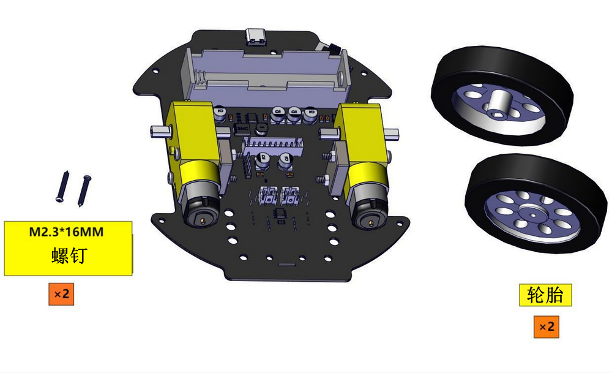
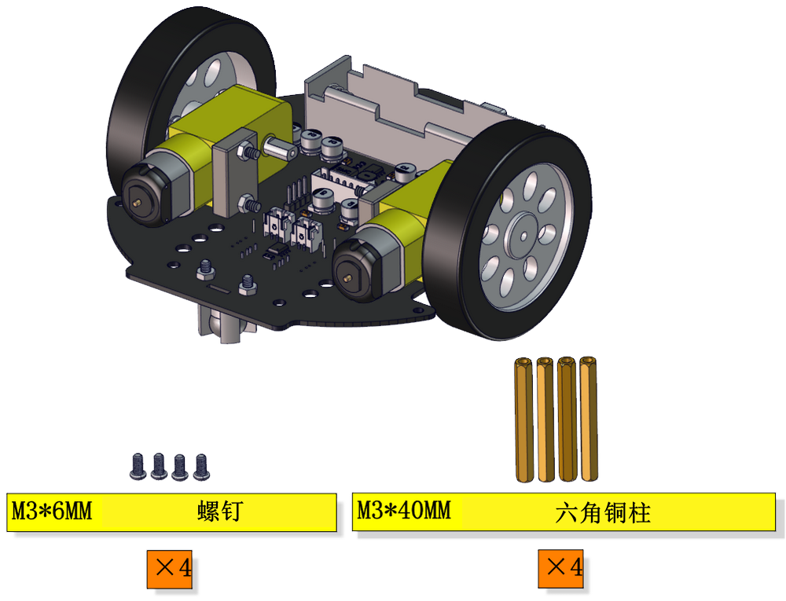
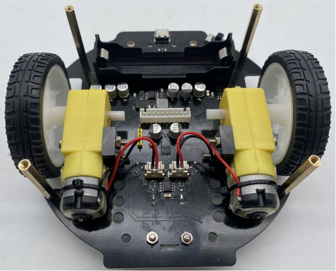
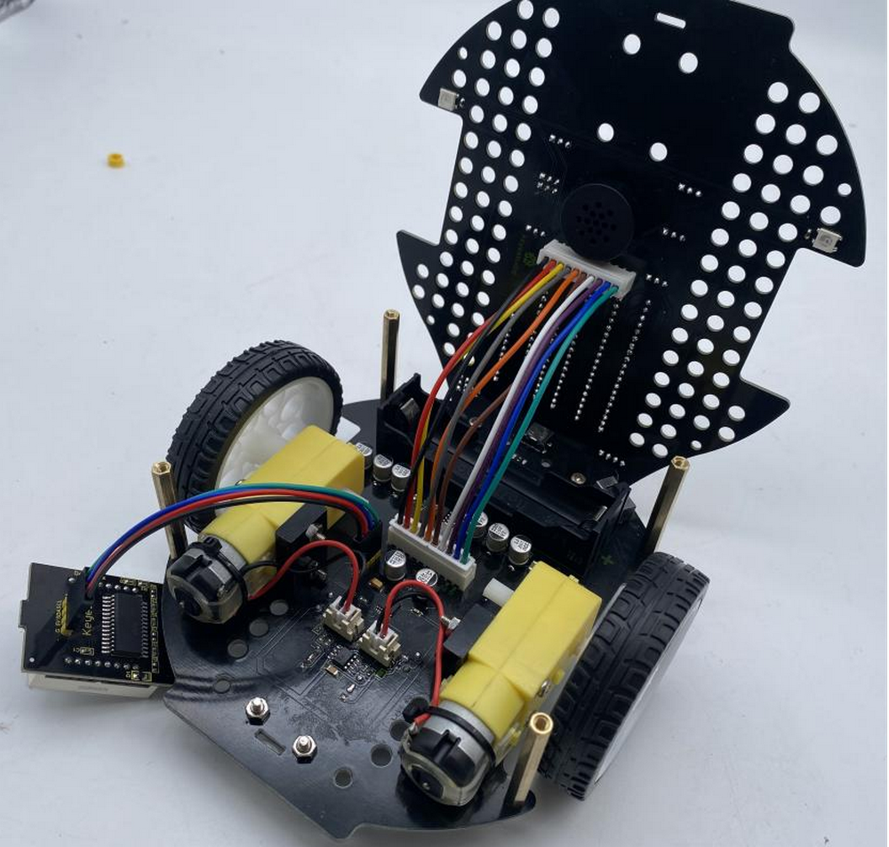
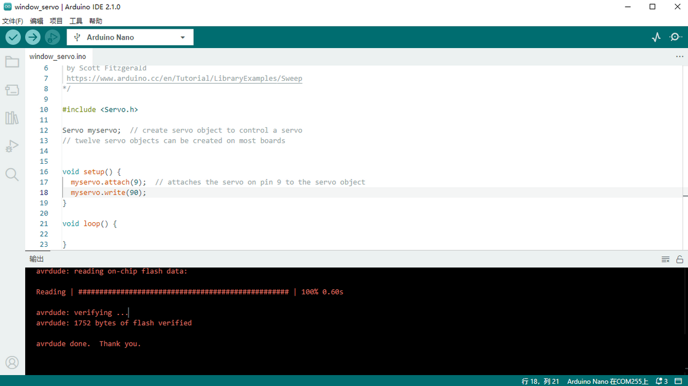
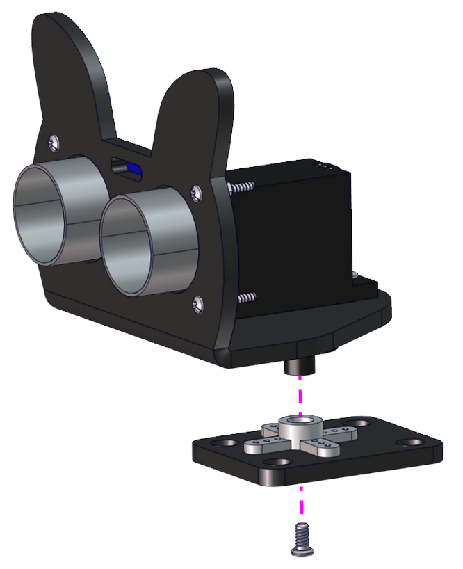
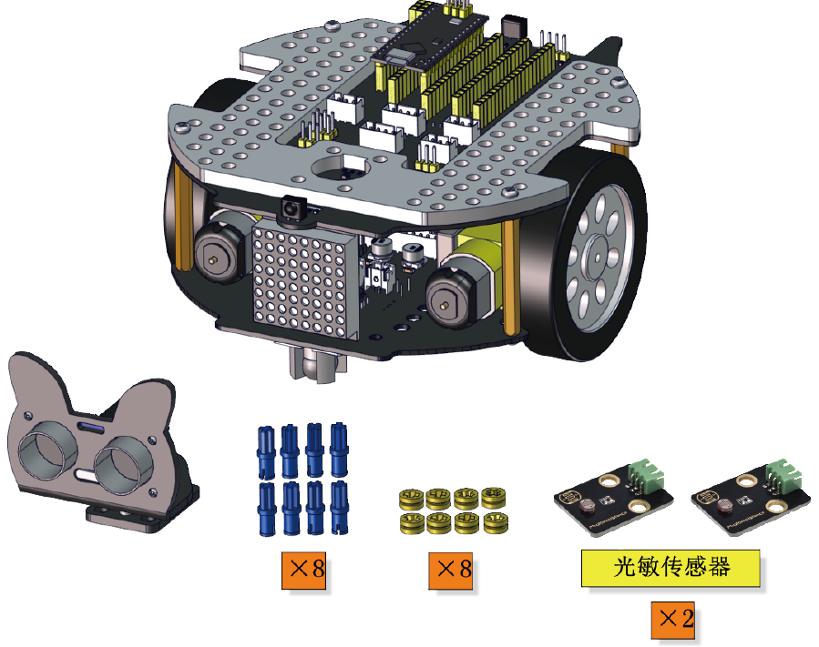
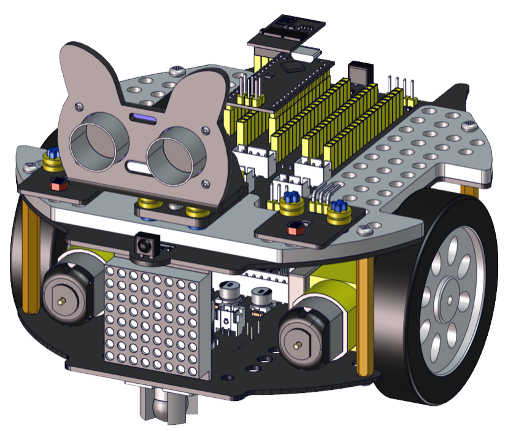

# KS0567 安装步骤

 在安装过程中，会有烧录代码的过程，请先安装软件部分，如果已经完成，接下来就开始实物的安装吧。一共分为20个小步骤，可分为椴木板安装和开发板接线两大类，还请拿出100%的精神，集中注意力，尽情享受动手创造的快乐吧！

------

## 步骤 1

------
1.1

------
1.2

------
1.3

完成

------

## 步骤 2

------

2.1

------

2.2

------

2.3

------

## 步骤 3

------

3.1

------

3.2

------

3.3

------

## 步骤 4

------

4.1

------

4.2

------

4.3

------

## 步骤 5

------

5.1

------

5.2

|   模块   |       接口        |
| :------: | :---------------: |
| 左边电机 | （L）  2.54mm端子 |
| 右边电机 | （R）  2.54mm端子 |

**接线时，请注意区分线材颜色，传感器S接黄色，V接红色，G接黑色**

------

5.3

将8*8点阵，通过杜邦线连接PCB底板。

| 所需线材 | 4P 杜邦母对母连拼 100mm （黑红蓝绿线） |
| -------- | -------------------------------------- |

8*8点阵接线表：

| 8*8点阵模块 |   PCB底板   |
| :---------: | :---------: |
|  G（黑色）  |  G（黑色）  |
| 5V（红色）  | 5V（红色）  |
| SDA（蓝色） | SDA（蓝色） |
| SCL（绿色） | SCL（绿色） |

然后将电机、8*8点阵屏用连接线，连接上下两块 PCB板，如下。

------

5.4

------

5.5

------

## 步骤 6

------

6.1

------

6.2

------

6.3

------

## 步骤 7

------

7.1

------

7.2

------

7.3

------

## 步骤 8

------

8.1

------

8.2

------

8.3

------

## 步骤 9

------

9.1

------

9.2

------

**安装舵机前，舵机角度调节到90度，通过烧录代码进行调节，通过arduino编译器进行。**

- 用舵机连接到小车的扩展板，连接扩展板上的引脚S1（D9）。

- 用**Arduino IDE**打开**window_servo.ino**，并上传至NANO开发板。

  

- 舵机将会调整到90度。

------

9.3

**开始安装舵机**

------

9.4

------

9.5

------

## 步骤 10

------

10.1

------

10.2

------

10.3

------

10.4

**此步骤需要使用杜邦线，连接超声波传感器。**

|     模块     |         线材          |
| :----------: | :-------------------: |
| 超声波传感器 | 4PIN **（黑红蓝绿）** |

- 先接超声波模块，**接线时，请注意区分线材颜色，Vcc接红色，Trig接蓝色，Echo接绿色，Gnd接黑色,**

  请务必要接线正确，否则发生短路，会烧坏超声波传感器！！

  

  ------

  超声波线另一端，接小车扩展板上。

  

  ------

  

  ------

  

10.5

**此步骤需要使用杜邦线，连接两个光敏传感器。**

|    模块    | 线材 |
| :--------: | :--: |
| 光敏传感器 | 3PIN |

- 先连接光敏传感器，请注意，**黄色线连接S，红色线连接V，黑色线连接G**。

  

  ------

  

- 再把传感器连接到小车扩展板，请注意，**黄色线连接S，红色线连接V，黑色线连接G**。

  

  ------

  

------

## 步骤 11

------

11.1

**所需零件**

------

11.2

------

11.3

------

11.4

------

## 步骤 12

------

12.1

使用缠绕管，把线全部整理起来。

------

------

# 完成

------