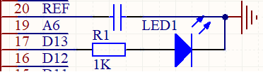
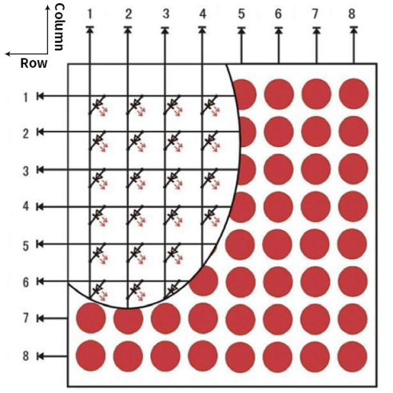
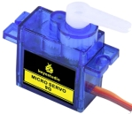
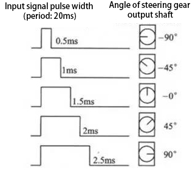
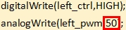
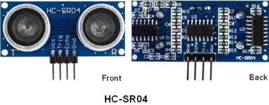
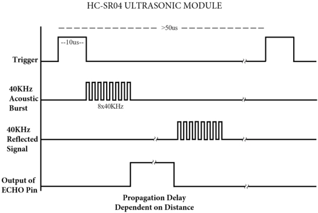
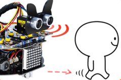
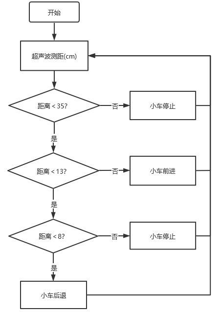

# Project 01: LED Blinking

## 实验简介

在前面的准备工作中，知道我们Arduino Nano主板上有个板载LED(L)，而且我们已经知道这个LED是连接在Arduino Nano主板上的D13，在本实验中，我们让这个LED闪烁起来。LED闪烁对于学习Arduino的爱好者而言，是最基础的实验项目，也是新手必须经历的一个练习。

------

## 元件知识

**板载LED：**LED是一种被称为“发光二极管”的半导体，是一种由半导体材料(硅、硒、锗等)制成的电子器件。它的控制方法非常简单，通过控制Arduino Nano主板上IO口（D13）的高低电平，来使LED灯亮灭。



------

## 实验代码

```c++
/*
  Project 01 LED Blinking
  Turns an LED on for one second, then off for one second, repeatedly.
*/
int ledPin=13; //Define LED pin to D13
// the setup function runs once when you press reset or power the board

void setup() {
  // initialize digital pin LED_BUILTIN as an output.
  pinMode(ledPin, OUTPUT);
}

// the loop function runs over and over again forever
void loop() {
  digitalWrite(ledPin, HIGH);   // turn the LED on (HIGH is the voltage level)
  delay(1000);                       // wait for a second
  digitalWrite(ledPin, LOW);    // turn the LED off by making the voltage LOW
  delay(1000);                       // wait for a second
}
```

------

## 实验现象

将实验代码上传至Arduino Nano主板上，利用USB线上电后，Arduino Nano主板上的板载LED就闪烁起来。
# Project 02: 6812 RGB


## 实验简介

小车扩展板上有4个RGB LED，RGB LED属于简单的发光模块，可以通过调节色彩调出不同颜色的灯效，可广泛应用于建筑物、桥梁、道路、花园、庭院、地板等领域的装饰照明与会场布置、圣诞节、万圣节、情人节、复活节、国庆节等节日期间烘托气氛等场景。在本实验中，使小车扩展板上的4个RGB实现各种灯光效果。

------

## 元件知识

**SK6812RGB：**小车扩展板上有4个RGB LED，从原理图中可以看出，这4个RGBLED都是串联起来的，在电压电流充足的情况下可以接几百个RGB LED，都可以用一根信号线控制任意一个RGB LED，并且让它显示任意一种颜色。每一颗RGBLED都是一个独立的像素点，每个像素点都是由R、G、B三基色颜色组成，可实现256级亮度显示，完成16777216种颜色的全真色彩显示，同时像素点内部包含了智能数字接口数据锁存信号整形放大驱动电路，还内置信号整形电路，有效保证了像素点光的颜色高度一致。


------

## 实验代码

```c++
/*
  Project 02 SK6812 RGB
  4 RGBs for various lighting effects.
*/
#include <Adafruit_NeoPixel.h>

#define PIN A3

// Parameter 1 = number of pixels in strip
// Parameter 2 = Arduino pin number (most are valid)
// Parameter 3 = pixel type flags, add together as needed:
//   NEO_KHZ800  800 KHz bitstream (most NeoPixel products w/WS2812 LEDs)
//   NEO_KHZ400  400 KHz (classic 'v1' (not v2) FLORA pixels, WS2811 drivers)
//   NEO_GRB     Pixels are wired for GRB bitstream (most NeoPixel products)
//   NEO_RGB     Pixels are wired for RGB bitstream (v1 FLORA pixels, not v2)
Adafruit_NeoPixel strip = Adafruit_NeoPixel(60, PIN, NEO_GRB + NEO_KHZ800);

// IMPORTANT: To reduce NeoPixel burnout risk, add 1000 uF capacitor across
// pixel power leads, add 300 - 500 Ohm resistor on first pixel's data input
// and minimize distance between Arduino and first pixel.  Avoid connecting
// on a live circuit...if you must, connect GND first.

void setup() {
  strip.begin();
  strip.show(); // Initialize all pixels to 'off'
}

void loop() {
  // Some example procedures showing how to display to the pixels:
  colorWipe(strip.Color(255, 0, 0), 50); // Red
  colorWipe(strip.Color(0, 255, 0), 50); // Green
  colorWipe(strip.Color(0, 0, 255), 50); // Blue
  // Send a theater pixel chase in...
  theaterChase(strip.Color(127, 127, 127), 50); // White
  theaterChase(strip.Color(127,   0,   0), 50); // Red
  theaterChase(strip.Color(  0,   0, 127), 50); // Blue

  rainbow(20);
  rainbowCycle(20);
  theaterChaseRainbow(50);
}

// Fill the dots one after the other with a color
void colorWipe(uint32_t c, uint8_t wait) {
  for(uint16_t i=0; i<strip.numPixels(); i++) {
      strip.setPixelColor(i, c);
      strip.show();
      delay(wait);
  }
}

void rainbow(uint8_t wait) {
  uint16_t i, j;

  for(j=0; j<256; j++) {
    for(i=0; i<strip.numPixels(); i++) {
      strip.setPixelColor(i, Wheel((i+j) & 255));
    }
    strip.show();
    delay(wait);
  }
}

// Slightly different, this makes the rainbow equally distributed throughout
void rainbowCycle(uint8_t wait) {
  uint16_t i, j;

  for(j=0; j<256*5; j++) { // 5 cycles of all colors on wheel
    for(i=0; i< strip.numPixels(); i++) {
      strip.setPixelColor(i, Wheel(((i * 256 / strip.numPixels()) + j) & 255));
    }
    strip.show();
    delay(wait);
  }
}

//Theatre-style crawling lights.
void theaterChase(uint32_t c, uint8_t wait) {
  for (int j=0; j<10; j++) {  //do 10 cycles of chasing
    for (int q=0; q < 3; q++) {
      for (int i=0; i < strip.numPixels(); i=i+3) {
        strip.setPixelColor(i+q, c);    //turn every third pixel on
      }
      strip.show();
     
      delay(wait);
     
      for (int i=0; i < strip.numPixels(); i=i+3) {
        strip.setPixelColor(i+q, 0);        //turn every third pixel off
      }
    }
  }
}

//Theatre-style crawling lights with rainbow effect
void theaterChaseRainbow(uint8_t wait) {
  for (int j=0; j < 256; j++) {     // cycle all 256 colors in the wheel
    for (int q=0; q < 3; q++) {
        for (int i=0; i < strip.numPixels(); i=i+3) {
          strip.setPixelColor(i+q, Wheel( (i+j) % 255));    //turn every third pixel on
        }
        strip.show();
       
        delay(wait);
       
        for (int i=0; i < strip.numPixels(); i=i+3) {
          strip.setPixelColor(i+q, 0);        //turn every third pixel off
        }
    }
  }
}

// Input a value 0 to 255 to get a color value.
// The colours are a transition r - g - b - back to r.
uint32_t Wheel(byte WheelPos) {
  if(WheelPos < 85) {
   return strip.Color(WheelPos * 3, 255 - WheelPos * 3, 0);
  } else if(WheelPos < 170) {
   WheelPos -= 85;
   return strip.Color(255 - WheelPos * 3, 0, WheelPos * 3);
  } else {
   WheelPos -= 170;
   return strip.Color(0, WheelPos * 3, 255 - WheelPos * 3);
  }
}
```

## 实验现象

将实验代码上传至Arduino Nano主板上，利用USB线上电后，小车PCB板上的4个RGB LED实现各种灯光效果。 


# Project 03: 演奏音乐

## 实验简介

小车扩展板上有个喇叭功放元件，它常用来播放音乐，作为一些音乐播放设备的外接扩音设备。

在本实验中，我们利用喇叭功放元件来播放一首音乐。

------

## 元件知识

***\*喇叭功放元件：\****喇叭功放元件（原理相当于无源蜂鸣器），其内部不带震荡电路，控制时需要在元件正极输入不同频率的方波，负极接地，从而控制喇叭功放元件响起不同频率的声音。

------

## 实验代码：

```c++
/*
Project 03 Buzzer
Buzzer plays music
*/
#define NOTE_B0  31
#define NOTE_C1  33
#define NOTE_CS1 35
#define NOTE_D1  37
#define NOTE_DS1 39
#define NOTE_E1  41
#define NOTE_F1  44
#define NOTE_FS1 46
#define NOTE_G1  49
#define NOTE_GS1 52
#define NOTE_A1  55
#define NOTE_AS1 58
#define NOTE_B1  62
#define NOTE_C2  65
#define NOTE_CS2 69
#define NOTE_D2  73
#define NOTE_DS2 78
#define NOTE_E2  82
#define NOTE_F2  87
#define NOTE_FS2 93
#define NOTE_G2  98
#define NOTE_GS2 104
#define NOTE_A2  110
#define NOTE_AS2 117
#define NOTE_B2  123
#define NOTE_C3  131
#define NOTE_CS3 139
#define NOTE_D3  147
#define NOTE_DS3 156
#define NOTE_E3  165
#define NOTE_F3  175
#define NOTE_FS3 185
#define NOTE_G3  196
#define NOTE_GS3 208
#define NOTE_A3  220
#define NOTE_AS3 233
#define NOTE_B3  247
#define NOTE_C4  262
#define NOTE_CS4 277
#define NOTE_D4  294
#define NOTE_DS4 311
#define NOTE_E4  330
#define NOTE_F4  349
#define NOTE_FS4 370
#define NOTE_G4  392
#define NOTE_GS4 415
#define NOTE_A4  440
#define NOTE_AS4 466
#define NOTE_B4  494
#define NOTE_C5  523
#define NOTE_CS5 554
#define NOTE_D5  587
#define NOTE_DS5 622
#define NOTE_E5  659
#define NOTE_F5  698
#define NOTE_FS5 740
#define NOTE_G5  784
#define NOTE_GS5 831
#define NOTE_A5  880
#define NOTE_AS5 932
#define NOTE_B5  988
#define NOTE_C6  1047
#define NOTE_CS6 1109
#define NOTE_D6  1175
#define NOTE_DS6 1245
#define NOTE_E6  1319
#define NOTE_F6  1397
#define NOTE_FS6 1480
#define NOTE_G6  1568
#define NOTE_GS6 1661
#define NOTE_A6  1760
#define NOTE_AS6 1865
#define NOTE_B6  1976
#define NOTE_C7  2093
#define NOTE_CS7 2217
#define NOTE_D7  2349
#define NOTE_DS7 2489
#define NOTE_E7  2637
#define NOTE_F7  2794
#define NOTE_FS7 2960
#define NOTE_G7  3136
#define NOTE_GS7 3322
#define NOTE_A7  3520
#define NOTE_AS7 3729
#define NOTE_B7  3951
#define NOTE_C8  4186
#define NOTE_CS8 4435
#define NOTE_D8  4699
#define NOTE_DS8 4978
#define REST 0
int tempo=114; // change this to make the song slower or faster
int buzzer = 3;// initializes  digital I/O PIN to control the buzzer
// notes of the moledy followed by the duration
// a 4 means a quarter note, 8 an eighteenth , 16 sixteenth, so on
//  !!negative numbers are used to represent dotted notes
//  so -4 means a dotted quarter note, that is, a quarter plus an eighteenth
int melody[] = {
  NOTE_E4,4,  NOTE_E4,4,  NOTE_F4,4,  NOTE_G4,4,//1
  NOTE_G4,4,  NOTE_F4,4,  NOTE_E4,4,  NOTE_D4,4,
  NOTE_C4,4,  NOTE_C4,4,  NOTE_D4,4,  NOTE_E4,4,
  NOTE_E4,-4, NOTE_D4,8,  NOTE_D4,2,
  NOTE_E4,4,  NOTE_E4,4,  NOTE_F4,4,  NOTE_G4,4,//4
  NOTE_G4,4,  NOTE_F4,4,  NOTE_E4,4,  NOTE_D4,4,
  NOTE_C4,4,  NOTE_C4,4,  NOTE_D4,4,  NOTE_E4,4,
  NOTE_D4,-4,  NOTE_C4,8,  NOTE_C4,2,
  NOTE_D4,4,  NOTE_D4,4,  NOTE_E4,4,  NOTE_C4,4,//8
  NOTE_D4,4,  NOTE_E4,8,  NOTE_F4,8,  NOTE_E4,4, NOTE_C4,4,
  NOTE_D4,4,  NOTE_E4,8,  NOTE_F4,8,  NOTE_E4,4, NOTE_D4,4,
  NOTE_C4,4,  NOTE_D4,4,  NOTE_G3,2,
  NOTE_E4,4,  NOTE_E4,4,  NOTE_F4,4,  NOTE_G4,4,//12
  NOTE_G4,4,  NOTE_F4,4,  NOTE_E4,4,  NOTE_D4,4,
  NOTE_C4,4,  NOTE_C4,4,  NOTE_D4,4,  NOTE_E4,4,
  NOTE_D4,-4,  NOTE_C4,8,  NOTE_C4,2
};
// sizeof gives the number of bytes, each int value is composed of two bytes (16 bits)
// there are two values per note (pitch and duration), so for each note there are four bytes
int notes=sizeof(melody)/sizeof(melody[0])/2; 
// this calculates the duration of a whole note in ms (60s/tempo)*4 beats
int wholenote = (60000 * 4) / tempo;
int divider = 0, noteDuration = 0;
void setup() {
  // iterate over the notes of the melody
  // remember, the array is twice the number of notes (notes + durations)
  for (int thisNote = 0; thisNote < notes * 2; thisNote = thisNote + 2) {
    // calculates the duration of each note
    divider = melody[thisNote + 1];
    if (divider > 0) {
    noteDuration = (wholenote) / divider; // regular note, just proceed
    } else if (divider < 0) {
      // dotted notes are represented with negative durations!!
      noteDuration = (wholenote) / abs(divider);
      noteDuration *= 1.5; // increases the duration in half for dotted notes
    }
    // we only play the note for 90% of the duration, leaving 10% as a pause
    tone(buzzer, melody[thisNote], noteDuration*0.9);
  // Wait for the specief duration before playing the next note
    delay(noteDuration);
    noTone(buzzer);  //  stop the waveform generation before the next note
  }
}
void loop() {
// if you want to repeat the song forever, 
// just paste the setup code here instead.
}
```

------

## 实验现象

将实验代码上传至Arduino Nano主板上，利用USB线上电后，小车PCB板上的喇叭功放元件就开始播放一首音乐。
# Project 04: 8\*8点阵

## 实验简介：


8\*8 点阵屏通过LED(发光二极管）组成，以灯珠亮灭来显示文字、图片、动画、视频等，8\*8 点阵显示屏制作简单，安装方便，被广泛应用于各种公共场合，如汽车报站器、广告屏、银行窗口屏、叫号屏以及停车系统等等。在本实验中，将使用8*8 点阵屏来显示图案。

------

## 元件知识

**8\*8点阵屏：**LED点阵屏按照LED发光颜色可分为单色、双色、三色灯等，可显示红、黄、绿甚至是真彩色。根据LED的数量又分为4×4、8×8、16×16等不同类型。这里我们通过单色8×8点阵屏来了解其原理。

不同点阵屏封装不同，8×8点阵屏由8行8列共64个LED灯组成，其内部结构如下图：

 

每个LED放置在行线和列线的交叉点上，当对应的某一行电平拉高，某一列电拉低，则对应交叉点的LED就会点亮。8×8点阵屏有16个管脚，将有丝印的一边朝下，逆时针编号为1-8，9-16。

 

其对应内部管脚定义如下如所示：

 

比如我们要点亮第一行第一列LED灯，则对应将点阵屏的第9脚拉高，第13脚拉低，其他LED控制以此类推即可。

HT16K33：8X8点阵驱动模块：上面介绍了8*8点阵的原理，想控制8*8点阵需要多达16个单片机的引脚。这样既浪费资源也浪费时间。这里用了一个驱动点阵屏的芯片：HT16K33。HT16K33是一款内存映射和多功能LED控制器驱动芯片。利用HT16K33芯片驱动1个8*8点阵，只需要利用单片机的I2C通信端口控制点阵，大大的节约了单片机资源。下图是HT16K33 芯片工作原理图。

 

我们基于以上原理设计了一个8X8点阵驱动模块，从上图我们可以看出，我们只要通过I2C 通讯利用单片机的2个引脚就可以很好的控制点阵显示。

**8X8点阵模块的参数：**

- 工作电压: 5V  

- 额定输入频率: 400KHZ 

- 输入功率: 2.5W 

- 输入电流: 500mA 

**取模工具的使用说明：**

点阵和驱动的原理都已经介绍完了，那点阵上显示的内容是怎么来的呢，有没有比较简便的方法？这里给大家介绍一款点阵取模工具，这块工具使用的是在线版，链接：[http://dotmatrixtool.com/#](http://dotmatrixtool.com/)

现在就一起看看怎么使用吧。

①打开链接如下图：

 

②我们的点阵是8*8的，所以调整高度为8，宽度为8，如下图：

 

③在***\*Byte order\**** 这里选择***\*Row major\**** 这个模式

 

④将图案生成16进制的数据

如下图，按鼠标左键选中，右键取消，画好自己想要的图案，点击***\*Generate\****，就会生成我们所需要的十六进制的数据了,

 

这个生成的十六进制的代码（0x00, 0x66, 0x00, 0x00, 0x18, 0x42, 0x3c, 0x00）就是我们需要显示的内容，我们先保存好，等一下需要放到程序里面。

 

## 实验接线：

 

| 8*8点阵 | 小车PCB板 |
| :-----: | :-------: |
|    G    |     G     |
|   5V    |    5V     |
|   SDA   |    SDA    |
|   SCL   |    SCL    |


## 实验代码

```c++
/*
 Project 04 8*8 Dot Matrix
 8*8 dot matrix screen to display patterns
*/ 
#include <ks_Matrix.h>
Matrix myMatrix(A4,A5);    //set pins to communication pins
// define an array
uint8_t LedArray1[8]={0x00, 0x66, 0x00, 0x00, 0x18, 0x42, 0x3c, 0x00};  
uint8_t  LEDArray[8]; //define an array(by modulus tool) without initial value

void setup(){
  myMatrix.begin(0x70);  //communication address
  myMatrix.clear();    //clear matrix
}

void loop(){
  for(int i=0; i<8; i++)  // there is eight data, loop for eight times
  {
LEDArray[i]=LedArray1[i];  //Call the emoticon array data in the subroutine LEDArray
for(int j=7; j>=0; j--)  //Every data(byte) has 8 bit, therefore, loop for eight times
    {
      if((LEDArray[i]&0x01)>0) //judge if the last bit of data is greater than 0
      {
        myMatrix.drawPixel(j, i,1);  //light up the corresponding point
      }
      else  //otherwise
      {
        myMatrix.drawPixel(j, i,0);  //turn off the corresponding point
      }
      LEDArray[i] = LEDArray[i]>>1;  //LEDArray[i] moves right for one bit to judge the previous one bit
    }
  }
  myMatrix.writeDisplay();  // dot matrix shows
}
```

## 实验现象

将实验代码上传至Arduino Nano主板上，利用USB线上电后，小车前的8*8点阵屏显示“笑脸”图案。


# Project 05: 舵机转动

## 实验简介：

小车上有两个舵机，这里以接在引脚D9的舵机为例，舵机是一种可以非常精确地旋转的电机。目前已广泛应用于玩具车、遥控直升机、飞机、机器人等领域。在这个项目中，我们将使用Nano主板控制舵机转动。

## 元件知识：



***\*舵机：\****舵机是一种位置伺服的驱动器，主要是由外壳、电路板、无核心马达、齿轮与位置检测器所构成。其工作原理是由接收机或者单片机发出信号给舵机，其内部有一个基准电路，产生周期为20ms，宽度为1.5ms 的基准信号，将获得的直流偏置电压与电位器的电压比较，获得电压差输出。经由电路板上的IC 判断转动方向，再驱动无核心马达开始转动，透过减速齿轮将动力传至摆臂，同时由位置检测器送回信号，判断是否已经到达定位。适用于那些需要角度不断变化并可以保持的控制系统。当电机转速一定时，通过级联减速齿轮带动电位器旋转，使得电压差为0，电机停止转动。一般舵机旋转的角度范围是0度到180 度。

控制舵机的脉冲周期为20ms，脉冲宽度为0.5ms ~ 2.5ms，对应位置为-90°~ +90°。下面是以一个180°角的舵机为例：



伺服电机有多种规格，但它们都有三根连接线，分别是棕色、红色、橙色(不同品牌可能有不同的颜色)。棕色为GND，红色为电源正极，橙色为信号线。


## 实验接线：

|  舵机  | 小车PCB板 |
| :----: | :-------: |
|  棕线  |     G     |
|  红线  |    5V     |
| 橙黄线 | S1（D9）  |

## 实验代码

```c++
/*
Project 05 Servo Rotation
the plastic arm of the servo will rotate at an angle of 0°, 45°, 90°, 135°, and 180°,repeatly.
*/
#include <Servo.h>
Servo myservo;// define the name of the servo
void setup()
{
myservo.attach(9);// select the pin of the servo(9)
}
void loop()
{
    myservo.write(0);// set the rotation angle of the motor
    delay(500);
    myservo.write(45);// set the rotation angle of the motor
    delay(500);
    myservo.write(90);// set the rotation angle of the motor
    delay(500);
    myservo.write(135);// set the rotation angle of the motor
    delay(500);
    myservo.write(180);// set the rotation angle of the motor
    delay(500);
}
```

## 实验现象

将实验代码上传至Arduino Nano主板，利用USB线上电后，舵机塑料臂将以0°、45°、90°、135°、180°的角度转动。循环进行！！


# Project 06: 电机驱动和调速


## 实验简介：

驱动电机的方法有很多，我们这个小车用到的是最常用的DRV8833电机驱动芯片，该芯片为玩具、打印机及其它电机一体化应用提供了一款双通道桥式电动驱动器解决方案。

在本实验中，我们使用扩展板上的DRV8833电机驱动芯片驱动小车的两个直流电机，通过编写代码实现小车分别向前，向后，向左，向右行走的效果。

## 元件知识：

**DRV8833电机驱动芯片：**具有电流控制功能的双H桥电机驱动器，可以驱动两个直流电机、一个双极步进电机、电磁阀或其他电感负载。每个H桥的输出驱动器块由N沟道功率MOSFET组成，配置为H桥以驱动电机绕组。每个H桥包括调节或限制绕组电流的电路。

带有故障输出引脚的内部停机功能是用于过大电流保护、短路保护、欠压锁定和超温。还提供了低功耗睡眠模式。我们来看一下DRV8833电机驱动芯片驱动两个直流电机的电路图和示意图：


 

如果想更深了解DRV8833电机驱动芯片，可以查看我们提供的芯片规格书，在资料的“Attachments”文件夹里。


## 规格参数：

逻辑部分输入电压：DC 5V

驱动部分输入电压：DC 5V

逻辑部分工作电流：<30mA

驱动部分工作电流：<2A

最大耗散功率：10W（T=80℃）

电机转速：5V 200 rpm / min

电机驱动形式：双路H桥驱动

控制信号输入电平：高电平2.3V<Vin<5V ，低电平-0.3V<Vin<1.5V

工作温度：-25~130℃

## 驱动小车运行原理：

根据上面电机驱动板的电路图和示意图，我们知道左电机的方向引脚在D4，调速引脚在D6；右电机的方向引脚在D2，调速引脚在D5，按照以下表格的运动逻辑，就可以知道如何通过控制数字口，PWM口控制2个电机转动，从而实现智能小车的行走。其中PWM值范围为0-255，设置数字越大，电机转动越快。

| 功能 |  D4  | D6（PWM） | 左电机 |  D2  | D5（PWM） | 右电机 |
| :--: | :--: | :-------: | :----: | :--: | :-------: | :----: |
| 前进 | LOW  |    200    |  正转  | LOW  |    200    |  正转  |
| 后退 | HIGH |    50     |  反转  | HIGH |    50     |  反转  |
| 左转 | HIGH |    200    |  反转  | LOW  |    200    |  正转  |
| 右转 | LOW  |    200    |  正转  | HIGH |    200    |  反转  |
| 停止 | LOW  |     0     |  停止  | LOW  |     0     |  停止  |

## 实验代码

```c++
/*
 Project 06 Motor drive and speed regulation
 Motor moves forward, backward, left and right
*/ 
const int left_ctrl = 4;//定义左电机方向控制引脚D4
const int left_pwm = 6;//定义左电机速度控制引脚D6
const int right_ctrl = 2;//定义右电机方向控制引脚D2
const int right_pwm = 5;//定义右电机速度控制引脚D5

void setup()
{
  pinMode(left_ctrl,OUTPUT);//设置左电机方向控制引脚为输出
  pinMode(left_pwm,OUTPUT);//设置左电机pwm控制速度引脚为输出
  pinMode(right_ctrl,OUTPUT);//设置右电机方向控制引脚为输出
  pinMode(right_pwm,OUTPUT);//设置右电机pwm控制速度引脚为输出
}

void loop()
{ 
  //front
  digitalWrite(left_ctrl,LOW); //左电机方向控制引脚低电平
  analogWrite(left_pwm,200); //左电机PWM控制速度200
  digitalWrite(right_ctrl,LOW); //右电机方向控制引脚低电平
  analogWrite(right_pwm,200); //右电机PWM控制速度200
  delay(2000);//延时2秒
  
  //back
  digitalWrite(left_ctrl,HIGH); //左电机方向控制引脚高电平
  analogWrite(left_pwm,50); //左电机PWM控制速度50
  digitalWrite(right_ctrl,HIGH); //右电机方向控制引脚高电平
  analogWrite(right_pwm,50); //右电机PWM控制速度50
  delay(2000);//延时2秒
  
  //left
  digitalWrite(left_ctrl,HIGH); //左电机方向控制引脚高电平
  analogWrite(left_pwm,200); //左电机PWM控制速度200
  digitalWrite(right_ctrl,LOW); //右电机方向控制引脚低电平
  analogWrite(right_pwm,200); //右电机PWM控制速度200
  delay(2000);//延时2秒
  
  //right
  digitalWrite(left_ctrl,LOW); //左电机方向控制引脚低电平
  analogWrite(left_pwm,200); //左电机PWM控制速度200
  digitalWrite(right_ctrl,HIGH); //右电机方向控制引脚高电平
  analogWrite(right_pwm,200); //右电机PWM控制速度200
  delay(2000);//延时2秒
  
  //stop
  digitalWrite(left_ctrl,LOW);//左电机方向控制引脚低电平
  analogWrite(left_pwm,0);//左电机PWM控制速度0
  digitalWrite(right_ctrl,LOW);//右电机方向控制引脚低电平
  analogWrite(right_pwm,0);//右电机PWM控制速度0
  delay(2000);//延时2秒
}
```

## 实验现象

将实验代码上传到Arduino Nano主板，小车安上电池，并且将电源开关拨到ON端，上电后，小车前进2秒，后退2秒，左转2秒，右转2秒，停止2秒，循环。

## 调速说明

HIGH相当于PWM值255，50是PWM值，是可以调整的。此代码中的差值是200，上下差值越大，电机转速越快，我们可以通过调整PWM值达到调节电机转速。如果将50调为0，上下差值就变成255，电机转速达到最大；如果将50调为255时，上下差值就变成0，电机转速为0，电机就不转动了。上下差值为正值时，电机反转。

LOW相当于PWM值0，200是PWM值，是可以调整的。此代码中的差值是200，上下差值越大，电机转速越快，我们可以通过调整PWM值达到调节电机转速。如果将200调为100，上下差值就变成100，电机转速减慢；如果将200调为255时，上下差值就变成255，电机转速达到最大；如果将200调为0时，上下差值变为0，电机就不转动了。上下差值为负值时，电机正转。
# Project 07：超声波测距

小车上有个超声波传感器，超声波传感器是一种非常实惠的距离传感器，它可以检测前方是否存在障碍物，并且检测出传感器与障碍物的详细距离。它的原理和蝙蝠飞行的原理一样，就是超声波传感器发送出一种频率很高的超声波信号，通常正常人耳朵的听力的声波范围是20Hz~20kHz，人类无法听到。这些超声波的信号若是碰到障碍物，就会立刻反射回来，在接收到返回的信息之后，通过判断发射信号和接收信号的时间差，计算出传感器和障碍物的距离。超声波传感器主要用于各种机器人项目中的物体躲避和测距，也常被用于水位传感，甚至作为一个停车传感器。在本章中，我们将学习超声波传感器测距原理及应用。

## 实验简介

在本实验中，我们使用超声波传感器来测量距离，并将数据打印在串口监视器上。

## 元件知识

***\*HC-SR04超声波传感器：\****像蝙蝠一样使用声纳来确定与物体的距离，它提供了精准的非接触范围检测，高精度和稳定的读数。它的操作不受阳光或黑色材料的影响，就像精密的照相机(在声学上像布料这样比较软的材料很难被探测到)。它带有超声波发射器和接收器。



在超声波传感器的前面是两个金属圆筒，这些是转换器。转换器将机械能转换成电信号。在超声波传感器中，有发射转换器和接收转换器。发射转换器将电信号转换为超声波脉冲，接收转换器将反射的超声波脉冲转换回电信号。如果你看超声波传感器的背面，你会看到的发射转换器后面有一个IC。这是控制发射转换器的IC。在接收转换器后面也有一个IC，这是一个四运算放大器，它将接收转换器产生的信号放大成足以传输到Arduino的信号。

***\*时序图：\****

下面图示是HC-SR04的时序图，为了开始测量，SR04的Trig必须接受至少10us的高(5V)脉冲，这将启动传感器将发射出8个周期的40kHz的超声波脉冲，并等待反射的超声波脉冲。当传感器从接收器检测到超声波时，它将设置回波引脚为高(5V)和延迟一个周期(宽度)，与距离成比例。为了获得距离，测量Echo引脚的宽度。



时间=回波脉冲宽度，单位为us(微秒)

距离（厘米）=时间/ 58

距离(英寸)=时间/ 148


HC-SR04超声波传感器有四个引脚：Vcc、Trig、Echo和GND。Vcc引脚提供产生超声波脉冲的电源，接Vcc/+5V。GND引脚接地/GND。Trig引脚是Arduino发送信号来启动超声波脉冲的地方。Echo引脚是超声波传感器向Arduino控制板发送关于超声波脉冲行程持续时间的信息的地方。

## 实验接线：

| 超声波传感器 | 小车PCB板 |
| :----------: | :-------: |
|     Vcc      |    5V     |
|     Trig     | S2（D8）  |
|     Echo     | S1（D7）  |
|     Gnd      |     G     |

## 实验代码

超声波传感器的Trig引脚是由Arduino Nano主板的IO口D8控制，Echo引脚是由Arduino Nano主板的IO口D7控制。

```c++
/*
Project 07 Ultrasonic Ranging
Ultrasonic detection of distance from objects
*/
const int trig = 8;  //Define trig pin to D8
const int echo = 7;  //Define echo pin to D7
int duration = 0;   
int distance = 0; //Define a variable to receive distance
void setup() 
{
  pinMode(trig , OUTPUT); // Define the trig pin as the output mode 
  pinMode(echo , INPUT); // Define the echo pin as the input mode
  Serial.begin(9600); // Set baud rate to 9600
}
void loop()
{
  digitalWrite(trig , HIGH);//the sensor is triggered by a high pulse of 1000 microseconds or more
  delayMicroseconds(1000);
  digitalWrite(trig , LOW); // Give a short low level in advance to ensure a clean high pulse
  duration = pulseIn(echo , HIGH);
  distance = (duration/2) / 28.5 ; //Convert to distance
  Serial.print(distance); // Print the distance in centimeters
  Serial.println("cm");
}
```

## 实验现象

将实验代码上传到Arduino Nano主板，利用USB线上电后，再打开串口监视器，设置波特率为9600，当把一个物体放在超声波传感器前面移动时(远近)，它会检测到物体的距离，该值将显示在串口监视器上。


# Project 08: 跟随我

## 实验简介：



在上面实验中，我们已经了解了8*8点阵、电机驱动和调速、超声波传感器、舵机等硬件知识，那么在本实验中，我们将结合它们打造一款跟随小车! 在电路设计过程中，我们可以利用超声波传感器来检测小车与前方物体的距离。通过测量距离控制电机的旋转，从而控制小车的运动状态，使小车跟随物体运动。

## 工作原理：


| 检测  | 检测前方物体的距离        | 距离（单位：cm） |
| ----- | ------------------------- | ---------------- |
| 条件1 | 距离＜8                   |                  |
| 状态  | 小车后退（设置PWM 为100） |                  |
| 条件2 | 8≤距离<13                 |                  |
| 状态  | 小车停止                  |                  |
| 条件3 | 13≤距离<35                |                  |
| 状态  | 小车前进（设置PWM 为100） |                  |
| 条件3 | 距离≥35                   |                  |
| 状态  | 小车停止                  |                  |

## 流程图：



## 实验代码

```c++
/*
Project 08: follow me
Car follows the object
*/ 
const int left_ctrl = 4;//定义左电机方向控制引脚D4
const int left_pwm = 6;//定义左电机速度控制引脚D6
const int right_ctrl = 2;//定义右电机方向控制引脚D2
const int right_pwm = 5;//定义右电机速度控制引脚D5
#include "SR04.h" //定义超声波模块函数库
#define TRIG_PIN 8// 定义超声波的信号输入在D8
#define ECHO_PIN 7//定义超声波的信号输出在D7
SR04 sr04 = SR04(ECHO_PIN,TRIG_PIN);
long distance;
const int servopin = 9;//定义舵机的脚位在D9
int myangle;
int pulsewidth;

void setup() {
  pinMode(left_ctrl,OUTPUT);//设置左电机方向控制引脚为输出
  pinMode(left_pwm,OUTPUT);//设置左电机pwm控制速度引脚为输出
  pinMode(right_ctrl,OUTPUT);//设置右电机方向控制引脚为输出
  pinMode(right_pwm,OUTPUT);//设置右电机pwm控制速度引脚为输出
  pinMode(TRIG_PIN,OUTPUT);//设置TRIG_PIN为输出
  pinMode(ECHO_PIN,INPUT);//设置ECHO_PIN为输入
  servopulse(servopin,90);//设置舵机初始角度为90
  delay(300);
}

void loop() {
  distance = sr04.Distance();//超声波测量的距离
  if(distance<8)//如果距离小于8
  {
    back();//后退
  }
  else if((distance>=8)&&(distance<13))//如果距离大于等于8，小于13
  {
    Stop();//停止
  }
  else if((distance>=13)&&(distance<35))//如果距离大于等于13，小于35
  {
    front();//跟随
  }
  else//如果以上都不是
  {
    Stop();//停止
  }
}

void servopulse(int servopin,int myangle)//舵机运行角度
{
  for(int i=0; i<20; i++)
  {
    pulsewidth = (myangle*11)+500;
    digitalWrite(servopin,HIGH);
    delayMicroseconds(pulsewidth);
    digitalWrite(servopin,LOW);
    delay(20-pulsewidth/1000);
  }  
}

void front()//定义前进的状态
{
  digitalWrite(left_ctrl,LOW); //左电机方向控制引脚低电平
  analogWrite(left_pwm,200); //左电机PWM控制速度200
  digitalWrite(right_ctrl,LOW); //右电机方向控制引脚低电平
  analogWrite(right_pwm,200); //右电机PWM控制速度200
}
void back()//定义后退的状态
{
  digitalWrite(left_ctrl,HIGH); //左电机方向控制引脚高电平
  analogWrite(left_pwm,50); //左电机PWM控制速度50
  digitalWrite(right_ctrl,HIGH); //右电机方向控制引脚高电平
  analogWrite(right_pwm,50); //右电机PWM控制速度50
}
void Stop()//定义停止的状态
{
  digitalWrite(left_ctrl,LOW);//左电机方向控制引脚低电平
  analogWrite(left_pwm,0);//左电机PWM控制速度0
  digitalWrite(right_ctrl,LOW);//右电机方向控制引脚低电平
  analogWrite(right_pwm,0);//右电机PWM控制速度0
}
```

## 实验现象

将实验代码上传到Arduino Nano主板，小车安上电池，并且将电源开关拨到ON端，上电后，小车可以随着前方障碍物的移动而移动（只能在一条线直上，不能转弯）。

# Project 09: 躲避障碍物

## 实验简介：


在上一实验中，我们制作了一个超声波跟随小车。实际上，利用同样硬件，我只需要更改一个测试代码就可以将跟随小车变为避障小车。那超声波避障小车，是怎么实现的呢？当然也是通过超声波传感器的测距来实现的。通过超声波传感器检测机器人前方障碍物，然后根据这一个数据获得机器人运动方向。

## 工作原理：

|        初始设定        |              8*8点阵清屏               |
| :--------------------: | :------------------------------------: |
|      设置舵机90°       |                                        |
|        循环进行        | 检测前方障碍物的距离：距离（单位: cm） |
|         条件 1         |                  状态                  |
|       0<距离＜10       |                小车停止                |
| 8*8点阵显示“停止”图案  |                                        |
|     设置舵机 180°      |     离障碍物的距离：a1（单位：cm）     |
|       设置舵机0°       |     离障碍物的距离：a2（单位：cm）     |
|         条件2          |                  状态                  |
|         a1＜a2         |      小车向右转（设置PWM为 200）       |
| 8*8点阵显示“向右” 图案 |                                        |
|      设置舵机 90°      |                                        |
|         a1≥a2          |      小车向左转（设置PWM为 200）       |
| 8*8点阵显示“向左” 图案 |                                        |
|      设置舵机 90°      |                                        |
|        距离≥10         |         8*8点阵显示“向前” 图案         |
|  前进（设置PWM为200）  |                                        |

## 流程图：


## 实验代码

```c++
/*
Project 09: avoid obstacles
*/  
#include <ks_Matrix.h>
Matrix myMatrix(A4,A5);//定义点阵的引脚在A4,A5
//数组，用于储存图案的数据，可以自己算也可以从取摸工具中得到
uint8_t matrix_front[8]={0x18,0x24,0x42,0x99,0x24,0x42,0x81,0x00};
uint8_t matrix_back[8]={0x00,0x81,0x42,0x24,0x99,0x42,0x24,0x18};
uint8_t matrix_left[8]={0x12,0x24,0x48,0x90,0x90,0x48,0x24,0x12};
uint8_t matrix_right[8]={0x48,0x24,0x12,0x09,0x09,0x12,0x24,0x48};
uint8_t matrix_stop[8]={0x18,0x18,0x18,0x18,0x18,0x00,0x18,0x18};
uint8_t  LEDArray[8];
const int left_ctrl = 4;//定义左电机方向控制引脚D4
const int left_pwm = 6;//定义左电机速度控制引脚D6
const int right_ctrl = 2;//定义右电机方向控制引脚D2
const int right_pwm = 5;//定义右电机速度控制引脚D5
#include "SR04.h"//定义超声波模块函数库
#define TRIG_PIN 8// 定义超声波的信号输入在D8
#define ECHO_PIN 7//定义超声波的信号输出在D7
SR04 sr04 = SR04(ECHO_PIN,TRIG_PIN);
long distance,a1,a2;//定义三个距离变量
const int servopin = 9;//定义舵机的脚位在D9
int myangle;
int pulsewidth;
int val;

void setup() {
  pinMode(left_ctrl,OUTPUT);//设置左电机方向控制引脚为输出
  pinMode(left_pwm,OUTPUT);//设置左电机pwm控制速度引脚为输出
  pinMode(right_ctrl,OUTPUT);//设置右电机方向控制引脚为输出
  pinMode(right_pwm,OUTPUT);//设置右电机pwm控制速度引脚为输出
  pinMode(TRIG_PIN,OUTPUT);//设置TRIG_PIN为输出
  pinMode(ECHO_PIN,INPUT);//设置ECHO_PIN为输入
  servopulse(servopin,90);//设置舵机初始角度为90
  delay(300);
  myMatrix.begin(112);
  myMatrix.clear();
}
 
void loop()
 {
  avoid();//运行避障主程序
}

void avoid()
{
  distance=sr04.Distance(); //获取超声波距离的值
  if((distance < 10)&&(distance != 0))//如果距离小于10且大于0
  {
    car_Stop();//停止
    myMatrix.clear();
    myMatrix.writeDisplay();//点阵显示停止图案
    matrix_display(matrix_stop);  //点阵显示停止图案
    delay(100);
    servopulse(servopin,180);//舵机转到180度
    delay(200);
    a1=sr04.Distance();//测量距离
    delay(100);
    servopulse(servopin,0);//再转到0度
    delay(200);
    a2=sr04.Distance();//测量距离
    delay(100);
    if(a1 > a2)//比较距离，如果左边大于右边
    {
      car_left();//向左转
      myMatrix.clear();
      myMatrix.writeDisplay();
      matrix_display(matrix_left);    //点阵显示向左图案
      servopulse(servopin,90);//舵机回到90度
      //delay(50);
      myMatrix.clear();
      myMatrix.writeDisplay();
      matrix_display(matrix_front);   //点阵显示前进图案
    }
    else//如果右边大于左边
    {
      car_right();//向右转
      myMatrix.clear();
      myMatrix.writeDisplay();
      matrix_display(matrix_right);   //显示右转图案
      servopulse(servopin,90);//舵机回到90度
      //delay(50);
      myMatrix.clear();
      myMatrix.writeDisplay();
      matrix_display(matrix_front);  //点阵显示前进图案
    }
  }
  else//如果以上都不是
  {
    car_front();//前进
    myMatrix.clear();
    myMatrix.writeDisplay();
    matrix_display(matrix_front);  //点阵显示前进图案
  }
}

void servopulse(int servopin,int myangle)//舵机运行角度
{
  for(int i=0; i<20; i++)
  {
    pulsewidth = (myangle*11)+500;
    digitalWrite(servopin,HIGH);
    delayMicroseconds(pulsewidth);
    digitalWrite(servopin,LOW);
    delay(20-pulsewidth/1000);
  } 
}

void car_front()//定义前进的状态
{
  digitalWrite(left_ctrl,LOW); //左电机方向控制引脚低电平
  analogWrite(left_pwm,200); //左电机PWM控制速度200
  digitalWrite(right_ctrl,LOW); //右电机方向控制引脚低电平
  analogWrite(right_pwm,200); //右电机PWM控制速度200
}
void car_back()//定义后退的状态
{
  digitalWrite(left_ctrl,HIGH); //左电机方向控制引脚高电平
  analogWrite(left_pwm,50); //左电机PWM控制速度50
  digitalWrite(right_ctrl,HIGH); //右电机方向控制引脚高电平
  analogWrite(right_pwm,50); //右电机PWM控制速度50
}
void car_left()//定义左转的状态
{
  digitalWrite(left_ctrl,HIGH); //左电机方向控制引脚高电平
  analogWrite(left_pwm,200); //左电机PWM控制速度200
  digitalWrite(right_ctrl,LOW); //右电机方向控制引脚低电平
  analogWrite(right_pwm,200); //右电机PWM控制速度200
}
void car_right()//定义右转的状态
{
  digitalWrite(left_ctrl,LOW); //左电机方向控制引脚低电平
  analogWrite(left_pwm,200); //左电机PWM控制速度200
  digitalWrite(right_ctrl,HIGH); //右电机方向控制引脚高电平
  analogWrite(right_pwm,200); //右电机PWM控制速度200
}
void car_Stop()//定义停止的状态
{
  digitalWrite(left_ctrl,LOW);//左电机方向控制引脚低电平
  analogWrite(left_pwm,0);//左电机PWM控制速度0
  digitalWrite(right_ctrl,LOW);//右电机方向控制引脚低电平
  analogWrite(right_pwm,0);//右电机PWM控制速度0
}

//点阵显示图案的函数
void matrix_display(unsigned char matrix_value[])
{
  for(int i=0; i<8; i++)
    {
      LEDArray[i]=matrix_value[i];
      for(int j=7; j>=0; j--)
      {
        if((LEDArray[i]&0x01)>0)
        myMatrix.drawPixel(j, i,1);
        LEDArray[i] = LEDArray[i]>>1;
      }
    } 
    myMatrix.writeDisplay();
}                  
```

## 实验现象

将实验代码上传到Arduino Nano主板，小车安上电池，并且将电源开关拨到ON端，上电后，小车可以可以自动避障。


