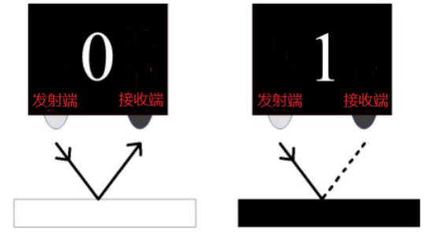
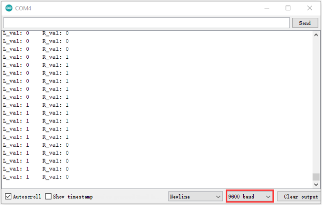

# Project 10: 红外循迹读值

## 实验简介：

在本实验中，我们使用ST188L3红外对管来检测黑白线，并将数据打印在串口监视器上。

## 元件知识：

***\*红外循迹：\****红外循迹有1对ST188L3红外对管，ST188L3红外对管具有一个高发射功率红外发射二极管和一个高灵敏度红外接收管。当红外发射二极管发射红外信号，红外信号经白色物体反射后，被接收管接收，一旦接收管接收到信号，输出端将输出低电平（0）；当红外发射二极管发射红外信号，红外线信号被黑色物体吸收后，将输出高电平（1），从而实现了通过红外线检测信号的功能。



警告：反射式光学传感器(包括红外循迹)应避免在阳光等有红外干扰的环境中使用。阳光中含有许多不可见光，如红外线和紫外线。在强光环境下，反射式光学传感器不能正常工作。

下表给出了小车上的红外循迹检测不同颜色物体的所有情况下的数值。其中检测到黑色物体或无物体代表1，检测到白色物体代表0。

|  左  |  右  | 值（二进制） |
| :--: | :--: | :----------: |
|  0   |  0   |      00      |
|  0   |  1   |      01      |
|  1   |  0   |      10      |
|  1   |  1   |      11      |

## 实验代码

小车PCB板上的左边红外循迹是由Arduino Nano主板的IO口D11控制，右边红外循迹是由Arduino Nano主板的IO口D10控制。

```c++
/*
Project 10: Tracking sensor read value
*/ 
int tracking_left = 11; //定义左红外循迹引脚D11
int tracking_right = 10; //定义右红外循迹引脚D10
int L_val,R_val; //定义左,右红外循迹两个变量

void setup() {
 Serial.begin(9600); //设置波特率为9600
 pinMode(tracking_left, INPUT); //设置左红外循迹引脚为输入
 pinMode(tracking_right, INPUT); //设置右红外循迹引脚为输入
}

void loop() {
 L_val = digitalRead(tracking_left); //读取左红外循迹的值
 R_val = digitalRead(tracking_right); //读取右红外循迹的值
 Serial.print("L_val: "); //串口打印字符串L_val
 Serial.print(L_val); //串口打印L_val值
 Serial.print("    "); //串口打印空格
 Serial.print("R_val: "); //串口打印字符串R_val
 Serial.println(R_val); //串口打印R_val值
 delay(300); //延时0.3秒
}
```

## 实验现象

将实验代码上传到Arduino Nano主板，利用USB线上电后，再打开串口监视器，设置波特率为9600，在小车的红外循迹下面放个黑色的东西，移动它，你会看到不同的指示灯亮起来，同时在串口监视器上看到红外循迹读取的值。旋转电位器可调节灵敏度，将指示灯调节至亮与不亮的临界点时，灵敏度最高。

