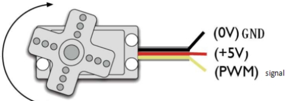

# Project 05: 舵机转动

## 实验简介：

小车上有两个舵机，这里以接在引脚D9的舵机为例，舵机是一种可以非常精确地旋转的电机。目前已广泛应用于玩具车、遥控直升机、飞机、机器人等领域。在这个项目中，我们将使用Nano主板控制舵机转动。

## 元件知识：


***\*舵机：\****舵机是一种位置伺服的驱动器，主要是由外壳、电路板、无核心马达、齿轮与位置检测器所构成。其工作原理是由接收机或者单片机发出信号给舵机，其内部有一个基准电路，产生周期为20ms，宽度为1.5ms 的基准信号，将获得的直流偏置电压与电位器的电压比较，获得电压差输出。经由电路板上的IC 判断转动方向，再驱动无核心马达开始转动，透过减速齿轮将动力传至摆臂，同时由位置检测器送回信号，判断是否已经到达定位。适用于那些需要角度不断变化并可以保持的控制系统。当电机转速一定时，通过级联减速齿轮带动电位器旋转，使得电压差为0，电机停止转动。一般舵机旋转的角度范围是0度到180 度。

控制舵机的脉冲周期为20ms，脉冲宽度为0.5ms ~ 2.5ms，对应位置为-90°~ +90°。下面是以一个180°角的舵机为例：


伺服电机有多种规格，但它们都有三根连接线，分别是棕色、红色、橙色(不同品牌可能有不同的颜色)。棕色为GND，红色为电源正极，橙色为信号线。



## 实验接线：

|  舵机  | 小车PCB板 |
| :----: | :-------: |
|  棕线  |     G     |
|  红线  |    5V     |
| 橙黄线 | S1（D9）  |

## 实验代码

```c++
/*
Project 05 Servo Rotation
the plastic arm of the servo will rotate at an angle of 0°, 45°, 90°, 135°, and 180°,repeatly.
*/
#include <Servo.h>
Servo myservo;// define the name of the servo
void setup()
{
myservo.attach(9);// select the pin of the servo(9)
}
void loop()
{
    myservo.write(0);// set the rotation angle of the motor
    delay(500);
    myservo.write(45);// set the rotation angle of the motor
    delay(500);
    myservo.write(90);// set the rotation angle of the motor
    delay(500);
    myservo.write(135);// set the rotation angle of the motor
    delay(500);
    myservo.write(180);// set the rotation angle of the motor
    delay(500);
}
```

## 实验现象

将实验代码上传至Arduino Nano主板，利用USB线上电后，舵机塑料臂将以0°、45°、90°、135°、180°的角度转动。循环进行！！

