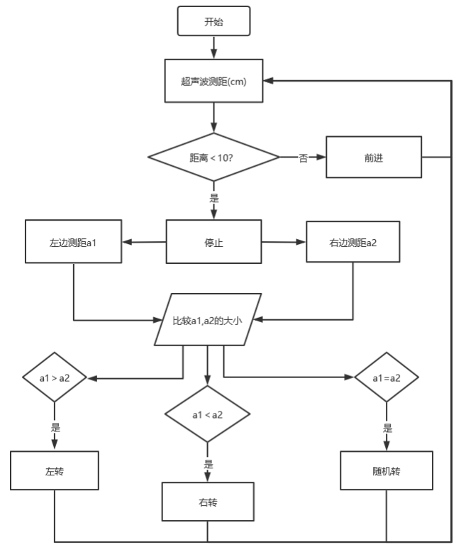

# Project 09: 躲避障碍物

## 实验简介：


在上一实验中，我们制作了一个超声波跟随小车。实际上，利用同样硬件，我只需要更改一个测试代码就可以将跟随小车变为避障小车。那超声波避障小车，是怎么实现的呢？当然也是通过超声波传感器的测距来实现的。通过超声波传感器检测机器人前方障碍物，然后根据这一个数据获得机器人运动方向。

## 工作原理：

|        初始设定        |              8*8点阵清屏               |
| :--------------------: | :------------------------------------: |
|      设置舵机90°       |                                        |
|        循环进行        | 检测前方障碍物的距离：距离（单位: cm） |
|         条件 1         |                  状态                  |
|       0<距离＜10       |                小车停止                |
| 8*8点阵显示“停止”图案  |                                        |
|     设置舵机 180°      |     离障碍物的距离：a1（单位：cm）     |
|       设置舵机0°       |     离障碍物的距离：a2（单位：cm）     |
|         条件2          |                  状态                  |
|         a1＜a2         |      小车向右转（设置PWM为 200）       |
| 8*8点阵显示“向右” 图案 |                                        |
|      设置舵机 90°      |                                        |
|         a1≥a2          |      小车向左转（设置PWM为 200）       |
| 8*8点阵显示“向左” 图案 |                                        |
|      设置舵机 90°      |                                        |
|        距离≥10         |         8*8点阵显示“向前” 图案         |
|  前进（设置PWM为200）  |                                        |

## 流程图：



## 实验代码

```c++
/*
Project 09: avoid obstacles
*/  
#include <ks_Matrix.h>
Matrix myMatrix(A4,A5);//定义点阵的引脚在A4,A5
//数组，用于储存图案的数据，可以自己算也可以从取摸工具中得到
uint8_t matrix_front[8]={0x18,0x24,0x42,0x99,0x24,0x42,0x81,0x00};
uint8_t matrix_back[8]={0x00,0x81,0x42,0x24,0x99,0x42,0x24,0x18};
uint8_t matrix_left[8]={0x12,0x24,0x48,0x90,0x90,0x48,0x24,0x12};
uint8_t matrix_right[8]={0x48,0x24,0x12,0x09,0x09,0x12,0x24,0x48};
uint8_t matrix_stop[8]={0x18,0x18,0x18,0x18,0x18,0x00,0x18,0x18};
uint8_t  LEDArray[8];
const int left_ctrl = 4;//定义左电机方向控制引脚D4
const int left_pwm = 6;//定义左电机速度控制引脚D6
const int right_ctrl = 2;//定义右电机方向控制引脚D2
const int right_pwm = 5;//定义右电机速度控制引脚D5
#include "SR04.h"//定义超声波模块函数库
#define TRIG_PIN 8// 定义超声波的信号输入在D8
#define ECHO_PIN 7//定义超声波的信号输出在D7
SR04 sr04 = SR04(ECHO_PIN,TRIG_PIN);
long distance,a1,a2;//定义三个距离变量
const int servopin = 9;//定义舵机的脚位在D9
int myangle;
int pulsewidth;
int val;

void setup() {
  pinMode(left_ctrl,OUTPUT);//设置左电机方向控制引脚为输出
  pinMode(left_pwm,OUTPUT);//设置左电机pwm控制速度引脚为输出
  pinMode(right_ctrl,OUTPUT);//设置右电机方向控制引脚为输出
  pinMode(right_pwm,OUTPUT);//设置右电机pwm控制速度引脚为输出
  pinMode(TRIG_PIN,OUTPUT);//设置TRIG_PIN为输出
  pinMode(ECHO_PIN,INPUT);//设置ECHO_PIN为输入
  servopulse(servopin,90);//设置舵机初始角度为90
  delay(300);
  myMatrix.begin(112);
  myMatrix.clear();
}
 
void loop()
 {
  avoid();//运行避障主程序
}

void avoid()
{
  distance=sr04.Distance(); //获取超声波距离的值
  if((distance < 10)&&(distance != 0))//如果距离小于10且大于0
  {
    car_Stop();//停止
    myMatrix.clear();
    myMatrix.writeDisplay();//点阵显示停止图案
    matrix_display(matrix_stop);  //点阵显示停止图案
    delay(100);
    servopulse(servopin,180);//舵机转到180度
    delay(200);
    a1=sr04.Distance();//测量距离
    delay(100);
    servopulse(servopin,0);//再转到0度
    delay(200);
    a2=sr04.Distance();//测量距离
    delay(100);
    if(a1 > a2)//比较距离，如果左边大于右边
    {
      car_left();//向左转
      myMatrix.clear();
      myMatrix.writeDisplay();
      matrix_display(matrix_left);    //点阵显示向左图案
      servopulse(servopin,90);//舵机回到90度
      //delay(50);
      myMatrix.clear();
      myMatrix.writeDisplay();
      matrix_display(matrix_front);   //点阵显示前进图案
    }
    else//如果右边大于左边
    {
      car_right();//向右转
      myMatrix.clear();
      myMatrix.writeDisplay();
      matrix_display(matrix_right);   //显示右转图案
      servopulse(servopin,90);//舵机回到90度
      //delay(50);
      myMatrix.clear();
      myMatrix.writeDisplay();
      matrix_display(matrix_front);  //点阵显示前进图案
    }
  }
  else//如果以上都不是
  {
    car_front();//前进
    myMatrix.clear();
    myMatrix.writeDisplay();
    matrix_display(matrix_front);  //点阵显示前进图案
  }
}

void servopulse(int servopin,int myangle)//舵机运行角度
{
  for(int i=0; i<20; i++)
  {
    pulsewidth = (myangle*11)+500;
    digitalWrite(servopin,HIGH);
    delayMicroseconds(pulsewidth);
    digitalWrite(servopin,LOW);
    delay(20-pulsewidth/1000);
  } 
}

void car_front()//定义前进的状态
{
  digitalWrite(left_ctrl,LOW); //左电机方向控制引脚低电平
  analogWrite(left_pwm,200); //左电机PWM控制速度200
  digitalWrite(right_ctrl,LOW); //右电机方向控制引脚低电平
  analogWrite(right_pwm,200); //右电机PWM控制速度200
}
void car_back()//定义后退的状态
{
  digitalWrite(left_ctrl,HIGH); //左电机方向控制引脚高电平
  analogWrite(left_pwm,50); //左电机PWM控制速度50
  digitalWrite(right_ctrl,HIGH); //右电机方向控制引脚高电平
  analogWrite(right_pwm,50); //右电机PWM控制速度50
}
void car_left()//定义左转的状态
{
  digitalWrite(left_ctrl,HIGH); //左电机方向控制引脚高电平
  analogWrite(left_pwm,200); //左电机PWM控制速度200
  digitalWrite(right_ctrl,LOW); //右电机方向控制引脚低电平
  analogWrite(right_pwm,200); //右电机PWM控制速度200
}
void car_right()//定义右转的状态
{
  digitalWrite(left_ctrl,LOW); //左电机方向控制引脚低电平
  analogWrite(left_pwm,200); //左电机PWM控制速度200
  digitalWrite(right_ctrl,HIGH); //右电机方向控制引脚高电平
  analogWrite(right_pwm,200); //右电机PWM控制速度200
}
void car_Stop()//定义停止的状态
{
  digitalWrite(left_ctrl,LOW);//左电机方向控制引脚低电平
  analogWrite(left_pwm,0);//左电机PWM控制速度0
  digitalWrite(right_ctrl,LOW);//右电机方向控制引脚低电平
  analogWrite(right_pwm,0);//右电机PWM控制速度0
}

//点阵显示图案的函数
void matrix_display(unsigned char matrix_value[])
{
  for(int i=0; i<8; i++)
    {
      LEDArray[i]=matrix_value[i];
      for(int j=7; j>=0; j--)
      {
        if((LEDArray[i]&0x01)>0)
        myMatrix.drawPixel(j, i,1);
        LEDArray[i] = LEDArray[i]>>1;
      }
    } 
    myMatrix.writeDisplay();
}                  
```

## 实验现象

将实验代码上传到Arduino Nano主板，小车安上电池，并且将电源开关拨到ON端，上电后，小车可以可以自动避障。

