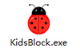
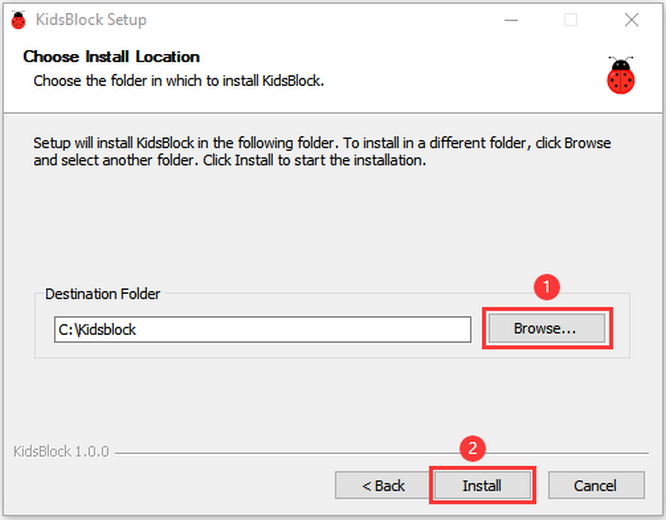
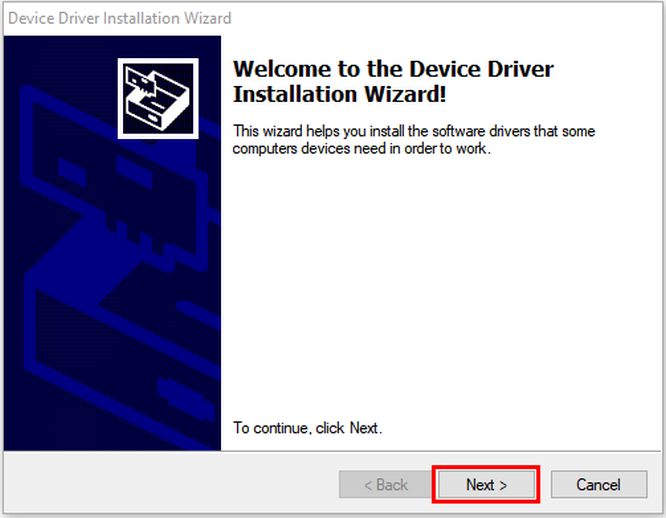
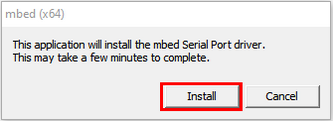
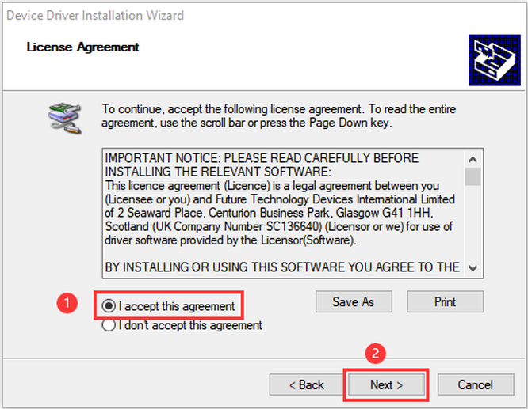
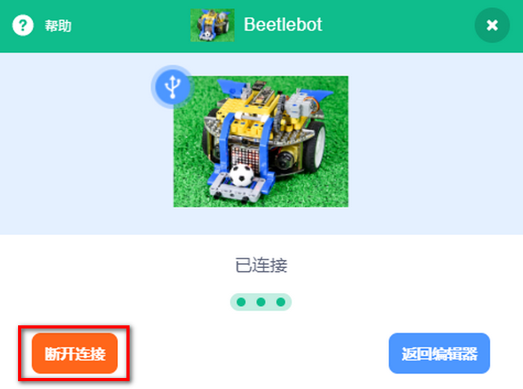
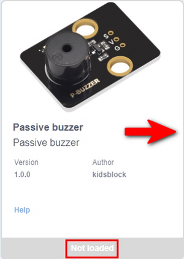
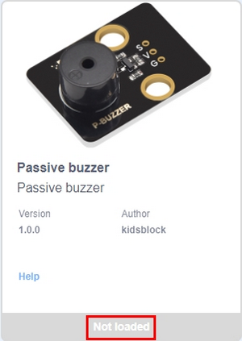
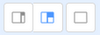

# 软件安装教程

## **Windows 系统 Kidsblock 软件安装：**

1. 获取软件方式

   - 下载链接：[http://xiazai.keyesrobot.cn/KidsBlock.exe](http://xiazai.keyesrobot.cn/KidsBlock.exe)

   - 资料文件夹内：

     

     

2. 下载完后，双击“KidsBlock.exe”

3. 先选中“**Anyone who uses this computer(all users)**”，再点击“**Next**”。

4. 先点击“**Browse...**”,选择安装的位置（我这里选择安装在C盘，你也可以选择安装在电脑的其他盘），再点击“**Install**”。这样，软件就在安装过程中。

5. 安装完成。点击“Finish”就可以打开安装好的Kidsblock软件。

6. 如果出现电脑安全警报窗口，点击“**Allow access**”。这样就可以打开Kidsblock软件页面。

------

## MacOS系统 Kidsblock 软件安装：

1. 下载Kidsblock软件安装包，下载链接： [http://xiazai.keyesrobot.cn/KidsBlock.dmg](http://xiazai.keyesrobot.cn/KidsBlock.dmg)

2. 下载完成后，双击KidsBlock的图标，出现下图，然后按住鼠标左键将KidsBlock Desktop拖动到Applications里。

3. 等待安装，安装完成后在启动台中可以看到如下安装好的KidsBlock图标。

# 软件使用教程：

（**以下是以Windows系统为例，MacOS系统可以参考**）

## 按钮功能示意图：

------

## 语言切换

点击可以语言“English”或“简体中文

------

## 安装开发板驱动程序

**注意：如果电脑已经安装了驱动程序，则不需要再安装驱动；如果没有，则需要进行以下操作**

- 点击，点击“**Install driver**”。

- 在“设备驱动程序安装向导”页面点击“**Next**”。

- 过一会儿，点击“**Finish**”。

- 点击“**Next**”。

- 点击“**Finish**”。

- 如果出现安全页面，选择点击“**Allow**”即可，然后点击“**Install**”。如果出现安装提示，点击“**Install**”。

- 过一会儿，点击“**Finish**”。

- 点击“**Extract**”。

- 点击“**Next**”。

- 点击“**I accept this agreement**”后，再点击“**Next**”。.
- 

- 点击“**Finish**”。

- 过一会儿，选择点击“**INSTALL**”。

- 过几秒钟后，驱动安装完成，点击“**OK**”即可。

------

## 开发板选择

选择开发板和串口

- 驱动安装完后，点击右上角进入选择主控板页面。

- 选择**套件**，选择**Beetlebot**，传感器都集成在套件中，不需要额外添加。

  

- 点击套件后，会弹出一个串口选择，我们选择正确的开发板串口，点击**连接**即可连接。

  

- 点击**Go to Editor**

  

- 主界面：

  

------

断开当前连接

- 如果要断开端口，先点击

- 再点击**断开连接**，即可断开当前连接。

  

------

## kidsblock软件界面工鞥呢示意图 2：

------

## 添加传感器模块（可以跳过）

**注意：这一步操作本套件已经集成好了不需要添加了，如果是要加套件上没有的传感器模块则参考这一步骤**

- 点击右下角的扩展包

  

- 传感器/模块扩展库

  

- 如需要添加无源蜂鸣器模块，点击无源蜂鸣器模块

- “**未加载**”变成“**已加载**”，说明“无源蜂鸣器”模块添加成功。

  

- 点击，可以回到代码编辑器界面，在模块区可以看到添加的“无源蜂鸣器”指令方块。 

  

- 如果需要删除“无源蜂鸣器”模块，只需要点击再次进入传感器/模块扩展库界面，点击“无源蜂鸣器”模块，“Loaded”变成“Not loaded”，则说明“无源蜂鸣器”模块删除成功。

  

  

------

## 如何打开代码文件

1. 方法一：

   - 软件没有打开的情况下，鼠标左键双击SB3类型文件，这样就可以打开SB3类型文件。例如：需要打开文件，则只需要左键双击文件就可以直接打开，注意打开后要与开发板进行连接。

     

2. 方法二：

   - 打开Kidsblock软件，先点击“**file**”，然后选择点击“**Load from your computer**”，

     	

   - 在电脑上选中需要打开的SB3类型文件（img/an47.png)文件)

     

     

------

## 上传代码与设置波特率

上传代码

- 将代码文件添加到Kidsblock软件中。

- 将开发板连接到电脑(如果没有显示端口则需要安装驱动，请查看“Kidsblock 软件使用教程”中的第3点)，选择好端口，点击

  

- 然后等待上传完成。

  

------

选择对应的波特率

- 如果没有右边的打印框,则需要通过右上角的这三个按键,设置打印框的大小.
  - 小型打印框
  - 大型打印框
  - 没有打印框

- 右下角点击设置,再选择对应的波特率即可.

------

设置好对应波特率后,右下角会打印“**Hello KidsBlock**”

