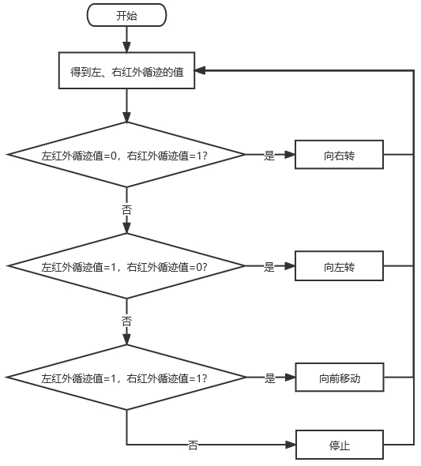

# Project 11: 循线行走

## 实验简介

在前面的项目中，我们详细的介绍了在上面实验中，我们已经了解了电机驱动和调速、红外循迹等硬件知识。在本实验中，小车会根据红外循迹传送的数值做出不同的动作。

## 工作原理

| 左   | 右   | 值（二进制） | 动作     |
| ---- | ---- | ------------ | -------- |
| 0    | 0    | 00           | 停止     |
| 0    | 1    | 01           | 向右转   |
| 1    | 0    | 10           | 向左转   |
| 1    | 1    | 11           | 向前移动 |

## 流程图

 

## 实验代码

## 实验现象

将实验代码上传到Arduino Nano主板，小车安上电池，并且将电源开关拨到ON端，上电后，然后把小车放在循迹轨道（我们提供的）上，小车就开始根据红外循迹传送的数值做出不同的动作。

