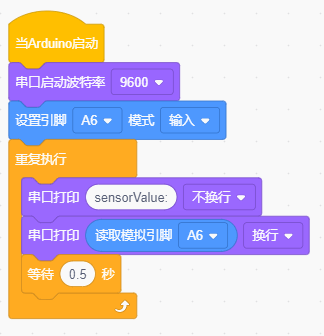

# Project 012: 读取光敏传感器的值

我们都知道人类可以通过自己的眼睛在黑暗中寻找光源，那么机器人是怎样完成这项任务呢？让机器人完成这项任务首先需要给机器人安装上能看见光亮的眼睛，即光敏传感器，这样就能让机器人通过光源的强弱来寻找光源。

我们的小车上左右各装有1个光敏传感器，当外界环境光线的强、弱发生变化的时候，光敏传感器的电阻也跟随发生相应的改变，并把这种变化传输给小车上的Nano主板，Nano主板就像人的大脑一样可以判断和思考，指挥着小车寻找光线。两个光敏传感器不停的检测是否有光线，检测到光线后就判断左、右两边哪个方向的光线较强，最后就指挥小车向着光线强的方向前进。

## 实验简介：

在本实验中，我们将了解光敏传感器的工作原理。

## 元件知识：

**光敏传感器：**它主要采用光敏电阻元件，该电阻元件电阻大小随着光照强度的变化而变化。传感器信号端连接单片机模拟口，当光线越强时，模拟口电压越大，即单片机的模拟值也大；反之，光照强度越弱时，模拟口电压越小，即单片机的模拟值也小。这样，就可以利用光敏传感器读取对应的模拟值来反映环境光线强度。

## 实验接线：

通过前面的安装接线知道，两个光敏传感器的信号脚位已经接到了Nano主板的A6和A7，下面我们就利用接到A6的光敏传感器来完成下面的实验，首先我们来读取模拟值。

| 左边光敏传感器 |   小车PCB板   |
| :------------: | :-----------: |
|       G        |       G       |
|       V        |       V       |
|       S        | S（A6或者A7） |

 

------

## 实验代码

左边光敏传感器是由Arduino Nano主板的IO口A6控制。

## 实验现象

将实验代码上传到Arduino Nano主板，利用USB线上电后，再打开串口监视器，设置波特率为9600，当光线增强时，串口监视器显示的模拟值增大；反之，串口监视器显示的模拟值减小。

