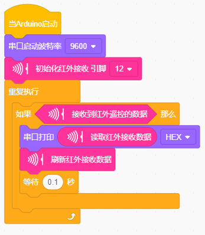

# Project 14: 红外遥控和接收

红外遥控在日常生活中随处可见，它被用来控制各种家电，如电视、音响、录影机和卫星信号接收器。红外遥控是由红外发射和红外接收系统组成的，也就是一个红外遥控器、红外接收器和一个能解码的单片机组成的，小车上有个红外接收器。在本章中，将介绍红外遥控器和红外接收器，并制作一辆红外遥控小车。

## 实验简介

在本实验中，使用红外接收器和红外遥控器相结合，读取红外遥控器上的按键值并将按键值打印在串口监视器上。

## 元件知识

***\*红外(IR)遥控器：\****是一种具有一定数量按钮的设备。按下不同的按钮会使位于遥控器前端的红外发射管以不同的编码发送红外信号。红外遥控技术应用广泛，如电视、空调等。因此，在当今科技发达社会，红外遥控技术使你切换电视节目和调节空调温度都很方便。

我们使用的遥控器如下所示：

该红外遥控器采用NEC编码，信号周期为110ms。

 

***\*红外(IR)接收器：\****它是一种元件，可以接收红外光，所以可以用它来检测红外遥控器发出的红外光信号。红外接收器解调接收到的红外光信号，并将其转换回二进制，然后将信息传递给微控制器。

**红外信号调制过程图：**

 

***\*NEC红外通信协议：\****

***\*NEC 协议\****

据我所知，我在这里描述的协议是由NEC（现在的瑞萨）开发的。我在互联网上看到过非常类似的协议描述，那里的协议被称为日本格式。

我承认，我不知道到底是谁开发的。我所知道的是，它被用于我的晚期录像机，由三洋公司生产，以Fisher的名义销售。NEC生产了遥控IC。

这段描述取自我的录像机的维修手册。在那些日子里，服务手册上充满了有用的信息！

****特点\****

- 8位地址和8位命令长度。

- 可使用扩展模式，使地址大小加倍。

- 地址和命令传输两次，以保证可靠性。

- 脉冲距离调制。

- 载波频率为38kHz。

- 位时间为1.125ms或2.25ms。

***\*调制****

 

NEC协议使用脉冲距离编码的比特。每个脉冲是一个560µs长的38kHz载波突发（约21个周期）。一个逻辑 "1 "需要2.25ms的传输时间，而一个逻辑 "0 "只有一半，为1.125ms。推荐的载波占空比是1/4或1/3

***\*协议\****

 

上图显示了NEC协议的一个典型脉冲序列。在这个协议中，LSB首先被传送。在这种情况下，地址59和命令16被传送。一个信息由一个9ms的AGC脉冲开始，它被用来设置早期红外接收器的增益。这个AGC突发之后是一个4.5ms的空格，然后是地址和命令。地址和命令被传送两次。第二次所有的位都是反转的，可以用来验证所收到的信息。总的传输时间是恒定的，因为每个比特都以其倒置的长度重复传输。如果你对这种可靠性不感兴趣，你可以忽略倒置的值，或者你可以将地址和命令扩展到每个16位 

请记住，为了能够确定最后一个比特的值，在信息的最后还必须有一个额外的560µs的突发。

 

一个命令只传送一次，即使遥控器上的键一直按着。每隔110ms就会传输一个重复代码，只要按键不动。这个重复代码只是一个9ms的AGC脉冲，然后是一个2.25ms的空间和一个560µs的脉冲。

 

***\*扩展的NEC协议\****

NEC协议被广泛使用，很快所有可能的地址都用完了。通过牺牲地址冗余，地址范围从256个可能的值扩展到大约65000个不同的值。这样，地址范围从8位扩展到16位，而不改变协议的任何其他属性。

通过这种方式扩展地址范围，总的信息时间不再是恒定的。现在它取决于消息中1和0的总数。如果你想保持总的消息时间不变，你就必须确保地址栏中1的数量是8（这自动意味着0的数量也是8）。这将使不同地址的最大数量减少到只有13000左右。

命令的冗余仍然被保留下来。因此，每个地址仍然可以处理256个不同的命令。

 

请记住，扩展协议的256个地址值是无效的，因为它们实际上是正常的NEC协议地址。只要低字节与高字节完全相反，就不是一个有效的扩展地址。

## 实验代码

## 实验现象

将实验代码上传到Arduino Nano主板，利用USB线上电后，再打开串口监视器，设置波特率为9600，

按下红外遥控器上的一个按钮，你会在串口显示器上看到一个代码。多次按下相同的按钮以确保你拥有该按钮的正确代码。如果看到FFFFFFFF，请忽略它。

写下红外遥控器与每个按钮相关联的代码，因为你稍后将需要这些信息。

 