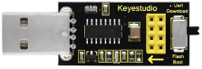
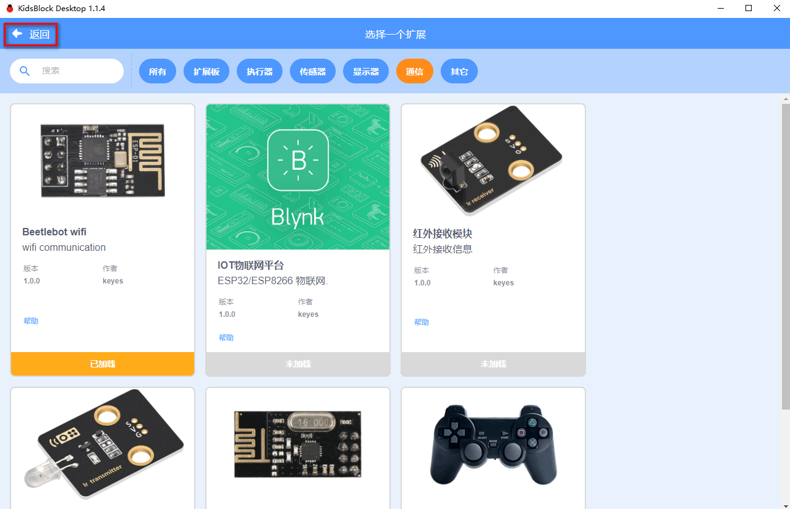
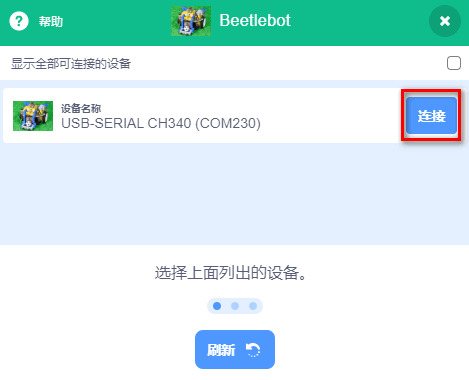
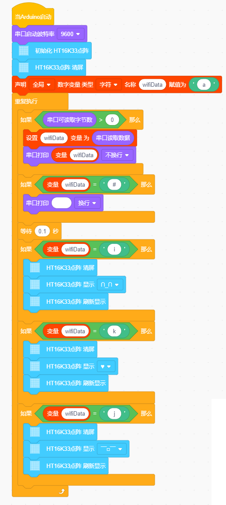
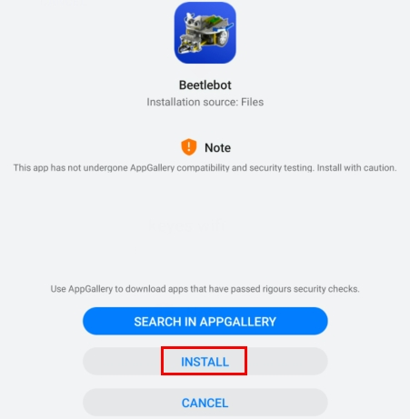

# Project 17: APP控制8x8点阵

## 实验简介：

ESP8266串口WIFI ESP-01模块，它是一款超低功耗的UART-WiFi 透传模块，拥有业内极富竞争力的封装尺寸和超低能耗技术，专为移动设备和物联网应用设计，可将用户的物理设备连接到Wi-Fi 无线网络上，进行互联网或局域网通信，实现联网功能。

并且ESP8266串口WIFI ESP-01模块通过WIFI测试代码得到相关的WIFI信息。那么在这个实验中，我们将使用ESP8266串口WIFI ESP-01模块通过APP和WIFI来控制小车上的8*8点阵。

## 实验元件

|  |  |  |
| ------------------------------------------------------------ | ------------------------------------------------------------ | ------------------------------------------------------------ |
| ESP8266串口WIFI ESP-01*1                                     | USB转ESP-01S WIFI模块串口测试扩展板*1                        | USB线*1                                                      |
|   |  |                                                              |
| 智能手机/IPad*1                                              | Beetlebot小车*1                                              |                                                              |

## 元件知识

  

***\*USB转ESP-01S WIFI模块串口测试扩展板：\****适用于ESP-01S WiFi模块，扩展板的拨动开关打到flash boot端，直插于电脑USB口，用安信可串口调试助手测试AT指令。

扩展板的拨动开关打到Uart Download 端，直插于电脑USB口，ESP-01模块处于下载模式，通过安信可固件下载软件可下载固件到ESP-01模块中。

   

**ESP8266串口 WIFIESP-01：**ESP8266串口WIFI ESP-01是一款超低功耗的UART-WiFi 透传模块，ESP8266串口WIFI ESP-01可广泛应用于智能电网、智能交通、智能家具、手持设备、工业控制等领域。

**产品特性**

** 支持无线802.11 b/g/n 标准

** 支持STA/AP/STA+AP 三种工作模式

** 内置TCP/IP协议栈，支持多路TCP Client连接 

** 支持丰富的Socket AT指令

** 支持UART/GPIO数据通信接口

** 支持Smart Link 智能联网功能

** 支持远程固件升级（OTA）

** 内置32位MCU，可兼作应用处理器 

** 超低能耗，高集成度的 Wi-Fi 芯片，适合电池供电应用

** 超宽工作温度范围：-40°C 至 +125°C

** 3.3V 单电源供电

 

**模块基本参数**

- **模块**

  |    型号    | 主芯片  |
  | :--------: | :-----: |
  | ESP8266-01 | ESP8266 |

- **无线参数**

  |   **无线标准**   |   **频率范围**    |            **发射功率**            |         **接收灵敏度**          |          **天线形式**          |
  | :--------------: | :---------------: | :--------------------------------: | :-----------------------------: | :----------------------------: |
  | IEEE 802.11b/g/n | 2.412GHz-2.484GHz |   802.11b: +16 +/-2dBm (@11Mbps)   | 802.11b: -93 dBm (@11Mbps ,CCK) |        外置：邮票孔接口        |
  |                  |                   |   802.11g: +14 +/-2dBm (@54Mbps)   | 802.11g: -85dBm (@54Mbps, OFDM) | 外置：I-PEX 连接器、SMA 连接器 |
  |                  |                   | 802.11n: +13 +/-2dBm (@HT20, MCS7) |  802.11n: -82dBm (@HT20, MCS7)  |       内置：板载PCB 天线       |

- **硬件参数**

  |   **硬件接口**   |                  UART，IIC，PWM，GPIO，ADC                   |
  | :--------------: | :----------------------------------------------------------: |
  |   **工作电压**   |                             3.3V                             |
  | **GPIO驱动能力** |                          Max：15ma                           |
  |   **工作电流**   | 持续发送下=>平均值：~70mA，峰值: 200mA正常模式下=>平均: ~12mA，峰值: 200mA待机：<200uA， |
  |   **工作温度**   |                          -40℃~125℃                           |
  |   **存储环境**   |                温度：<40℃，相对湿度：<90%R.H.                |
  |     **尺寸**     |               板载PCB天线：14.3mm*24.8mm*1mm；               |

  

- **串口透传**.

  | **传输速率**  | **TCP Client** |
  | :-----------: | :------------: |
  | 110-921600bps |      5个       |

- **软件参数**

  | **无线网络类型** |                        STA/AP/STA+AP                         |
  | :--------------: | :----------------------------------------------------------: |
  |   **安全机制**   |                     WEP/WPA-PSK/WPA2-PSK                     |
  |   **加密类型**   |                    WEP64/WEP128/TKIP/AES                     |
  |   **固件升级**   |                    本地串口，OTA远程升级                     |
  |   **网络协议**   |                    IPv4, TCP/UDP/FTP/HTTP                    |
  |   **用户配置**   | AT+指令集, Web 页面 Android/iOS 终端, Smart Link 智能配置APP |

  

硬件介绍：

ESP8266硬件接口丰富，可支持UART，IIC，PWM，GPIO，ADC等，适用于各种物联网应用场合。

| **引脚** |     **功能**     |                           **说明**                           |
| :------: | :--------------: | :----------------------------------------------------------: |
|    1     |       URXD       | 1）UART_RXD，接收；2）General Purpose Input/Output：GPIO3；  |
|    2     |       UTXD       | 1）UART_TXD，发送；2）General Purpose Input/Ou tput：GPIO1；3）开机时禁止下拉； |
|    5     | RESET（GPIO 16） |      外部Reset信号，低电平复位，高电平工作（默认高）；       |
|    6     |       GND        |                             GND                              |
|    8     |       VCC        |                       3.3V，模块供电；                       |
|    9     |       ANT        |                         WiFi Antenna                         |
|    11    |      GPIO0       | 1）默认WiFi Status：WiFi工作状态指示灯控制信号；2）工作模式选择：  悬空：Flash Boot，工作模式；  下拉：UART Download，下载模式； |
|    12    |       ADC        |                    ADC，输入范围：0V-1V；                    |
|    13    |      GPIO15      |                       下拉：工作模式；                       |
|    14    |      CH_PD       |            1）高电平工作；2）低电平模块供电关掉；            |
|    15    |      GPIO2       |  1）开机上电时必须为高电平，禁止硬件下拉；2）内部默认已拉高  |

功耗

|                  模式                  | 最小值 | 通常 | 最大值 | 单位 |
| :------------------------------------: | ------ | ---- | ------ | ---- |
| 传送802.11b，CCK 1Mbps，Pout=+19.5dBm  |        | 215  |        | mA   |
| 传送802.11b，CCK 11Mbps，Pout=+18.5dBm |        | 197  |        | mA   |
| 传送802.11g，OFDM54 Mbps，Pout=+16dBm  |        | 145  |        | mA   |
|     传送802.11n，MCS7，Pout=+14dBm     |        | 135  |        | mA   |
|   接收802.11b，包长1024字节，-80dBm    |        | 100  |        | mA   |
|   接收802.11g，包长1024字节，-70dBm    |        | 100  |        | mA   |
|   接收802.11n，包长1024字节，-65dBm    |        | 102  |        | mA   |
|              系统待机模式              |        | 70   |        | mA   |
|                  关机                  |        | 0.5  |        | μA   |

下列功耗数据是基于3.3V的电源、25°的环境温度下测得。

1.所有测量均在天线接口处完成。 

2.所有发射数据是基于 90% 的占空比，在持续发射的模式下测得的。

射频指标：

以下数据是在室内温度下，电压为3.3V时测得。 

|            **描述**            | **最小值** | **通常** | **最大值** | **单位** |
| :----------------------------: | :--------: | :------: | :--------: | :------: |
|            输入频率            |    2412    |          |    2484    |   MHz    |
|            输入电阻            |            |    50    |            |    Ω     |
|            输入反射            |            |          |    -10     |    dB    |
|    72.2Mbps下，PA的输出功率    |     14     |    15    |     16     |   dBm    |
|  802.11b模式下，PA的输出功率   |    17.5    |   18.5   |    19.5    |   dBm    |
|           **灵敏度**           |            |          |            |          |
|           CCK 1Mbps            |            |   -98    |            |   dBm    |
|           CCK 11Mbps           |            |   -91    |            |   dBm    |
|         6Mbps(1/2BPSK)         |            |   -93    |            |   dBm    |
|       54Mbps(3/4 64-QAM)       |            |   -75    |            |   dBm    |
| HT20，MCS7（65Mbps，72.2Mbps） |            |   -71    |            |   dBm    |
|          **邻频抑制**          |            |          |            |          |
|          OFDM，6Mbps           |            |    37    |            |    dB    |
|          OFDM，54Mbps          |            |    21    |            |    dB    |
|           HT20，MCS0           |            |    37    |            |    dB    |
|           HT20，MCS7           |            |    20    |            |    dB    |

注：1. 72.2Mbps是在802.11n模式下，MCS=7，GI=200uS时测得；

2. 802.11b模式下最高可达+19.5dBm的输出功率。

功能描述

***\*A.主要功能\****

ESP8266可以实现的主要功能包括：串口透传，PWM 调控，GPIO控制。

※串口透传：数据传输，传输的可靠性好，最大的传输速率为：460800bps。

※PWM 调控：灯光调节，三色LED 调节，电机调速等。

※GPIO控制：控制开关，继电器等。

***\*B.工作模式\****

ESP8266模块支持STA/AP/STA+AP 三种工作模式。

❊STA 模式：ESP8266模块通过路由器连接互联网，手机或电脑通过互联网实现对设备的远程控制。

 

❊AP 模式：ESP8266模块作为热点，实现手机或电脑直接与模块通信，实现局域网无线控制。

❊STA+AP 模式：两种模式的共存模式，即可以通过互联网控制可实现无缝切换，方便操作。

 

***\*C.应用领域\****

✭✮串口CH340 转Wi-Fi；

✭✮工业透传DTU；

✭✮Wi-Fi 远程监控/控制；

✭✮玩具领域；

✭✮彩色LED 控制；

✭✮消防、安防智能一体化管理；

✭✮智能卡终端，无线POS 机，Wi-Fi 摄像头，手持设备等

 

将WIFI模块串口测试扩展板插入电脑的USB口：

A. 将ESP8266串口WIFI ESP-01模块正确方向插入USB转ESP-01S WIFI模块串口测试扩展板上。

 

B. 先将USB转ESP-01S WIFI模块串口测试扩展板上的拨码开关拨到UartDownload端，再将USB转ESP-01S WIFI模块串口测试扩展板插入电脑的USB口。

 

添加ESP8266主控板：

点击进入主控板页面，可以选择需要添加的设备（控制板），本项目需要选择ESP8266主控板。先点击ESP8266主控板所处区域，后点击“***\*Connect\****”。这样ESP8266主板已连接上，点击“***\*Go to editor\****”回到代码编辑器。这样，我们会发现变成，同时变成，说明ESP8266主板和端口（COM) 都已经连接上了。

          

  

添加Beetlebot wifi 模块：

这里需要添加Beetlebot wifi 模块，先点击图标进入传感器/模块扩展界面，然后找到并点击“Beetlebot wifi”区域 ，“Not loaded”会变成“loaded”。这样，Beetlebot wifi 模块就添加成功，点击返回代码编辑器界面，就可以看到添加的Beetlebot wifi 模块。

   

  

ESP8266 代码：

注意：如果家里没有WIFI，需要打开手机热点共享WIFI.

 

特别注意：需要将ESP8266代码

中的Wifi名称和Wifi密码改成你们自己的Wifi名称和Wifi密码。 

A. Wifi名称和Wifi密码修改后，确保USB转ESP-01S WIFI模块串口测试扩展板上的拨码开关已经拨到Uart Download 端，并且也确定USB转ESP-01S WIFI模块串口测试扩展板已经插入电脑的USB口，然后点击kidsblock软件上的“**上传**” 按钮 。将ESP8266代码上传到ESP8266串口WIFI ESP-01模块上，上传成功。（注意：如果上传失败，在板型和COM口没问题下，将USB转ESP-01S WIFI模块串口测试扩展板从电脑的USB口拔下来再次插到电脑的USB口）

 

B. ESP8266代码上传成功后，先将USB转ESP-01S WIFI模块串口测试扩展板从电脑的USB口拔下来，再将ESP8266串口WIFI ESP-01模块从USB转ESP-01S WIFI模块串口测试扩展板上拔下来。

USB线连接电脑和Arduino Nano主板：

 

Beetlebot页面设置:

更换开发板，点击，

     

 

Arduino Nano实验代码：

  

实验现象：

点击kidsblock软件上的“***\*上传\****” 按钮将Arduino Nano实验代码上传至Arduino Nano主板。Arduino Nano实验代码上传成功后，再将ESP8266串口WIFI ESP-01模块插入小车PCB板上的WiFi插口。（注意：USB线不要拔下来，否则读取不了COM端口）

  

点击串口监视器窗口中的，将波特率设置为9600。这样，串口监视器就显示此时你们WIFI的IP地址。（WIFI的IP地址有时候会改变，如果原来的IP地址不行，需要重新检测WIFI的IP地址)

 

 

## 安卓系统设备（手机/平板）APP：

现将文件夹中的Beetlebot.apk文件转移到安卓系统手机或平板上，点击Beetlebot.apk文件进入安装页面，点击“***\*ALLOW\****”按钮，然后再点击“***\*INSTALL\****”按钮，安装完成后点击“***\*OPEN\****”按钮就可以进入APP界面。

 

            

 

先在WIFI按钮前面的文本框中输入检测到的WIFI IP地址（例如，上面串口监视器检测到的IP地址：192.168.1.126），再切换WIFI按钮来连接WiFi（白色WIFI按钮变成绿色WIFI按钮），同时WIFI IP地址前的文本框中会显示对应的WIFI IP地址“192.168.1.134”。这样，就说明APP已经连接上了WIFI。

 

## IOS系统设备（手机/iPad）APP

a.打开App Store。

 

b.在搜索框输入Beetlebot，点击搜索，出现下载界面，点击“”，就可以下载安装Beetlebot的APP。接下来的操作和安卓系统类似的，可以参考上面安卓系统的步骤进行操作。

注意：点击APP上的按钮，ESP8266串口WIFI ESP-01模块上的蓝色指示灯会闪烁，说明APP已经连接上WIFI。

APP已经连接上了WIFI之后，开始进行如下操作：

点击APP上的按钮，串口监视器窗口打印一些对应的控制字符，如下图所示：

 

APP上各个按钮（控件）对应的功能，如下图所示：

 

## 此代码实验APP操作及现象：

点击按钮，小车前面的8*8点阵显示“笑脸”图案；点击按钮，小车前面的8*8点阵显示“十”图案；点击按钮，小车前面的8*8点阵显示“❤”图案。

 