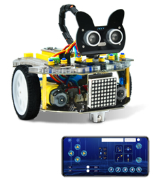
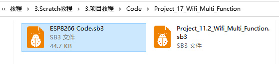
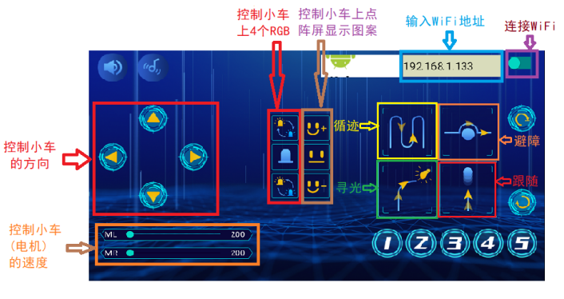

**Project 11.3: WiFi控制多功能小车**

学习前面的课程，我们学完了控制Beetlebot小车的所有模块的功能。前面学的每样功能都要烧录一次对应的代码，我们想玩其它功能时就比较麻烦。现在我们编写个代码，将多个功能集合到一起，通过APP来切换功能，这样就会比较方便的玩多种功能了。

1. ESP8266wifi的代码和上一课一样，修改好自己的WiFi密码。（如果上一课已经烧录过了，就不需要重复烧录）

   
2. 给Beetlebot的主控Arduino Nano主板烧录代码，代码在如下图文件夹中。

 

3. APP操作，如下图。

   可实现前后左右电机控制，控制RGB灯，点阵功能。

 

