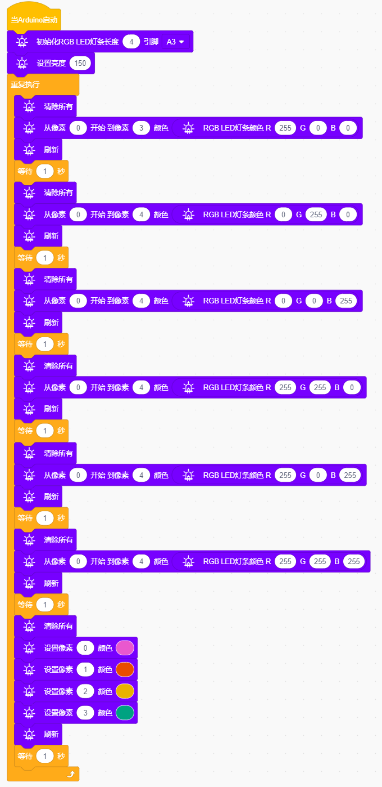

# Project 02: 6812 RGB

## 实验简介

小车扩展板上有4个RGB LED，RGB LED属于简单的发光模块，可以通过调节色彩调出不同颜色的灯效，可广泛应用于建筑物、桥梁、道路、花园、庭院、地板等领域的装饰照明与会场布置、圣诞节、万圣节、情人节、复活节、国庆节等节日期间烘托气氛等场景。在本实验中，使小车扩展板上的4个RGB实现各种灯光效果。

------

## 元件知识

**SK6812RGB：**小车扩展板上有4个RGB LED，从原理图中可以看出，这4个RGBLED都是串联起来的，在电压电流充足的情况下可以接几百个RGB LED，都可以用一根信号线控制任意一个RGB LED，并且让它显示任意一种颜色。每一颗RGBLED都是一个独立的像素点，每个像素点都是由R、G、B三基色颜色组成，可实现256级亮度显示，完成16777216种颜色的全真色彩显示，同时像素点内部包含了智能数字接口数据锁存信号整形放大驱动电路，还内置信号整形电路，有效保证了像素点光的颜色高度一致。

------

## 实验代码

## 实验现象

将实验代码上传至Arduino Nano主板上，利用USB线上电后，小车PCB板上的4个RGB LED实现各种灯光效果。 
