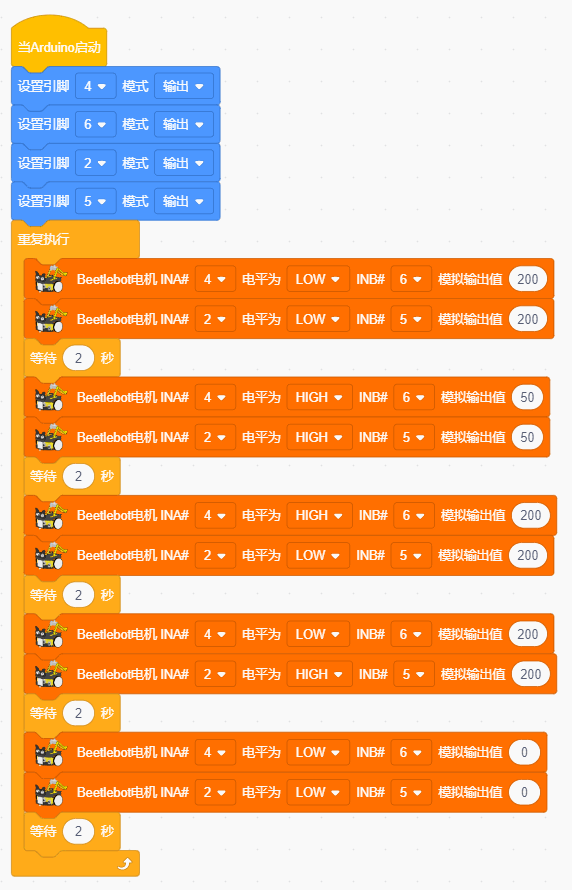

# Project 06: 电机驱动和调速

## 实验简介：

驱动电机的方法有很多，我们这个小车用到的是最常用的DRV8833电机驱动芯片，该芯片为玩具、打印机及其它电机一体化应用提供了一款双通道桥式电动驱动器解决方案。

在本实验中，我们使用扩展板上的DRV8833电机驱动芯片驱动小车的两个直流电机，通过编写代码实现小车分别向前，向后，向左，向右行走的效果。

## 元件知识：

**DRV8833电机驱动芯片：**具有电流控制功能的双H桥电机驱动器，可以驱动两个直流电机、一个双极步进电机、电磁阀或其他电感负载。每个H桥的输出驱动器块由N沟道功率MOSFET组成，配置为H桥以驱动电机绕组。每个H桥包括调节或限制绕组电流的电路。

带有故障输出引脚的内部停机功能是用于过大电流保护、短路保护、欠压锁定和超温。还提供了低功耗睡眠模式。我们来看一下DRV8833电机驱动芯片驱动两个直流电机的电路图和示意图：

 

 

 

如果想更深了解DRV8833电机驱动芯片，可以查看我们提供的芯片规格书，在资料的“Attachments”文件夹里。

 

## 规格参数：

逻辑部分输入电压：DC 5V

驱动部分输入电压：DC 5V

逻辑部分工作电流：<30mA

驱动部分工作电流：<2A

最大耗散功率：10W（T=80℃）

电机转速：5V 200 rpm / min

电机驱动形式：双路H桥驱动

控制信号输入电平：高电平2.3V<Vin<5V ，低电平-0.3V<Vin<1.5V

工作温度：-25~130℃

## 驱动小车运行原理：

根据上面电机驱动板的电路图和示意图，我们知道左电机的方向引脚在D4，调速引脚在D6；右电机的方向引脚在D2，调速引脚在D5，按照以下表格的运动逻辑，就可以知道如何通过控制数字口，PWM口控制2个电机转动，从而实现智能小车的行走。其中PWM值范围为0-255，设置数字越大，电机转动越快。

| 功能 |  D4  | D6（PWM） | 左电机 |  D2  | D5（PWM） | 右电机 |
| :--: | :--: | :-------: | :----: | :--: | :-------: | :----: |
| 前进 | LOW  |    200    |  正转  | LOW  |    200    |  正转  |
| 后退 | HIGH |    50     |  反转  | HIGH |    50     |  反转  |
| 左转 | HIGH |    200    |  反转  | LOW  |    200    |  正转  |
| 右转 | LOW  |    200    |  正转  | HIGH |    200    |  反转  |
| 停止 | LOW  |     0     |  停止  | LOW  |     0     |  停止  |

## 实验代码

## 实验现象

将实验代码上传到Arduino Nano主板，小车安上电池，并且将电源开关拨到ON端，上电后，小车前进2秒，后退2秒，左转2秒，右转2秒，停止2秒，循环。

## 调速说明

HIGH相当于PWM值255，50是PWM值，是可以调整的。此代码中的差值是200，上下差值越大，电机转速越快，我们可以通过调整PWM值达到调节电机转速。如果将50调为0，上下差值就变成255，电机转速达到最大；如果将50调为255时，上下差值就变成0，电机转速为0，电机就不转动了。上下差值为正值时，电机反转。

LOW相当于PWM值0，200是PWM值，是可以调整的。此代码中的差值是200，上下差值越大，电机转速越快，我们可以通过调整PWM值达到调节电机转速。如果将200调为100，上下差值就变成100，电机转速减慢；如果将200调为255时，上下差值就变成255，电机转速达到最大；如果将200调为0时，上下差值变为0，电机就不转动了。上下差值为负值时，电机正转。