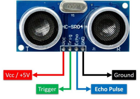

# Project 07：超声波测距

小车上有个超声波传感器，超声波传感器是一种非常实惠的距离传感器，它可以检测前方是否存在障碍物，并且检测出传感器与障碍物的详细距离。它的原理和蝙蝠飞行的原理一样，就是超声波传感器发送出一种频率很高的超声波信号，通常正常人耳朵的听力的声波范围是20Hz~20kHz，人类无法听到。这些超声波的信号若是碰到障碍物，就会立刻反射回来，在接收到返回的信息之后，通过判断发射信号和接收信号的时间差，计算出传感器和障碍物的距离。超声波传感器主要用于各种机器人项目中的物体躲避和测距，也常被用于水位传感，甚至作为一个停车传感器。在本章中，我们将学习超声波传感器测距原理及应用。

## 实验简介

在本实验中，我们使用超声波传感器来测量距离，并将数据打印在串口监视器上。

## 元件知识

***\*HC-SR04超声波传感器：\****像蝙蝠一样使用声纳来确定与物体的距离，它提供了精准的非接触范围检测，高精度和稳定的读数。它的操作不受阳光或黑色材料的影响，就像精密的照相机(在声学上像布料这样比较软的材料很难被探测到)。它带有超声波发射器和接收器。

 

在超声波传感器的前面是两个金属圆筒，这些是转换器。转换器将机械能转换成电信号。在超声波传感器中，有发射转换器和接收转换器。发射转换器将电信号转换为超声波脉冲，接收转换器将反射的超声波脉冲转换回电信号。如果你看超声波传感器的背面，你会看到的发射转换器后面有一个IC。这是控制发射转换器的IC。在接收转换器后面也有一个IC，这是一个四运算放大器，它将接收转换器产生的信号放大成足以传输到Arduino的信号。

***\*时序图：\****

下面图示是HC-SR04的时序图，为了开始测量，SR04的Trig必须接受至少10us的高(5V)脉冲，这将启动传感器将发射出8个周期的40kHz的超声波脉冲，并等待反射的超声波脉冲。当传感器从接收器检测到超声波时，它将设置回波引脚为高(5V)和延迟一个周期(宽度)，与距离成比例。为了获得距离，测量Echo引脚的宽度。

 

时间=回波脉冲宽度，单位为us(微秒)

距离（厘米）=时间/ 58

距离(英寸)=时间/ 148

​         

HC-SR04超声波传感器有四个引脚：Vcc、Trig、Echo和GND。Vcc引脚提供产生超声波脉冲的电源，接Vcc/+5V。GND引脚接地/GND。Trig引脚是Arduino发送信号来启动超声波脉冲的地方。Echo引脚是超声波传感器向Arduino控制板发送关于超声波脉冲行程持续时间的信息的地方。

## 实验接线：

| 超声波传感器 | 小车PCB板 |
| :----------: | :-------: |
|     Vcc      |    5V     |
|     Trig     | S2（D8）  |
|     Echo     | S1（D7）  |
|     Gnd      |     G     |

## 实验代码

超声波传感器的Trig引脚是由Arduino Nano主板的IO口D8控制，Echo引脚是由Arduino Nano主板的IO口D7控制。

## 实验现象

将实验代码上传到Arduino Nano主板，利用USB线上电后，再打开串口监视器，设置波特率为9600，当把一个物体放在超声波传感器前面移动时(远近)，它会检测到物体的距离，该值将显示在串口监视器上。

