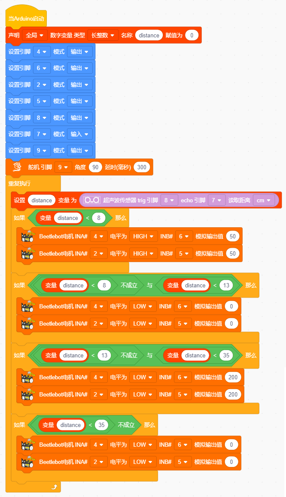

# Project 08: 跟随我

## 实验简介：

在上面实验中，我们已经了解了8*8点阵、电机驱动和调速、超声波传感器、舵机等硬件知识，那么在本实验中，我们将结合它们打造一款跟随小车! 在电路设计过程中，我们可以利用超声波传感器来检测小车与前方物体的距离。通过测量距离控制电机的旋转，从而控制小车的运动状态，使小车跟随物体运动。

## 工作原理：

| 检测  | 检测前方物体的距离        | 距离（单位：cm） |
| ----- | ------------------------- | ---------------- |
| 条件1 | 距离＜8                   |                  |
| 状态  | 小车后退（设置PWM 为100） |                  |
| 条件2 | 8≤距离<13                 |                  |
| 状态  | 小车停止                  |                  |
| 条件3 | 13≤距离<35                |                  |
| 状态  | 小车前进（设置PWM 为100） |                  |
| 条件3 | 距离≥35                   |                  |
| 状态  | 小车停止                  |                  |

## 流程图：

 

## 实验代码

## 实验现象

将实验代码上传到Arduino Nano主板，小车安上电池，并且将电源开关拨到ON端，上电后，小车可以随着前方障碍物的移动而移动（只能在一条线直上，不能转弯）。
