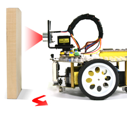

# Project 09: 躲避障碍物

## 实验简介：

在上一实验中，我们制作了一个超声波跟随小车。实际上，利用同样硬件，我只需要更改一个测试代码就可以将跟随小车变为避障小车。那超声波避障小车，是怎么实现的呢？当然也是通过超声波传感器的测距来实现的。通过超声波传感器检测机器人前方障碍物，然后根据这一个数据获得机器人运动方向。

## 工作原理：

|        初始设定        |              8*8点阵清屏               |
| :--------------------: | :------------------------------------: |
|      设置舵机90°       |                                        |
|        循环进行        | 检测前方障碍物的距离：距离（单位: cm） |
|         条件 1         |                  状态                  |
|       0<距离＜10       |                小车停止                |
| 8*8点阵显示“停止”图案  |                                        |
|     设置舵机 180°      |     离障碍物的距离：a1（单位：cm）     |
|       设置舵机0°       |     离障碍物的距离：a2（单位：cm）     |
|         条件2          |                  状态                  |
|         a1＜a2         |      小车向右转（设置PWM为 200）       |
| 8*8点阵显示“向右” 图案 |                                        |
|      设置舵机 90°      |                                        |
|         a1≥a2          |      小车向左转（设置PWM为 200）       |
| 8*8点阵显示“向左” 图案 |                                        |
|      设置舵机 90°      |                                        |
|        距离≥10         |         8*8点阵显示“向前” 图案         |
|  前进（设置PWM为200）  |                                        |

## 流程图：

## 实验代码

## 实验现象

将实验代码上传到Arduino Nano主板，小车安上电池，并且将电源开关拨到ON端，上电后，小车可以可以自动避障。

