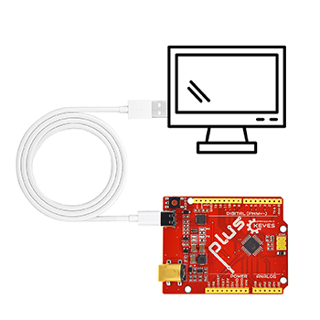
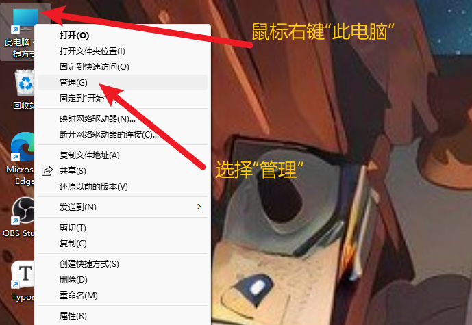
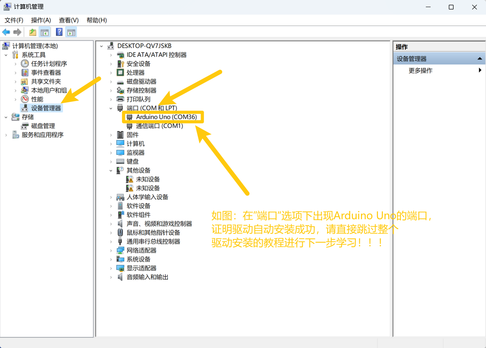
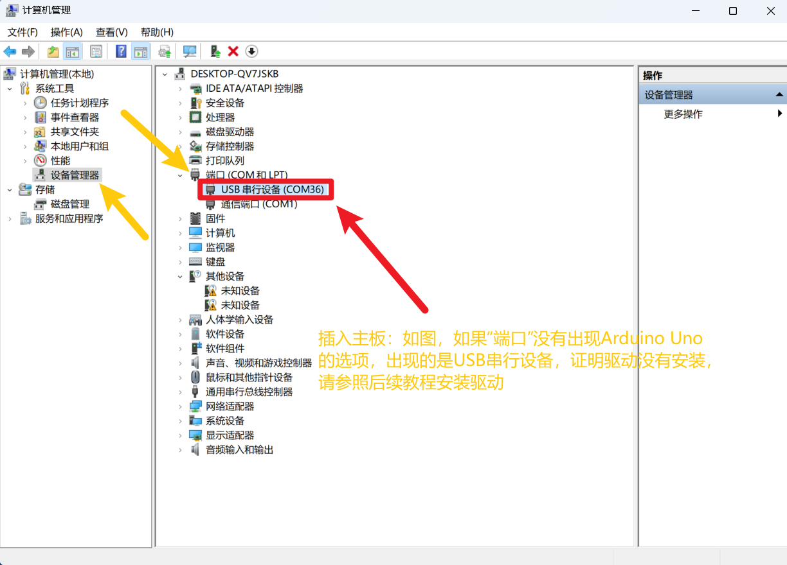
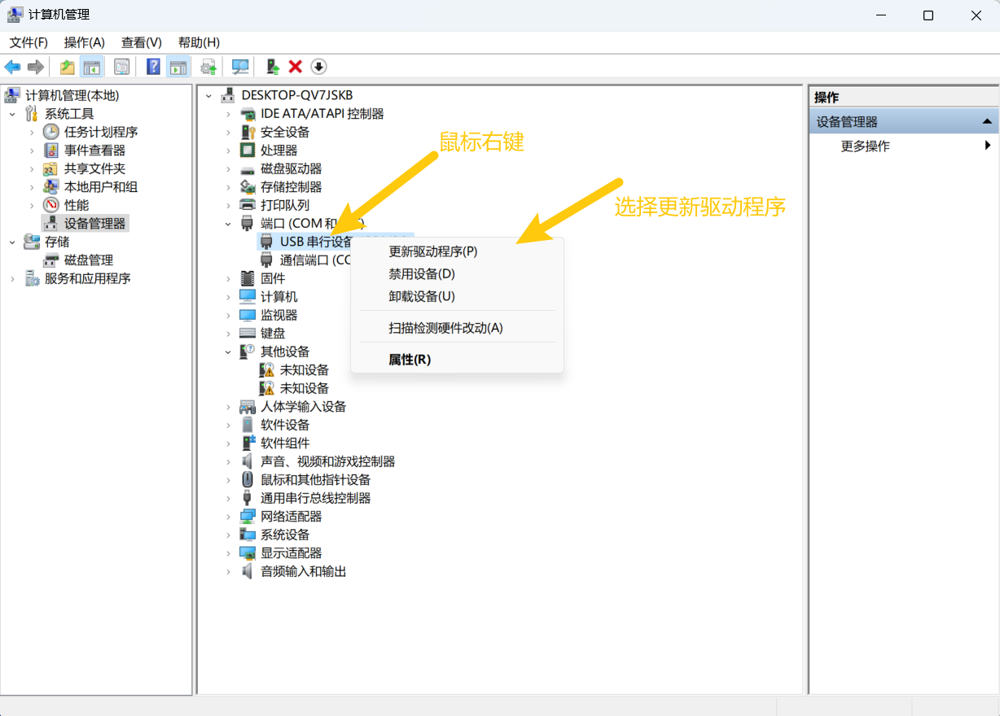
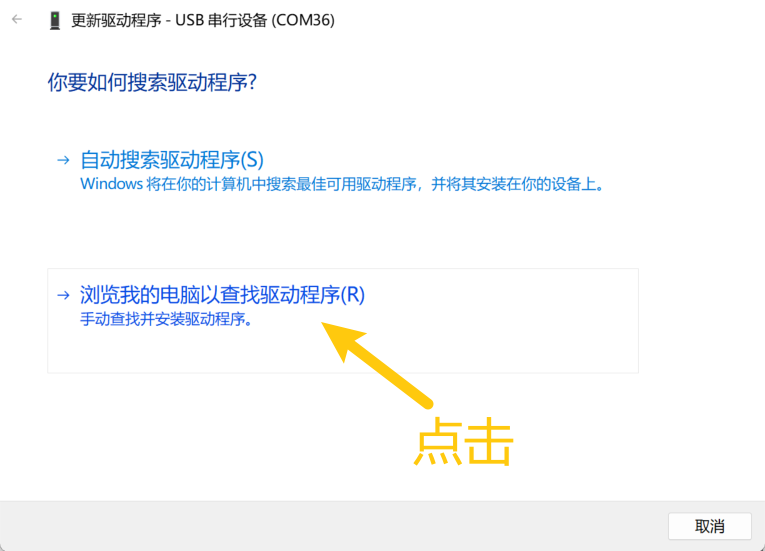
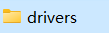
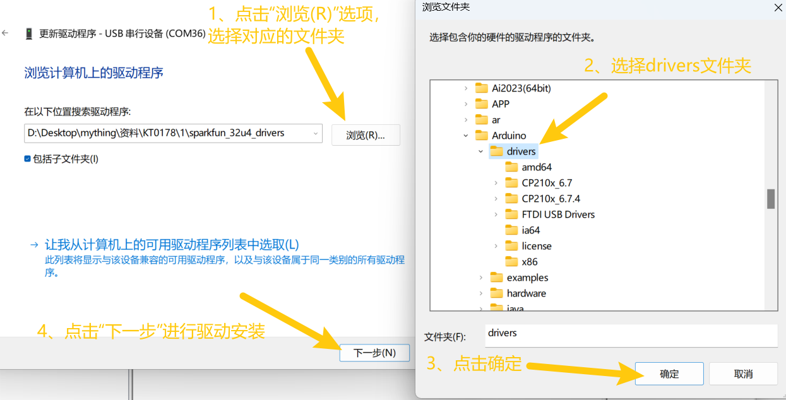
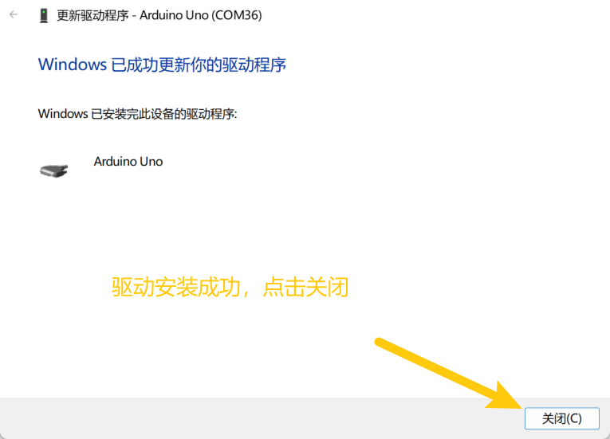
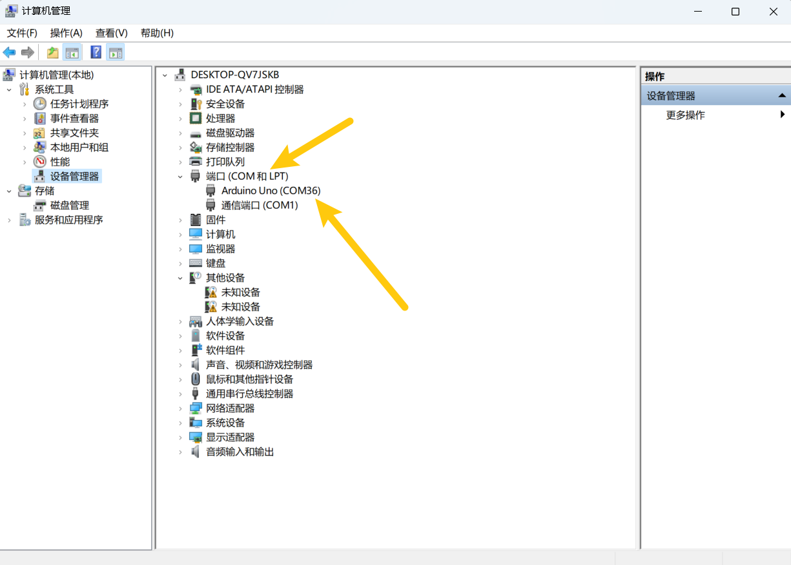

2. 驱动安装
===========

4.1 驱动下载
------------

驱动下载： :download:`驱动下载 <./drivers.7z>`

.. _驱动安装-1:

4.2 驱动安装
------------

1、将主板连接到电脑

|image1|

2、打开“设备管理器”.

|image2|

3、检查驱动是否已经安装

情况一：驱动安装完成，请跳过驱动教程，进行下一步学习

|image3|

情况二：驱动没有安装，请进行以下教程手动安装驱动

|image4|

1、鼠标右击\ **“USB串行设备”**\ ，在弹出框中选择\ **“更新驱动程序（P）”**

|image5|

2、点击选择\ **“浏览我的电脑以查找驱动程序（R）”**.

|image6|

3、点击\ **“浏览（R）“**\ 选项，在弹出的方框中找到Arduino安装路径下的\ |image7|\ ，或者直接选择提供的\ |image8|,点击\ **“确定”**\ ，完成后点击\ **“下一步”**\ 进行驱动安装.

|image9|

4、界面显示如下图类似的话语，证明驱动安装成功，点击\ **“关闭“**.

|image10|

5.驱动安装完成后，选择\ **“端口”**\ 选项，如图对应端口的名字改变成Arduino
Uno，证明驱动安装完成.

|image11|

.. |image7| image:: media/image-20251028161757343.png

