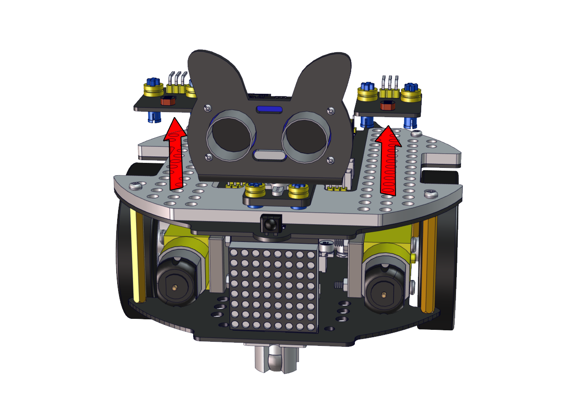
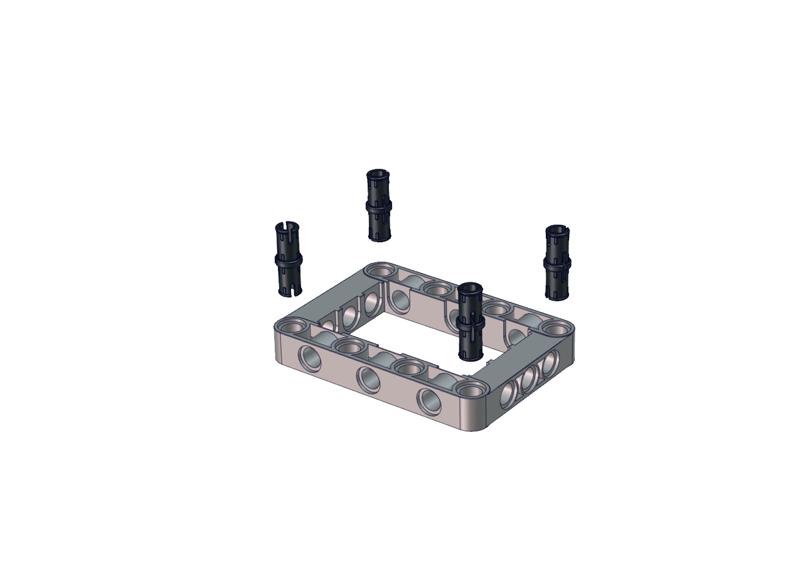
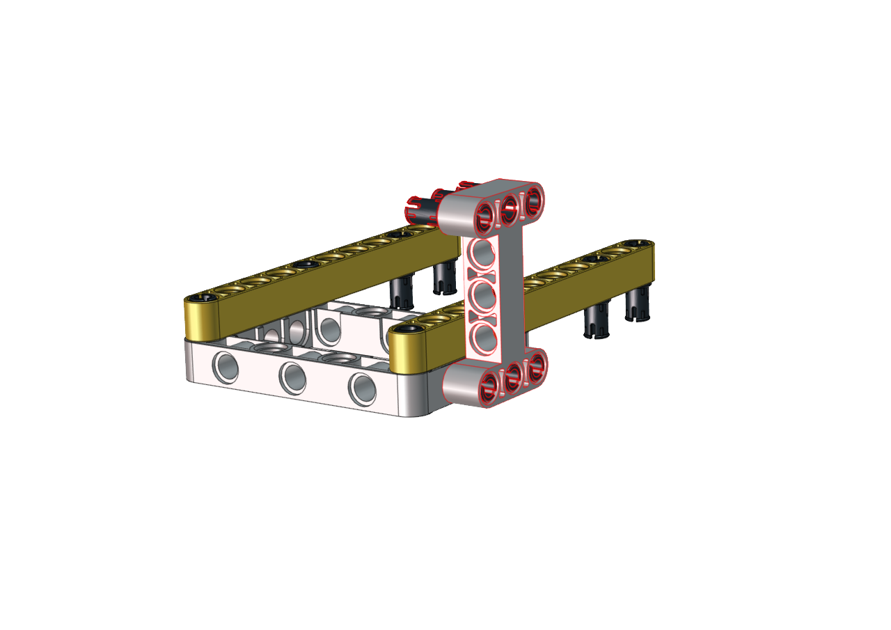
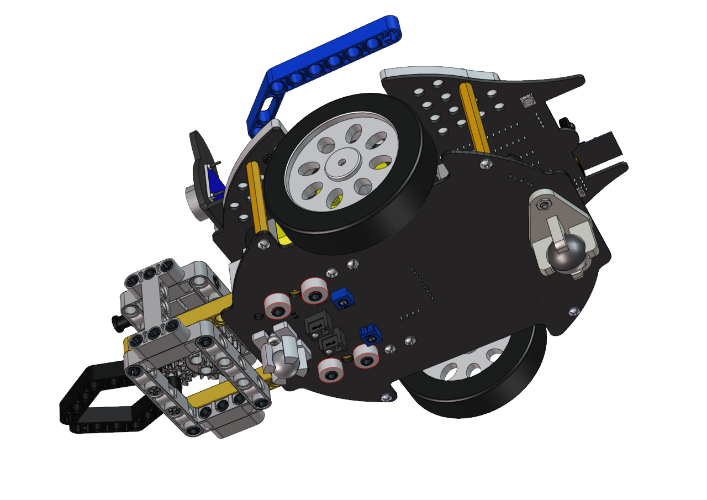

# 足球机器人形态安装步骤

先将两个光敏传感器拆下



------

## 安装所需零件


------

安装


------

完成


------

## 安装所需零件


------

安装



------

完成


------

## 安装所需零件


------

安装


------

完成


------

## 安装所需零件


------

安装


------

完成



------

## 安装所需零件


------

安装


------

完成


------

## 安装所需零件


------

安装（注意红圈内凸起朝右）


------

完成


------

## 安装所需零件


------

安装


------

完成


------

## 安装所需零件


------

安装（注意调整夹爪角度，使其闭合朝前）


------

完成


------

## 安装所需零件


------

注意在安装前需要先调节舵机角度为180度

**将舵机的线接到PCB上板的S2接口，如下表:**

|  舵机  | 小车PCB板 |
| :----: | :-------: |
|  棕线  |     G     |
|  红线  |    5V     |
| 橙黄线 | S2（A0）  |

代码：

```c++
#include <Servo.h>
Servo myservo;  // create servo object to control a servo

void setup() {
  myservo.attach(A0);  // attaches the servo on pin A0 to the servo object
}

void loop() {
  myservo.write(180);  // tell servo to go to position
}
```

上面的Arduino代码在资料中有提供，打开舵机的调整代码并烧录到Beetlebot的主板，完成。代码如下图位置:


也可以使用Scratch代码来调整舵机初始角度：


Scratch代码在资料中也有提供，打开舵机的调整代码并烧录到Beetlebot的主板，完成。代码如下图位置:


安装（齿轮安装时保持夹爪为闭合朝前状态）


------

完成


------

安装所需零件


------

安装


------

完成


------

安装所需零件


------

安装


------

完成



------

足球小将形态完成


------

乐高舵机接线图

