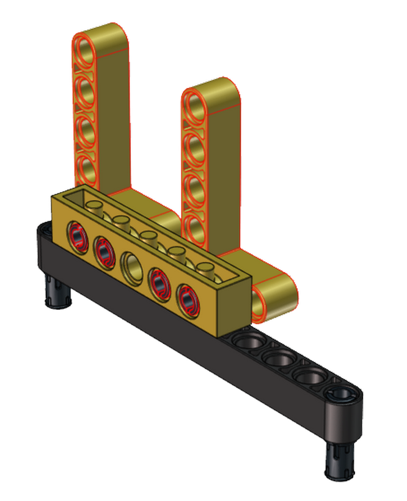
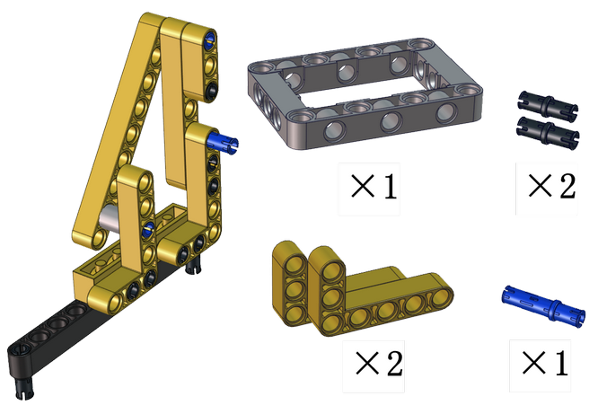
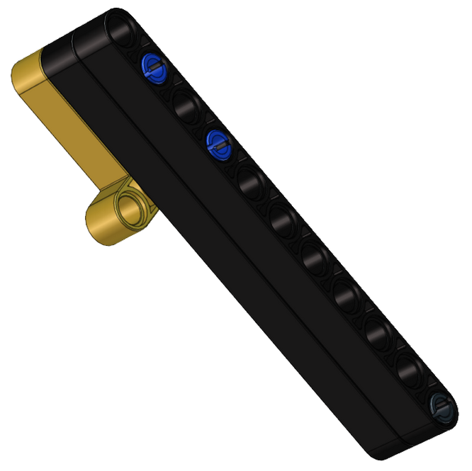
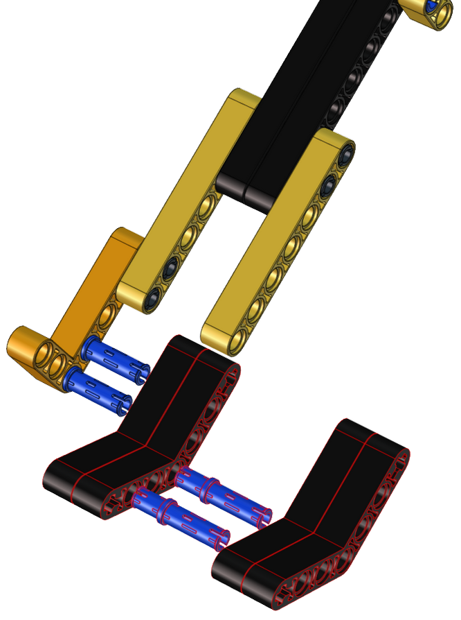
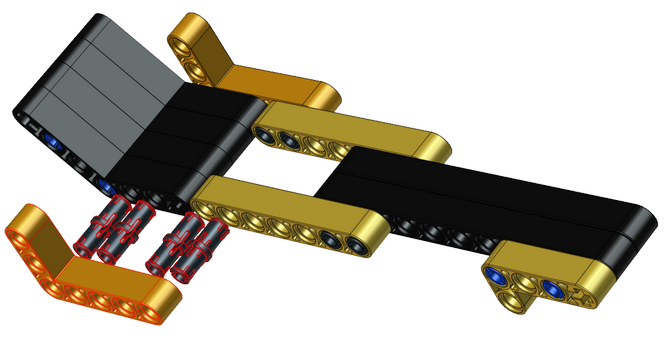
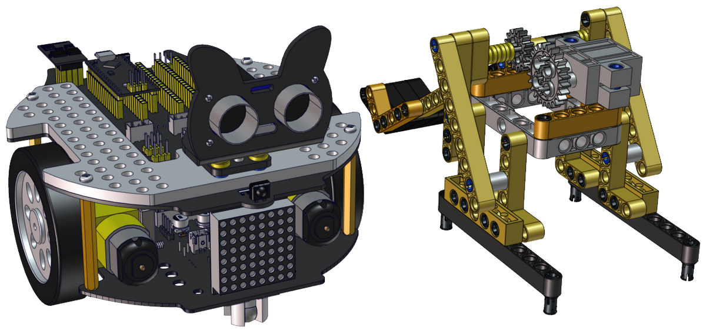

# 攻城战车形态安装步骤

## 安装所需零件


------

安装


------

完成


------

## 安装所需零件


------

安装


------

完成



------

## 安装所需零件


------

安装


------

完成


------

## 安装所需零件


------

安装


------

完成


------

## 安装所需零件



------

安装


------

完成


------

## 安装所需零件


------

安装


------

完成


------

## 安装所需零件


------

安装


------

完成


------

## 安装所需零件


------

安装


------

完成


------

## 安装所需零件


------

安装


------

完成



------

## 安装所需零件


------

安装


------

完成


------

## 安装所需零件


------

安装


------

完成


------

## 安装所需零件


------

安装



------

完成


------

## 安装所需零件


------

安装



------

完成


------

## 安装所需零件


------

安装


------

完成


------

## 安装所需零件


------

安装


------

完成


------

## 安装所需零件


------

安装


------

完成


------

## 安装所需零件


------

安装前需调节舵机角度为0°

将舵机的线接到PCB上板的S2接口，如下表:

| 舵机   | 小车PCB板 |
| ------ | --------- |
| 棕线   | G         |
| 红线   | 5V        |
| 橙黄线 | S2（A0）  |

```c++
#include <Servo.h>
Servo myservo;  // create servo object to control a servo

void setup() {
  myservo.attach(A0);  // attaches the servo on pin A0 to the servo object
}

void loop() {
  myservo.write(0);  // tell servo to go to position
}
```

上面的Arduino代码在资料中有提供，打开舵机的调整代码并烧录到Beetlebot的主板，完成。代码如下图位置。


也可以使用下面的Scratch-KidsBlock代码来调整舵机初始化角度。


Scratch代码在资料中也有提供，打开舵机的调整代码并烧录到Beetlebot的主板，完成。代码如下图位置:


------

安装（安装姿态与右图保持一致）


------

完成


------

## 安装所需零件



------

安装


------

完成


------

## 舵机接线图

