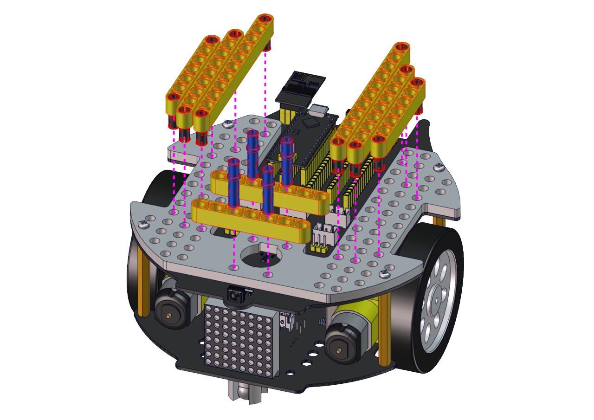
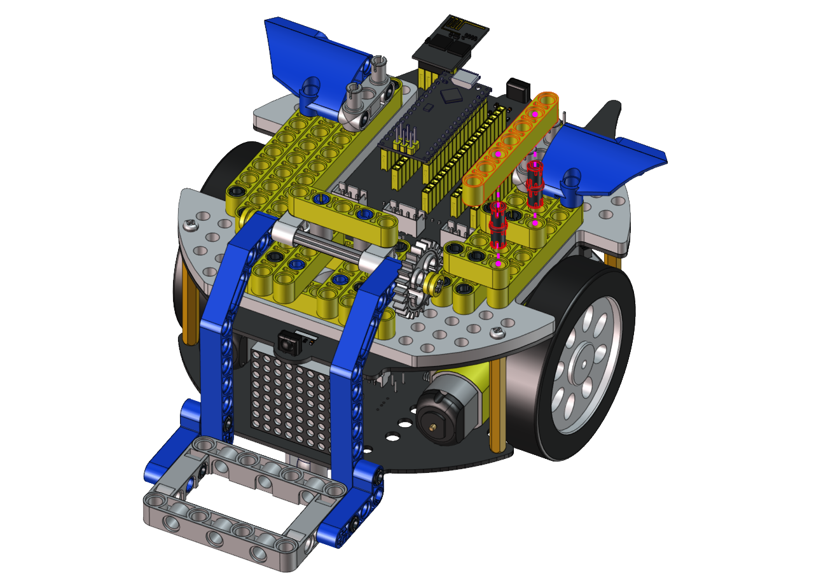
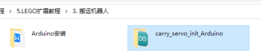
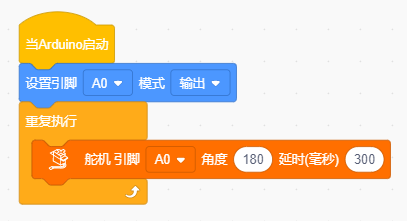
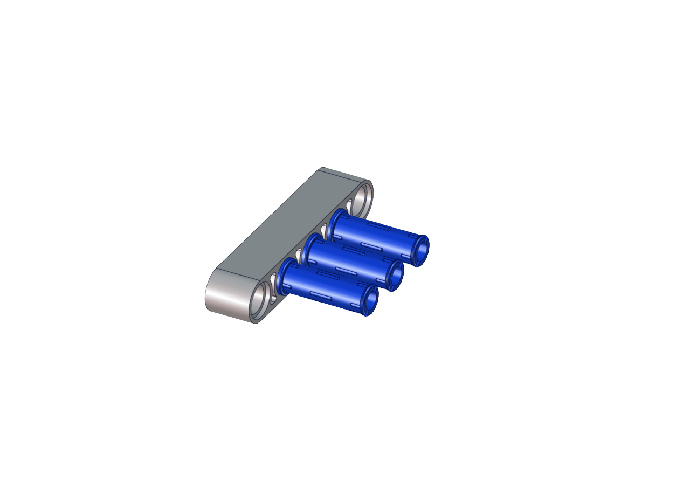

# 搬运机器人形态安装步骤


## 将超声波云台拆下


------

## 安装所需零件


------

安装



------

完成


------

## 安装所需零件


------

安装


------

完成


------

## 安装所需零件


------

安装


------

完成


------

## 安装所需零件


------

安装


------

完成


------

## 安装所需零件


------

安装


------

完成


------

## 安装所需零件


------

安装


------

完成


------

## 安装所需零件


------

安装



------

完成


------

## 安装所需零件


------

安装


------

完成


------

## 安装所需零件


------

安装前需调节舵机角度为180°

将舵机的线接到PCB上板的S2接口，如下表:

|  舵机  | 小车PCB板 |
| :----: | :-------: |
|  棕线  |     G     |
|  红线  |    5V     |
| 橙黄线 | S2（A0）  |

```c++
#include <Servo.h>
Servo myservo;  // create servo object to control a servo

void setup() {
  myservo.attach(A0);  // attaches the servo on pin A0 to the servo object
}

void loop() {
  myservo.write(180);  // tell servo to go to position
}
```

上面的Arduino代码在资料中有提供，打开舵机的调整代码并烧录到Beetlebot的主板，完成。代码如下图位置：



也可以使用下面的Scratch-KidsBlock代码来调整舵机初始化角度.



Scratch代码在资料中也有提供，打开舵机的调整代码并烧录到Beetlebot的主板，完成。代码如下图位置:


------

安装（安装姿势与右图一致）


------

完成


------

## 安装所需零件


------

安装


------

安装


------

完成



------

完成


------

## 完成


------

## 舵机接线图

舵机接到板子上的S2接口

