# LEGO扩展教程


## 足球机器人

### 足球机器人形态安装步骤

先将两个光敏传感器拆下


------

安装所需零件


------

安装


------

完成


------

安装所需零件


------

安装


------

完成


------

安装所需零件


------

安装


------

完成


------

安装所需零件


------

安装

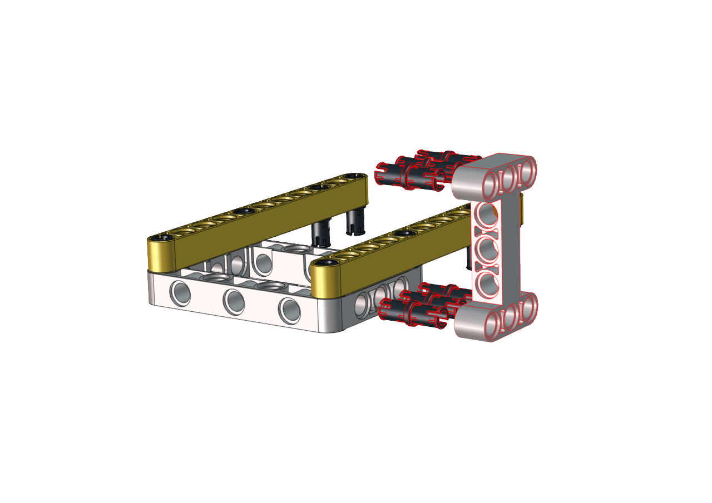

------

完成


------

安装所需零件


------

安装


------

完成


------

安装所需零件


------

安装（注意红圈内凸起朝右）


------

完成

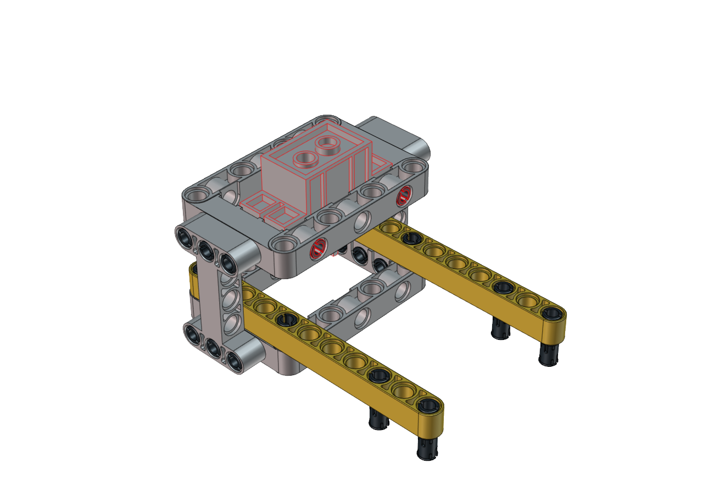

------

安装所需零件


------

安装


------

完成


------

安装所需零件


------

安装（注意调整夹爪角度，使其闭合朝前）

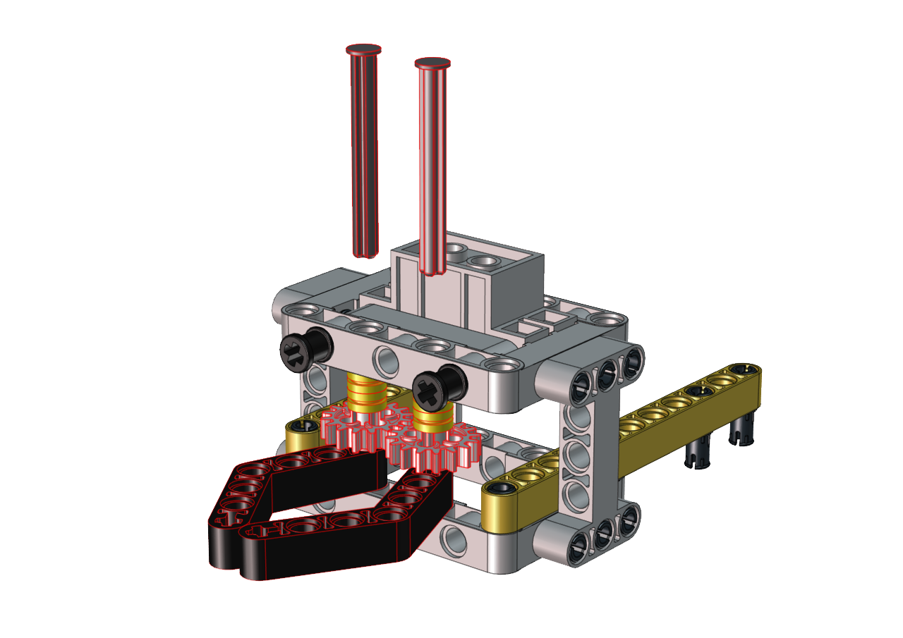

------

完成


------

安装所需零件


------

注意在安装前需要先调节舵机角度为180度

**将舵机的线接到PCB上板的S2接口，如下表:**

|  舵机  | 小车PCB板 |
| :----: | :-------: |
|  棕线  |     G     |
|  红线  |    5V     |
| 橙黄线 | S2（A0）  |

代码：

```c++
###include <Servo.h>
Servo myservo;  // create servo object to control a servo

void setup() {
  myservo.attach(A0);  // attaches the servo on pin A0 to the servo object
}

void loop() {
  myservo.write(180);  // tell servo to go to position
}
```

上面的Arduino代码在资料中有提供，打开舵机的调整代码并烧录到Beetlebot的主板，完成。代码如下图位置:


也可以使用Scratch代码来调整舵机初始角度：


Scratch代码在资料中也有提供，打开舵机的调整代码并烧录到Beetlebot的主板，完成。代码如下图位置:


安装（齿轮安装时保持夹爪为闭合朝前状态）


------

完成


------

安装所需零件


------

安装


------

完成


------

安装所需零件


------

安装

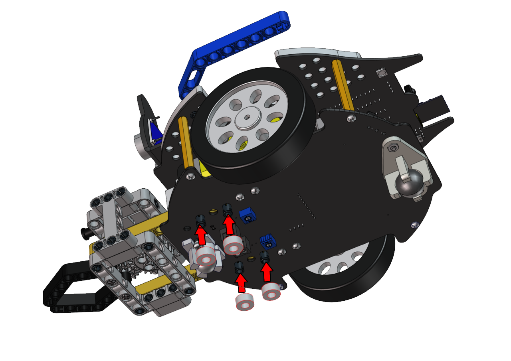

------

完成


------

足球小将形态完成


------

乐高舵机接线图


### 足球门安装步骤

安装所需零件


------

安装


------

完成


------

安装所需零件

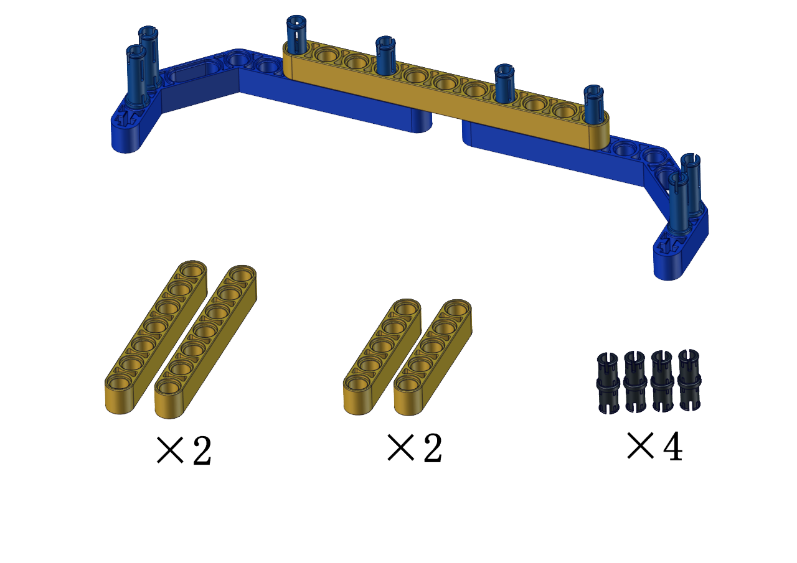

------

安装


------

完成


------

安装所需零件


------

安装


------

完成


------


### Arduino教程

#### 足球机器人

实验简介：

足球运动是一种大家非常喜爱的运动。让[机器人](https://baike.baidu.com/item/机器人/888)去踢足球，听起来像天方夜谭似的。机器人也能去踢足球？ 是的，足球机器人可以做到像我们人一样去组成团队进行踢足球比赛，比如：一年一度的RoboCup机器人世界杯---RoboCup足球赛等。在本实验中，我们利用乐高积木搭建了一款足球机器人，并且使用足球机器人把小足球送进足球门里。

------

足球机器人造型搭建：


------

实验代码:


------

实验场景：

1.将足球门（乐高造型已搭好）放在地上某个固定的位置，APP连上WiFi。

2.将小足球放在足球机器人的夹子中间，按住按钮使夹子夹住小足球，同时操作小车方向按钮使足球机器人把小足球送到离足球门一小段距离处再松开按钮。这样，小足球掉在地上且往前滚，看看小足球是否会滚进足球门里？如果没有，就反复上面的操作，使小足球最终进入足球门里。

3.如果你们小伙伴们也拥有这款足球机器人，可以和小伙伴们一起进行足球比赛，每一个足球机器人都夹着小足球，大家都操作各自的APP上的小车方向按钮，看看谁能最终把足球送到足球门里。


### Scratch教程

#### 足球机器人

实验简介：

足球运动是一种大家非常喜爱的运动。让[机器人](https://baike.baidu.com/item/机器人/888)去踢足球，听起来像天方夜谭似的。机器人也能去踢足球？ 是的，足球机器人可以做到像我们人一样去组成团队进行踢足球比赛，比如：一年一度的RoboCup机器人世界杯---RoboCup足球赛等。在本实验中，我们利用乐高积木搭建了一款足球机器人，并且使用足球机器人把小足球送进足球门里。

------

足球机器人造型搭建：


------

实验代码:


------

实验场景：

1.将足球门（乐高造型已搭好）放在地上某个固定的位置，APP连上WiFi。

2.将小足球放在足球机器人的夹子中间，按住按钮使夹子夹住小足球，同时操作小车方向按钮使足球机器人把小足球送到离足球门一小段距离处再松开按钮。这样，小足球掉在地上且往前滚，看看小足球是否会滚进足球门里？如果没有，就反复上面的操作，使小足球最终进入足球门里。

3.如果你们小伙伴们也拥有这款足球机器人，可以和小伙伴们一起进行足球比赛，每一个足球机器人都夹着小足球，大家都操作各自的APP上的小车方向按钮，看看谁能最终把足球送到足球门里。


## 投石攻城车

### 攻城战车形态安装步骤

安装所需零件


------

安装


------

完成


------

安装所需零件


------

安装


------

完成


------

安装所需零件


------

安装


------

完成


------

安装所需零件


------

安装


------

完成

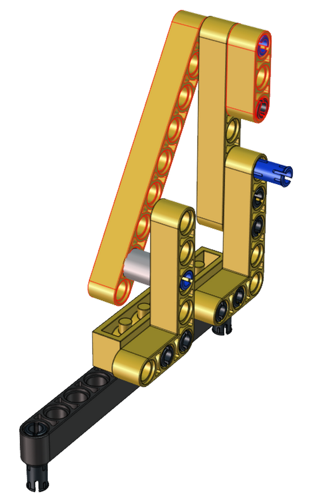

------

安装所需零件


------

安装

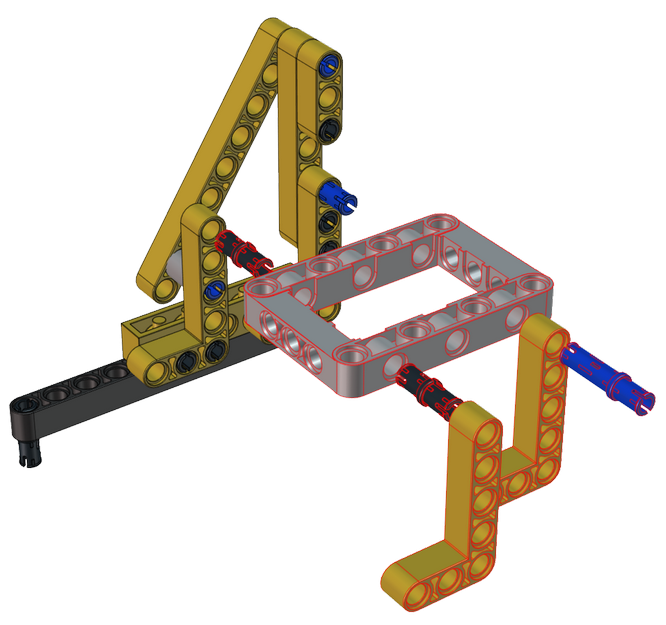

------

完成


------

安装所需零件


------

安装


------

完成


------

安装所需零件


------

安装


------

完成


------

安装所需零件

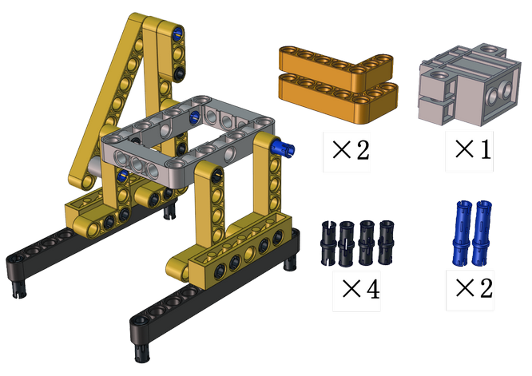

------

安装

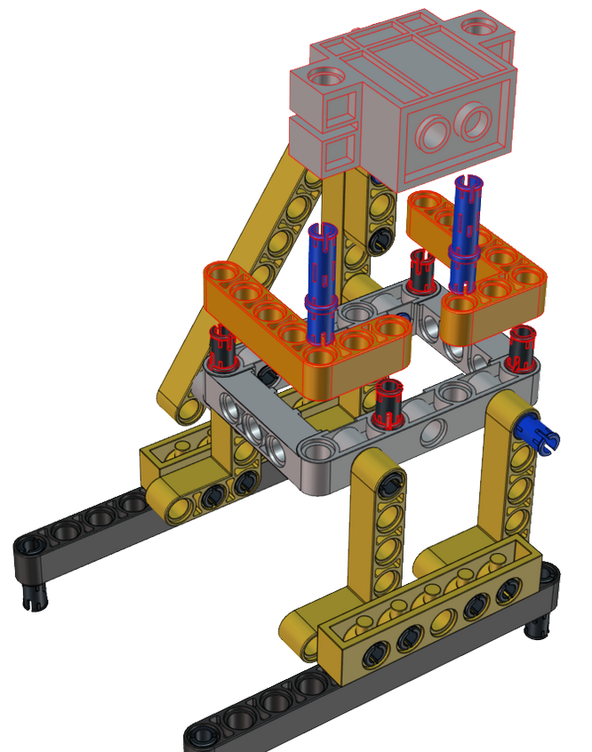

------

完成


------

安装所需零件


------

安装


------

完成


------

安装所需零件


------

安装


------

完成


------

安装所需零件


------

安装


------

完成


------

安装所需零件

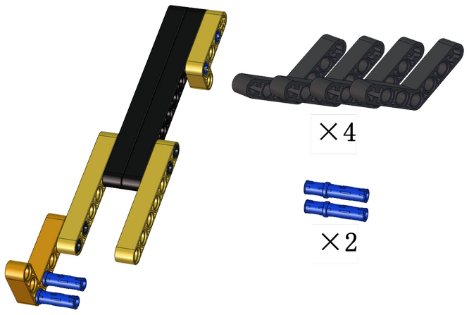

------

安装


------

完成


------

安装所需零件


------

安装


------

完成


------

安装所需零件


------

安装


------

完成


------

安装所需零件


------

安装


------

完成


------

安装所需零件


------

安装

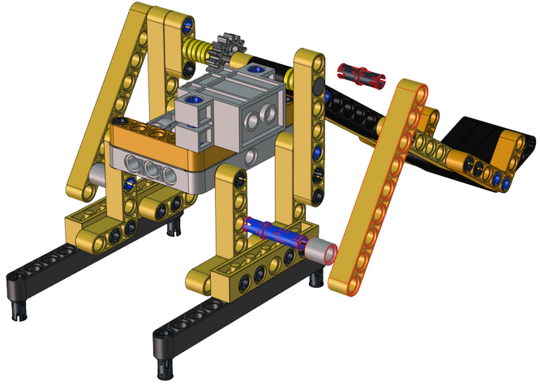

------

完成


------

安装所需零件


------

安装前需调节舵机角度为0°

将舵机的线接到PCB上板的S2接口，如下表:

| 舵机   | 小车PCB板 |
| ------ | --------- |
| 棕线   | G         |
| 红线   | 5V        |
| 橙黄线 | S2（A0）  |

```c++
###include <Servo.h>
Servo myservo;  // create servo object to control a servo

void setup() {
  myservo.attach(A0);  // attaches the servo on pin A0 to the servo object
}

void loop() {
  myservo.write(0);  // tell servo to go to position
}
```

上面的Arduino代码在资料中有提供，打开舵机的调整代码并烧录到Beetlebot的主板，完成。代码如下图位置。


也可以使用下面的Scratch-KidsBlock代码来调整舵机初始化角度。


Scratch代码在资料中也有提供，打开舵机的调整代码并烧录到Beetlebot的主板，完成。代码如下图位置:


------

安装（安装姿态与右图保持一致）


------

完成


------

安装所需零件


------

安装


------

完成


------

舵机接线图

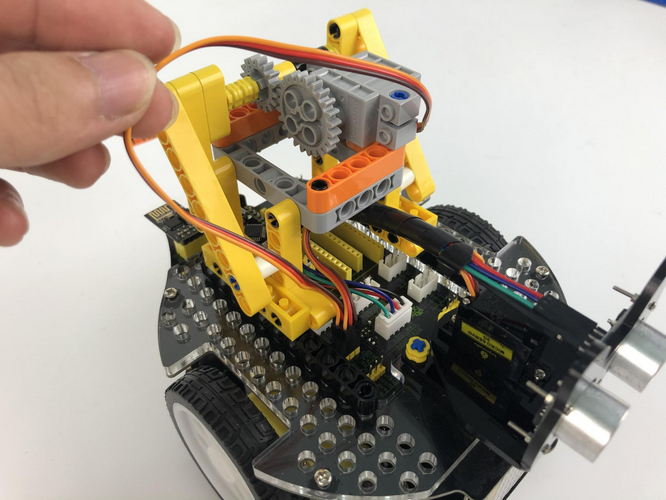

### Arduino教程

#### 投石攻城车

实验简介

投石攻城车在古代主要用于围攻和防守要塞，主要是用木头制作的，是利用配重物的重力发射，把石头抛出去。我们也制作了一款投石攻城车，是由车和乐高积木搭建而成的，车上装有舵机和齿轮，长臂末端有乐高搭建的凹槽是用于装投射物。[发射](https://baike.baidu.com/item/发射/7776886)时，舵机转动带动齿轮把长臂向后推，把投射物放入凹槽中,当舵机转动一定角度带动齿轮把长臂完全升起时，投射物从凹槽中飞出。

------

投石攻城车造型搭建


------

实验代码


实验场景

1. 在场地用乐高积木搭建几个目标物（目标物A，B，C，D，E），目标物在投石攻城车前方且都隔一段距离。APP连上WiFi。

2. 操作小车方向按钮使投石攻城车正对目标物A一段距离，按住按钮，舵机转动一定角度带动齿轮升起长臂把乐高积木块抛出去；松开按钮，舵机转动带动齿轮把长臂向后推。看看乐高积木块是否打击到目标物A？如果没有，就反复操作小车方向按钮、按住或松开按钮，调整投石攻城车与目标物A之间的距离，使抛出去的乐高积木块刚好可以打击到目标物A。

3.打击目标物B，C，D，E的操作方法和上面的一样。按住按钮，舵机转动一定角度带动齿轮升起长臂把乐高积木块抛出去。


### Scratch教程

#### 投石攻城车

实验简介

投石攻城车在古代主要用于围攻和防守要塞，主要是用木头制作的，是利用配重物的重力发射，把石头抛出去。我们也制作了一款投石攻城车，是由车和乐高积木搭建而成的，车上装有舵机和齿轮，长臂末端有乐高搭建的凹槽是用于装投射物。[发射](https://baike.baidu.com/item/发射/7776886)时，舵机转动带动齿轮把长臂向后推，把投射物放入凹槽中,当舵机转动一定角度带动齿轮把长臂完全升起时，投射物从凹槽中飞出。

------

投石攻城车造型搭建


------

实验代码


实验场景

1. 在场地用乐高积木搭建几个目标物（目标物A，B，C，D，E），目标物在投石攻城车前方且都隔一段距离。APP连上WiFi。

2. 操作小车方向按钮使投石攻城车正对目标物A一段距离，按住按钮，舵机转动一定角度带动齿轮升起长臂把乐高积木块抛出去；松开按钮，舵机转动带动齿轮把长臂向后推。看看乐高积木块是否打击到目标物A？如果没有，就反复操作小车方向按钮、按住或松开按钮，调整投石攻城车与目标物A之间的距离，使抛出去的乐高积木块刚好可以打击到目标物A。

3.打击目标物B，C，D，E的操作方法和上面的一样。按住按钮，舵机转动一定角度带动齿轮升起长臂把乐高积木块抛出去。


## 搬运机器人

### 搬运机器人形态安装步骤


将超声波云台拆下


------

安装所需零件


------

安装


------

完成


------

安装所需零件


------

安装


------

完成


------

安装所需零件


------

安装


------

完成


------

安装所需零件


------

安装


------

完成


------

安装所需零件

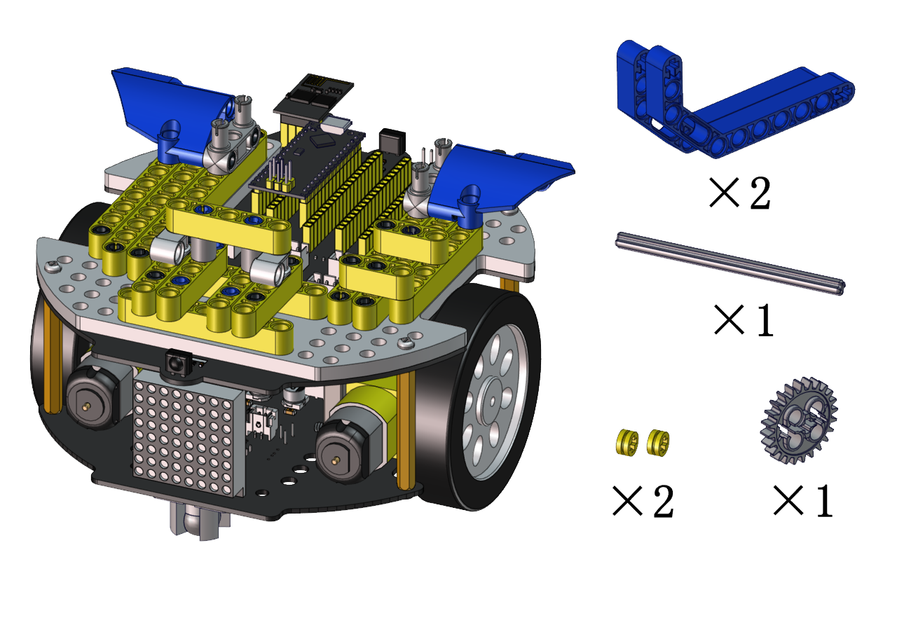

------

安装


------

完成


------

安装所需零件


------

安装


------

完成


------

安装所需零件


------

安装


------

完成


------

安装所需零件

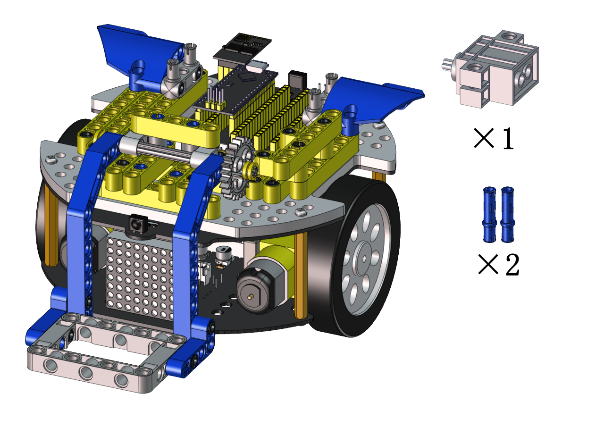

------

安装


------

完成


------

安装所需零件


------

安装前需调节舵机角度为180°

将舵机的线接到PCB上板的S2接口，如下表:

|  舵机  | 小车PCB板 |
| :----: | :-------: |
|  棕线  |     G     |
|  红线  |    5V     |
| 橙黄线 | S2（A0）  |

```c++
###include <Servo.h>
Servo myservo;  // create servo object to control a servo

void setup() {
  myservo.attach(A0);  // attaches the servo on pin A0 to the servo object
}

void loop() {
  myservo.write(180);  // tell servo to go to position
}
```

上面的Arduino代码在资料中有提供，打开舵机的调整代码并烧录到Beetlebot的主板，完成。代码如下图位置：


也可以使用下面的Scratch-KidsBlock代码来调整舵机初始化角度.


Scratch代码在资料中也有提供，打开舵机的调整代码并烧录到Beetlebot的主板，完成。代码如下图位置:


------

安装（安装姿势与右图一致）


------

完成


------

安装所需零件


------

安装


------

安装


------

完成


------

完成


------

完成

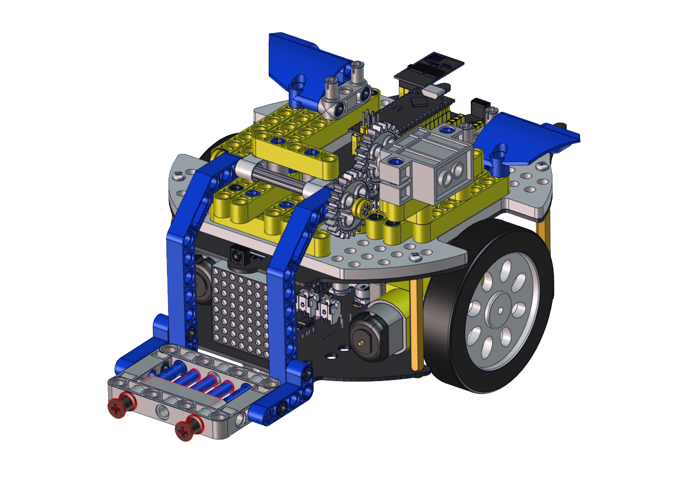

------

舵机接线图

舵机接到板子上的S2接口


### Arduino教程

#### 搬运机器人


实验简介

在众多的工业机器人中，搬运机器人无疑是应用率较高的机器人之一，不管是在工业制造、仓储物流、烟草、医药、食品、化工等行业领域，还是在邮局、图书馆、港口码头、机场、停车场等场景，都可以见到搬运机器人的身影。在本实验中，我们也利用乐高积木搭建了一款搬运机器人来搬运东西。

------

搬运机器人造型搭建


------

实验代码


------

实验场景

1. 在投石攻城车项目实验中，投石攻城车抛乐高积木块击打目标物A、B、C、D散落满地的一些乐高积木。
2. APP连上WiFi，操作小车方向按钮使搬运机器人移动到散落满地的乐高积木旁。
3. 用手拣一些小的乐高积木块放到铲斗上，操作小车方向按钮使搬运机器人把乐高积木搬运到原始位置。按住按钮，舵机转动一定角度带动齿轮使铲斗升起，这样，运送的乐高积木块就掉下来。


4. 重复上面的操作方法，把所有的乐高积木块都搬运到原始位置。


### Scratch教程

#### 搬运机器人


实验简介

在众多的工业机器人中，搬运机器人无疑是应用率较高的机器人之一，不管是在工业制造、仓储物流、烟草、医药、食品、化工等行业领域，还是在邮局、图书馆、港口码头、机场、停车场等场景，都可以见到搬运机器人的身影。在本实验中，我们也利用乐高积木搭建了一款搬运机器人来搬运东西。

------

搬运机器人造型搭建


------

实验代码


------

实验场景

1. 在投石攻城车项目实验中，投石攻城车抛乐高积木块击打目标物A、B、C、D散落满地的一些乐高积木。
2. APP连上WiFi，操作小车方向按钮使搬运机器人移动到散落满地的乐高积木旁。
3. 用手拣一些小的乐高积木块放到铲斗上，操作小车方向按钮使搬运机器人把乐高积木搬运到原始位置。按住按钮，舵机转动一定角度带动齿轮使铲斗升起，这样，运送的乐高积木块就掉下来。


4. 重复上面的操作方法，把所有的乐高积木块都搬运到原始位置。


