## 清单

**当收到这个产品时，请根据清单进行清点，以确保所有配件完整无损。如果发现有缺失的配件，请立即联系我们的销售人员。**

| 序号 |       图片        |                        规格                        | 倍用量 |
| :--: | :---------------: | :------------------------------------------------: | :----: |
|  1   | 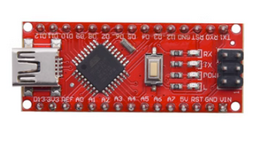 | keyes NANO for arduino 开发板 红色 |   1    |
|  2   | 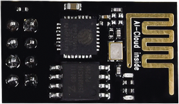 |      ESP8266串口WIFI ESP-01 WEBDUINO专用      |   1    |
|  3   |  | 光敏电阻传感器 |   2    |
|  4   |  |             乐高舵机 270°舵机             |   1    |
|  5   |  |               扩展板             |   1    |
|  6   |  |            驱动板            |   1    |
|  7   |  |              乐高套件           |   1    |
|  8   | 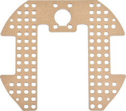 |                亚克力垫高板                |   1    |
|  9   |  |                      超声波固定亚克力折弯板                      |   1    |
|  10  |  |                     乐高孔位亚克力舵机固定平台                     |   1    |
|  11  |  |                 马达                |   2    |
|  12  |  |                 8X8点阵模块                 |   1    |
|  13  | 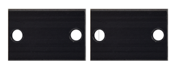 |                  马达固定部件                  |   2    |
|  14  |  |            9G 舵机180度             |   1    |
|  15  |  |               轮胎               |   2    |
|  16  | 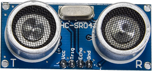 |            超声波传感器       |   1    |
|  17  |  | 红黑色 十字螺丝刀 |   1    |
|  18  |  |   万向轮   |   1    |
|  19  |  |            USB MINI5P 蓝色            |   1    |
|  20  |  | 遥控器 |   1    |
|  21  |  |            USB type-c            |   1    |
|  22  |  |                    紫黑色 十字螺丝刀                    |   1    |
|  23  | 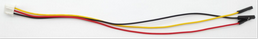 |            XH2.54-3Pin+杜邦母单            |   2    |
|  24  | 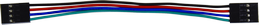 |                    4P 杜邦母对母连拼                    |   1    |
|  25  |  |      HX2.54mm-4P转2.54杜邦母单 |   1    |
|  26  |   |                  缠绕管                  |   1   |
|  27  |   |                10P XH2.54白色端子                |   1   |
|  28  |    |                乐高摩擦销用亚克力垫片                |   1   |
|  29  |    |               六角铜柱            |   4   |
|  30  |   |               自攻螺钉            |   4   |
|  31  |  |                    镀镍螺母                 |   4   |
|  32  |   |                    不锈钢螺钉                |   4    |
|  33  |   |               镀镍螺母            |   2    |
|  34  | 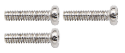 |    十字螺钉 |   2    |
|  35  |  |    十字螺钉 |   6    |
|  36  |  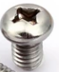 |    十字螺钉    |   10   |
|  37  |  |    镀镍螺母    |   8    |
|  38  |   |      十字螺钉   |   4    |
|  39  |  |     桌上足球     |   1    |
|  40  | 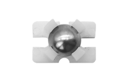 |           钢珠万向轮           |   1    |
|  41  |  |              18650电池              |   1    |
|  42  | 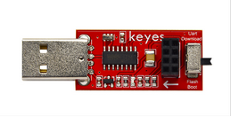 |   USB转ESP-01S WIFI模块串口测试扩展板 |   1    |
|  43  |  |                       寻迹跑道                       |   1    |
| 44 |  | 圆头十字 自攻螺丝 | 2 |
