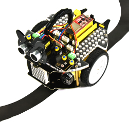

# Project 11: 循线行走

## 实验简介



在前面的项目中，我们详细的介绍了在上面实验中，我们已经了解了电机驱动和调速、红外循迹等硬件知识。在本实验中，小车会根据红外循迹传送的数值做出不同的动作。

## 工作原理

| 左   | 右   | 值（二进制） | 动作     |
| ---- | ---- | ------------ | -------- |
| 0    | 0    | 00           | 停止     |
| 0    | 1    | 01           | 向右转   |
| 1    | 0    | 10           | 向左转   |
| 1    | 1    | 11           | 向前移动 |

## 流程图

 

## 实验代码

```c++
//*************************************************************************************
/*
Project 08.2: Follow line to walk
*/
const int left_ctrl = 4;//定义左电机方向控制引脚D4
const int left_pwm = 6;//定义左电机速度控制引脚D5
const int right_ctrl = 2;//定义右电机方向控制引脚D2
const int right_pwm = 5;//定义右电机速度控制引脚D5
int tracking_left = 11;//定义左红外循迹引脚D11
int tracking_right = 10;//定义右红外循迹引脚D10
int L_val,R_val;//定义左,右红外循迹两个变量
const int servopin = 9;//定义舵机的脚位在D9
int myangle;
int pulsewidth;

void setup() {
  pinMode(left_ctrl,OUTPUT);//设置左电机方向控制引脚为输出
  pinMode(left_pwm,OUTPUT);//设置左电机pwm控制速度引脚为输出
  pinMode(right_ctrl,OUTPUT);//设置右电机方向控制引脚为输出
  pinMode(right_pwm,OUTPUT);//设置右电机pwm控制速度引脚为输出
  pinMode(tracking_left, INPUT); //设置左红外循迹引脚为输入
  pinMode(tracking_right, INPUT); //设置右红外循迹引脚为输入
  servopulse(servopin,90);//设置舵机初始角度为90
  delay(300);
}

void loop() 
{
  tracking(); //运行主程序
}

void tracking()
{
  L_val = digitalRead(tracking_left);//读取左红外循迹的值
  R_val = digitalRead(tracking_right);//读取右红外循迹的值
  if((L_val == 1)&&(R_val == 1))//如果左,右红外循迹都读到黑线
  {
    front();//小车前进
  }
  else if((L_val == 1)&&(R_val == 0))//否则如果左红外循迹读到黑线，右红外循迹没有
  {
    left();//小车左转
  }
  else if((L_val == 0)&&(R_val == 1))//如果右红外循迹读到黑线，左红外循迹没有
  {
    right();//小车右转
  }
  else//如果左,右红外循迹都没有读到黑线
  {
    Stop();//小车停止
   }
}

void servopulse(int servopin,int myangle)//舵机运行角度
{
  for(int i=0; i<20; i++)
  {
    pulsewidth = (myangle*11)+500;
    digitalWrite(servopin,HIGH);
    delayMicroseconds(pulsewidth);
    digitalWrite(servopin,LOW);
    delay(20-pulsewidth/1000);
  }  
}

void front()//定义前进的状态
{
  digitalWrite(left_ctrl,LOW); //左电机方向控制引脚低电平
  analogWrite(left_pwm,100); //左电机PWM控制速度200
  digitalWrite(right_ctrl,LOW); //右电机方向控制引脚低电平
  analogWrite(right_pwm,100); //右电机PWM控制速度200
}
void left()//定义左转的状态
{
  digitalWrite(left_ctrl,HIGH); //左电机方向控制引脚高电平
  analogWrite(left_pwm,200); //左电机PWM控制速度200
  digitalWrite(right_ctrl,LOW); //右电机方向控制引脚低电平
  analogWrite(right_pwm,50); //右电机PWM控制速度200
}
void right()//定义右转的状态
{
  digitalWrite(left_ctrl,LOW); //左电机方向控制引脚低电平
  analogWrite(left_pwm,50); //左电机PWM控制速度200
  digitalWrite(right_ctrl,HIGH); //右电机方向控制引脚高电平
  analogWrite(right_pwm,200); //右电机PWM控制速度200
}
void Stop()//定义停止的状态
{
  digitalWrite(left_ctrl,LOW);//左电机方向控制引脚低电平
  analogWrite(left_pwm,0);//左电机PWM控制速度0
  digitalWrite(right_ctrl,LOW);//右电机方向控制引脚低电平
  analogWrite(right_pwm,0);//右电机PWM控制速度0
}
//*************************************************************************************
```

## 实验现象

将实验代码上传到Arduino Nano主板，小车安上电池，并且将电源开关拨到ON端，上电后，然后把小车放在循迹轨道（我们提供的）上，小车就开始根据红外循迹传送的数值做出不同的动作。

