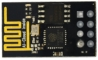
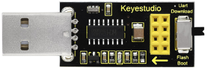
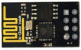
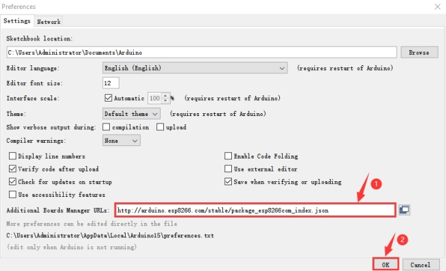
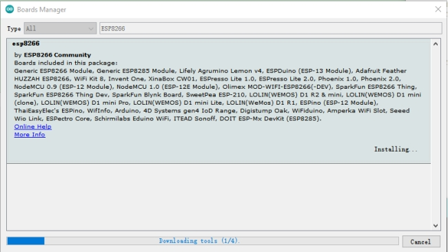
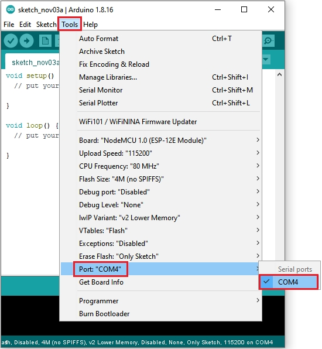
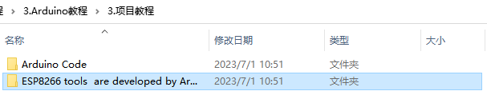
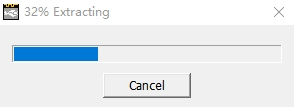
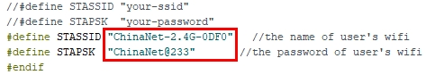
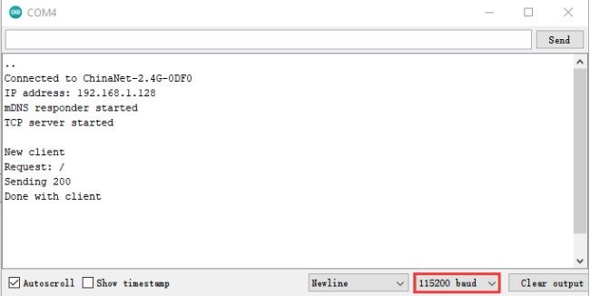

# Project 16：WIFI 测试

在如今科技高速发展的时代，人们的生活质量越来越好，生活节奏越来越快，开始有人觉得复杂多样的智能化设备控制起来十分麻烦，通过手机统一控制智能化设备这种方法逐渐得到了人们的青睐。

这种方法是利用单片机通过wifi模块和Internet网络建立手机和智能化设备之间的连接以此来实现对智能化设备的远程控制。在本章实验中，我们结合Nano主板和ESP8266串口WIFI ESP-01模块，通过Beetlebot APP向ESP8266串口WIFI ESP-01模块发送指令，ESP8266串口WIFI ESP-01模块接到指令后再将其发送给单片机，单片机再控制小车进行动作调整。

## 实验简介：

ESP8266串口WIFI ESP-01模块，它是一款超低功耗的UART-WiFi 透传模块，拥有业内极富竞争力的封装尺寸和超低能耗技术，专为移动设备和物联网应用设计，可将用户的物理设备连接到Wi-Fi 无线网络上，进行互联网或局域网通信，实现联网功能。

## 实验元件：


|   |                |
| :----------------------: | :-----------------------------------: |
| ESP8266串口WIFI ESP-01*1 | USB转ESP-01S WIFI模块串口测试扩展板*1 |

## 元件知识：


***\*USB转ESP-01S WIFI模块串口测试扩展板：\****适用于ESP-01S WiFi模块，扩展板的拨动开关打到flash boot端，直插于电脑USB口，用安信可串口调试助手测试AT指令。

扩展板的拨动开关打到Uart Download 端，直插于电脑USB口，ESP-01模块处于下载模式，通过安信可固件下载软件可下载固件到ESP-01模块中。



**ESP8266串口 WIFIESP-01：**ESP8266串口WIFI ESP-01是一款超低功耗的UART-WiFi 透传模块，ESP8266串口WIFI ESP-01可广泛应用于智能电网、智能交通、智能家具、手持设备、工业控制等领域。

**产品特性**

** 支持无线802.11 b/g/n 标准

** 支持STA/AP/STA+AP 三种工作模式

** 内置TCP/IP协议栈，支持多路TCP Client连接 

** 支持丰富的Socket AT指令

** 支持UART/GPIO数据通信接口

** 支持Smart Link 智能联网功能

** 支持远程固件升级（OTA）

** 内置32位MCU，可兼作应用处理器 

** 超低能耗，高集成度的 Wi-Fi 芯片，适合电池供电应用

** 超宽工作温度范围：-40°C 至 +125°C

** 3.3V 单电源供电

 

**模块基本参数**

- **模块**

  |    型号    | 主芯片  |
  | :--------: | :-----: |
  | ESP8266-01 | ESP8266 |

- **无线参数**

  |   **无线标准**   |   **频率范围**    |            **发射功率**            |         **接收灵敏度**          |          **天线形式**          |
  | :--------------: | :---------------: | :--------------------------------: | :-----------------------------: | :----------------------------: |
  | IEEE 802.11b/g/n | 2.412GHz-2.484GHz |   802.11b: +16 +/-2dBm (@11Mbps)   | 802.11b: -93 dBm (@11Mbps ,CCK) |        外置：邮票孔接口        |
  |                  |                   |   802.11g: +14 +/-2dBm (@54Mbps)   | 802.11g: -85dBm (@54Mbps, OFDM) | 外置：I-PEX 连接器、SMA 连接器 |
  |                  |                   | 802.11n: +13 +/-2dBm (@HT20, MCS7) |  802.11n: -82dBm (@HT20, MCS7)  |       内置：板载PCB 天线       |

- **硬件参数**

  |   **硬件接口**   |                  UART，IIC，PWM，GPIO，ADC                   |
  | :--------------: | :----------------------------------------------------------: |
  |   **工作电压**   |                             3.3V                             |
  | **GPIO驱动能力** |                          Max：15ma                           |
  |   **工作电流**   | 持续发送下=>平均值：~70mA，峰值: 200mA正常模式下=>平均: ~12mA，峰值: 200mA待机：<200uA， |
  |   **工作温度**   |                          -40℃~125℃                           |
  |   **存储环境**   |                温度：<40℃，相对湿度：<90%R.H.                |
  |     **尺寸**     |               板载PCB天线：14.3mm*24.8mm*1mm；               |

  

- **串口透传**.

  | **传输速率**  | **TCP Client** |
  | :-----------: | :------------: |
  | 110-921600bps |      5个       |

- **软件参数**

  | **无线网络类型** |                        STA/AP/STA+AP                         |
  | :--------------: | :----------------------------------------------------------: |
  |   **安全机制**   |                     WEP/WPA-PSK/WPA2-PSK                     |
  |   **加密类型**   |                    WEP64/WEP128/TKIP/AES                     |
  |   **固件升级**   |                    本地串口，OTA远程升级                     |
  |   **网络协议**   |                    IPv4, TCP/UDP/FTP/HTTP                    |
  |   **用户配置**   | AT+指令集, Web 页面 Android/iOS 终端, Smart Link 智能配置APP |

  

硬件介绍：

ESP8266硬件接口丰富，可支持UART，IIC，PWM，GPIO，ADC等，适用于各种物联网应用场合。

| **引脚** |     **功能**     |                           **说明**                           |
| :------: | :--------------: | :----------------------------------------------------------: |
|    1     |       URXD       | 1）UART_RXD，接收；2）General Purpose Input/Output：GPIO3；  |
|    2     |       UTXD       | 1）UART_TXD，发送；2）General Purpose Input/Ou tput：GPIO1；3）开机时禁止下拉； |
|    5     | RESET（GPIO 16） |      外部Reset信号，低电平复位，高电平工作（默认高）；       |
|    6     |       GND        |                             GND                              |
|    8     |       VCC        |                       3.3V，模块供电；                       |
|    9     |       ANT        |                         WiFi Antenna                         |
|    11    |      GPIO0       | 1）默认WiFi Status：WiFi工作状态指示灯控制信号；2）工作模式选择：  悬空：Flash Boot，工作模式；  下拉：UART Download，下载模式； |
|    12    |       ADC        |                    ADC，输入范围：0V-1V；                    |
|    13    |      GPIO15      |                       下拉：工作模式；                       |
|    14    |      CH_PD       |            1）高电平工作；2）低电平模块供电关掉；            |
|    15    |      GPIO2       |  1）开机上电时必须为高电平，禁止硬件下拉；2）内部默认已拉高  |


功耗

|                  模式                  | 最小值 | 通常 | 最大值 | 单位 |
| :------------------------------------: | ------ | ---- | ------ | ---- |
| 传送802.11b，CCK 1Mbps，Pout=+19.5dBm  |        | 215  |        | mA   |
| 传送802.11b，CCK 11Mbps，Pout=+18.5dBm |        | 197  |        | mA   |
| 传送802.11g，OFDM54 Mbps，Pout=+16dBm  |        | 145  |        | mA   |
|     传送802.11n，MCS7，Pout=+14dBm     |        | 135  |        | mA   |
|   接收802.11b，包长1024字节，-80dBm    |        | 100  |        | mA   |
|   接收802.11g，包长1024字节，-70dBm    |        | 100  |        | mA   |
|   接收802.11n，包长1024字节，-65dBm    |        | 102  |        | mA   |
|              系统待机模式              |        | 70   |        | mA   |
|                  关机                  |        | 0.5  |        | μA   |

下列功耗数据是基于3.3V的电源、25°的环境温度下测得。

1.所有测量均在天线接口处完成。 

2.所有发射数据是基于 90% 的占空比，在持续发射的模式下测得的。

射频指标：

以下数据是在室内温度下，电压为3.3V时测得。 

|            **描述**            | **最小值** | **通常** | **最大值** | **单位** |
| :----------------------------: | :--------: | :------: | :--------: | :------: |
|            输入频率            |    2412    |          |    2484    |   MHz    |
|            输入电阻            |            |    50    |            |    Ω     |
|            输入反射            |            |          |    -10     |    dB    |
|    72.2Mbps下，PA的输出功率    |     14     |    15    |     16     |   dBm    |
|  802.11b模式下，PA的输出功率   |    17.5    |   18.5   |    19.5    |   dBm    |
|           **灵敏度**           |            |          |            |          |
|           CCK 1Mbps            |            |   -98    |            |   dBm    |
|           CCK 11Mbps           |            |   -91    |            |   dBm    |
|         6Mbps(1/2BPSK)         |            |   -93    |            |   dBm    |
|       54Mbps(3/4 64-QAM)       |            |   -75    |            |   dBm    |
| HT20，MCS7（65Mbps，72.2Mbps） |            |   -71    |            |   dBm    |
|          **邻频抑制**          |            |          |            |          |
|          OFDM，6Mbps           |            |    37    |            |    dB    |
|          OFDM，54Mbps          |            |    21    |            |    dB    |
|           HT20，MCS0           |            |    37    |            |    dB    |
|           HT20，MCS7           |            |    20    |            |    dB    |

注：1. 72.2Mbps是在802.11n模式下，MCS=7，GI=200uS时测得；

2. 802.11b模式下最高可达+19.5dBm的输出功率。

功能描述

***\*A.主要功能\****

ESP8266可以实现的主要功能包括：串口透传，PWM 调控，GPIO控制。

※串口透传：数据传输，传输的可靠性好，最大的传输速率为：460800bps。

※PWM 调控：灯光调节，三色LED 调节，电机调速等。

※GPIO控制：控制开关，继电器等。

***\*B.工作模式\****

ESP8266模块支持STA/AP/STA+AP 三种工作模式。

❊STA 模式：ESP8266模块通过路由器连接互联网，手机或电脑通过互联网实现对设备的远程控制。


❊AP 模式：ESP8266模块作为热点，实现手机或电脑直接与模块通信，实现局域网无线控制。

❊STA+AP 模式：两种模式的共存模式，即可以通过互联网控制可实现无缝切换，方便操作。


***\*C.应用领域\****

✭✮串口CH340 转Wi-Fi；

✭✮工业透传DTU；

✭✮Wi-Fi 远程监控/控制；

✭✮玩具领域；

✭✮彩色LED 控制；

✭✮消防、安防智能一体化管理；

✭✮智能卡终端，无线POS 机，Wi-Fi 摄像头，手持设备等

 

将WIFI模块串口测试扩展板插入电脑的USB口：

A. 将ESP8266串口WIFI ESP-01模块正确方向插入USB转ESP-01S WIFI模块串口测试扩展板上。


B. 先将USB转ESP-01S WIFI模块串口测试扩展板上的拨码开关拨到UartDownload端，再将USB转ESP-01S WIFI模块串口测试扩展板插入电脑的USB口。


Arduino搭建Esp8266开发环境

先将ESP8266串口WIFI ESP-01模块正确插入USB转ESP-01S WIFI模块串口测试扩展板中，然后将USB转ESP-01S WIFI模块串口测试扩展板插入电脑的USB口，点击进入arduino-1.8.16文件夹（也可以采用最新版本的），找到图标并点击进入1.8.16版本IDE界面。


 在Arduino IDE里面进行下载安装：

A.点击File→Preferences，在Additional Boards Manager URLs:框中复制粘贴这个地址：http://arduino.esp8266.com/stable/package_esp8266com_index.json，然后点击“***\*OK\****”保存这个地址。



B. 先点击“Tools”→“Board:”，再点击Boards Manager…进入“Boards Manager”页面，在“ALL”后空格中输入“ESP8266”，然后点击下面搜索内容，选择最新版本进行安装，安装包不大，点击“安装”开始安装相关插件。如下图。（可能会出现下载安装出错，有可能是服务器原因，需要重新点击“安装”就可以了，但由于网络原因，大多用户可能无法搜到esp8266 by esp8266 Community，对于小白而言不推荐使用此方法添加，推荐下面方法2）




C. 安装成功后点击“***\*Close\****”关闭页面，然后点击“***\*Tools\****”→“***\*Board:\****”，你可以在里面查看到各种不同型号ESP8266开发板。选择对应的ESP8266开发板型号和COM口，选中后即可对ESP8266进行编程。




通过工具对ESP8266进行安装：（推荐使用这种方法）

A.点击File→Preferences，在Additional Boards Manager URLs:框中复制粘贴这个地址：http://arduino.esp8266.com/stable/package_esp8266com_index.json，然后点击“***\*OK\****”保存这个地址。


B.使用“ESP8266 one-click installation of Arduino board version 2.5.0.exe”，一键安装，此方法安装便捷，且安装较快，推荐此方法安装。



鼠标左键双击“ESP8266 one-click installation of Arduino board version 2.5.0.exe”，然后就安装完成了。



在上述工具安装完成之后，重启 Arduino IDE 软件，点击 Arduino 菜单栏Tools→Board，可查看到各种不同型号ESP8266开发板。选择对应的ESP8266开发板型号和COM口，选中后即可对ESP8266进行编程。


## 实验代码

注意：打开IDE后，一定要先设置好板型和COM口。手机和设备需要连接在同一个WiFi上，打开手机热点共享WIFI是最好的方法。

ESP8266串口WIFI ESP-01模块的UTXD引脚是由Arduino Nano主板的IO口RX（0）控制，URXD引脚是由Arduino Nano主板的IO口TX（1）控制。

```c++
/*
Project 16 WIFI test
*/
#include <ESP8266WiFi.h>
#include <ESP8266mDNS.h>
#include <WiFiClient.h>

#ifndef STASSID
//#define STASSID "your-ssid"
//#define STAPSK  "your-password"
#define STASSID "ChinaNet-2.4G-0DF0"   //the name of user's wifi
#define STAPSK  "ChinaNet@233"       //the password of user's wifi
#endif

const char* ssid = STASSID;
const char* password = STAPSK;

// TCP server at port 80 will response the HTTP requirement
WiFiServer server(80);

void setup(void) {
  Serial.begin(115200);

  //  connect WiFi 
  WiFi.mode(WIFI_STA);
  WiFi.begin(ssid, password);
  Serial.println("");

  // wait connection
  while (WiFi.status() != WL_CONNECTED) {
    delay(500);
    Serial.print(".");
  }
  Serial.println("");
  Serial.print("Connected to ");
  Serial.println(ssid);
  Serial.print("IP address: ");
  Serial.println(WiFi.localIP());

  // set the mDNS responder::
  // - in this example. the first parameter is domain name
  //   The fully qualified domain name is “esp8266.local”
  // - the second parameter is IP address
  //   send the IP address via WiFi
  if (!MDNS.begin("esp8266")) {
    Serial.println("Error setting up MDNS responder!");
    while (1) {
      delay(1000);
    }
  }
  Serial.println("mDNS responder started");

  // activate TCP (HTTP) server
  server.begin();
  Serial.println("TCP server started");

  // add the server to MDNS-SD
  MDNS.addService("http", "tcp", 80);
}

void loop(void) {

  MDNS.update();

  // check the client side is connected or not
  WiFiClient client = server.available();
  if (!client) {
    return;
  }
  Serial.println("");
  Serial.println("New client");

  // wait the effective data from the client side
  while (client.connected() && !client.available()) {
    delay(1);
  }

  // read the first row of HTTP requirement
  String req = client.readStringUntil('\r');

  // the first row of the HTTP requirement is shown below: "GET /path HTTP/1.1"
  // Retrieve the "/path" part by finding the spaces
  int addr_start = req.indexOf(' ');
  int addr_end = req.indexOf(' ', addr_start + 1);
  if (addr_start == -1 || addr_end == -1) {
    Serial.print("Invalid request: ");
    Serial.println(req);
    return;
  }
  req = req.substring(addr_start + 1, addr_end);
  Serial.print("Request: ");
  Serial.println(req);
  client.flush();

  String s;
  if (req == "/") {
    IPAddress ip = WiFi.localIP();
    String ipStr = String(ip[0]) + '.' + String(ip[1]) + '.' + String(ip[2]) + '.' + String(ip[3]);
    s = "HTTP/1.1 200 OK\r\nContent-Type: text/html\r\n\r\n<!DOCTYPE HTML>\r\n<html>Hello from ESP8266 at ";
    s += ipStr;
    s += "</html>\r\n\r\n";
    Serial.println("Sending 200");
  } else {
    s = "HTTP/1.1 404 Not Found\r\n\r\n";
    Serial.println("Sending 404");
  }
  client.print(s);

  Serial.println("Done with client");
}
```

## 实验现象

特别注意：需要先将项目代码中的用户Wifi名称和用户Wifi密码改成你们自己的Wifi名称和Wifi密码。

Wifi名称和Wifi密码修改后，确保USB转ESP-01S WIFI模块串口测试扩展板上的拨码开关已经拨到Uart Download 端，并且也确定USB转ESP-01S WIFI模块串口测试扩展板已经插入电脑的USB口。然后按照前面方法设置板型和COM口，IDE右下角显示对应板型和COM口，再点击将测试代码上传到ESP8266串口WIFI ESP-01模块上，上传成功。（注意：如果上传失败，在板型和COM口没问题下，将USB转ESP-01S WIFI模块串口测试扩展板从电脑的USB口拔下来再次插到电脑的USB口)


WIFI实验代码上传成功后，先将USB转ESP-01S WIFI模块串口测试扩展板从电脑的USB口拔下来，再将USB转ESP-01S WIFI模块串口测试扩展板上的拨码开关拨到Flash Boot 端，然后再次插到电脑的USB口上。打开串口监视器，设置波特率为115200，即可看到你的WIFI信息，如下图所示：

