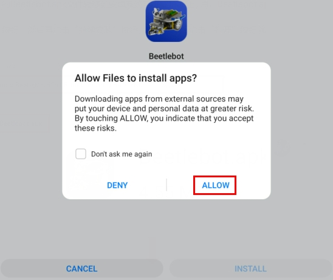

# Project 17: APP控制8x8点阵

## 实验简介：

在前面的实验中，我们已经知道ESP8266串口WIFI ESP-01模块通过WIFI测试代码得到相关的WIFI信息。那么在这个实验中，我们将使用ESP8266串口WIFI ESP-01模块通过APP和WIFI来控制小车上8*8点阵。

## 将WIFI模块串口测试扩展板插入电脑的USB口

将ESP8266串口WIFI ESP-01模块正确方向插入USB转ESP-01S WIFI模块串口测试扩展板上。


先将USB转ESP-01S WIFI模块串口测试扩展板上的拨码开关拨到UartDownload端，再将USB转ESP-01S WIFI模块串口测试扩展板插入电脑的USB口。


## ESP8266代码

ESP8266串口WIFI ESP-01模块的UTXD引脚是由Arduino Nano主板的IO口RX（0）控制，URXD引脚是由Arduino Nano主板的IO口TX（1）控制。

```c++
/*
Project 17.1 ESP8266_Code
*/
// generated by KidsBlock
#include <Arduino.h>
#include <ESP8266WiFi.h>
#include <ESP8266mDNS.h>
#include <WiFiClient.h>
//#include <WiFi.h>

#ifndef STASSID
#define STASSID "ChinaNet-2.4G-0DF0"  //the name of user's Wifi
#define STAPSK  "ChinaNet@233"       //the password of the user's wifi
#endif
const char* ssid = STASSID;
const char* password = STAPSK;

//IPAddress local_IP(192,168,4,22);
//IPAddress gateway(192,168,4,22);
//IPAddress subnet(255,255,255,0);
//
//const char *ssid = "ESP8266_AP_TEST";
//const char *password = "12345678";

WiFiServer server(80);
String unoData = "";
int ip_flag = 0;
int ultra_state = 1;
String ip_str;


void setup() {
  Serial.begin(9600); 
//   WiFi.mode(WIFI_AP); //设置工作在AP模式
//
//  WiFi.softAPConfig(local_IP, gateway, subnet); //设置AP地址
//  while(!WiFi.softAP(ssid, password)){}; //启动AP
//  Serial.println("AP启动成功");
//
//  Serial.print("IP address: ");
//  Serial.println(WiFi.softAPIP()); // 打印IP地址
//
//  WiFi.softAPsetHostname("myHostName"); //设置主机名
//  Serial.print("HostName: ");
//  Serial.println(WiFi.softAPgetHostname()); //打印主机名
//
//  Serial.print("mac Address: ");
//  Serial.println(WiFi.softAPmacAddress()); //打印mac地址

  WiFi.mode(WIFI_STA);
  WiFi.begin(ssid, password);
  while (WiFi.status() != WL_CONNECTED) {
    delay(500);
    Serial.print(".");
  }
  Serial.print("IP ADDRESS: ");
  Serial.println(WiFi.localIP());
  if (!MDNS.begin("esp8266")) {
    //Serial.println("Error setting up MDNS responder!");
    while (1) {
      delay(1000);
    }
  }
 // Serial.println("mDNS responder started");
  server.begin();
  //Serial.println("TCP server started");
  MDNS.addService("http", "tcp", 80);
  ip_flag = 1;
}

void loop() {
  //Serial.println(WiFi.softAPgetStationNum()); //打印客户端连接数
  if(ip_flag == 1)
  {
    for(int i=3; i>0; i--)
    {
      Serial.print("IP: ");
      Serial.print(WiFi.localIP());
      Serial.println('#');
      delay(500);
    }
    ip_flag = 0;
    
  }
    MDNS.update();
    WiFiClient client = server.available();
    if (!client) {
      return;
    }
    //Serial.println("");
    while (client.connected() && !client.available()) {
      delay(1);
    }
    String req = client.readStringUntil('\r');
    int addr_start = req.indexOf(' ');
    int addr_end = req.indexOf(' ', addr_start + 1);
    if (addr_start == -1 || addr_end == -1) {
      //Serial.print("Invalid request: ");
      //Serial.println(req);
      return;
    }
    req = req.substring(addr_start + 1, addr_end);
    int len_val = String(req).length();
    String M_req = String(req).substring(0,6);
    //Serial.println(M_req);
    if(M_req == "/btn/u")
    {
      String s_M_req = String(req).substring(5,len_val);
      Serial.print(s_M_req);
      Serial.print("#");
    }
    if(M_req == "/btn/v")
    {
      String s_M_req = String(req).substring(5,len_val);
      Serial.print(s_M_req);
      Serial.print("#");
    }
    client.flush();
    String s;
    if (req == "/") {
      IPAddress ip = WiFi.localIP();
      String ipStr = String(ip[0]) + '.' + String(ip[1]) + '.' + String(ip[2]) + '.' + String(ip[3]);
      s = "HTTP/1.1 200 OK\r\nContent-Type: text/html\r\n\r\n<!DOCTYPE HTML>\r\n<html>Hello from ESP8266 at ";
      s += ipStr;
      s += "</html>\r\n\r\n";
      //Serial.println("Sending 200");
      Serial.println(WiFi.localIP());
      Serial.write('*');
      client.println(WiFi.localIP());
      ip_flag = 0;
    }
    else if(req == "/btn/F")
    {
      Serial.write('F');
      client.println(F("F"));
    }
    else if(req == "/btn/B")
    {
      Serial.write('B');
      client.println(F("B"));
    }
    else if(req == "/btn/L")
    {
      Serial.write('L');
      client.println(F("L"));
    }
    else if(req == "/btn/R")
    {
      Serial.write('R');
      client.println(F("R"));
    }
    else if(req == "/btn/S")
    {
      Serial.write('S');
      client.println(F("S"));
    }
    else if(req == "/btn/a")
    {
      Serial.write('a');
      client.println(F("a"));
    }
    else if(req == "/btn/b")
    {
      Serial.write('b');
      client.println(F("b"));
    }
    else if(req == "/btn/c")
    {
      Serial.write('c');
      client.println(F("c"));
    }
    else if(req == "/btn/d")
    {
      Serial.write('d');
      client.println(F("d"));
    }
    else if(req == "/btn/e")
    {
      Serial.write('e');
      client.println(F("e"));
    }
    else if(req == "/btn/f")
    {
      Serial.write('f');
      client.println(F("f"));
    }
    else if(req == "/btn/g")
    {
      Serial.write('g');
      client.println(F("g"));
    }
    else if(req == "/btn/z")
    {
      Serial.write('z');
      client.println(F("z"));
    }
    else if(req == "/btn/i")
    {
      Serial.write('i');
      client.println(F("i"));
    }
    else if(req == "/btn/j")
    {
      Serial.write('j');
      client.println(F("j"));
    }
    else if(req == "/btn/k")
    {
      Serial.write('k');
      client.println(F("k"));
    }
    else if(req == "/btn/y")
    {
      Serial.write('y');
      client.println(F("y"));
    }
    else if(req == "/btn/l")
    {
      Serial.write('l');
      client.println(F("l"));
    }
    else if(req == "/btn/m")
    {
      Serial.write('m');
      client.println(F("m"));
    }
    else if(req == "/btn/n")
    {
      Serial.write('n');
      client.println("n");
    }
    else if(req == "/btn/o")
    {
      Serial.write('o');
      client.println(F("o"));
    }
    else if(req == "/btn/p")
    {
      Serial.write('p');
      client.println(F("p"));
    }
    else if(req == "/btn/q")
    {
      Serial.write('q');
      client.println("q");
    }
    else if(req == "/btn/x")
    {
      Serial.write('x');
      client.println(F("x"));
    }
    else if(req == "/btn/1")
    {
      Serial.write('1');
      client.println(F("1"));
    }
    else if(req == "/btn/2")
    {
      Serial.write('2');
      client.println("2");
    }
    else if(req == "/btn/3")
    {
      Serial.write('3');
      client.println(F("3"));
    }
    else if(req == "/btn/4")
    {
      Serial.write('4');
      client.println("4");
    }
    else if(req == "/btn/5")
    {
      Serial.write('5');
      client.println(F("5"));
    }
    else if(req == "/btn/0")
    {
      Serial.write('0');
      client.println("0");
    }
    else {
      //s = "HTTP/1.1 404 Not Found\r\n\r\n";
      //Serial.println("Sending 404");
    }

    client.print(F("IP : "));
    client.println(WiFi.localIP());
}
```

特别注意：需要先将项目代码

中的用户Wifi名称和用户Wifi密码改成你们自己的Wifi名称和Wifi密码。

Wifi名称和Wifi密码修改后，确保USB转ESP-01S WIFI模块串口测试扩展板上的拨码开关已经拨到Uart Download 端，并且也确定USB转ESP-01S WIFI模块串口测试扩展板已经插入电脑的USB口。然后按照Project 11 .1中的方法设置板型和COM口，IDE右下角显示对应板型和COM口，再点击将ESP8266 代码上传到ESP8266串口WIFI ESP-01模块上，上传成功。（注意：如果上传失败，在板型和COM口没问题情况下，将USB转ESP-01S WIFI模块串口测试扩展板从电脑的USB口拔下来再次插到电脑的USB口)


ESP8266 代码上传成功后，先将USB转ESP-01S WIFI模块串口测试扩展板从电脑的USB口拔下来，再将ESP8266串口WIFI ESP-01模块从USB转ESP-01S WIFI模块串口测试扩展板上拔下来。

## Arduino Nano 实验代码

注意：打开IDE后，一定要先设置好板型和COM口。如果家里没有WIFI需要打开手机热点共享WIFI

```c++
/*
Project 17.2 WiFi control dot matrix
*/
#include <ks_Matrix.h>
Matrix myMatrix(A4,A5);//Define the dot matrix pins in A4,A5
//Array, used to store the data of the pattern, can be calculated yourself 
//or retrieved from the touch tool
uint8_t matrix_smile[8]={0x00,0x66,0x00,0x00,0x18,0x42,0x3c,0x00};
uint8_t matrix_heart[8]={0x0e,0x11,0x21,0x42,0x21,0x11,0x0e,0x00};
uint8_t matrix_ten[8]={0x08,0x08,0x08,0x08,0xff,0x08,0x08,0x08};
uint8_t LEDArray[8];
char wifiData;

void setup() {
  Serial.begin(9600);
  myMatrix.begin(112);
  myMatrix.clear();
  myMatrix.writeDisplay();
}

void loop() {
  if(Serial.available() > 0)
  {
    wifiData = Serial.read();
    Serial.print(wifiData);
    if(wifiData == '#')
    {
      Serial.println("");
    }
    delay(100);
    
    if(wifiData == 'i')
    {
      myMatrix.writeDisplay();
      matrix_display(matrix_smile); 
    }
    else if(wifiData == 'k')
    {
      myMatrix.writeDisplay();
      matrix_display(matrix_heart);
    }
    else if(wifiData == 'j')
    {
      myMatrix.writeDisplay();
      matrix_display(matrix_ten);
    }
    else if(wifiData == 'y')
    {
      myMatrix.clear();
    }
  }
}

//Dot matrix display pattern function
void matrix_display(unsigned char matrix_value[])
{
  for(int i=0; i<8; i++)
    {
      LEDArray[i]=matrix_value[i];
      for(int j=7; j>=0; j--)
      {
        if((LEDArray[i]&0x01)>0)
        myMatrix.drawPixel(j, i,1);
        LEDArray[i] = LEDArray[i]>>1;
      }
    } 
    myMatrix.writeDisplay();
}
```

## 实验现象

点击Arduino 菜单栏的"Tools" → "Board："，选择“Arduino Nano”，选择正确的COM端口，最后将Arduino Nano实验代码上传至Arduino Nano主板。


Arduino Nano实验代码上传成功后，再将ESP8266串口WIFI ESP-01模块插入小车PCB板上的WiFi插口。（注意：USB线不要拔下来，否则读取不了COM端口）


点击打开串口监视器窗口，将波特率设置为9600。这样，串口监视器就显示此时你们WIFI的IP地址。（WIFI的IP地址有时候会改变，如果原来的IP地址不行，需要重新检测WIFI的IP地址)


 

***\*安卓系统设备（手机/平板）APP：\****

现将文件夹中的Beetlebot.apk文件转移到安卓系统手机或平板上


或者使用手机浏览器中的扫描功能，扫描下面二维码进行下载


点击Beetlebot.apk文件进入安装页面，点击“***\*ALLOW\****”按钮，然后再点击“***\*INSTALL\****”按钮，安装完成后点击“***\*OPEN\****”按钮就可以进入APP界面。





 

------


先在WIFI按钮前面的文本框中输入检测到的WIFI IP地址（例如，上面串口监视器检测到的IP地址：192.168.1.134），再切换WIFI按钮来连接WiFi（白色WIFI按钮变成绿色WIFI按钮），同时WIFI IP地址前的文本框中会显示对应的WIFI IP地址“192.168.1.134”。这样，就说明APP已经连接上了WIFI。


 ***\*IOS系统设备（手机/iPad）APP\****

a.打开App Store。


b.在搜索框输入Beetlebot，点击搜索，出现下载界面，点击“”，就可以下载安装Beetlebot的APP。接下来的操作和安卓系统类似的，可以参考上面安卓系统的步骤进行操作。

注意：点击APP上的按钮，ESP8266串口WIFI ESP-01模块上的蓝色指示灯会闪烁，说明APP已经连接上WIFI。

APP已经连接上了WIFI之后，开始进行如下操作：

点击APP上的按钮，串口监视器窗口打印一些对应的控制字符，如下图所示：


APP上各个按钮（控件）对应的功能，如下图所示：


***\*此代码实验APP操作及现象：\****

点击按钮，小车前面的8*8点阵显示“笑脸”图案；点击按钮，小车前面的8*8点阵显示“十”图案；点击按钮，小车前面的8*8点阵显示“❤”图案。

