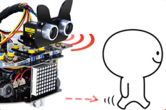

# Project 08: 跟随我

## 实验简介：



在上面实验中，我们已经了解了8*8点阵、电机驱动和调速、超声波传感器、舵机等硬件知识，那么在本实验中，我们将结合它们打造一款跟随小车! 在电路设计过程中，我们可以利用超声波传感器来检测小车与前方物体的距离。通过测量距离控制电机的旋转，从而控制小车的运动状态，使小车跟随物体运动。

## 工作原理：


| 检测  | 检测前方物体的距离        | 距离（单位：cm） |
| ----- | ------------------------- | ---------------- |
| 条件1 | 距离＜8                   |                  |
| 状态  | 小车后退（设置PWM 为100） |                  |
| 条件2 | 8≤距离<13                 |                  |
| 状态  | 小车停止                  |                  |
| 条件3 | 13≤距离<35                |                  |
| 状态  | 小车前进（设置PWM 为100） |                  |
| 条件3 | 距离≥35                   |                  |
| 状态  | 小车停止                  |                  |

## 流程图：


## 实验代码

```c++
/*
Project 08: follow me
Car follows the object
*/ 
const int left_ctrl = 4;//定义左电机方向控制引脚D4
const int left_pwm = 6;//定义左电机速度控制引脚D6
const int right_ctrl = 2;//定义右电机方向控制引脚D2
const int right_pwm = 5;//定义右电机速度控制引脚D5
#include "SR04.h" //定义超声波模块函数库
#define TRIG_PIN 8// 定义超声波的信号输入在D8
#define ECHO_PIN 7//定义超声波的信号输出在D7
SR04 sr04 = SR04(ECHO_PIN,TRIG_PIN);
long distance;
const int servopin = 9;//定义舵机的脚位在D9
int myangle;
int pulsewidth;

void setup() {
  pinMode(left_ctrl,OUTPUT);//设置左电机方向控制引脚为输出
  pinMode(left_pwm,OUTPUT);//设置左电机pwm控制速度引脚为输出
  pinMode(right_ctrl,OUTPUT);//设置右电机方向控制引脚为输出
  pinMode(right_pwm,OUTPUT);//设置右电机pwm控制速度引脚为输出
  pinMode(TRIG_PIN,OUTPUT);//设置TRIG_PIN为输出
  pinMode(ECHO_PIN,INPUT);//设置ECHO_PIN为输入
  servopulse(servopin,90);//设置舵机初始角度为90
  delay(300);
}

void loop() {
  distance = sr04.Distance();//超声波测量的距离
  if(distance<8)//如果距离小于8
  {
    back();//后退
  }
  else if((distance>=8)&&(distance<13))//如果距离大于等于8，小于13
  {
    Stop();//停止
  }
  else if((distance>=13)&&(distance<35))//如果距离大于等于13，小于35
  {
    front();//跟随
  }
  else//如果以上都不是
  {
    Stop();//停止
  }
}

void servopulse(int servopin,int myangle)//舵机运行角度
{
  for(int i=0; i<20; i++)
  {
    pulsewidth = (myangle*11)+500;
    digitalWrite(servopin,HIGH);
    delayMicroseconds(pulsewidth);
    digitalWrite(servopin,LOW);
    delay(20-pulsewidth/1000);
  }  
}

void front()//定义前进的状态
{
  digitalWrite(left_ctrl,LOW); //左电机方向控制引脚低电平
  analogWrite(left_pwm,200); //左电机PWM控制速度200
  digitalWrite(right_ctrl,LOW); //右电机方向控制引脚低电平
  analogWrite(right_pwm,200); //右电机PWM控制速度200
}
void back()//定义后退的状态
{
  digitalWrite(left_ctrl,HIGH); //左电机方向控制引脚高电平
  analogWrite(left_pwm,50); //左电机PWM控制速度50
  digitalWrite(right_ctrl,HIGH); //右电机方向控制引脚高电平
  analogWrite(right_pwm,50); //右电机PWM控制速度50
}
void Stop()//定义停止的状态
{
  digitalWrite(left_ctrl,LOW);//左电机方向控制引脚低电平
  analogWrite(left_pwm,0);//左电机PWM控制速度0
  digitalWrite(right_ctrl,LOW);//右电机方向控制引脚低电平
  analogWrite(right_pwm,0);//右电机PWM控制速度0
}
```

## 实验现象

将实验代码上传到Arduino Nano主板，小车安上电池，并且将电源开关拨到ON端，上电后，小车可以随着前方障碍物的移动而移动（只能在一条线直上，不能转弯）。
